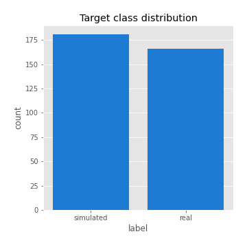

# Exploratory Data Analysis

[<< Go back](../README.md)
## Feature : target
- **Feature type** : categorical
- **Missing** : 0.0%
- **Unique** : 2
- **Count** :347
- **Unique** :2
- **Top** :simulated
- **Freq** :181

## Feature : return_mean1
- **Feature type** : continous
- **Missing** : 0.0%
- **Unique** : 347
- **Count** :347.0
- **Mean** :0.08398836009214565
- **Std** :0.08762466670131006
- **Min** :-0.22632637961920957
- **25%th Percentile** : 0.031074890067505936
- **50%th Percentile** : 0.08367692108603561
- **75%th Percentile** : 0.1342754661314748
- **Max** :0.37175100008111034

## Feature : return_mean2
- **Feature type** : continous
- **Missing** : 0.0%
- **Unique** : 347
- **Count** :347.0
- **Mean** :0.055305579337109084
- **Std** :0.09044616089069483
- **Min** :-0.24205418062825398
- **25%th Percentile** : 0.0040905585819915775
- **50%th Percentile** : 0.05400363030829556
- **75%th Percentile** : 0.10696875724554523
- **Max** :0.45276227087658566

## Feature : return_sd1
- **Feature type** : continous
- **Missing** : 0.0%
- **Unique** : 347
- **Count** :347.0
- **Mean** :1.9345643508861932
- **Std** :0.7551558345697551
- **Min** :0.7470080772831957
- **25%th Percentile** : 1.7499352732871483
- **50%th Percentile** : 1.86995842559984
- **75%th Percentile** : 1.9574421072432466
- **Max** :9.236766377527575

## Feature : return_sd2
- **Feature type** : continous
- **Missing** : 0.0%
- **Unique** : 347
- **Count** :347.0
- **Mean** :1.90804450993727
- **Std** :0.7135951853122106
- **Min** :0.8455946193085045
- **25%th Percentile** : 1.6839263166041745
- **50%th Percentile** : 1.8156097016986061
- **75%th Percentile** : 1.910015591502214
- **Max** :6.737618636746393

## Feature : return_skew1
- **Feature type** : continous
- **Missing** : 0.0%
- **Unique** : 347
- **Count** :347.0
- **Mean** :-0.09455640431729258
- **Std** :0.6173001696505427
- **Min** :-3.453087436558107
- **25%th Percentile** : -0.2028457465636953
- **50%th Percentile** : -0.03824780093331788
- **75%th Percentile** : 0.13711264510160842
- **Max** :2.5845963767725557

## Feature : return_skew2
- **Feature type** : continous
- **Missing** : 0.0%
- **Unique** : 347
- **Count** :347.0
- **Mean** :-0.1389319208462734
- **Std** :0.6115045688035561
- **Min** :-3.4392142944489743
- **25%th Percentile** : -0.28085342384978185
- **50%th Percentile** : -0.055719053480752574
- **75%th Percentile** : 0.1041602192179179
- **Max** :2.2606839051517187

## Feature : return_kurtosis1
- **Feature type** : continous
- **Missing** : 0.0%
- **Unique** : 347
- **Count** :347.0
- **Mean** :3.272142965604297
- **Std** :5.984659613219563
- **Min** :-0.29377186946627587
- **25%th Percentile** : 0.22098014056077364
- **50%th Percentile** : 0.9023884582933617
- **75%th Percentile** : 3.767479093377704
- **Max** :46.07507808162177

## Feature : return_kurtosis2
- **Feature type** : continous
- **Missing** : 0.0%
- **Unique** : 347
- **Count** :347.0
- **Mean** :3.7405336001344334
- **Std** :6.328018578214202
- **Min** :-0.4718817170108771
- **25%th Percentile** : 0.3255696455077972
- **50%th Percentile** : 1.3783361125518199
- **75%th Percentile** : 4.3833290542849985
- **Max** :57.31293005729889

## Feature : return_autocorrelation_1_lag1
- **Feature type** : continous
- **Missing** : 0.0%
- **Unique** : 347
- **Count** :347.0
- **Mean** :-0.0011766072392982035
- **Std** :0.06336179378722251
- **Min** :-0.2135576224968752
- **25%th Percentile** : -0.037319237134696606
- **50%th Percentile** : 0.007171528235732309
- **75%th Percentile** : 0.038053917331476776
- **Max** :0.1731511729786233

## Feature : return_autocorrelation_1_lag2
- **Feature type** : continous
- **Missing** : 0.0%
- **Unique** : 347
- **Count** :347.0
- **Mean** :-0.0007817804976097366
- **Std** :0.05165945704479151
- **Min** :-0.13309283796645122
- **25%th Percentile** : -0.03547446848191253
- **50%th Percentile** : 0.0007884965362399525
- **75%th Percentile** : 0.031460011493844135
- **Max** :0.1561488228015672

## Feature : return_autocorrelation_1_lag3
- **Feature type** : continous
- **Missing** : 0.0%
- **Unique** : 347
- **Count** :347.0
- **Mean** :0.003633852452333963
- **Std** :0.05282065747364195
- **Min** :-0.1940836867390813
- **25%th Percentile** : -0.02955930668846792
- **50%th Percentile** : 0.005538929402687478
- **75%th Percentile** : 0.03882796052289759
- **Max** :0.17805869530681923

## Feature : return_autocorrelation_2_lag1
- **Feature type** : continous
- **Missing** : 0.0%
- **Unique** : 347
- **Count** :347.0
- **Mean** :0.0024828072590691555
- **Std** :0.0630458194323408
- **Min** :-0.24590087874039124
- **25%th Percentile** : -0.03148706064753308
- **50%th Percentile** : 0.007712837022686376
- **75%th Percentile** : 0.04260985492975673
- **Max** :0.17462620870314283

## Feature : return_autocorrelation_2_lag2
- **Feature type** : continous
- **Missing** : 0.0%
- **Unique** : 347
- **Count** :347.0
- **Mean** :0.009017809037638522
- **Std** :0.054504652522995106
- **Min** :-0.1495113937562178
- **25%th Percentile** : -0.03024983755329601
- **50%th Percentile** : 0.009247526112360044
- **75%th Percentile** : 0.047470133951146506
- **Max** :0.1735398560230086

## Feature : return_autocorrelation_2_lag3
- **Feature type** : continous
- **Missing** : 0.0%
- **Unique** : 347
- **Count** :347.0
- **Mean** :0.010249732807075513
- **Std** :0.05319617286560378
- **Min** :-0.14200107169559698
- **25%th Percentile** : -0.021835593589853416
- **50%th Percentile** : 0.010307524360341765
- **75%th Percentile** : 0.04627706150782035
- **Max** :0.14742315579661075

## Feature : return_correlation_ts1_lag_0
- **Feature type** : continous
- **Missing** : 0.0%
- **Unique** : 347
- **Count** :347.0
- **Mean** :0.35119823522622523
- **Std** :0.11148600920437199
- **Min** :-0.027089510445801036
- **25%th Percentile** : 0.3014533271367953
- **50%th Percentile** : 0.3647309651183103
- **75%th Percentile** : 0.40730549710495834
- **Max** :0.6949986865664105

## Feature : return_correlation_ts1_lag_1
- **Feature type** : continous
- **Missing** : 0.0%
- **Unique** : 347
- **Count** :347.0
- **Mean** :0.0015239438547546933
- **Std** :0.054171196906385485
- **Min** :-0.16985510949917193
- **25%th Percentile** : -0.03199677855207893
- **50%th Percentile** : 0.004330394224441129
- **75%th Percentile** : 0.03777251832677868
- **Max** :0.15967596605397566

## Feature : return_correlation_ts1_lag_2
- **Feature type** : continous
- **Missing** : 0.0%
- **Unique** : 347
- **Count** :347.0
- **Mean** :0.007572086106340705
- **Std** :0.04990419012332165
- **Min** :-0.21653581047581763
- **25%th Percentile** : -0.02625120003014552
- **50%th Percentile** : 0.008039070975697536
- **75%th Percentile** : 0.04287938473542831
- **Max** :0.181885686073666

## Feature : return_correlation_ts1_lag_3
- **Feature type** : continous
- **Missing** : 0.0%
- **Unique** : 347
- **Count** :347.0
- **Mean** :0.008751541758652998
- **Std** :0.052795822626278924
- **Min** :-0.1270218498974763
- **25%th Percentile** : -0.023668334727588253
- **50%th Percentile** : 0.008388660896622172
- **75%th Percentile** : 0.042486293460732634
- **Max** :0.192060846757953

## Feature : return_correlation_ts2_lag_1
- **Feature type** : continous
- **Missing** : 0.0%
- **Unique** : 347
- **Count** :347.0
- **Mean** :0.0066346883590196045
- **Std** :0.054653938329809956
- **Min** :-0.19671969155495325
- **25%th Percentile** : -0.02739509675728545
- **50%th Percentile** : 0.005315007251473573
- **75%th Percentile** : 0.04804624217664662
- **Max** :0.17208763791364762

## Feature : return_correlation_ts2_lag_2
- **Feature type** : continous
- **Missing** : 0.0%
- **Unique** : 347
- **Count** :347.0
- **Mean** :0.009689900451687244
- **Std** :0.05260688814681948
- **Min** :-0.23751835475804678
- **25%th Percentile** : -0.024357565091050797
- **50%th Percentile** : 0.011558590909965825
- **75%th Percentile** : 0.040893695659284746
- **Max** :0.20772887392904255

## Feature : return_correlation_ts2_lag_3
- **Feature type** : continous
- **Missing** : 0.0%
- **Unique** : 347
- **Count** :347.0
- **Mean** :0.011127536085796407
- **Std** :0.05460031509224438
- **Min** :-0.17564076057312866
- **25%th Percentile** : -0.021266173037851728
- **50%th Percentile** : 0.009770558473500963
- **75%th Percentile** : 0.04808467520689252
- **Max** :0.14734795808357612

## Feature : sqreturn_autocorrelation_ts1_lag1
- **Feature type** : continous
- **Missing** : 0.0%
- **Unique** : 347
- **Count** :347.0
- **Mean** :0.04889369952970121
- **Std** :0.09179046565535294
- **Min** :-0.09770338156703365
- **25%th Percentile** : -0.008948757856558888
- **50%th Percentile** : 0.024672051494299494
- **75%th Percentile** : 0.08275441791374133
- **Max** :0.49414293176447355

## Feature : sqreturn_autocorrelation_ts1_lag2
- **Feature type** : continous
- **Missing** : 0.0%
- **Unique** : 347
- **Count** :347.0
- **Mean** :0.038218215691324955
- **Std** :0.08984898613383933
- **Min** :-0.09879594561029544
- **25%th Percentile** : -0.015316104713793965
- **50%th Percentile** : 0.01229141777978868
- **75%th Percentile** : 0.06377975875534364
- **Max** :0.540735851444759

## Feature : sqreturn_autocorrelation_ts1_lag3
- **Feature type** : continous
- **Missing** : 0.0%
- **Unique** : 347
- **Count** :347.0
- **Mean** :0.030442487626588882
- **Std** :0.07609598683735656
- **Min** :-0.10659282632007448
- **25%th Percentile** : -0.016785422457118757
- **50%th Percentile** : 0.011710548254852042
- **75%th Percentile** : 0.05564377892665184
- **Max** :0.41030914918857014

## Feature : sqreturn_autocorrelation_ts2_lag1
- **Feature type** : continous
- **Missing** : 0.0%
- **Unique** : 347
- **Count** :347.0
- **Mean** :0.04769792262030602
- **Std** :0.08677299768310043
- **Min** :-0.08605462858457527
- **25%th Percentile** : -0.008813524972585989
- **50%th Percentile** : 0.026830074347105402
- **75%th Percentile** : 0.07836882254031369
- **Max** :0.510085647437958

## Feature : sqreturn_autocorrelation_ts2_lag2
- **Feature type** : continous
- **Missing** : 0.0%
- **Unique** : 347
- **Count** :347.0
- **Mean** :0.037207953815479596
- **Std** :0.08665187239275293
- **Min** :-0.10314159506566722
- **25%th Percentile** : -0.01230205975377252
- **50%th Percentile** : 0.015185213759964006
- **75%th Percentile** : 0.057033099923109336
- **Max** :0.45676817892778204

## Feature : sqreturn_autocorrelation_ts2_lag3
- **Feature type** : continous
- **Missing** : 0.0%
- **Unique** : 347
- **Count** :347.0
- **Mean** :0.025447347037561224
- **Std** :0.07120927122813422
- **Min** :-0.10370302849600108
- **25%th Percentile** : -0.019735755557191287
- **50%th Percentile** : 0.007321280800366191
- **75%th Percentile** : 0.053507956285673904
- **Max** :0.31225727797735664

## Feature : sqreturn_correlation_ts1_lag_0
- **Feature type** : continous
- **Missing** : 0.0%
- **Unique** : 347
- **Count** :347.0
- **Mean** :0.35119823522622523
- **Std** :0.11148600920437199
- **Min** :-0.027089510445801036
- **25%th Percentile** : 0.3014533271367953
- **50%th Percentile** : 0.3647309651183103
- **75%th Percentile** : 0.40730549710495834
- **Max** :0.6949986865664105

## Feature : sqreturn_correlation_ts1_lag_1
- **Feature type** : continous
- **Missing** : 0.0%
- **Unique** : 347
- **Count** :347.0
- **Mean** :0.0015239438547546933
- **Std** :0.054171196906385485
- **Min** :-0.16985510949917193
- **25%th Percentile** : -0.03199677855207893
- **50%th Percentile** : 0.004330394224441129
- **75%th Percentile** : 0.03777251832677868
- **Max** :0.15967596605397566

## Feature : sqreturn_correlation_ts1_lag_2
- **Feature type** : continous
- **Missing** : 0.0%
- **Unique** : 347
- **Count** :347.0
- **Mean** :0.007572086106340705
- **Std** :0.04990419012332165
- **Min** :-0.21653581047581763
- **25%th Percentile** : -0.02625120003014552
- **50%th Percentile** : 0.008039070975697536
- **75%th Percentile** : 0.04287938473542831
- **Max** :0.181885686073666

## Feature : sqreturn_correlation_ts1_lag_3
- **Feature type** : continous
- **Missing** : 0.0%
- **Unique** : 347
- **Count** :347.0
- **Mean** :0.008751541758652998
- **Std** :0.052795822626278924
- **Min** :-0.1270218498974763
- **25%th Percentile** : -0.023668334727588253
- **50%th Percentile** : 0.008388660896622172
- **75%th Percentile** : 0.042486293460732634
- **Max** :0.192060846757953

## Feature : sqreturn_correlation_ts2_lag_1
- **Feature type** : continous
- **Missing** : 0.0%
- **Unique** : 347
- **Count** :347.0
- **Mean** :0.0066346883590196045
- **Std** :0.054653938329809956
- **Min** :-0.19671969155495325
- **25%th Percentile** : -0.02739509675728545
- **50%th Percentile** : 0.005315007251473573
- **75%th Percentile** : 0.04804624217664662
- **Max** :0.17208763791364762

## Feature : sqreturn_correlation_ts2_lag_2
- **Feature type** : continous
- **Missing** : 0.0%
- **Unique** : 347
- **Count** :347.0
- **Mean** :0.009689900451687244
- **Std** :0.05260688814681948
- **Min** :-0.23751835475804678
- **25%th Percentile** : -0.024357565091050797
- **50%th Percentile** : 0.011558590909965825
- **75%th Percentile** : 0.040893695659284746
- **Max** :0.20772887392904255

## Feature : sqreturn_correlation_ts2_lag_3
- **Feature type** : continous
- **Missing** : 0.0%
- **Unique** : 347
- **Count** :347.0
- **Mean** :0.011127536085796407
- **Std** :0.05460031509224438
- **Min** :-0.17564076057312866
- **25%th Percentile** : -0.021266173037851728
- **50%th Percentile** : 0.009770558473500963
- **75%th Percentile** : 0.04808467520689252
- **Max** :0.14734795808357612

## Feature : price2_granger_cause_price1
- **Feature type** : continous
- **Missing** : 0.0%
- **Unique** : 347
- **Count** :347.0
- **Mean** :0.2626094308005138
- **Std** :0.2842568459749802
- **Min** :5.679432604846029e-10
- **25%th Percentile** : 0.02301540591005701
- **50%th Percentile** : 0.1424018606533265
- **75%th Percentile** : 0.44212809793933927
- **Max** :0.9871972655759044

## Feature : price1_granger_cause_price2
- **Feature type** : continous
- **Missing** : 0.0%
- **Unique** : 347
- **Count** :347.0
- **Mean** :0.1948303400787608
- **Std** :0.25567345615294296
- **Min** :5.438377743666263e-12
- **25%th Percentile** : 0.0021744684734750688
- **50%th Percentile** : 0.061095698422849974
- **75%th Percentile** : 0.3138525965529918
- **Max** :0.9951398266867577

[<< Go back](../README.md)
