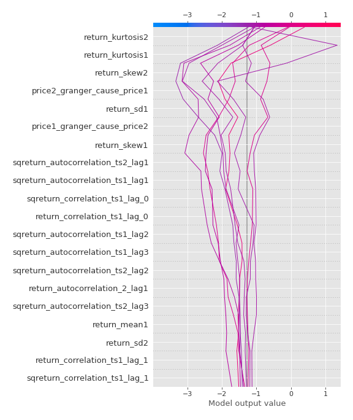

# Summary of 3_Linear

[<< Go back](../README.md)

## Logistic Regression (Linear)
- **n_jobs**: -1
- **explain_level**: 2

## Validation
 - **validation_type**: split
 - **train_ratio**: 0.75
 - **shuffle**: True
 - **stratify**: True

## Optimized metric
accuracy

## Training time

8.1 seconds

## Metric details
|           |    score |     threshold |
|:----------|---------:|--------------:|
| logloss   | 0.247527 | nan           |
| auc       | 0.979365 | nan           |
| f1        | 0.987952 |   0.602526    |
| accuracy  | 0.988506 |   0.602526    |
| precision | 1        |   0.917211    |
| recall    | 1        |   3.30369e-19 |
| mcc       | 0.977225 |   0.602526    |

## Confusion matrix (at threshold=0.602526)
|                      |   Predicted as real |   Predicted as simulated |
|:---------------------|--------------------:|-------------------------:|
| Labeled as real      |                  45 |                        0 |
| Labeled as simulated |                   1 |                       41 |

## Learning curves

## Coefficients
| feature                           |   Learner_1 |
|:----------------------------------|------------:|
| return_mean1                      |   1.15215   |
| return_skew2                      |   0.855922  |
| return_correlation_ts1_lag_0      |   0.846018  |
| sqreturn_correlation_ts1_lag_0    |   0.846018  |
| return_autocorrelation_2_lag1     |   0.734405  |
| return_autocorrelation_2_lag3     |   0.728361  |
| return_autocorrelation_2_lag2     |   0.683573  |
| sqreturn_correlation_ts2_lag_1    |   0.673275  |
| return_correlation_ts2_lag_1      |   0.673275  |
| return_autocorrelation_1_lag3     |   0.634764  |
| return_autocorrelation_1_lag1     |   0.621313  |
| sqreturn_correlation_ts1_lag_3    |   0.567438  |
| return_correlation_ts1_lag_3      |   0.567438  |
| return_correlation_ts1_lag_1      |   0.5327    |
| sqreturn_correlation_ts1_lag_1    |   0.5327    |
| return_skew1                      |   0.512866  |
| return_correlation_ts1_lag_2      |   0.501509  |
| sqreturn_correlation_ts1_lag_2    |   0.501509  |
| sqreturn_correlation_ts2_lag_3    |   0.450398  |
| return_correlation_ts2_lag_3      |   0.450398  |
| return_autocorrelation_1_lag2     |   0.426721  |
| return_sd1                        |   0.291746  |
| return_correlation_ts2_lag_2      |   0.287563  |
| sqreturn_correlation_ts2_lag_2    |   0.287563  |
| return_sd2                        |  -0.0459682 |
| return_mean2                      |  -0.252046  |
| price2_granger_cause_price1       |  -0.828494  |
| sqreturn_autocorrelation_ts2_lag3 |  -0.961187  |
| intercept                         |  -0.981151  |
| sqreturn_autocorrelation_ts2_lag2 |  -1.23531   |
| sqreturn_autocorrelation_ts1_lag3 |  -1.39106   |
| sqreturn_autocorrelation_ts1_lag1 |  -1.39474   |
| sqreturn_autocorrelation_ts1_lag2 |  -1.61456   |
| price1_granger_cause_price2       |  -1.65309   |
| sqreturn_autocorrelation_ts2_lag1 |  -1.65856   |
| return_kurtosis2                  |  -1.82075   |
| return_kurtosis1                  |  -3.01643   |

## Permutation-based Importance

## Confusion Matrix

## Normalized Confusion Matrix

## ROC Curve

## Kolmogorov-Smirnov Statistic

## Precision-Recall Curve

## Calibration Curve

## Cumulative Gains Curve

## Lift Curve

## SHAP Importance

## SHAP Dependence plots

### Dependence (Fold 1)

## SHAP Decision plots

### Top-10 Worst decisions for class 0 (Fold 1)

### Top-10 Best decisions for class 0 (Fold 1)

### Top-10 Worst decisions for class 1 (Fold 1)

### Top-10 Best decisions for class 1 (Fold 1)

[<< Go back](../README.md)
