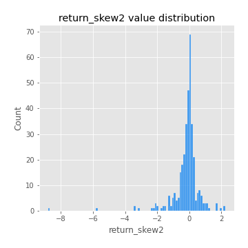
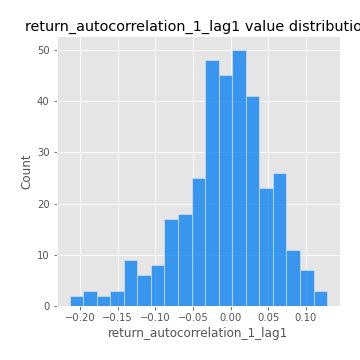
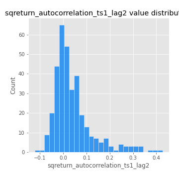

# Exploratory Data Analysis

[<< Go back](../README.md)
## Feature : target
- **Feature type** : categorical
- **Missing** : 0.0%
- **Unique** : 2
- **Count** :347
- **Unique** :2
- **Top** :real
- **Freq** :178

## Feature : return_mean1
- **Feature type** : continous
- **Missing** : 0.0%
- **Unique** : 347
- **Count** :347.0
- **Mean** :0.08792766670083865
- **Std** :0.08869157074094036
- **Min** :-0.22632637961920957
- **25%th Percentile** : 0.033230751359666716
- **50%th Percentile** : 0.08363988016912048
- **75%th Percentile** : 0.1347914014366957
- **Max** :0.40064217634766663

## Feature : return_mean2
- **Feature type** : continous
- **Missing** : 0.0%
- **Unique** : 347
- **Count** :347.0
- **Mean** :0.05522443621216208
- **Std** :0.0981802550031416
- **Min** :-0.25079772504412395
- **25%th Percentile** : -0.0006480652835617064
- **50%th Percentile** : 0.057928199993399085
- **75%th Percentile** : 0.10523389455046428
- **Max** :0.426936579156591

## Feature : return_sd1
- **Feature type** : continous
- **Missing** : 0.0%
- **Unique** : 347
- **Count** :347.0
- **Mean** :1.9012517649802974
- **Std** :0.7538401717595754
- **Min** :0.7620831696941981
- **25%th Percentile** : 1.580409353601877
- **50%th Percentile** : 1.87164751023415
- **75%th Percentile** : 1.9550451436385208
- **Max** :9.236766377527575

## Feature : return_sd2
- **Feature type** : continous
- **Missing** : 0.0%
- **Unique** : 347
- **Count** :347.0
- **Mean** :1.8658721630794555
- **Std** :0.6102399530816093
- **Min** :0.8455946193085045
- **25%th Percentile** : 1.6260293897824116
- **50%th Percentile** : 1.8120168387846363
- **75%th Percentile** : 1.9086705547984248
- **Max** :5.642692356880054

## Feature : return_skew1
- **Feature type** : continous
- **Missing** : 0.0%
- **Unique** : 347
- **Count** :347.0
- **Mean** :-0.09670036274931644
- **Std** :0.6013331142980278
- **Min** :-3.453087436558107
- **25%th Percentile** : -0.2196992175480469
- **50%th Percentile** : -0.031983093793589774
- **75%th Percentile** : 0.11782110142644928
- **Max** :2.5845963767725557

## Feature : return_skew2
- **Feature type** : continous
- **Missing** : 0.0%
- **Unique** : 347
- **Count** :347.0
- **Mean** :-0.16425630323021656
- **Std** :0.8724069669356799
- **Min** :-8.801502855292393
- **25%th Percentile** : -0.2945495428712871
- **50%th Percentile** : -0.0427150071504121
- **75%th Percentile** : 0.1262680617846649
- **Max** :2.242019525651531

## Feature : return_kurtosis1
- **Feature type** : continous
- **Missing** : 0.0%
- **Unique** : 347
- **Count** :347.0
- **Mean** :3.5607615495518323
- **Std** :5.9603345984421905
- **Min** :-0.32330013332162544
- **25%th Percentile** : 0.28599189535051006
- **50%th Percentile** : 1.3065158117729294
- **75%th Percentile** : 3.9926829085040287
- **Max** :46.07507808162177

## Feature : return_kurtosis2
- **Feature type** : continous
- **Missing** : 0.0%
- **Unique** : 347
- **Count** :347.0
- **Mean** :4.7208303217265835
- **Std** :10.560264890038042
- **Min** :-0.33325988742055435
- **25%th Percentile** : 0.4107858981143997
- **50%th Percentile** : 1.764037863973591
- **75%th Percentile** : 4.714693831645485
- **Max** :143.10871011533666

## Feature : return_autocorrelation_1_lag1
- **Feature type** : continous
- **Missing** : 0.0%
- **Unique** : 347
- **Count** :347.0
- **Mean** :-0.008154840493913195
- **Std** :0.05976847570931294
- **Min** :-0.2135576224968752
- **25%th Percentile** : -0.035992016246903166
- **50%th Percentile** : -0.0038203955790839317
- **75%th Percentile** : 0.029238247599267415
- **Max** :0.12810656890648087

## Feature : return_autocorrelation_1_lag2
- **Feature type** : continous
- **Missing** : 0.0%
- **Unique** : 347
- **Count** :347.0
- **Mean** :0.00010743959179988087
- **Std** :0.050972830495998975
- **Min** :-0.130385320665415
- **25%th Percentile** : -0.03423121734063152
- **50%th Percentile** : 0.0009133899629249503
- **75%th Percentile** : 0.03372675992363355
- **Max** :0.13553587149024285

## Feature : return_autocorrelation_1_lag3
- **Feature type** : continous
- **Missing** : 0.0%
- **Unique** : 347
- **Count** :347.0
- **Mean** :0.007563917556827505
- **Std** :0.05109421519493827
- **Min** :-0.1940836867390813
- **25%th Percentile** : -0.022294035986685647
- **50%th Percentile** : 0.0071817118846006596
- **75%th Percentile** : 0.04376384466418522
- **Max** :0.1250444101711275

## Feature : return_autocorrelation_2_lag1
- **Feature type** : continous
- **Missing** : 0.0%
- **Unique** : 347
- **Count** :347.0
- **Mean** :0.0032583814555017577
- **Std** :0.06479678948193504
- **Min** :-0.24265814531706406
- **25%th Percentile** : -0.03301722059992458
- **50%th Percentile** : 0.00921713081363506
- **75%th Percentile** : 0.04376219829539898
- **Max** :0.31863413537898483

## Feature : return_autocorrelation_2_lag2
- **Feature type** : continous
- **Missing** : 0.0%
- **Unique** : 347
- **Count** :347.0
- **Mean** :0.010008873592939161
- **Std** :0.05441694292764944
- **Min** :-0.15323211089747296
- **25%th Percentile** : -0.0281451894611133
- **50%th Percentile** : 0.010847707828722934
- **75%th Percentile** : 0.04464438946438836
- **Max** :0.20974504043791217

## Feature : return_autocorrelation_2_lag3
- **Feature type** : continous
- **Missing** : 0.0%
- **Unique** : 347
- **Count** :347.0
- **Mean** :0.010143374381466962
- **Std** :0.05245279039815006
- **Min** :-0.14200107169559698
- **25%th Percentile** : -0.02615688535237596
- **50%th Percentile** : 0.008471560838087889
- **75%th Percentile** : 0.04827065498649753
- **Max** :0.14962110587416147

## Feature : return_correlation_ts1_lag_0
- **Feature type** : continous
- **Missing** : 0.0%
- **Unique** : 347
- **Count** :347.0
- **Mean** :0.3438139345965017
- **Std** :0.11254088171996035
- **Min** :-0.027089510445801036
- **25%th Percentile** : 0.2841034190362307
- **50%th Percentile** : 0.3636976684750523
- **75%th Percentile** : 0.40716300673544886
- **Max** :0.7028422087350163

## Feature : return_correlation_ts1_lag_1
- **Feature type** : continous
- **Missing** : 0.0%
- **Unique** : 347
- **Count** :347.0
- **Mean** :0.0011274387841571007
- **Std** :0.05420451074141666
- **Min** :-0.16985510949917193
- **25%th Percentile** : -0.03181858147207818
- **50%th Percentile** : 0.00418909974644103
- **75%th Percentile** : 0.03742342248993534
- **Max** :0.1703032051543384

## Feature : return_correlation_ts1_lag_2
- **Feature type** : continous
- **Missing** : 0.0%
- **Unique** : 347
- **Count** :347.0
- **Mean** :0.010712681994610155
- **Std** :0.051702538221325804
- **Min** :-0.21653581047581763
- **25%th Percentile** : -0.022764164758906337
- **50%th Percentile** : 0.01223972612915849
- **75%th Percentile** : 0.046205795508067214
- **Max** :0.1498644857670072

## Feature : return_correlation_ts1_lag_3
- **Feature type** : continous
- **Missing** : 0.0%
- **Unique** : 347
- **Count** :347.0
- **Mean** :0.009955570475882055
- **Std** :0.0524754687541545
- **Min** :-0.12306593817498207
- **25%th Percentile** : -0.0234417524979074
- **50%th Percentile** : 0.01103772120226746
- **75%th Percentile** : 0.046793624972186754
- **Max** :0.1636773216468148

## Feature : return_correlation_ts2_lag_1
- **Feature type** : continous
- **Missing** : 0.0%
- **Unique** : 347
- **Count** :347.0
- **Mean** :0.0012370259193902305
- **Std** :0.05681287431510074
- **Min** :-0.2081139431093261
- **25%th Percentile** : -0.029627027188527354
- **50%th Percentile** : 0.0038267771177678336
- **75%th Percentile** : 0.040312048174005716
- **Max** :0.17208763791364762

## Feature : return_correlation_ts2_lag_2
- **Feature type** : continous
- **Missing** : 0.0%
- **Unique** : 347
- **Count** :347.0
- **Mean** :0.009857085432742756
- **Std** :0.051694978131767884
- **Min** :-0.23751835475804678
- **25%th Percentile** : -0.024582474046840816
- **50%th Percentile** : 0.010041700077125142
- **75%th Percentile** : 0.04126158716525222
- **Max** :0.15388933426238696

## Feature : return_correlation_ts2_lag_3
- **Feature type** : continous
- **Missing** : 0.0%
- **Unique** : 347
- **Count** :347.0
- **Mean** :0.010595990043937556
- **Std** :0.05097792418804023
- **Min** :-0.1603001201932561
- **25%th Percentile** : -0.020756300155911286
- **50%th Percentile** : 0.013487587072531214
- **75%th Percentile** : 0.04536240801367339
- **Max** :0.13128380114518473

## Feature : sqreturn_autocorrelation_ts1_lag1
- **Feature type** : continous
- **Missing** : 0.0%
- **Unique** : 347
- **Count** :347.0
- **Mean** :0.050915694005524356
- **Std** :0.08667195870443951
- **Min** :-0.09015239893784249
- **25%th Percentile** : -0.008291158570853541
- **50%th Percentile** : 0.028796089537889404
- **75%th Percentile** : 0.08656006621399676
- **Max** :0.49414293176447355

## Feature : sqreturn_autocorrelation_ts1_lag2
- **Feature type** : continous
- **Missing** : 0.0%
- **Unique** : 347
- **Count** :347.0
- **Mean** :0.04041108987180829
- **Std** :0.08658984629885236
- **Min** :-0.12279686234224867
- **25%th Percentile** : -0.012126104507709862
- **50%th Percentile** : 0.016072630923868826
- **75%th Percentile** : 0.06420564692038422
- **Max** :0.42719220751700526

## Feature : sqreturn_autocorrelation_ts1_lag3
- **Feature type** : continous
- **Missing** : 0.0%
- **Unique** : 347
- **Count** :347.0
- **Mean** :0.03182506008971292
- **Std** :0.0769727551533225
- **Min** :-0.09573598157580929
- **25%th Percentile** : -0.015541358239048102
- **50%th Percentile** : 0.015055193737716006
- **75%th Percentile** : 0.06101083347160214
- **Max** :0.44755937369538146

## Feature : sqreturn_autocorrelation_ts2_lag1
- **Feature type** : continous
- **Missing** : 0.0%
- **Unique** : 347
- **Count** :347.0
- **Mean** :0.04457291308565874
- **Std** :0.0901892539534114
- **Min** :-0.0871397146132774
- **25%th Percentile** : -0.013861085813362789
- **50%th Percentile** : 0.01956831179793193
- **75%th Percentile** : 0.07464678766495364
- **Max** :0.510085647437958

## Feature : sqreturn_autocorrelation_ts2_lag2
- **Feature type** : continous
- **Missing** : 0.0%
- **Unique** : 347
- **Count** :347.0
- **Mean** :0.034657699774863465
- **Std** :0.08369045736200839
- **Min** :-0.11351356327328821
- **25%th Percentile** : -0.014612551030903373
- **50%th Percentile** : 0.012375866706371325
- **75%th Percentile** : 0.05532805277099291
- **Max** :0.5373432415582473

## Feature : sqreturn_autocorrelation_ts2_lag3
- **Feature type** : continous
- **Missing** : 0.0%
- **Unique** : 347
- **Count** :347.0
- **Mean** :0.025314363133453737
- **Std** :0.06715946971574396
- **Min** :-0.1250855565874987
- **25%th Percentile** : -0.01588172675349868
- **50%th Percentile** : 0.007738770776192683
- **75%th Percentile** : 0.047794799896021124
- **Max** :0.30256115637327263

## Feature : sqreturn_correlation_ts1_lag_0
- **Feature type** : continous
- **Missing** : 0.0%
- **Unique** : 347
- **Count** :347.0
- **Mean** :0.3438139345965017
- **Std** :0.11254088171996035
- **Min** :-0.027089510445801036
- **25%th Percentile** : 0.2841034190362307
- **50%th Percentile** : 0.3636976684750523
- **75%th Percentile** : 0.40716300673544886
- **Max** :0.7028422087350163

## Feature : sqreturn_correlation_ts1_lag_1
- **Feature type** : continous
- **Missing** : 0.0%
- **Unique** : 347
- **Count** :347.0
- **Mean** :0.0011274387841571007
- **Std** :0.05420451074141666
- **Min** :-0.16985510949917193
- **25%th Percentile** : -0.03181858147207818
- **50%th Percentile** : 0.00418909974644103
- **75%th Percentile** : 0.03742342248993534
- **Max** :0.1703032051543384

## Feature : sqreturn_correlation_ts1_lag_2
- **Feature type** : continous
- **Missing** : 0.0%
- **Unique** : 347
- **Count** :347.0
- **Mean** :0.010712681994610155
- **Std** :0.051702538221325804
- **Min** :-0.21653581047581763
- **25%th Percentile** : -0.022764164758906337
- **50%th Percentile** : 0.01223972612915849
- **75%th Percentile** : 0.046205795508067214
- **Max** :0.1498644857670072

## Feature : sqreturn_correlation_ts1_lag_3
- **Feature type** : continous
- **Missing** : 0.0%
- **Unique** : 347
- **Count** :347.0
- **Mean** :0.009955570475882055
- **Std** :0.0524754687541545
- **Min** :-0.12306593817498207
- **25%th Percentile** : -0.0234417524979074
- **50%th Percentile** : 0.01103772120226746
- **75%th Percentile** : 0.046793624972186754
- **Max** :0.1636773216468148

## Feature : sqreturn_correlation_ts2_lag_1
- **Feature type** : continous
- **Missing** : 0.0%
- **Unique** : 347
- **Count** :347.0
- **Mean** :0.0012370259193902305
- **Std** :0.05681287431510074
- **Min** :-0.2081139431093261
- **25%th Percentile** : -0.029627027188527354
- **50%th Percentile** : 0.0038267771177678336
- **75%th Percentile** : 0.040312048174005716
- **Max** :0.17208763791364762

## Feature : sqreturn_correlation_ts2_lag_2
- **Feature type** : continous
- **Missing** : 0.0%
- **Unique** : 347
- **Count** :347.0
- **Mean** :0.009857085432742756
- **Std** :0.051694978131767884
- **Min** :-0.23751835475804678
- **25%th Percentile** : -0.024582474046840816
- **50%th Percentile** : 0.010041700077125142
- **75%th Percentile** : 0.04126158716525222
- **Max** :0.15388933426238696

## Feature : sqreturn_correlation_ts2_lag_3
- **Feature type** : continous
- **Missing** : 0.0%
- **Unique** : 347
- **Count** :347.0
- **Mean** :0.010595990043937556
- **Std** :0.05097792418804023
- **Min** :-0.1603001201932561
- **25%th Percentile** : -0.020756300155911286
- **50%th Percentile** : 0.013487587072531214
- **75%th Percentile** : 0.04536240801367339
- **Max** :0.13128380114518473

## Feature : price2_granger_cause_price1
- **Feature type** : continous
- **Missing** : 0.0%
- **Unique** : 347
- **Count** :347.0
- **Mean** :0.2615398792182968
- **Std** :0.2826863616450613
- **Min** :3.3033139317978937e-10
- **25%th Percentile** : 0.0203430213379907
- **50%th Percentile** : 0.14132247695801506
- **75%th Percentile** : 0.4429637542907339
- **Max** :0.9853666024514321

## Feature : price1_granger_cause_price2
- **Feature type** : continous
- **Missing** : 0.0%
- **Unique** : 347
- **Count** :347.0
- **Mean** :0.20989266596376202
- **Std** :0.2664263307831862
- **Min** :7.521368571630114e-13
- **25%th Percentile** : 0.004508586905881032
- **50%th Percentile** : 0.07105524613003326
- **75%th Percentile** : 0.3492368587774304
- **Max** :0.9951398266867577

[<< Go back](../README.md)
