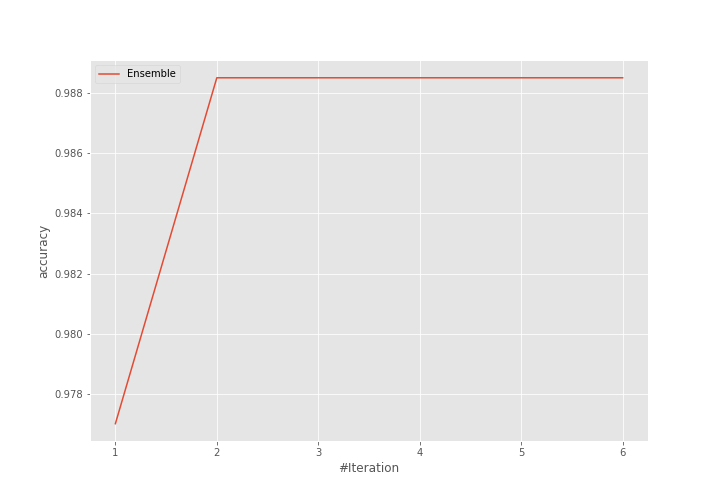
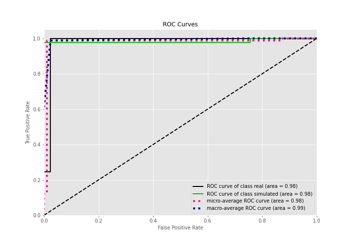
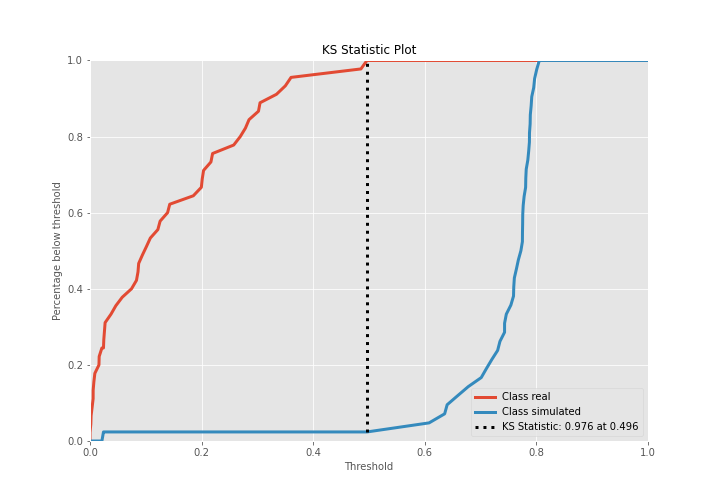
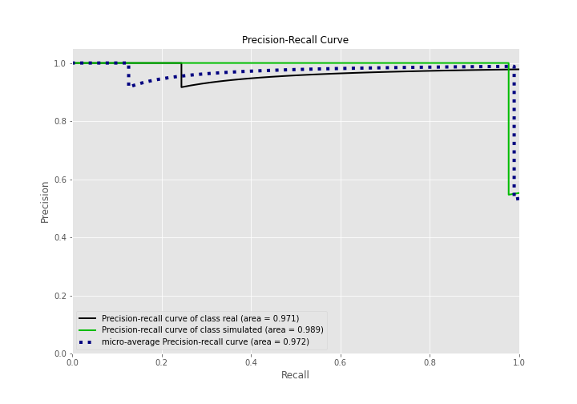
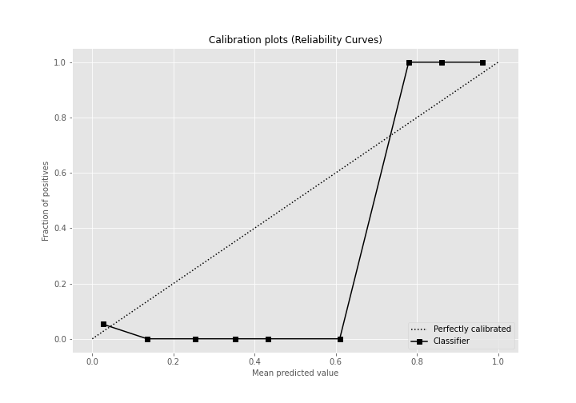
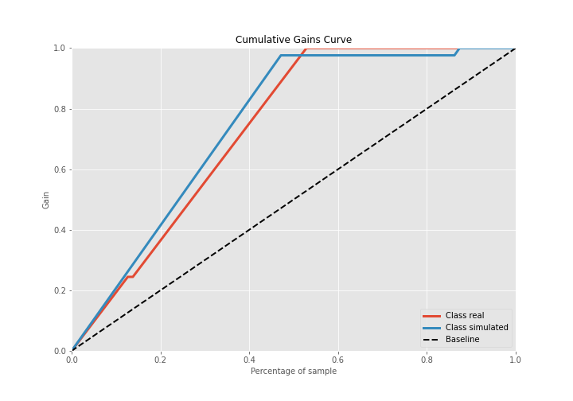
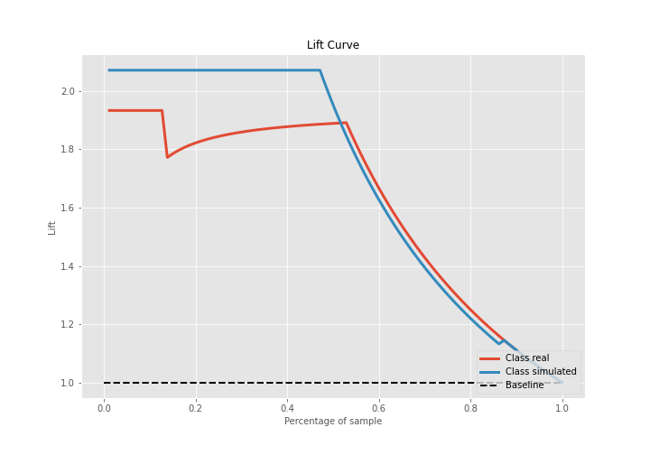

# Summary of Ensemble

[<< Go back](../README.md)

## Ensemble structure
| Model                   |   Weight |
|:------------------------|---------:|
| 3_Linear                |        1 |
| 5_Default_NeuralNetwork |        1 |

## Metric details
|           |    score |     threshold |
|:----------|---------:|--------------:|
| logloss   | 0.264041 | nan           |
| auc       | 0.982011 | nan           |
| f1        | 0.987952 |   0.511044    |
| accuracy  | 0.988506 |   0.511044    |
| precision | 1        |   0.76596     |
| recall    | 1        |   9.79429e-10 |
| mcc       | 0.977225 |   0.511044    |

## Confusion matrix (at threshold=0.511044)
|                      |   Predicted as real |   Predicted as simulated |
|:---------------------|--------------------:|-------------------------:|
| Labeled as real      |                  45 |                        0 |
| Labeled as simulated |                   1 |                       41 |

## Learning curves

## Confusion Matrix

## Normalized Confusion Matrix

## ROC Curve

## Kolmogorov-Smirnov Statistic

## Precision-Recall Curve

## Calibration Curve

## Cumulative Gains Curve

## Lift Curve

[<< Go back](../README.md)
