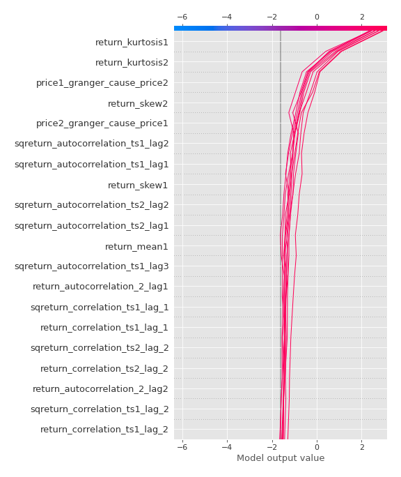

# Summary of 3_Linear

[<< Go back](../README.md)

## Logistic Regression (Linear)
- **n_jobs**: -1
- **explain_level**: 2

## Validation
 - **validation_type**: split
 - **train_ratio**: 0.75
 - **shuffle**: True
 - **stratify**: True

## Optimized metric
accuracy

## Training time

9.2 seconds

## Metric details
|           |    score |     threshold |
|:----------|---------:|--------------:|
| logloss   | 0.16848  | nan           |
| auc       | 0.989418 | nan           |
| f1        | 0.97561  |   0.58398     |
| accuracy  | 0.977011 |   0.58398     |
| precision | 1        |   0.58398     |
| recall    | 1        |   2.31741e-09 |
| mcc       | 0.954911 |   0.58398     |

## Confusion matrix (at threshold=0.58398)
|                      |   Predicted as real |   Predicted as simulated |
|:---------------------|--------------------:|-------------------------:|
| Labeled as real      |                  45 |                        0 |
| Labeled as simulated |                   2 |                       40 |

## Learning curves

## Coefficients
| feature                           |   Learner_1 |
|:----------------------------------|------------:|
| return_autocorrelation_2_lag1     |    0.942062 |
| return_mean1                      |    0.859387 |
| sqreturn_correlation_ts1_lag_1    |    0.827795 |
| return_correlation_ts1_lag_1      |    0.827795 |
| return_skew2                      |    0.806828 |
| return_skew1                      |    0.749315 |
| return_autocorrelation_2_lag2     |    0.687785 |
| sqreturn_correlation_ts1_lag_0    |    0.660907 |
| return_correlation_ts1_lag_0      |    0.660907 |
| return_autocorrelation_1_lag3     |    0.609186 |
| return_autocorrelation_2_lag3     |    0.606558 |
| return_correlation_ts2_lag_1      |    0.548716 |
| sqreturn_correlation_ts2_lag_1    |    0.548716 |
| return_correlation_ts1_lag_3      |    0.53839  |
| sqreturn_correlation_ts1_lag_3    |    0.53839  |
| sqreturn_correlation_ts2_lag_2    |    0.51291  |
| return_correlation_ts2_lag_2      |    0.51291  |
| sqreturn_correlation_ts1_lag_2    |    0.474729 |
| return_correlation_ts1_lag_2      |    0.474729 |
| return_autocorrelation_1_lag2     |    0.389238 |
| sqreturn_correlation_ts2_lag_3    |    0.376    |
| return_correlation_ts2_lag_3      |    0.376    |
| return_autocorrelation_1_lag1     |    0.334334 |
| return_sd1                        |    0.265    |
| return_sd2                        |   -0.156578 |
| return_mean2                      |   -0.201447 |
| price2_granger_cause_price1       |   -0.783039 |
| intercept                         |   -0.946258 |
| sqreturn_autocorrelation_ts2_lag3 |   -0.976442 |
| sqreturn_autocorrelation_ts1_lag3 |   -1.25088  |
| price1_granger_cause_price2       |   -1.29681  |
| sqreturn_autocorrelation_ts2_lag2 |   -1.37184  |
| sqreturn_autocorrelation_ts2_lag1 |   -1.47282  |
| sqreturn_autocorrelation_ts1_lag2 |   -1.53018  |
| sqreturn_autocorrelation_ts1_lag1 |   -1.78564  |
| return_kurtosis2                  |   -2.12822  |
| return_kurtosis1                  |   -3.28755  |

## Permutation-based Importance

## Confusion Matrix

## Normalized Confusion Matrix

## ROC Curve

## Kolmogorov-Smirnov Statistic

## Precision-Recall Curve

## Calibration Curve

## Cumulative Gains Curve

## Lift Curve

## SHAP Importance

## SHAP Dependence plots

### Dependence (Fold 1)

## SHAP Decision plots

### Top-10 Worst decisions for class 0 (Fold 1)

### Top-10 Best decisions for class 0 (Fold 1)

### Top-10 Worst decisions for class 1 (Fold 1)

### Top-10 Best decisions for class 1 (Fold 1)

[<< Go back](../README.md)
