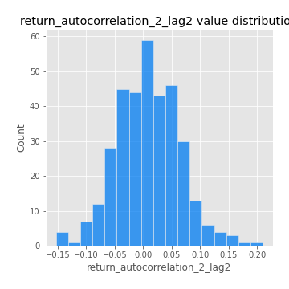
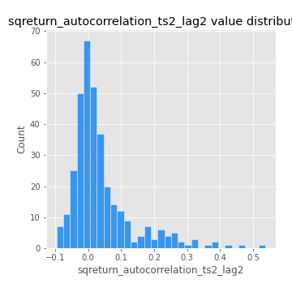
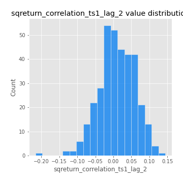

# Exploratory Data Analysis

[<< Go back](../README.md)
## Feature : target
- **Feature type** : categorical
- **Missing** : 0.0%
- **Unique** : 2
- **Count** :347
- **Unique** :2
- **Top** :real
- **Freq** :178

## Feature : return_mean1
- **Feature type** : continous
- **Missing** : 0.0%
- **Unique** : 347
- **Count** :347.0
- **Mean** :0.07869959416852308
- **Std** :0.08842906473010323
- **Min** :-0.22632637961920957
- **25%th Percentile** : 0.025697201054049913
- **50%th Percentile** : 0.07827683395781435
- **75%th Percentile** : 0.12240866011294052
- **Max** :0.375483290600218

## Feature : return_mean2
- **Feature type** : continous
- **Missing** : 0.0%
- **Unique** : 347
- **Count** :347.0
- **Mean** :0.05348981244998384
- **Std** :0.09949788708271137
- **Min** :-0.24205418062825398
- **25%th Percentile** : -0.002365856072831552
- **50%th Percentile** : 0.05730581816669039
- **75%th Percentile** : 0.10869140960118481
- **Max** :0.4029881618936809

## Feature : return_sd1
- **Feature type** : continous
- **Missing** : 0.0%
- **Unique** : 347
- **Count** :347.0
- **Mean** :1.9102342977957947
- **Std** :0.7284751664369733
- **Min** :0.7470080772831957
- **25%th Percentile** : 1.6844370027829432
- **50%th Percentile** : 1.8554238339986482
- **75%th Percentile** : 1.960014634185148
- **Max** :9.236766377527575

## Feature : return_sd2
- **Feature type** : continous
- **Missing** : 0.0%
- **Unique** : 347
- **Count** :347.0
- **Mean** :1.9188452704285808
- **Std** :0.7039242194064206
- **Min** :0.8592887433004143
- **25%th Percentile** : 1.6821836387569469
- **50%th Percentile** : 1.8171315815142186
- **75%th Percentile** : 1.9136674181927609
- **Max** :6.737618636746393

## Feature : return_skew1
- **Feature type** : continous
- **Missing** : 0.0%
- **Unique** : 347
- **Count** :347.0
- **Mean** :-0.07818902757907308
- **Std** :0.5636972681486287
- **Min** :-2.817259764925239
- **25%th Percentile** : -0.21009903602353627
- **50%th Percentile** : -0.011587953097557896
- **75%th Percentile** : 0.1244905517693633
- **Max** :2.5845963767725557

## Feature : return_skew2
- **Feature type** : continous
- **Missing** : 0.0%
- **Unique** : 347
- **Count** :347.0
- **Mean** :-0.13361596732538933
- **Std** :0.8051492499847263
- **Min** :-8.801502855292393
- **25%th Percentile** : -0.26449381418609325
- **50%th Percentile** : -0.03659630688864156
- **75%th Percentile** : 0.12679029830246086
- **Max** :2.2606839051517187

## Feature : return_kurtosis1
- **Feature type** : continous
- **Missing** : 0.0%
- **Unique** : 347
- **Count** :347.0
- **Mean** :3.280148211042877
- **Std** :5.597671660688148
- **Min** :-0.3614777473408699
- **25%th Percentile** : 0.29139573465518454
- **50%th Percentile** : 1.21974372492522
- **75%th Percentile** : 3.8376122618365898
- **Max** :36.91113889081053

## Feature : return_kurtosis2
- **Feature type** : continous
- **Missing** : 0.0%
- **Unique** : 347
- **Count** :347.0
- **Mean** :4.136397467790296
- **Std** :10.114170382044845
- **Min** :-0.4519113595628226
- **25%th Percentile** : 0.4204041688347251
- **50%th Percentile** : 1.4119554644926713
- **75%th Percentile** : 4.181354912626768
- **Max** :143.10871011533666

## Feature : return_autocorrelation_1_lag1
- **Feature type** : continous
- **Missing** : 0.0%
- **Unique** : 347
- **Count** :347.0
- **Mean** :-0.004951655935262629
- **Std** :0.060497641351083736
- **Min** :-0.2135576224968752
- **25%th Percentile** : -0.03824971930839452
- **50%th Percentile** : -0.000831782721604324
- **75%th Percentile** : 0.03251093848268108
- **Max** :0.12810656890648087

## Feature : return_autocorrelation_1_lag2
- **Feature type** : continous
- **Missing** : 0.0%
- **Unique** : 347
- **Count** :347.0
- **Mean** :-0.0015318798183132439
- **Std** :0.05091077226696692
- **Min** :-0.13309283796645122
- **25%th Percentile** : -0.033206717412408826
- **50%th Percentile** : -0.00018445450979933406
- **75%th Percentile** : 0.03179566145701204
- **Max** :0.1561488228015672

## Feature : return_autocorrelation_1_lag3
- **Feature type** : continous
- **Missing** : 0.0%
- **Unique** : 347
- **Count** :347.0
- **Mean** :0.0033303999366321494
- **Std** :0.054982033782722935
- **Min** :-0.1940836867390813
- **25%th Percentile** : -0.032004336204174685
- **50%th Percentile** : 0.005377375015251968
- **75%th Percentile** : 0.035674822381715106
- **Max** :0.17805869530681923

## Feature : return_autocorrelation_2_lag1
- **Feature type** : continous
- **Missing** : 0.0%
- **Unique** : 347
- **Count** :347.0
- **Mean** :0.006008415851370503
- **Std** :0.06425178091876542
- **Min** :-0.24590087874039124
- **25%th Percentile** : -0.027519798598752677
- **50%th Percentile** : 0.01342783289065442
- **75%th Percentile** : 0.05021262606099498
- **Max** :0.31863413537898483

## Feature : return_autocorrelation_2_lag2
- **Feature type** : continous
- **Missing** : 0.0%
- **Unique** : 347
- **Count** :347.0
- **Mean** :0.008809978310099675
- **Std** :0.05532880843759498
- **Min** :-0.15323211089747296
- **25%th Percentile** : -0.03001184470684571
- **50%th Percentile** : 0.006682285058973788
- **75%th Percentile** : 0.04921052186199979
- **Max** :0.20974504043791217

## Feature : return_autocorrelation_2_lag3
- **Feature type** : continous
- **Missing** : 0.0%
- **Unique** : 347
- **Count** :347.0
- **Mean** :0.0042047460161500055
- **Std** :0.04988087456152064
- **Min** :-0.14200107169559698
- **25%th Percentile** : -0.02810856301957962
- **50%th Percentile** : 0.005673101980331803
- **75%th Percentile** : 0.03899590845044728
- **Max** :0.12103978207043897

## Feature : return_correlation_ts1_lag_0
- **Feature type** : continous
- **Missing** : 0.0%
- **Unique** : 347
- **Count** :347.0
- **Mean** :0.35348326656441814
- **Std** :0.11054150692887264
- **Min** :-0.027089510445801036
- **25%th Percentile** : 0.30199519789134843
- **50%th Percentile** : 0.36425615951441614
- **75%th Percentile** : 0.4042560856413359
- **Max** :0.7028422087350163

## Feature : return_correlation_ts1_lag_1
- **Feature type** : continous
- **Missing** : 0.0%
- **Unique** : 347
- **Count** :347.0
- **Mean** :0.0040112905632735
- **Std** :0.054273358699029654
- **Min** :-0.16985510949917193
- **25%th Percentile** : -0.028946694646773876
- **50%th Percentile** : 0.010318145206396262
- **75%th Percentile** : 0.039589743944421635
- **Max** :0.15499424718508623

## Feature : return_correlation_ts1_lag_2
- **Feature type** : continous
- **Missing** : 0.0%
- **Unique** : 347
- **Count** :347.0
- **Mean** :0.009458539977711703
- **Std** :0.04994784572776241
- **Min** :-0.21653581047581763
- **25%th Percentile** : -0.02302154264884649
- **50%th Percentile** : 0.009783147657714857
- **75%th Percentile** : 0.0473118238883604
- **Max** :0.14417498613988514

## Feature : return_correlation_ts1_lag_3
- **Feature type** : continous
- **Missing** : 0.0%
- **Unique** : 347
- **Count** :347.0
- **Mean** :0.00893467757920267
- **Std** :0.052804234931873695
- **Min** :-0.1270218498974763
- **25%th Percentile** : -0.023354377072870844
- **50%th Percentile** : 0.009748827124807442
- **75%th Percentile** : 0.03964789556198706
- **Max** :0.1636773216468148

## Feature : return_correlation_ts2_lag_1
- **Feature type** : continous
- **Missing** : 0.0%
- **Unique** : 347
- **Count** :347.0
- **Mean** :0.003996565439291214
- **Std** :0.05639828300159592
- **Min** :-0.2081139431093261
- **25%th Percentile** : -0.028428050948355224
- **50%th Percentile** : 0.0034711376235895936
- **75%th Percentile** : 0.04090132708494159
- **Max** :0.14631739450511635

## Feature : return_correlation_ts2_lag_2
- **Feature type** : continous
- **Missing** : 0.0%
- **Unique** : 347
- **Count** :347.0
- **Mean** :0.008788983627096602
- **Std** :0.0528304125848628
- **Min** :-0.23751835475804678
- **25%th Percentile** : -0.027951513160306824
- **50%th Percentile** : 0.010307410774699006
- **75%th Percentile** : 0.04430129254139343
- **Max** :0.20772887392904255

## Feature : return_correlation_ts2_lag_3
- **Feature type** : continous
- **Missing** : 0.0%
- **Unique** : 347
- **Count** :347.0
- **Mean** :0.004719522225370893
- **Std** :0.054373041206031716
- **Min** :-0.17564076057312866
- **25%th Percentile** : -0.02768138698301708
- **50%th Percentile** : 0.0016003123030982438
- **75%th Percentile** : 0.04417599601380624
- **Max** :0.13663551109329544

## Feature : sqreturn_autocorrelation_ts1_lag1
- **Feature type** : continous
- **Missing** : 0.0%
- **Unique** : 347
- **Count** :347.0
- **Mean** :0.05111258738345779
- **Std** :0.09690646673610454
- **Min** :-0.09526443969149131
- **25%th Percentile** : -0.015285590316952223
- **50%th Percentile** : 0.0226729270055185
- **75%th Percentile** : 0.08838670726689835
- **Max** :0.49414293176447355

## Feature : sqreturn_autocorrelation_ts1_lag2
- **Feature type** : continous
- **Missing** : 0.0%
- **Unique** : 347
- **Count** :347.0
- **Mean** :0.04501603794328505
- **Std** :0.10005263404045776
- **Min** :-0.11402269488365065
- **25%th Percentile** : -0.014524819278500564
- **50%th Percentile** : 0.016072630923868826
- **75%th Percentile** : 0.07478127517932029
- **Max** :0.540735851444759

## Feature : sqreturn_autocorrelation_ts1_lag3
- **Feature type** : continous
- **Missing** : 0.0%
- **Unique** : 347
- **Count** :347.0
- **Mean** :0.03765484247606098
- **Std** :0.07958343129119776
- **Min** :-0.07861614739365985
- **25%th Percentile** : -0.015094363402231047
- **50%th Percentile** : 0.018492499492989197
- **75%th Percentile** : 0.06520547727859416
- **Max** :0.41030914918857014

## Feature : sqreturn_autocorrelation_ts2_lag1
- **Feature type** : continous
- **Missing** : 0.0%
- **Unique** : 347
- **Count** :347.0
- **Mean** :0.04983910833488073
- **Std** :0.09126238678461608
- **Min** :-0.1037882230026565
- **25%th Percentile** : -0.010607269511531415
- **50%th Percentile** : 0.02527293529662947
- **75%th Percentile** : 0.08752294149687073
- **Max** :0.510085647437958

## Feature : sqreturn_autocorrelation_ts2_lag2
- **Feature type** : continous
- **Missing** : 0.0%
- **Unique** : 347
- **Count** :347.0
- **Mean** :0.038512241664760506
- **Std** :0.09501206493595585
- **Min** :-0.09588419326296674
- **25%th Percentile** : -0.0166651898892373
- **50%th Percentile** : 0.012239267024428074
- **75%th Percentile** : 0.055320023832590104
- **Max** :0.5373432415582473

## Feature : sqreturn_autocorrelation_ts2_lag3
- **Feature type** : continous
- **Missing** : 0.0%
- **Unique** : 347
- **Count** :347.0
- **Mean** :0.029563039370476402
- **Std** :0.07091301078118392
- **Min** :-0.10353511203738416
- **25%th Percentile** : -0.014291208098480078
- **50%th Percentile** : 0.012784161301929102
- **75%th Percentile** : 0.056885829461347695
- **Max** :0.31225727797735664

## Feature : sqreturn_correlation_ts1_lag_0
- **Feature type** : continous
- **Missing** : 0.0%
- **Unique** : 347
- **Count** :347.0
- **Mean** :0.35348326656441814
- **Std** :0.11054150692887264
- **Min** :-0.027089510445801036
- **25%th Percentile** : 0.30199519789134843
- **50%th Percentile** : 0.36425615951441614
- **75%th Percentile** : 0.4042560856413359
- **Max** :0.7028422087350163

## Feature : sqreturn_correlation_ts1_lag_1
- **Feature type** : continous
- **Missing** : 0.0%
- **Unique** : 347
- **Count** :347.0
- **Mean** :0.0040112905632735
- **Std** :0.054273358699029654
- **Min** :-0.16985510949917193
- **25%th Percentile** : -0.028946694646773876
- **50%th Percentile** : 0.010318145206396262
- **75%th Percentile** : 0.039589743944421635
- **Max** :0.15499424718508623

## Feature : sqreturn_correlation_ts1_lag_2
- **Feature type** : continous
- **Missing** : 0.0%
- **Unique** : 347
- **Count** :347.0
- **Mean** :0.009458539977711703
- **Std** :0.04994784572776241
- **Min** :-0.21653581047581763
- **25%th Percentile** : -0.02302154264884649
- **50%th Percentile** : 0.009783147657714857
- **75%th Percentile** : 0.0473118238883604
- **Max** :0.14417498613988514

## Feature : sqreturn_correlation_ts1_lag_3
- **Feature type** : continous
- **Missing** : 0.0%
- **Unique** : 347
- **Count** :347.0
- **Mean** :0.00893467757920267
- **Std** :0.052804234931873695
- **Min** :-0.1270218498974763
- **25%th Percentile** : -0.023354377072870844
- **50%th Percentile** : 0.009748827124807442
- **75%th Percentile** : 0.03964789556198706
- **Max** :0.1636773216468148

## Feature : sqreturn_correlation_ts2_lag_1
- **Feature type** : continous
- **Missing** : 0.0%
- **Unique** : 347
- **Count** :347.0
- **Mean** :0.003996565439291214
- **Std** :0.05639828300159592
- **Min** :-0.2081139431093261
- **25%th Percentile** : -0.028428050948355224
- **50%th Percentile** : 0.0034711376235895936
- **75%th Percentile** : 0.04090132708494159
- **Max** :0.14631739450511635

## Feature : sqreturn_correlation_ts2_lag_2
- **Feature type** : continous
- **Missing** : 0.0%
- **Unique** : 347
- **Count** :347.0
- **Mean** :0.008788983627096602
- **Std** :0.0528304125848628
- **Min** :-0.23751835475804678
- **25%th Percentile** : -0.027951513160306824
- **50%th Percentile** : 0.010307410774699006
- **75%th Percentile** : 0.04430129254139343
- **Max** :0.20772887392904255

## Feature : sqreturn_correlation_ts2_lag_3
- **Feature type** : continous
- **Missing** : 0.0%
- **Unique** : 347
- **Count** :347.0
- **Mean** :0.004719522225370893
- **Std** :0.054373041206031716
- **Min** :-0.17564076057312866
- **25%th Percentile** : -0.02768138698301708
- **50%th Percentile** : 0.0016003123030982438
- **75%th Percentile** : 0.04417599601380624
- **Max** :0.13663551109329544

## Feature : price2_granger_cause_price1
- **Feature type** : continous
- **Missing** : 0.0%
- **Unique** : 347
- **Count** :347.0
- **Mean** :0.28765788425162603
- **Std** :0.291665030060524
- **Min** :3.029718398079551e-07
- **25%th Percentile** : 0.024719750970577832
- **50%th Percentile** : 0.17256746072654225
- **75%th Percentile** : 0.48660777282057993
- **Max** :0.9906702147224425

## Feature : price1_granger_cause_price2
- **Feature type** : continous
- **Missing** : 0.0%
- **Unique** : 347
- **Count** :347.0
- **Mean** :0.22356616564447163
- **Std** :0.2730613903384116
- **Min** :6.691320110302301e-17
- **25%th Percentile** : 0.0021533999443266207
- **50%th Percentile** : 0.08859369736605449
- **75%th Percentile** : 0.3752962585454995
- **Max** :0.9951398266867577

[<< Go back](../README.md)
