# Summary of 2_DecisionTree

[<< Go back](../README.md)

## Decision Tree
- **n_jobs**: -1
- **criterion**: gini
- **max_depth**: 3
- **explain_level**: 2

## Validation
 - **validation_type**: split
 - **train_ratio**: 0.75
 - **shuffle**: True
 - **stratify**: True

## Optimized metric
accuracy

## Training time

12.0 seconds

## Metric details
|           |    score |   threshold |
|:----------|---------:|------------:|
| logloss   | 0.528671 | nan         |
| auc       | 0.931383 | nan         |
| f1        | 0.934783 |   0.0347826 |
| accuracy  | 0.931034 |   0.0347826 |
| precision | 0.955556 |   0.0347826 |
| recall    | 1        |   0.0313043 |
| mcc       | 0.862603 |   0.0347826 |

## Confusion matrix (at threshold=0.034783)
|                      |   Predicted as real |   Predicted as simulated |
|:---------------------|--------------------:|-------------------------:|
| Labeled as real      |                  38 |                        2 |
| Labeled as simulated |                   4 |                       43 |

## Learning curves
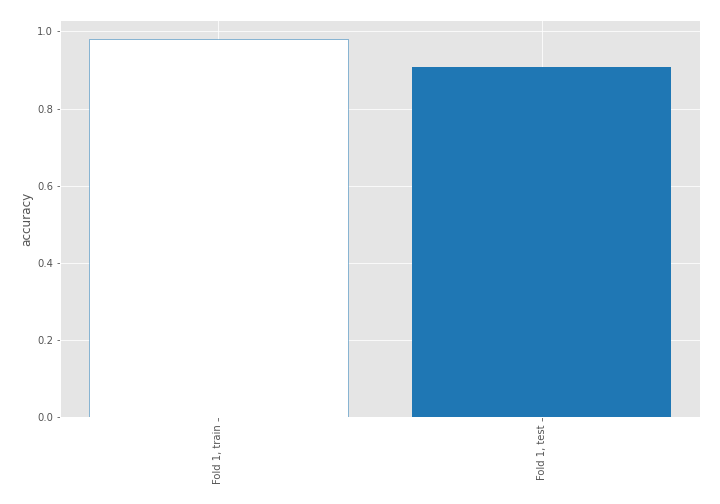

## Decision Tree 

### Tree #1
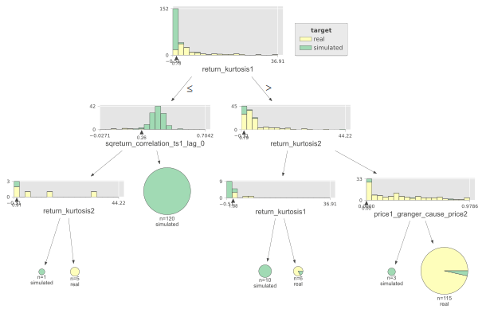

### Rules

if (return_kurtosis1 <= 0.778) and (sqreturn_correlation_ts1_lag_0 > 0.263) then class: simulated (proba: 100.0%) | based on 120 samples

if (return_kurtosis1 > 0.778) and (return_kurtosis2 > 0.791) and (price1_granger_cause_price2 > 0.0) then class: real (proba: 96.52%) | based on 115 samples

if (return_kurtosis1 > 0.778) and (return_kurtosis2 <= 0.791) and (return_kurtosis1 <= 1.883) then class: simulated (proba: 100.0%) | based on 10 samples

if (return_kurtosis1 > 0.778) and (return_kurtosis2 <= 0.791) and (return_kurtosis1 > 1.883) then class: real (proba: 83.33%) | based on 6 samples

if (return_kurtosis1 <= 0.778) and (sqreturn_correlation_ts1_lag_0 <= 0.263) and (return_kurtosis2 > 0.909) then class: real (proba: 100.0%) | based on 5 samples

if (return_kurtosis1 > 0.778) and (return_kurtosis2 > 0.791) and (price1_granger_cause_price2 <= 0.0) then class: simulated (proba: 100.0%) | based on 3 samples

if (return_kurtosis1 <= 0.778) and (sqreturn_correlation_ts1_lag_0 <= 0.263) and (return_kurtosis2 <= 0.909) then class: simulated (proba: 100.0%) | based on 1 samples

## Permutation-based Importance
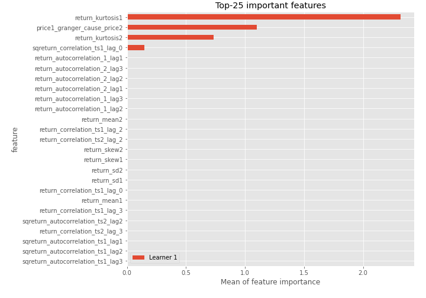
## Confusion Matrix

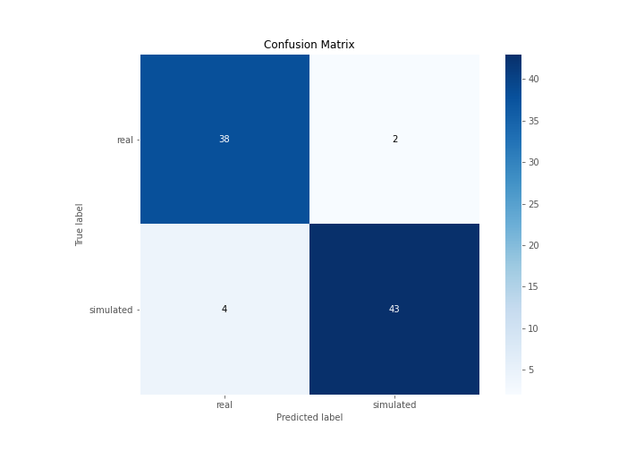

## Normalized Confusion Matrix

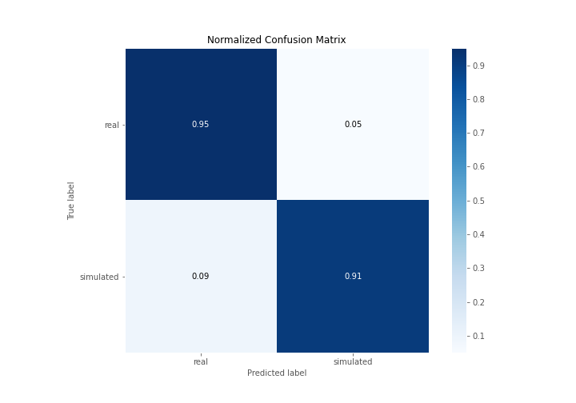

## ROC Curve

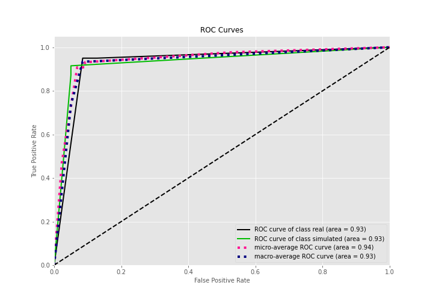

## Kolmogorov-Smirnov Statistic

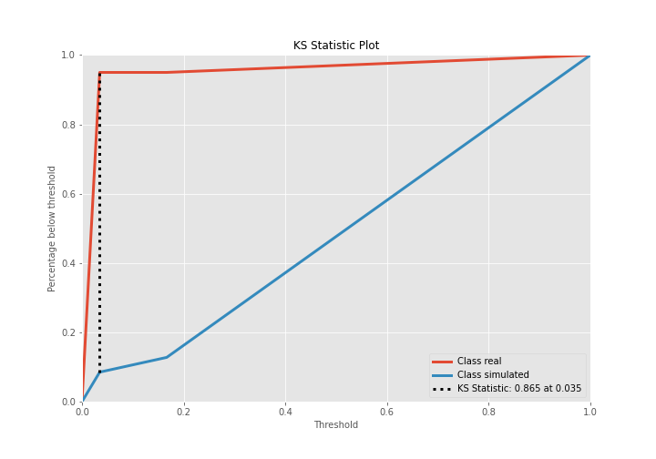

## Precision-Recall Curve

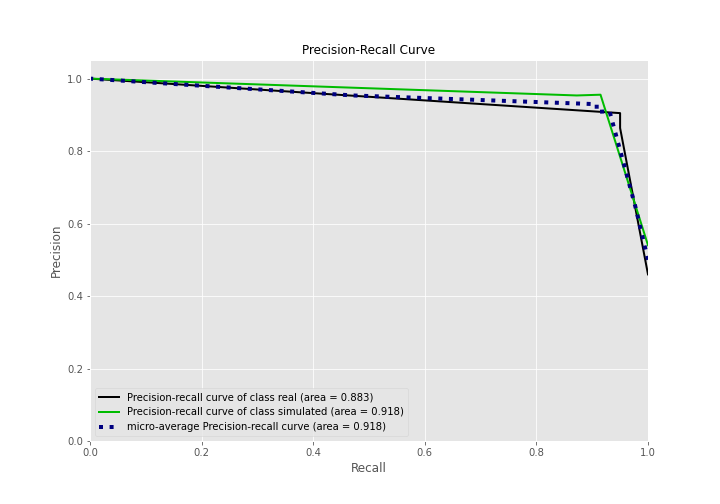

## Calibration Curve

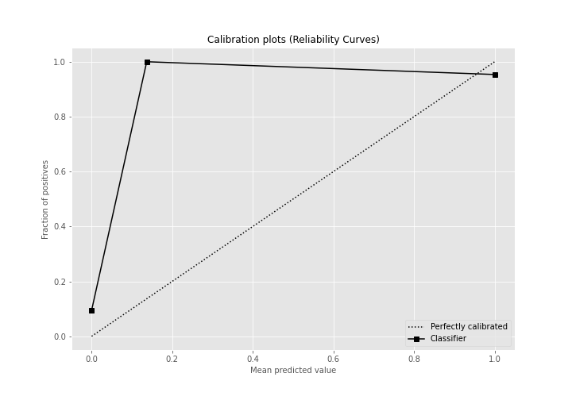

## Cumulative Gains Curve

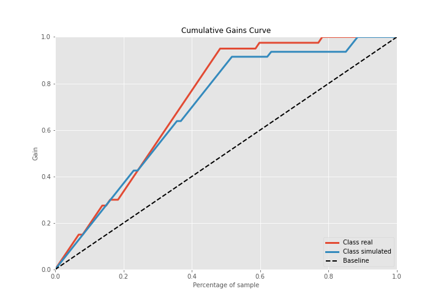

## Lift Curve

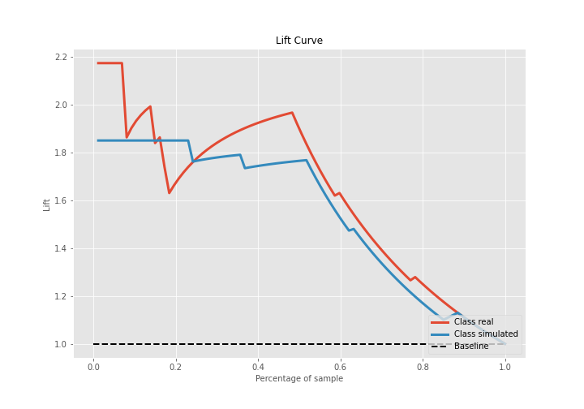

## SHAP Importance
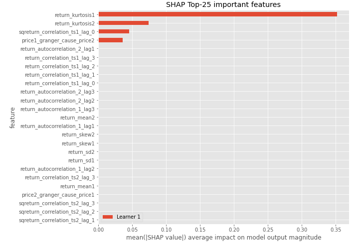

## SHAP Dependence plots

### Dependence (Fold 1)
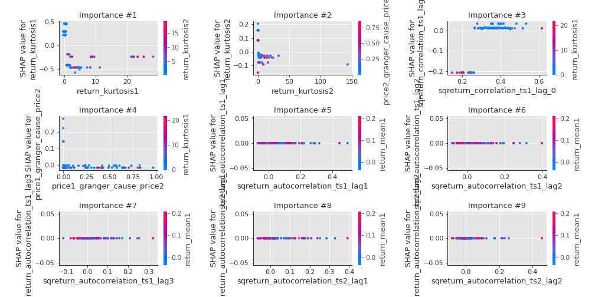

## SHAP Decision plots

### Top-10 Worst decisions for class 0 (Fold 1)
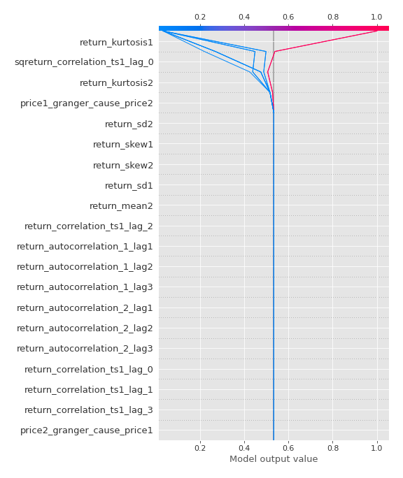
### Top-10 Best decisions for class 0 (Fold 1)
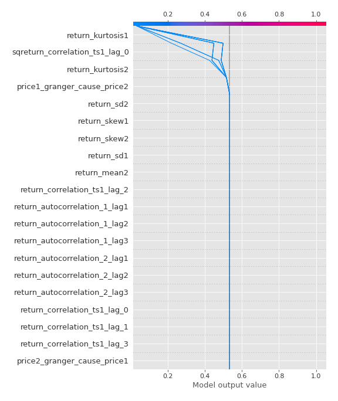
### Top-10 Worst decisions for class 1 (Fold 1)
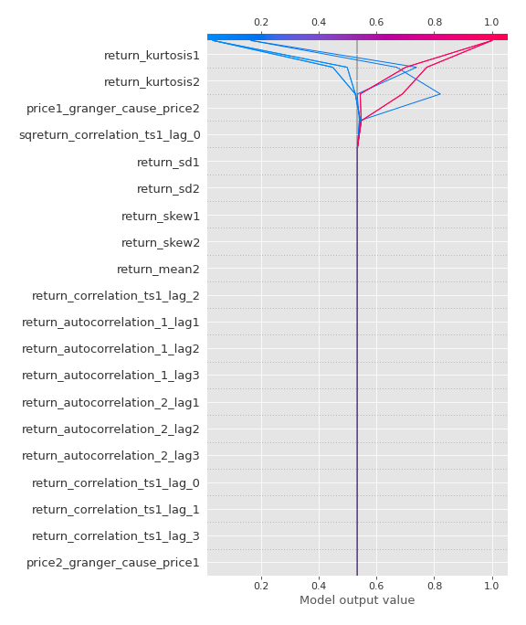
### Top-10 Best decisions for class 1 (Fold 1)
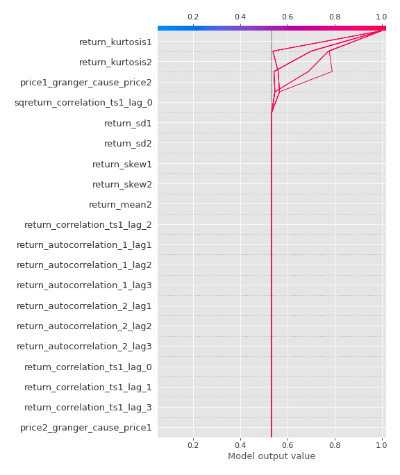

[<< Go back](../README.md)
