# Summary of 3_Linear

[<< Go back](../README.md)

## Logistic Regression (Linear)
- **n_jobs**: -1
- **explain_level**: 2

## Validation
 - **validation_type**: split
 - **train_ratio**: 0.75
 - **shuffle**: True
 - **stratify**: True

## Optimized metric
accuracy

## Training time

10.6 seconds

## Metric details
|           |    score |     threshold |
|:----------|---------:|--------------:|
| logloss   | 0.207201 | nan           |
| auc       | 0.97766  | nan           |
| f1        | 0.967033 |   0.60864     |
| accuracy  | 0.965517 |   0.60864     |
| precision | 1        |   0.60864     |
| recall    | 1        |   5.01993e-12 |
| mcc       | 0.933197 |   0.60864     |

## Confusion matrix (at threshold=0.60864)
|                      |   Predicted as real |   Predicted as simulated |
|:---------------------|--------------------:|-------------------------:|
| Labeled as real      |                  40 |                        0 |
| Labeled as simulated |                   3 |                       44 |

## Learning curves
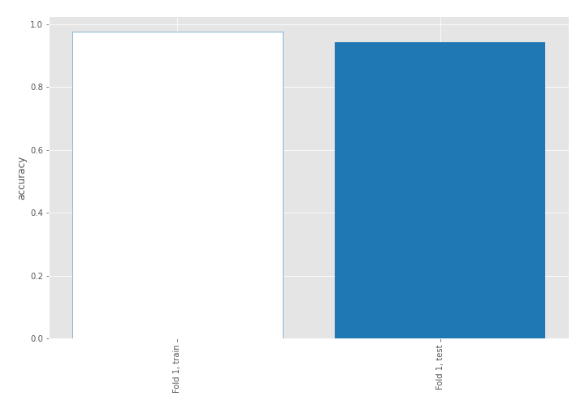

## Coefficients
| feature                           |   Learner_1 |
|:----------------------------------|------------:|
| sqreturn_correlation_ts1_lag_0    |    1.1118   |
| return_correlation_ts1_lag_0      |    1.1118   |
| return_skew2                      |    0.877532 |
| return_autocorrelation_2_lag1     |    0.752252 |
| return_mean1                      |    0.712875 |
| return_correlation_ts2_lag_1      |    0.674718 |
| sqreturn_correlation_ts2_lag_1    |    0.674718 |
| return_autocorrelation_1_lag2     |    0.657462 |
| return_autocorrelation_2_lag3     |    0.639717 |
| sqreturn_correlation_ts1_lag_1    |    0.598366 |
| return_correlation_ts1_lag_1      |    0.598366 |
| return_autocorrelation_2_lag2     |    0.584543 |
| sqreturn_correlation_ts1_lag_2    |    0.565501 |
| return_correlation_ts1_lag_2      |    0.565501 |
| return_correlation_ts2_lag_3      |    0.518609 |
| sqreturn_correlation_ts2_lag_3    |    0.518609 |
| return_autocorrelation_1_lag1     |    0.507907 |
| return_autocorrelation_1_lag3     |    0.47515  |
| sqreturn_correlation_ts2_lag_2    |    0.340975 |
| return_correlation_ts2_lag_2      |    0.340975 |
| return_skew1                      |    0.305845 |
| sqreturn_correlation_ts1_lag_3    |    0.281554 |
| return_correlation_ts1_lag_3      |    0.281554 |
| return_sd1                        |    0.184428 |
| return_sd2                        |   -0.173397 |
| return_mean2                      |   -0.474436 |
| sqreturn_autocorrelation_ts2_lag3 |   -0.74028  |
| return_kurtosis2                  |   -0.793412 |
| intercept                         |   -0.812599 |
| price2_granger_cause_price1       |   -1.09982  |
| sqreturn_autocorrelation_ts2_lag2 |   -1.15879  |
| sqreturn_autocorrelation_ts1_lag3 |   -1.20871  |
| price1_granger_cause_price2       |   -1.23343  |
| sqreturn_autocorrelation_ts1_lag2 |   -1.42593  |
| sqreturn_autocorrelation_ts2_lag1 |   -1.46462  |
| sqreturn_autocorrelation_ts1_lag1 |   -1.46493  |
| return_kurtosis1                  |   -3.59533  |

## Permutation-based Importance
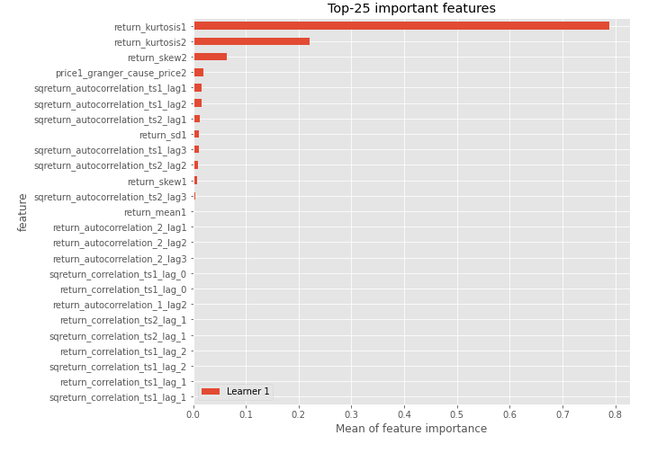
## Confusion Matrix

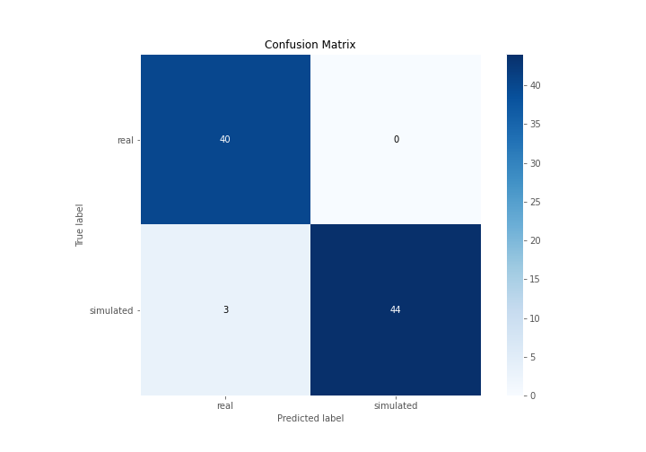

## Normalized Confusion Matrix

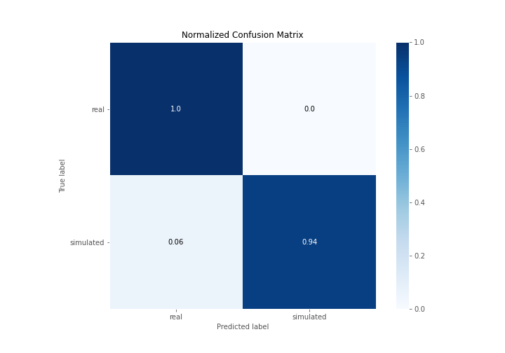

## ROC Curve

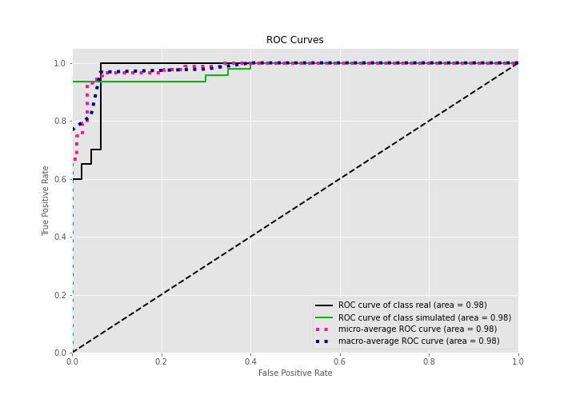

## Kolmogorov-Smirnov Statistic

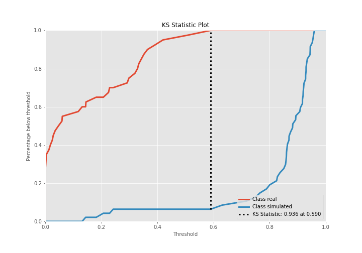

## Precision-Recall Curve

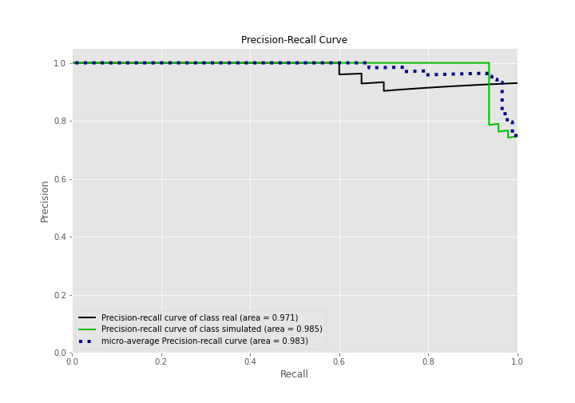

## Calibration Curve

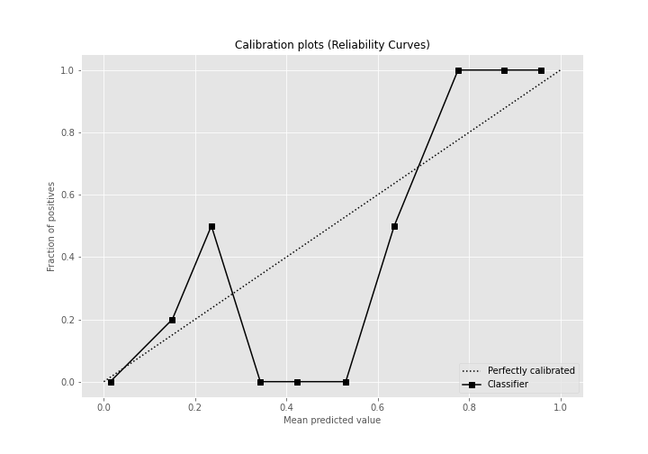

## Cumulative Gains Curve

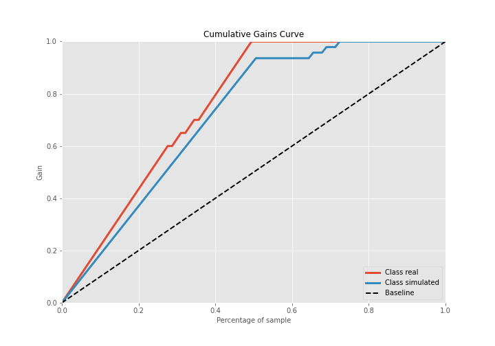

## Lift Curve

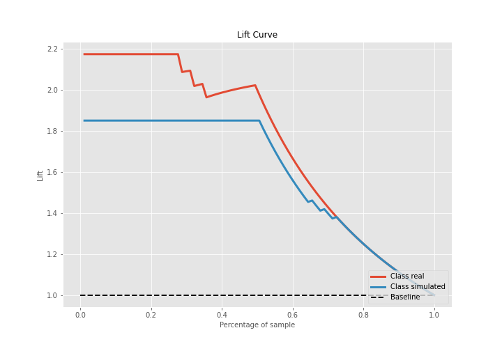

## SHAP Importance
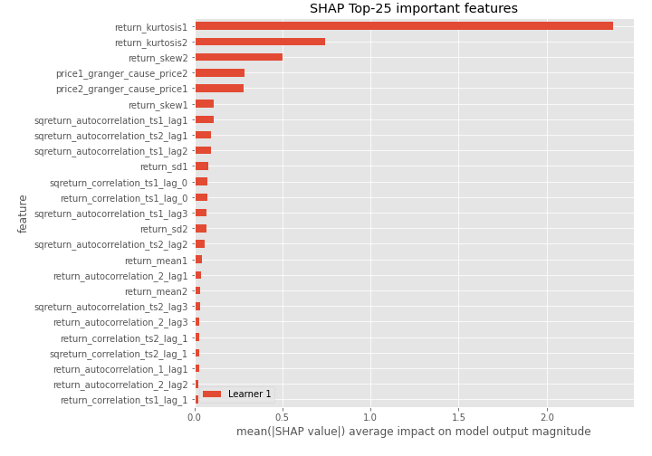

## SHAP Dependence plots

### Dependence (Fold 1)
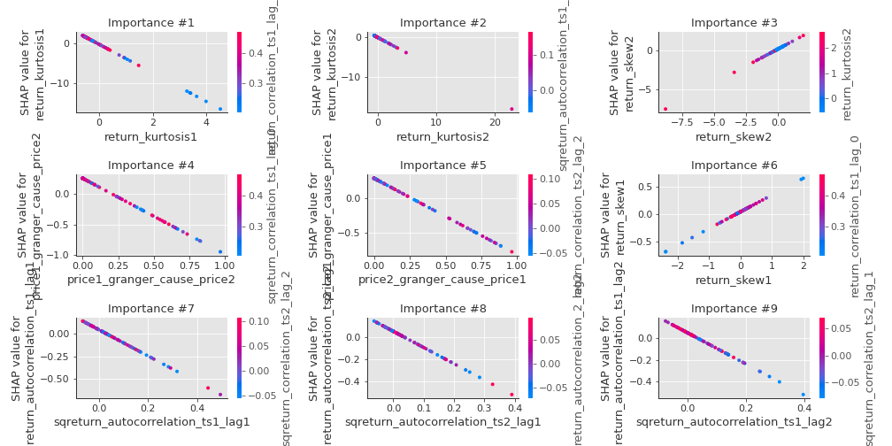

## SHAP Decision plots

### Top-10 Worst decisions for class 0 (Fold 1)
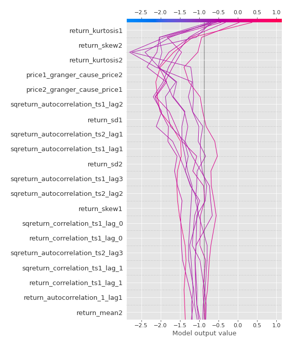
### Top-10 Best decisions for class 0 (Fold 1)
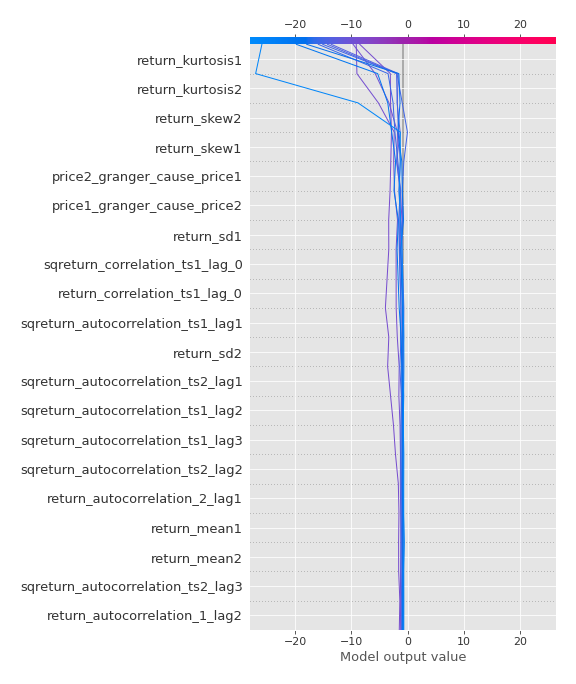
### Top-10 Worst decisions for class 1 (Fold 1)
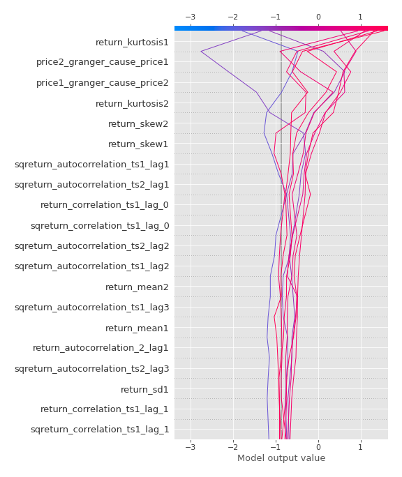
### Top-10 Best decisions for class 1 (Fold 1)
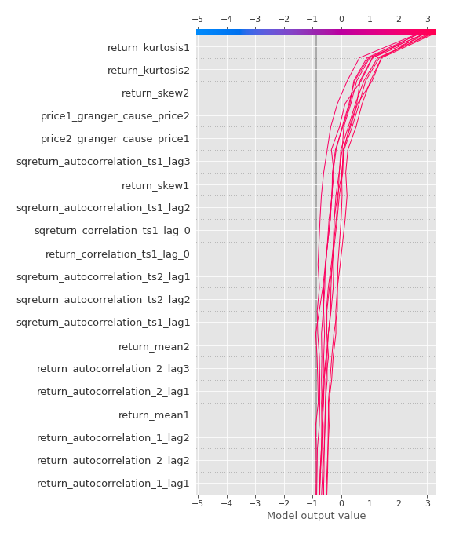

[<< Go back](../README.md)
