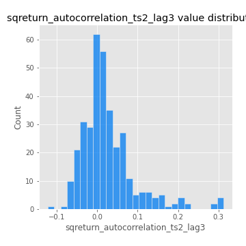

# Exploratory Data Analysis

[<< Go back](../README.md)
## Feature : target
- **Feature type** : categorical
- **Missing** : 0.0%
- **Unique** : 2
- **Count** :347
- **Unique** :2
- **Top** :simulated
- **Freq** :186

## Feature : return_mean1
- **Feature type** : continous
- **Missing** : 0.0%
- **Unique** : 347
- **Count** :347.0
- **Mean** :0.08824474363213736
- **Std** :0.08543371376982624
- **Min** :-0.17686457077756634
- **25%th Percentile** : 0.032608504895343504
- **50%th Percentile** : 0.08421804623938986
- **75%th Percentile** : 0.13873815150971858
- **Max** :0.37175100008111034

## Feature : return_mean2
- **Feature type** : continous
- **Missing** : 0.0%
- **Unique** : 347
- **Count** :347.0
- **Mean** :0.047126469909832804
- **Std** :0.09633275201559492
- **Min** :-0.3559026163062499
- **25%th Percentile** : -0.00243681502394394
- **50%th Percentile** : 0.044258793591574204
- **75%th Percentile** : 0.09830437531237539
- **Max** :0.5415196988524176

## Feature : return_sd1
- **Feature type** : continous
- **Missing** : 0.0%
- **Unique** : 347
- **Count** :347.0
- **Mean** :1.8913829409800098
- **Std** :0.5953872394942872
- **Min** :0.7470080772831957
- **25%th Percentile** : 1.7308274363935494
- **50%th Percentile** : 1.8657350266799648
- **75%th Percentile** : 1.9521291880068938
- **Max** :6.495661311240861

## Feature : return_sd2
- **Feature type** : continous
- **Missing** : 0.0%
- **Unique** : 347
- **Count** :347.0
- **Mean** :1.8544624914149153
- **Std** :0.6134015461774897
- **Min** :0.8592887433004143
- **25%th Percentile** : 1.6370099273875067
- **50%th Percentile** : 1.821351081528011
- **75%th Percentile** : 1.9048200478615909
- **Max** :5.762808157208253

## Feature : return_skew1
- **Feature type** : continous
- **Missing** : 0.0%
- **Unique** : 347
- **Count** :347.0
- **Mean** :-0.07939539585000753
- **Std** :0.5848835841343956
- **Min** :-2.817259764925239
- **25%th Percentile** : -0.20464929637626447
- **50%th Percentile** : -0.0385029227427179
- **75%th Percentile** : 0.1200317720340855
- **Max** :2.5845963767725557

## Feature : return_skew2
- **Feature type** : continous
- **Missing** : 0.0%
- **Unique** : 347
- **Count** :347.0
- **Mean** :-0.1566340883802499
- **Std** :0.7895122025112509
- **Min** :-8.801502855292393
- **25%th Percentile** : -0.26939210428141447
- **50%th Percentile** : -0.062087492596527495
- **75%th Percentile** : 0.0981686352609127
- **Max** :3.6474936871955608

## Feature : return_kurtosis1
- **Feature type** : continous
- **Missing** : 0.0%
- **Unique** : 347
- **Count** :347.0
- **Mean** :3.1802094223671125
- **Std** :5.701356253250933
- **Min** :-0.5127620019866916
- **25%th Percentile** : 0.15875583606560695
- **50%th Percentile** : 0.8583833335344617
- **75%th Percentile** : 3.493977699762969
- **Max** :36.91113889081053

## Feature : return_kurtosis2
- **Feature type** : continous
- **Missing** : 0.0%
- **Unique** : 347
- **Count** :347.0
- **Mean** :3.948639944257319
- **Std** :9.668767442154152
- **Min** :-0.3056693653573239
- **25%th Percentile** : 0.3520609837116697
- **50%th Percentile** : 1.2628971223603576
- **75%th Percentile** : 3.925999561854516
- **Max** :143.10871011533666

## Feature : return_autocorrelation_1_lag1
- **Feature type** : continous
- **Missing** : 0.0%
- **Unique** : 347
- **Count** :347.0
- **Mean** :-0.0013217974369257239
- **Std** :0.05872678974645456
- **Min** :-0.2135576224968752
- **25%th Percentile** : -0.03103188539807065
- **50%th Percentile** : 0.004010943415189421
- **75%th Percentile** : 0.03664742355491696
- **Max** :0.12810656890648087

## Feature : return_autocorrelation_1_lag2
- **Feature type** : continous
- **Missing** : 0.0%
- **Unique** : 347
- **Count** :347.0
- **Mean** :0.0033386066272039576
- **Std** :0.04935703163516086
- **Min** :-0.13309283796645122
- **25%th Percentile** : -0.028112262947675444
- **50%th Percentile** : 0.007624718875663837
- **75%th Percentile** : 0.03499399287079426
- **Max** :0.1561488228015672

## Feature : return_autocorrelation_1_lag3
- **Feature type** : continous
- **Missing** : 0.0%
- **Unique** : 347
- **Count** :347.0
- **Mean** :0.008467834446005249
- **Std** :0.05407274841121911
- **Min** :-0.1940836867390813
- **25%th Percentile** : -0.021028383476125352
- **50%th Percentile** : 0.008932678805496343
- **75%th Percentile** : 0.04578066441362105
- **Max** :0.17805869530681923

## Feature : return_autocorrelation_2_lag1
- **Feature type** : continous
- **Missing** : 0.0%
- **Unique** : 347
- **Count** :347.0
- **Mean** :0.00506602931530898
- **Std** :0.06360202988203484
- **Min** :-0.25075531010123286
- **25%th Percentile** : -0.028289929340244158
- **50%th Percentile** : 0.009963061954948798
- **75%th Percentile** : 0.04740128490537035
- **Max** :0.16452612084849627

## Feature : return_autocorrelation_2_lag2
- **Feature type** : continous
- **Missing** : 0.0%
- **Unique** : 347
- **Count** :347.0
- **Mean** :0.013189169311097836
- **Std** :0.05491498383106344
- **Min** :-0.15323211089747296
- **25%th Percentile** : -0.023593838661282954
- **50%th Percentile** : 0.012255853450786107
- **75%th Percentile** : 0.050183521851520536
- **Max** :0.1735398560230086

## Feature : return_autocorrelation_2_lag3
- **Feature type** : continous
- **Missing** : 0.0%
- **Unique** : 347
- **Count** :347.0
- **Mean** :0.01008998173931566
- **Std** :0.05472580175270555
- **Min** :-0.14200107169559698
- **25%th Percentile** : -0.023814773025964173
- **50%th Percentile** : 0.008380070233523674
- **75%th Percentile** : 0.044892965110274435
- **Max** :0.16381644668850437

## Feature : return_correlation_ts1_lag_0
- **Feature type** : continous
- **Missing** : 0.0%
- **Unique** : 347
- **Count** :347.0
- **Mean** :0.3444568223470547
- **Std** :0.10940390342742035
- **Min** :-0.027089510445801036
- **25%th Percentile** : 0.29727210060382026
- **50%th Percentile** : 0.36084213231741136
- **75%th Percentile** : 0.4069275063039052
- **Max** :0.7041861626832071

## Feature : return_correlation_ts1_lag_1
- **Feature type** : continous
- **Missing** : 0.0%
- **Unique** : 347
- **Count** :347.0
- **Mean** :0.004301976763930502
- **Std** :0.05067851051405071
- **Min** :-0.16985510949917193
- **25%th Percentile** : -0.024812639130909843
- **50%th Percentile** : 0.007249978614783968
- **75%th Percentile** : 0.03611709325248835
- **Max** :0.1534733350877454

## Feature : return_correlation_ts1_lag_2
- **Feature type** : continous
- **Missing** : 0.0%
- **Unique** : 347
- **Count** :347.0
- **Mean** :0.012066997981762072
- **Std** :0.0492195153823121
- **Min** :-0.21653581047581763
- **25%th Percentile** : -0.020976163664139066
- **50%th Percentile** : 0.014184816331854845
- **75%th Percentile** : 0.04741473241850873
- **Max** :0.12098067570240166

## Feature : return_correlation_ts1_lag_3
- **Feature type** : continous
- **Missing** : 0.0%
- **Unique** : 347
- **Count** :347.0
- **Mean** :0.007568927848271707
- **Std** :0.05273624317662408
- **Min** :-0.1270218498974763
- **25%th Percentile** : -0.026046790246925078
- **50%th Percentile** : 0.0078060763156426426
- **75%th Percentile** : 0.043666607320475545
- **Max** :0.1636773216468148

## Feature : return_correlation_ts2_lag_1
- **Feature type** : continous
- **Missing** : 0.0%
- **Unique** : 347
- **Count** :347.0
- **Mean** :0.008894976679987246
- **Std** :0.053933372647304974
- **Min** :-0.20093919236581337
- **25%th Percentile** : -0.01971148051191678
- **50%th Percentile** : 0.011218894599672602
- **75%th Percentile** : 0.04366007545087107
- **Max** :0.17208763791364762

## Feature : return_correlation_ts2_lag_2
- **Feature type** : continous
- **Missing** : 0.0%
- **Unique** : 347
- **Count** :347.0
- **Mean** :0.013514927995727372
- **Std** :0.04816057344222025
- **Min** :-0.11701735111763815
- **25%th Percentile** : -0.02099542918114436
- **50%th Percentile** : 0.012081349804213028
- **75%th Percentile** : 0.0451233865083379
- **Max** :0.20772887392904255

## Feature : return_correlation_ts2_lag_3
- **Feature type** : continous
- **Missing** : 0.0%
- **Unique** : 347
- **Count** :347.0
- **Mean** :0.009535188848990026
- **Std** :0.052693383542132
- **Min** :-0.17564076057312866
- **25%th Percentile** : -0.019689960600590146
- **50%th Percentile** : 0.00853159409099306
- **75%th Percentile** : 0.046092573517827834
- **Max** :0.1551654382501384

## Feature : sqreturn_autocorrelation_ts1_lag1
- **Feature type** : continous
- **Missing** : 0.0%
- **Unique** : 347
- **Count** :347.0
- **Mean** :0.046865529677719696
- **Std** :0.09641266004542276
- **Min** :-0.1009744225008219
- **25%th Percentile** : -0.018130184321934882
- **50%th Percentile** : 0.023027642775551204
- **75%th Percentile** : 0.08538969663794785
- **Max** :0.49414293176447355

## Feature : sqreturn_autocorrelation_ts1_lag2
- **Feature type** : continous
- **Missing** : 0.0%
- **Unique** : 347
- **Count** :347.0
- **Mean** :0.041570502107207065
- **Std** :0.08630560447655854
- **Min** :-0.07722898408866474
- **25%th Percentile** : -0.010918902408977176
- **50%th Percentile** : 0.01815527944468389
- **75%th Percentile** : 0.06127980002904217
- **Max** :0.4522162366773919

## Feature : sqreturn_autocorrelation_ts1_lag3
- **Feature type** : continous
- **Missing** : 0.0%
- **Unique** : 347
- **Count** :347.0
- **Mean** :0.030717700040512545
- **Std** :0.08033795989746544
- **Min** :-0.11555512392022971
- **25%th Percentile** : -0.0178670328983679
- **50%th Percentile** : 0.011661694976324318
- **75%th Percentile** : 0.05373855654721503
- **Max** :0.41030914918857014

## Feature : sqreturn_autocorrelation_ts2_lag1
- **Feature type** : continous
- **Missing** : 0.0%
- **Unique** : 347
- **Count** :347.0
- **Mean** :0.047417843515767714
- **Std** :0.08739182950780398
- **Min** :-0.08520586663750691
- **25%th Percentile** : -0.011323404738198194
- **50%th Percentile** : 0.024896300065362514
- **75%th Percentile** : 0.0844437327791894
- **Max** :0.510085647437958

## Feature : sqreturn_autocorrelation_ts2_lag2
- **Feature type** : continous
- **Missing** : 0.0%
- **Unique** : 347
- **Count** :347.0
- **Mean** :0.03125811310883442
- **Std** :0.08402746125216452
- **Min** :-0.10579824896432341
- **25%th Percentile** : -0.016085067491520975
- **50%th Percentile** : 0.01162085636483385
- **75%th Percentile** : 0.046081836434424206
- **Max** :0.45676817892778204

## Feature : sqreturn_autocorrelation_ts2_lag3
- **Feature type** : continous
- **Missing** : 0.0%
- **Unique** : 347
- **Count** :347.0
- **Mean** :0.025496072303203828
- **Std** :0.06652838020650524
- **Min** :-0.12194798404078303
- **25%th Percentile** : -0.011943491040310353
- **50%th Percentile** : 0.012784161301929102
- **75%th Percentile** : 0.04521521546244153
- **Max** :0.31225727797735664

## Feature : sqreturn_correlation_ts1_lag_0
- **Feature type** : continous
- **Missing** : 0.0%
- **Unique** : 347
- **Count** :347.0
- **Mean** :0.3444568223470547
- **Std** :0.10940390342742035
- **Min** :-0.027089510445801036
- **25%th Percentile** : 0.29727210060382026
- **50%th Percentile** : 0.36084213231741136
- **75%th Percentile** : 0.4069275063039052
- **Max** :0.7041861626832071

## Feature : sqreturn_correlation_ts1_lag_1
- **Feature type** : continous
- **Missing** : 0.0%
- **Unique** : 347
- **Count** :347.0
- **Mean** :0.004301976763930502
- **Std** :0.05067851051405071
- **Min** :-0.16985510949917193
- **25%th Percentile** : -0.024812639130909843
- **50%th Percentile** : 0.007249978614783968
- **75%th Percentile** : 0.03611709325248835
- **Max** :0.1534733350877454

## Feature : sqreturn_correlation_ts1_lag_2
- **Feature type** : continous
- **Missing** : 0.0%
- **Unique** : 347
- **Count** :347.0
- **Mean** :0.012066997981762072
- **Std** :0.0492195153823121
- **Min** :-0.21653581047581763
- **25%th Percentile** : -0.020976163664139066
- **50%th Percentile** : 0.014184816331854845
- **75%th Percentile** : 0.04741473241850873
- **Max** :0.12098067570240166

## Feature : sqreturn_correlation_ts1_lag_3
- **Feature type** : continous
- **Missing** : 0.0%
- **Unique** : 347
- **Count** :347.0
- **Mean** :0.007568927848271707
- **Std** :0.05273624317662408
- **Min** :-0.1270218498974763
- **25%th Percentile** : -0.026046790246925078
- **50%th Percentile** : 0.0078060763156426426
- **75%th Percentile** : 0.043666607320475545
- **Max** :0.1636773216468148

## Feature : sqreturn_correlation_ts2_lag_1
- **Feature type** : continous
- **Missing** : 0.0%
- **Unique** : 347
- **Count** :347.0
- **Mean** :0.008894976679987246
- **Std** :0.053933372647304974
- **Min** :-0.20093919236581337
- **25%th Percentile** : -0.01971148051191678
- **50%th Percentile** : 0.011218894599672602
- **75%th Percentile** : 0.04366007545087107
- **Max** :0.17208763791364762

## Feature : sqreturn_correlation_ts2_lag_2
- **Feature type** : continous
- **Missing** : 0.0%
- **Unique** : 347
- **Count** :347.0
- **Mean** :0.013514927995727372
- **Std** :0.04816057344222025
- **Min** :-0.11701735111763815
- **25%th Percentile** : -0.02099542918114436
- **50%th Percentile** : 0.012081349804213028
- **75%th Percentile** : 0.0451233865083379
- **Max** :0.20772887392904255

## Feature : sqreturn_correlation_ts2_lag_3
- **Feature type** : continous
- **Missing** : 0.0%
- **Unique** : 347
- **Count** :347.0
- **Mean** :0.009535188848990026
- **Std** :0.052693383542132
- **Min** :-0.17564076057312866
- **25%th Percentile** : -0.019689960600590146
- **50%th Percentile** : 0.00853159409099306
- **75%th Percentile** : 0.046092573517827834
- **Max** :0.1551654382501384

## Feature : price2_granger_cause_price1
- **Feature type** : continous
- **Missing** : 0.0%
- **Unique** : 347
- **Count** :347.0
- **Mean** :0.2725617392283976
- **Std** :0.2968728567632847
- **Min** :5.151430997936629e-08
- **25%th Percentile** : 0.01943300764549897
- **50%th Percentile** : 0.14359316166293137
- **75%th Percentile** : 0.47651280493748777
- **Max** :0.9885712803689185

## Feature : price1_granger_cause_price2
- **Feature type** : continous
- **Missing** : 0.0%
- **Unique** : 347
- **Count** :347.0
- **Mean** :0.20943105788091634
- **Std** :0.27257613446264767
- **Min** :1.7405091995600134e-13
- **25%th Percentile** : 0.0016326265980946871
- **50%th Percentile** : 0.05319399506382417
- **75%th Percentile** : 0.35487713495478274
- **Max** :0.9785872619015303

[<< Go back](../README.md)
