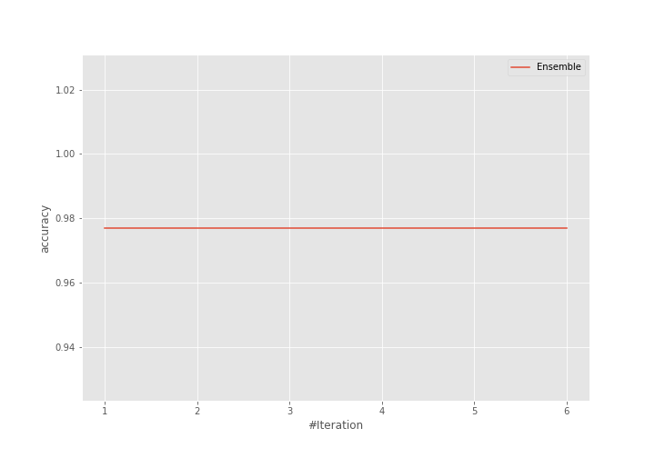

# Summary of Ensemble

[<< Go back](../README.md)

## Ensemble structure
| Model             |   Weight |
|:------------------|---------:|
| 4_Default_Xgboost |        1 |

## Metric details
|           |     score |   threshold |
|:----------|----------:|------------:|
| logloss   | 0.0977488 | nan         |
| auc       | 0.998404  | nan         |
| f1        | 0.979167  |   0.22663   |
| accuracy  | 0.977011  |   0.503169  |
| precision | 1         |   0.503169  |
| recall    | 1         |   0.0159423 |
| mcc       | 0.954911  |   0.503169  |

## Confusion matrix (at threshold=0.503169)
|                      |   Predicted as real |   Predicted as simulated |
|:---------------------|--------------------:|-------------------------:|
| Labeled as real      |                  40 |                        0 |
| Labeled as simulated |                   2 |                       45 |

## Learning curves

## Confusion Matrix

## Normalized Confusion Matrix

## ROC Curve

## Kolmogorov-Smirnov Statistic

## Precision-Recall Curve

## Calibration Curve

## Cumulative Gains Curve

## Lift Curve

[<< Go back](../README.md)
