# Summary of 3_Linear

[<< Go back](../README.md)

## Logistic Regression (Linear)
- **n_jobs**: -1
- **explain_level**: 2

## Validation
 - **validation_type**: split
 - **train_ratio**: 0.75
 - **shuffle**: True
 - **stratify**: True

## Optimized metric
accuracy

## Training time

4.2 seconds

## Metric details
|           |    score |     threshold |
|:----------|---------:|--------------:|
| logloss   | 0.150504 | nan           |
| auc       | 0.9926   | nan           |
| f1        | 0.977273 |   0.502583    |
| accuracy  | 0.977011 |   0.502583    |
| precision | 1        |   0.852886    |
| recall    | 1        |   4.91403e-11 |
| mcc       | 0.95505  |   0.502583    |

## Confusion matrix (at threshold=0.502583)
|                      |   Predicted as real |   Predicted as simulated |
|:---------------------|--------------------:|-------------------------:|
| Labeled as real      |                  42 |                        2 |
| Labeled as simulated |                   0 |                       43 |

## Learning curves
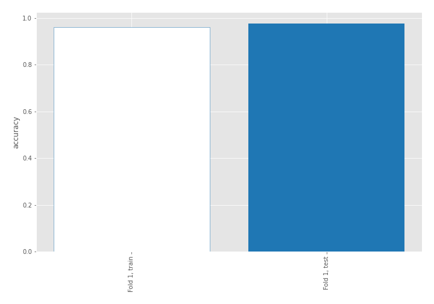

## Coefficients
| feature                           |   Learner_1 |
|:----------------------------------|------------:|
| return_skew2                      |   0.828886  |
| return_autocorrelation_2_lag1     |   0.613772  |
| return_autocorrelation_2_lag3     |   0.342401  |
| sqreturn_correlation_ts1_lag_1    |   0.300721  |
| return_correlation_ts1_lag_1      |   0.300721  |
| return_skew1                      |   0.253838  |
| return_correlation_ts1_lag_0      |   0.244832  |
| sqreturn_correlation_ts1_lag_0    |   0.244832  |
| return_autocorrelation_1_lag2     |   0.238046  |
| sqreturn_correlation_ts2_lag_3    |   0.236076  |
| return_correlation_ts2_lag_3      |   0.236076  |
| return_autocorrelation_2_lag2     |   0.203017  |
| sqreturn_correlation_ts2_lag_2    |   0.171655  |
| return_correlation_ts2_lag_2      |   0.171655  |
| return_autocorrelation_1_lag3     |   0.123322  |
| sqreturn_correlation_ts1_lag_3    |   0.113612  |
| return_correlation_ts1_lag_3      |   0.113612  |
| return_correlation_ts2_lag_1      |   0.103096  |
| sqreturn_correlation_ts2_lag_1    |   0.103096  |
| return_autocorrelation_1_lag1     |   0.0576146 |
| return_correlation_ts1_lag_2      |   0.0548239 |
| sqreturn_correlation_ts1_lag_2    |   0.0548239 |
| return_sd1                        |   0.0217558 |
| price1_granger_cause_price2       |  -0.122741  |
| price2_granger_cause_price1       |  -0.172588  |
| return_sd2                        |  -0.316713  |
| return_mean1                      |  -0.421332  |
| return_mean2                      |  -0.465076  |
| sqreturn_autocorrelation_ts2_lag3 |  -0.831429  |
| sqreturn_autocorrelation_ts1_lag3 |  -0.912426  |
| sqreturn_autocorrelation_ts2_lag2 |  -0.942791  |
| sqreturn_autocorrelation_ts1_lag2 |  -1.04985   |
| sqreturn_autocorrelation_ts1_lag1 |  -1.22404   |
| sqreturn_autocorrelation_ts2_lag1 |  -1.36504   |
| intercept                         |  -1.72135   |
| return_kurtosis2                  |  -3.5594    |
| return_kurtosis1                  |  -4.35862   |

## Permutation-based Importance
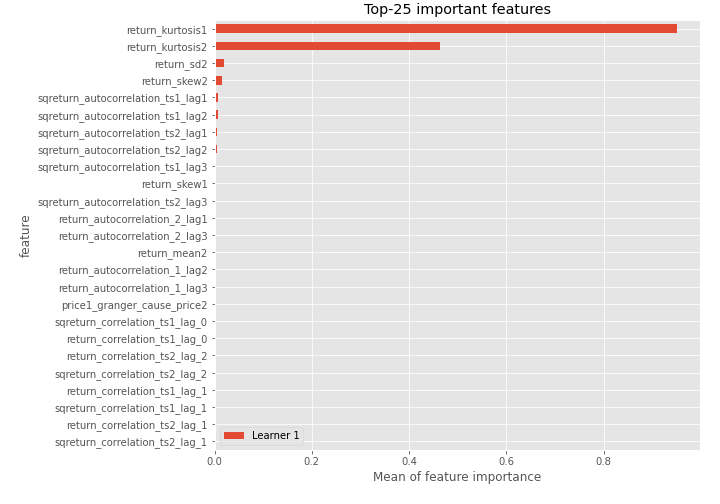
## Confusion Matrix

## Normalized Confusion Matrix

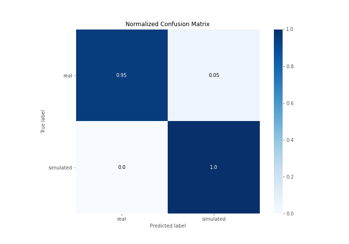

## ROC Curve

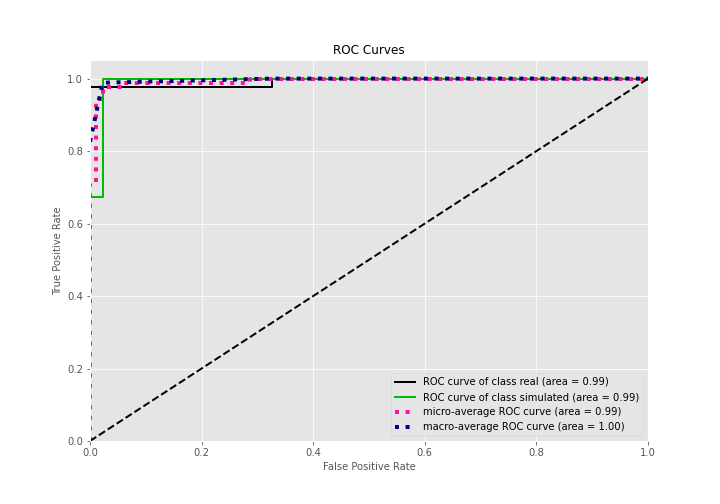

## Kolmogorov-Smirnov Statistic

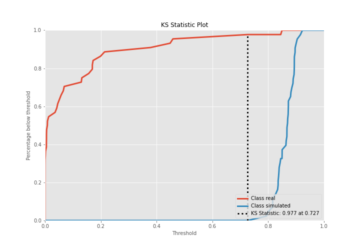

## Precision-Recall Curve

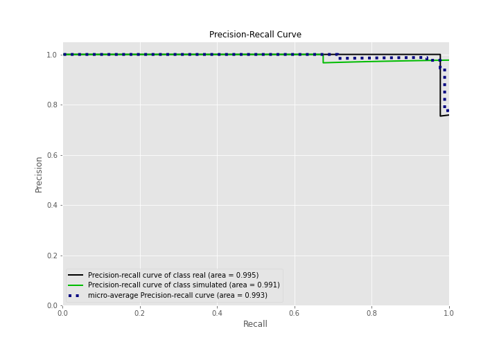

## Calibration Curve

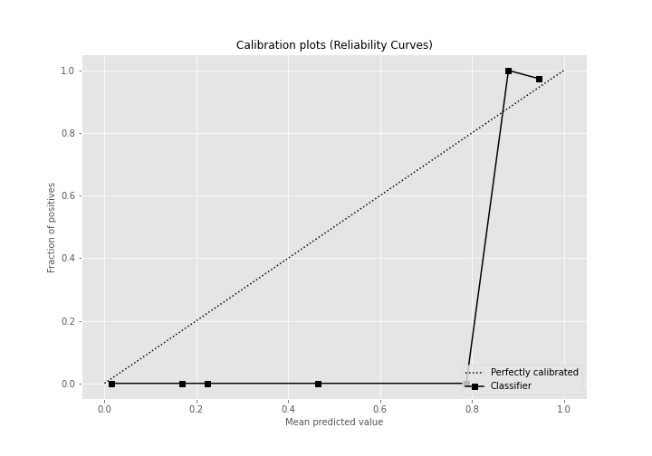

## Cumulative Gains Curve

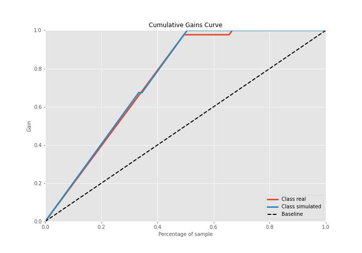

## Lift Curve

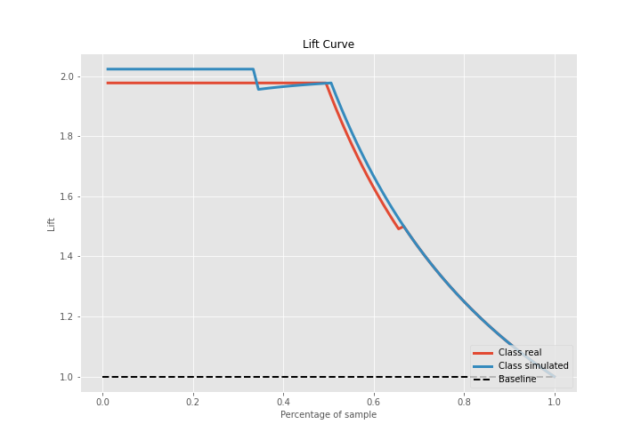

## SHAP Importance
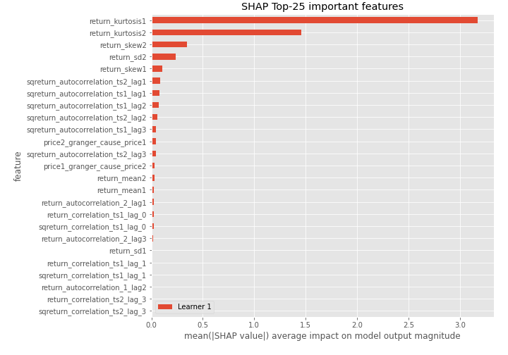

## SHAP Dependence plots

### Dependence (Fold 1)
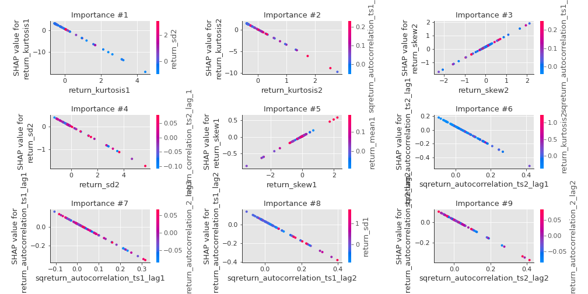

## SHAP Decision plots

### Top-10 Worst decisions for class 0 (Fold 1)
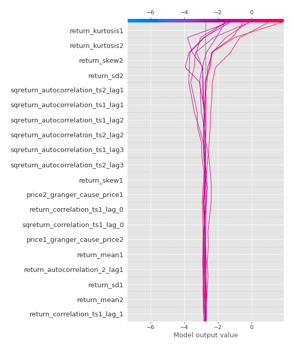
### Top-10 Best decisions for class 0 (Fold 1)
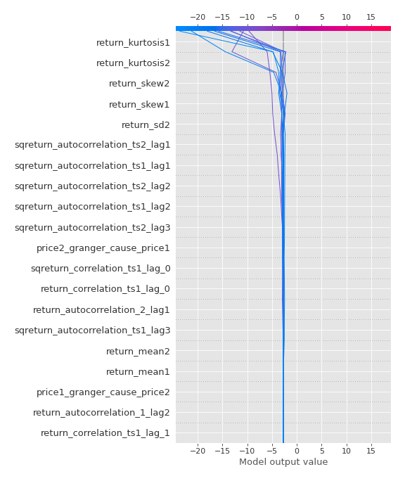
### Top-10 Worst decisions for class 1 (Fold 1)
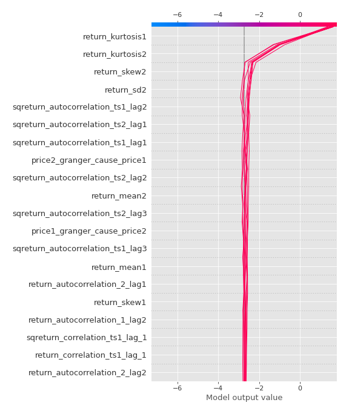
### Top-10 Best decisions for class 1 (Fold 1)
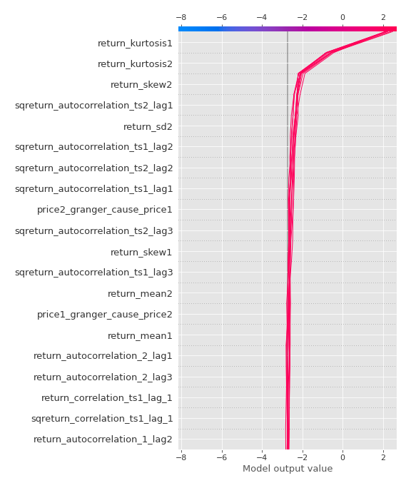

[<< Go back](../README.md)
