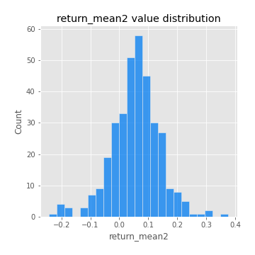
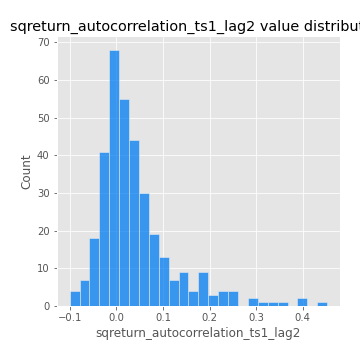
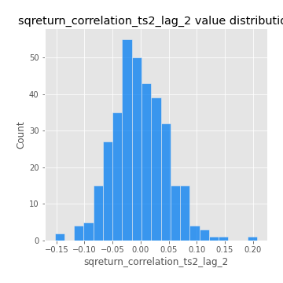

# Exploratory Data Analysis

[<< Go back](../README.md)
## Feature : target
- **Feature type** : categorical
- **Missing** : 0.0%
- **Unique** : 2
- **Count** :347
- **Unique** :2
- **Top** :real
- **Freq** :176

## Feature : return_mean1
- **Feature type** : continous
- **Missing** : 0.0%
- **Unique** : 347
- **Count** :347.0
- **Mean** :0.050016375422009623
- **Std** :0.07961152366594441
- **Min** :-0.22632637961920957
- **25%th Percentile** : 0.0003614845984745188
- **50%th Percentile** : 0.04912987029805134
- **75%th Percentile** : 0.09587415936890814
- **Max** :0.37175100008111034

## Feature : return_mean2
- **Feature type** : continous
- **Missing** : 0.0%
- **Unique** : 347
- **Count** :347.0
- **Mean** :0.05638126926865438
- **Std** :0.08429558433143373
- **Min** :-0.24205418062825398
- **25%th Percentile** : 0.008844990422005542
- **50%th Percentile** : 0.05745256992054549
- **75%th Percentile** : 0.10332179319855267
- **Max** :0.37616608147096464

## Feature : return_sd1
- **Feature type** : continous
- **Missing** : 0.0%
- **Unique** : 347
- **Count** :347.0
- **Mean** :1.7804594837756968
- **Std** :0.7693241225131163
- **Min** :0.7470080772831957
- **25%th Percentile** : 1.5393121775423546
- **50%th Percentile** : 1.6014915205716447
- **75%th Percentile** : 1.7031601847441014
- **Max** :9.236766377527575

## Feature : return_sd2
- **Feature type** : continous
- **Missing** : 0.0%
- **Unique** : 347
- **Count** :347.0
- **Mean** :1.7755182221380912
- **Std** :0.7646473670281907
- **Min** :0.8455946193085045
- **25%th Percentile** : 1.51146596388652
- **50%th Percentile** : 1.588009334253561
- **75%th Percentile** : 1.6885739278598813
- **Max** :6.737618636746393

## Feature : return_skew1
- **Feature type** : continous
- **Missing** : 0.0%
- **Unique** : 347
- **Count** :347.0
- **Mean** :-0.07693098687723124
- **Std** :0.6127646085557238
- **Min** :-3.530116233761814
- **25%th Percentile** : -0.16542649355327266
- **50%th Percentile** : -0.011111677242081439
- **75%th Percentile** : 0.10042779928374931
- **Max** :2.5845963767725557

## Feature : return_skew2
- **Feature type** : continous
- **Missing** : 0.0%
- **Unique** : 347
- **Count** :347.0
- **Mean** :-0.16241280329196278
- **Std** :0.8258325455853959
- **Min** :-8.801502855292393
- **25%th Percentile** : -0.24997546702811635
- **50%th Percentile** : -0.04015413148720717
- **75%th Percentile** : 0.0992091355153748
- **Max** :2.2606839051517187

## Feature : return_kurtosis1
- **Feature type** : continous
- **Missing** : 0.0%
- **Unique** : 347
- **Count** :347.0
- **Mean** :3.3978871321635737
- **Std** :6.415803432091602
- **Min** :-0.512897103202687
- **25%th Percentile** : -0.02327713083197014
- **50%th Percentile** : 0.6344278261025611
- **75%th Percentile** : 3.6512465710229476
- **Max** :46.07507808162177

## Feature : return_kurtosis2
- **Feature type** : continous
- **Missing** : 0.0%
- **Unique** : 347
- **Count** :347.0
- **Mean** :3.9935413349374107
- **Std** :10.529074400293073
- **Min** :-0.473238469498412
- **25%th Percentile** : -0.01442053080114758
- **50%th Percentile** : 0.6208695975279284
- **75%th Percentile** : 4.3612884611668505
- **Max** :143.10871011533666

## Feature : return_autocorrelation_1_lag1
- **Feature type** : continous
- **Missing** : 0.0%
- **Unique** : 347
- **Count** :347.0
- **Mean** :-0.013668438621005852
- **Std** :0.0570084521418046
- **Min** :-0.19339575314049967
- **25%th Percentile** : -0.05114534955208851
- **50%th Percentile** : -0.0069089598187218
- **75%th Percentile** : 0.024699953999832325
- **Max** :0.16517379178637007

## Feature : return_autocorrelation_1_lag2
- **Feature type** : continous
- **Missing** : 0.0%
- **Unique** : 347
- **Count** :347.0
- **Mean** :-0.01009493948760643
- **Std** :0.048287229395034256
- **Min** :-0.14332335322309647
- **25%th Percentile** : -0.039645322427897395
- **50%th Percentile** : -0.009043088888686804
- **75%th Percentile** : 0.01987879316392132
- **Max** :0.1561488228015672

## Feature : return_autocorrelation_1_lag3
- **Feature type** : continous
- **Missing** : 0.0%
- **Unique** : 347
- **Count** :347.0
- **Mean** :-0.0004890038067135089
- **Std** :0.04932891905269196
- **Min** :-0.15117275786205733
- **25%th Percentile** : -0.031201341393182265
- **50%th Percentile** : -0.00038564435691356786
- **75%th Percentile** : 0.033428056881941406
- **Max** :0.17805869530681923

## Feature : return_autocorrelation_2_lag1
- **Feature type** : continous
- **Missing** : 0.0%
- **Unique** : 347
- **Count** :347.0
- **Mean** :-0.007587917824260802
- **Std** :0.061993821028729454
- **Min** :-0.25075531010123286
- **25%th Percentile** : -0.04024736656709013
- **50%th Percentile** : -0.0007772337721704469
- **75%th Percentile** : 0.029228275129120233
- **Max** :0.31863413537898483

## Feature : return_autocorrelation_2_lag2
- **Feature type** : continous
- **Missing** : 0.0%
- **Unique** : 347
- **Count** :347.0
- **Mean** :-0.004281920290134682
- **Std** :0.05238483311473232
- **Min** :-0.15323211089747296
- **25%th Percentile** : -0.03544139041078115
- **50%th Percentile** : -0.007521628340500333
- **75%th Percentile** : 0.02762904516715727
- **Max** :0.20974504043791217

## Feature : return_autocorrelation_2_lag3
- **Feature type** : continous
- **Missing** : 0.0%
- **Unique** : 347
- **Count** :347.0
- **Mean** :-0.003018547210436076
- **Std** :0.048415950009810624
- **Min** :-0.14200107169559698
- **25%th Percentile** : -0.02967488564301178
- **50%th Percentile** : -0.0033165962748403057
- **75%th Percentile** : 0.030624213119176305
- **Max** :0.1419999376914021

## Feature : return_correlation_ts1_lag_0
- **Feature type** : continous
- **Missing** : 0.0%
- **Unique** : 347
- **Count** :347.0
- **Mean** :0.316473267016492
- **Std** :0.11121446596236105
- **Min** :-0.027089510445801036
- **25%th Percentile** : 0.265099158975147
- **50%th Percentile** : 0.3176279388662059
- **75%th Percentile** : 0.35899920656634
- **Max** :0.7041861626832071

## Feature : return_correlation_ts1_lag_1
- **Feature type** : continous
- **Missing** : 0.0%
- **Unique** : 347
- **Count** :347.0
- **Mean** :-0.004029536094547898
- **Std** :0.049420015963142
- **Min** :-0.15776193292681923
- **25%th Percentile** : -0.03654108513036382
- **50%th Percentile** : 0.00056641931933655
- **75%th Percentile** : 0.028375317997857186
- **Max** :0.15499424718508623

## Feature : return_correlation_ts1_lag_2
- **Feature type** : continous
- **Missing** : 0.0%
- **Unique** : 347
- **Count** :347.0
- **Mean** :-0.0032424510132988073
- **Std** :0.04373238846704332
- **Min** :-0.11523251525020971
- **25%th Percentile** : -0.03156581506379878
- **50%th Percentile** : -0.003462747377412801
- **75%th Percentile** : 0.025750504806612867
- **Max** :0.10925794766608564

## Feature : return_correlation_ts1_lag_3
- **Feature type** : continous
- **Missing** : 0.0%
- **Unique** : 347
- **Count** :347.0
- **Mean** :-0.0003936261732722137
- **Std** :0.04780043971933704
- **Min** :-0.1270218498974763
- **25%th Percentile** : -0.03312911319463009
- **50%th Percentile** : -0.0014573215147489639
- **75%th Percentile** : 0.028527507228935205
- **Max** :0.1636773216468148

## Feature : return_correlation_ts2_lag_1
- **Feature type** : continous
- **Missing** : 0.0%
- **Unique** : 347
- **Count** :347.0
- **Mean** :-0.007758413696422265
- **Std** :0.053393676196629124
- **Min** :-0.20093919236581337
- **25%th Percentile** : -0.04061374979736698
- **50%th Percentile** : -0.008508948255955322
- **75%th Percentile** : 0.027159687635179224
- **Max** :0.12024182334271934

## Feature : return_correlation_ts2_lag_2
- **Feature type** : continous
- **Missing** : 0.0%
- **Unique** : 347
- **Count** :347.0
- **Mean** :-0.0025220328404727157
- **Std** :0.04847279011482448
- **Min** :-0.15299951737180204
- **25%th Percentile** : -0.033393147266383094
- **50%th Percentile** : -0.003994199611078405
- **75%th Percentile** : 0.028303318592543092
- **Max** :0.20772887392904255

## Feature : return_correlation_ts2_lag_3
- **Feature type** : continous
- **Missing** : 0.0%
- **Unique** : 347
- **Count** :347.0
- **Mean** :-0.004557814214165985
- **Std** :0.05053637624391609
- **Min** :-0.17564076057312866
- **25%th Percentile** : -0.03556851554157304
- **50%th Percentile** : -0.004399611847170813
- **75%th Percentile** : 0.027696182434564245
- **Max** :0.13128380114518473

## Feature : sqreturn_autocorrelation_ts1_lag1
- **Feature type** : continous
- **Missing** : 0.0%
- **Unique** : 347
- **Count** :347.0
- **Mean** :0.047834474178629904
- **Std** :0.08990111133942598
- **Min** :-0.11565120384755068
- **25%th Percentile** : -0.005749576981783532
- **50%th Percentile** : 0.02604744663371074
- **75%th Percentile** : 0.07951258026436825
- **Max** :0.4439086285737898

## Feature : sqreturn_autocorrelation_ts1_lag2
- **Feature type** : continous
- **Missing** : 0.0%
- **Unique** : 347
- **Count** :347.0
- **Mean** :0.04042454650067548
- **Std** :0.08240900716047728
- **Min** :-0.10056824273953315
- **25%th Percentile** : -0.011384532593414418
- **50%th Percentile** : 0.01873698756982352
- **75%th Percentile** : 0.06510527068071117
- **Max** :0.4522162366773919

## Feature : sqreturn_autocorrelation_ts1_lag3
- **Feature type** : continous
- **Missing** : 0.0%
- **Unique** : 347
- **Count** :347.0
- **Mean** :0.0321888682521545
- **Std** :0.07300304218455256
- **Min** :-0.1325264385821875
- **25%th Percentile** : -0.01015426548779634
- **50%th Percentile** : 0.020146845055684353
- **75%th Percentile** : 0.061100377140409806
- **Max** :0.41030914918857014

## Feature : sqreturn_autocorrelation_ts2_lag1
- **Feature type** : continous
- **Missing** : 0.0%
- **Unique** : 347
- **Count** :347.0
- **Mean** :0.049800689931692003
- **Std** :0.09002449989349263
- **Min** :-0.12241418701446047
- **25%th Percentile** : -0.003992682395709424
- **50%th Percentile** : 0.02872931438248279
- **75%th Percentile** : 0.08343447905876857
- **Max** :0.510085647437958

## Feature : sqreturn_autocorrelation_ts2_lag2
- **Feature type** : continous
- **Missing** : 0.0%
- **Unique** : 347
- **Count** :347.0
- **Mean** :0.037206392585047626
- **Std** :0.08789988675512506
- **Min** :-0.135224957028263
- **25%th Percentile** : -0.012631915490494033
- **50%th Percentile** : 0.017910399080895156
- **75%th Percentile** : 0.056202508963033325
- **Max** :0.45676817892778204

## Feature : sqreturn_autocorrelation_ts2_lag3
- **Feature type** : continous
- **Missing** : 0.0%
- **Unique** : 347
- **Count** :347.0
- **Mean** :0.026685966806857427
- **Std** :0.07284256278947442
- **Min** :-0.11507001373360007
- **25%th Percentile** : -0.018740964615590515
- **50%th Percentile** : 0.011929156480206402
- **75%th Percentile** : 0.051130774437918296
- **Max** :0.31225727797735664

## Feature : sqreturn_correlation_ts1_lag_0
- **Feature type** : continous
- **Missing** : 0.0%
- **Unique** : 347
- **Count** :347.0
- **Mean** :0.316473267016492
- **Std** :0.11121446596236105
- **Min** :-0.027089510445801036
- **25%th Percentile** : 0.265099158975147
- **50%th Percentile** : 0.3176279388662059
- **75%th Percentile** : 0.35899920656634
- **Max** :0.7041861626832071

## Feature : sqreturn_correlation_ts1_lag_1
- **Feature type** : continous
- **Missing** : 0.0%
- **Unique** : 347
- **Count** :347.0
- **Mean** :-0.004029536094547898
- **Std** :0.049420015963142
- **Min** :-0.15776193292681923
- **25%th Percentile** : -0.03654108513036382
- **50%th Percentile** : 0.00056641931933655
- **75%th Percentile** : 0.028375317997857186
- **Max** :0.15499424718508623

## Feature : sqreturn_correlation_ts1_lag_2
- **Feature type** : continous
- **Missing** : 0.0%
- **Unique** : 347
- **Count** :347.0
- **Mean** :-0.0032424510132988073
- **Std** :0.04373238846704332
- **Min** :-0.11523251525020971
- **25%th Percentile** : -0.03156581506379878
- **50%th Percentile** : -0.003462747377412801
- **75%th Percentile** : 0.025750504806612867
- **Max** :0.10925794766608564

## Feature : sqreturn_correlation_ts1_lag_3
- **Feature type** : continous
- **Missing** : 0.0%
- **Unique** : 347
- **Count** :347.0
- **Mean** :-0.0003936261732722137
- **Std** :0.04780043971933704
- **Min** :-0.1270218498974763
- **25%th Percentile** : -0.03312911319463009
- **50%th Percentile** : -0.0014573215147489639
- **75%th Percentile** : 0.028527507228935205
- **Max** :0.1636773216468148

## Feature : sqreturn_correlation_ts2_lag_1
- **Feature type** : continous
- **Missing** : 0.0%
- **Unique** : 347
- **Count** :347.0
- **Mean** :-0.007758413696422265
- **Std** :0.053393676196629124
- **Min** :-0.20093919236581337
- **25%th Percentile** : -0.04061374979736698
- **50%th Percentile** : -0.008508948255955322
- **75%th Percentile** : 0.027159687635179224
- **Max** :0.12024182334271934

## Feature : sqreturn_correlation_ts2_lag_2
- **Feature type** : continous
- **Missing** : 0.0%
- **Unique** : 347
- **Count** :347.0
- **Mean** :-0.0025220328404727157
- **Std** :0.04847279011482448
- **Min** :-0.15299951737180204
- **25%th Percentile** : -0.033393147266383094
- **50%th Percentile** : -0.003994199611078405
- **75%th Percentile** : 0.028303318592543092
- **Max** :0.20772887392904255

## Feature : sqreturn_correlation_ts2_lag_3
- **Feature type** : continous
- **Missing** : 0.0%
- **Unique** : 347
- **Count** :347.0
- **Mean** :-0.004557814214165985
- **Std** :0.05053637624391609
- **Min** :-0.17564076057312866
- **25%th Percentile** : -0.03556851554157304
- **50%th Percentile** : -0.004399611847170813
- **75%th Percentile** : 0.027696182434564245
- **Max** :0.13128380114518473

## Feature : price2_granger_cause_price1
- **Feature type** : continous
- **Missing** : 0.0%
- **Unique** : 347
- **Count** :347.0
- **Mean** :0.3372865559210054
- **Std** :0.28775699876573585
- **Min** :1.1505642493585304e-05
- **25%th Percentile** : 0.0769351171370738
- **50%th Percentile** : 0.2735063577909001
- **75%th Percentile** : 0.5612164617063153
- **Max** :0.9911428716868302

## Feature : price1_granger_cause_price2
- **Feature type** : continous
- **Missing** : 0.0%
- **Unique** : 347
- **Count** :347.0
- **Mean** :0.3028009820315781
- **Std** :0.2881195062641976
- **Min** :9.531703260727481e-07
- **25%th Percentile** : 0.043594264352500314
- **50%th Percentile** : 0.2176774341783571
- **75%th Percentile** : 0.5183011534534149
- **Max** :0.9951398266867577

[<< Go back](../README.md)
