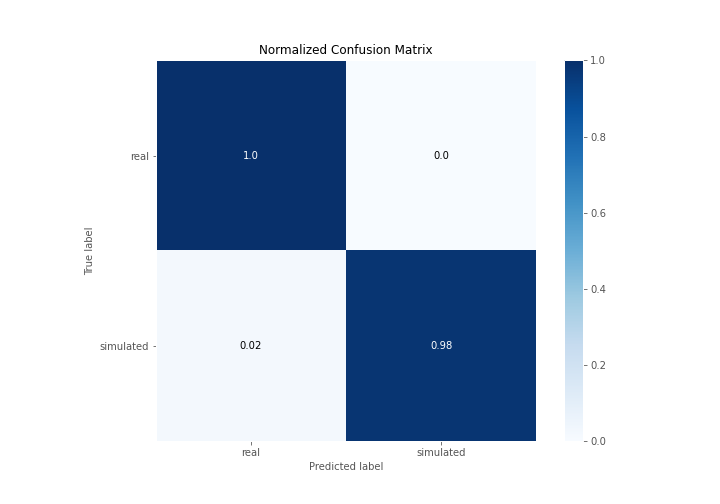

# Summary of 3_Linear

[<< Go back](../README.md)

## Logistic Regression (Linear)
- **n_jobs**: -1
- **explain_level**: 2

## Validation
 - **validation_type**: split
 - **train_ratio**: 0.75
 - **shuffle**: True
 - **stratify**: True

## Optimized metric
accuracy

## Training time

11.1 seconds

## Metric details
|           |    score |     threshold |
|:----------|---------:|--------------:|
| logloss   | 0.251387 | nan           |
| auc       | 0.982558 | nan           |
| f1        | 0.988506 |   0.645192    |
| accuracy  | 0.988506 |   0.645192    |
| precision | 1        |   0.782505    |
| recall    | 1        |   8.56453e-11 |
| mcc       | 0.977273 |   0.645192    |

## Confusion matrix (at threshold=0.645192)
|                      |   Predicted as real |   Predicted as simulated |
|:---------------------|--------------------:|-------------------------:|
| Labeled as real      |                  43 |                        0 |
| Labeled as simulated |                   1 |                       43 |

## Learning curves

## Coefficients
| feature                           |   Learner_1 |
|:----------------------------------|------------:|
| return_mean1                      |    1.17771  |
| return_autocorrelation_2_lag1     |    0.694883 |
| sqreturn_correlation_ts2_lag_1    |    0.656418 |
| return_correlation_ts2_lag_1      |    0.656418 |
| return_autocorrelation_2_lag2     |    0.634162 |
| sqreturn_correlation_ts1_lag_1    |    0.59639  |
| return_correlation_ts1_lag_1      |    0.59639  |
| return_autocorrelation_1_lag1     |    0.547164 |
| return_skew2                      |    0.538298 |
| return_autocorrelation_2_lag3     |    0.521569 |
| return_correlation_ts2_lag_3      |    0.443443 |
| sqreturn_correlation_ts2_lag_3    |    0.443443 |
| return_correlation_ts1_lag_0      |    0.435114 |
| sqreturn_correlation_ts1_lag_0    |    0.435114 |
| return_autocorrelation_1_lag2     |    0.426499 |
| return_correlation_ts1_lag_2      |    0.4053   |
| sqreturn_correlation_ts1_lag_2    |    0.4053   |
| return_sd1                        |    0.402623 |
| return_autocorrelation_1_lag3     |    0.370247 |
| sqreturn_correlation_ts1_lag_3    |    0.366566 |
| return_correlation_ts1_lag_3      |    0.366566 |
| sqreturn_correlation_ts2_lag_2    |    0.342824 |
| return_correlation_ts2_lag_2      |    0.342824 |
| return_skew1                      |    0.186406 |
| return_sd2                        |   -0.227072 |
| return_mean2                      |   -0.364659 |
| sqreturn_autocorrelation_ts2_lag3 |   -0.780234 |
| intercept                         |   -0.823789 |
| sqreturn_autocorrelation_ts2_lag2 |   -0.925279 |
| sqreturn_autocorrelation_ts1_lag3 |   -0.996378 |
| price2_granger_cause_price1       |   -1.13842  |
| sqreturn_autocorrelation_ts1_lag1 |   -1.25939  |
| sqreturn_autocorrelation_ts1_lag2 |   -1.29426  |
| sqreturn_autocorrelation_ts2_lag1 |   -1.4205   |
| price1_granger_cause_price2       |   -2.24766  |
| return_kurtosis2                  |   -2.43172  |
| return_kurtosis1                  |   -3.77973  |

## Permutation-based Importance

## Confusion Matrix

## Normalized Confusion Matrix

## ROC Curve

## Kolmogorov-Smirnov Statistic

## Precision-Recall Curve

## Calibration Curve

## Cumulative Gains Curve

## Lift Curve

## SHAP Importance

## SHAP Dependence plots

### Dependence (Fold 1)

## SHAP Decision plots

### Top-10 Worst decisions for class 0 (Fold 1)

### Top-10 Best decisions for class 0 (Fold 1)

### Top-10 Worst decisions for class 1 (Fold 1)

### Top-10 Best decisions for class 1 (Fold 1)

[<< Go back](../README.md)
