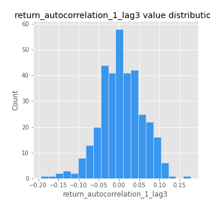
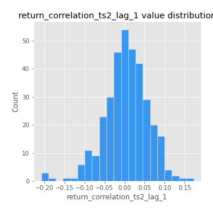

# Exploratory Data Analysis

[<< Go back](../README.md)
## Feature : target
- **Feature type** : categorical
- **Missing** : 0.0%
- **Unique** : 2
- **Count** :347
- **Unique** :2
- **Top** :simulated
- **Freq** :177

## Feature : return_mean1
- **Feature type** : continous
- **Missing** : 0.0%
- **Unique** : 347
- **Count** :347.0
- **Mean** :0.09469109158000265
- **Std** :0.09233712347702668
- **Min** :-0.22632637961920957
- **25%th Percentile** : 0.038305653134737286
- **50%th Percentile** : 0.08780905345842276
- **75%th Percentile** : 0.1505555059671264
- **Max** :0.37175100008111034

## Feature : return_mean2
- **Feature type** : continous
- **Missing** : 0.0%
- **Unique** : 347
- **Count** :347.0
- **Mean** :0.04838351325807911
- **Std** :0.09450313010740512
- **Min** :-0.24205418062825398
- **25%th Percentile** : -0.004159142556829863
- **50%th Percentile** : 0.054264286981144765
- **75%th Percentile** : 0.09830437531237539
- **Max** :0.4019488562209225

## Feature : return_sd1
- **Feature type** : continous
- **Missing** : 0.0%
- **Unique** : 347
- **Count** :347.0
- **Mean** :1.918880929091289
- **Std** :0.7520616467275317
- **Min** :0.7470080772831957
- **25%th Percentile** : 1.7136172094173003
- **50%th Percentile** : 1.8671452308076009
- **75%th Percentile** : 1.952878362831948
- **Max** :9.236766377527575

## Feature : return_sd2
- **Feature type** : continous
- **Missing** : 0.0%
- **Unique** : 347
- **Count** :347.0
- **Mean** :1.9030962641194933
- **Std** :0.7569354523571662
- **Min** :0.8455946193085045
- **25%th Percentile** : 1.6401011191459425
- **50%th Percentile** : 1.817071405653694
- **75%th Percentile** : 1.9147878114295205
- **Max** :6.737618636746393

## Feature : return_skew1
- **Feature type** : continous
- **Missing** : 0.0%
- **Unique** : 347
- **Count** :347.0
- **Mean** :-0.11300503264282931
- **Std** :0.6084280137625404
- **Min** :-3.530116233761814
- **25%th Percentile** : -0.20724600509685565
- **50%th Percentile** : -0.03831729667060578
- **75%th Percentile** : 0.11169609734528549
- **Max** :2.5845963767725557

## Feature : return_skew2
- **Feature type** : continous
- **Missing** : 0.0%
- **Unique** : 347
- **Count** :347.0
- **Mean** :-0.1724570148941969
- **Std** :0.8275089651316754
- **Min** :-8.801502855292393
- **25%th Percentile** : -0.3003355869138071
- **50%th Percentile** : -0.05609325966278483
- **75%th Percentile** : 0.11891922841369434
- **Max** :1.9492855042693131

## Feature : return_kurtosis1
- **Feature type** : continous
- **Missing** : 0.0%
- **Unique** : 347
- **Count** :347.0
- **Mean** :3.4964027180272406
- **Std** :6.495419258014792
- **Min** :-0.34803426270920657
- **25%th Percentile** : 0.1708606137359916
- **50%th Percentile** : 1.2042500538072205
- **75%th Percentile** : 3.528701256114429
- **Max** :46.07507808162177

## Feature : return_kurtosis2
- **Feature type** : continous
- **Missing** : 0.0%
- **Unique** : 347
- **Count** :347.0
- **Mean** :4.350592255465394
- **Std** :10.402275970249715
- **Min** :-0.3723532388298474
- **25%th Percentile** : 0.33251173965404845
- **50%th Percentile** : 1.463493437276878
- **75%th Percentile** : 4.49631400753587
- **Max** :143.10871011533666

## Feature : return_autocorrelation_1_lag1
- **Feature type** : continous
- **Missing** : 0.0%
- **Unique** : 347
- **Count** :347.0
- **Mean** :0.0014294566417544761
- **Std** :0.059954227001746276
- **Min** :-0.2135576224968752
- **25%th Percentile** : -0.03332572597313399
- **50%th Percentile** : 0.00575615748854897
- **75%th Percentile** : 0.039652544262447895
- **Max** :0.12924403960616204

## Feature : return_autocorrelation_1_lag2
- **Feature type** : continous
- **Missing** : 0.0%
- **Unique** : 347
- **Count** :347.0
- **Mean** :0.0019348029055279378
- **Std** :0.05039227396807963
- **Min** :-0.13309283796645122
- **25%th Percentile** : -0.029967903359740495
- **50%th Percentile** : 0.0007450804120033817
- **75%th Percentile** : 0.031482950842662706
- **Max** :0.17521468906001797

## Feature : return_autocorrelation_1_lag3
- **Feature type** : continous
- **Missing** : 0.0%
- **Unique** : 347
- **Count** :347.0
- **Mean** :0.00521166162761526
- **Std** :0.05360249730435602
- **Min** :-0.1940836867390813
- **25%th Percentile** : -0.02840663136502946
- **50%th Percentile** : 0.003590703223490323
- **75%th Percentile** : 0.04034126076235273
- **Max** :0.17805869530681923

## Feature : return_autocorrelation_2_lag1
- **Feature type** : continous
- **Missing** : 0.0%
- **Unique** : 347
- **Count** :347.0
- **Mean** :0.004310225176556855
- **Std** :0.0634866952406875
- **Min** :-0.24590087874039124
- **25%th Percentile** : -0.030394566295679007
- **50%th Percentile** : 0.00990401303613882
- **75%th Percentile** : 0.0467119490280556
- **Max** :0.31863413537898483

## Feature : return_autocorrelation_2_lag2
- **Feature type** : continous
- **Missing** : 0.0%
- **Unique** : 347
- **Count** :347.0
- **Mean** :0.011745992486792629
- **Std** :0.053556772809454305
- **Min** :-0.15323211089747296
- **25%th Percentile** : -0.02444365907837956
- **50%th Percentile** : 0.011153129444411186
- **75%th Percentile** : 0.05021856590278012
- **Max** :0.20974504043791217

## Feature : return_autocorrelation_2_lag3
- **Feature type** : continous
- **Missing** : 0.0%
- **Unique** : 347
- **Count** :347.0
- **Mean** :0.008145048726061954
- **Std** :0.05221848657398256
- **Min** :-0.1344316177078651
- **25%th Percentile** : -0.024957711786025544
- **50%th Percentile** : 0.0071566782792465145
- **75%th Percentile** : 0.04386323822954859
- **Max** :0.1656920392136202

## Feature : return_correlation_ts1_lag_0
- **Feature type** : continous
- **Missing** : 0.0%
- **Unique** : 347
- **Count** :347.0
- **Mean** :0.3488872463332207
- **Std** :0.11421917398911077
- **Min** :-0.027089510445801036
- **25%th Percentile** : 0.29854793082492387
- **50%th Percentile** : 0.3632676021393144
- **75%th Percentile** : 0.41063483245648386
- **Max** :0.7041861626832071

## Feature : return_correlation_ts1_lag_1
- **Feature type** : continous
- **Missing** : 0.0%
- **Unique** : 347
- **Count** :347.0
- **Mean** :0.00622296155441259
- **Std** :0.05403334316770566
- **Min** :-0.16985510949917193
- **25%th Percentile** : -0.027818108912115037
- **50%th Percentile** : 0.010885649418614153
- **75%th Percentile** : 0.04490597007790664
- **Max** :0.1811519056591784

## Feature : return_correlation_ts1_lag_2
- **Feature type** : continous
- **Missing** : 0.0%
- **Unique** : 347
- **Count** :347.0
- **Mean** :0.0076909599306587036
- **Std** :0.050101905429513226
- **Min** :-0.21653581047581763
- **25%th Percentile** : -0.02665461805093
- **50%th Percentile** : 0.009511460734422335
- **75%th Percentile** : 0.0448027802294069
- **Max** :0.1363326336340847

## Feature : return_correlation_ts1_lag_3
- **Feature type** : continous
- **Missing** : 0.0%
- **Unique** : 347
- **Count** :347.0
- **Mean** :0.010602540777121644
- **Std** :0.05273683097413398
- **Min** :-0.1270218498974763
- **25%th Percentile** : -0.02634854209770621
- **50%th Percentile** : 0.011997816427081833
- **75%th Percentile** : 0.04807057988282179
- **Max** :0.1636773216468148

## Feature : return_correlation_ts2_lag_1
- **Feature type** : continous
- **Missing** : 0.0%
- **Unique** : 347
- **Count** :347.0
- **Mean** :0.004427515716498224
- **Std** :0.05495693072611154
- **Min** :-0.2081139431093261
- **25%th Percentile** : -0.026726983639074487
- **50%th Percentile** : 0.005985556417566443
- **75%th Percentile** : 0.03913592661823989
- **Max** :0.17208763791364762

## Feature : return_correlation_ts2_lag_2
- **Feature type** : continous
- **Missing** : 0.0%
- **Unique** : 347
- **Count** :347.0
- **Mean** :0.009261074038237704
- **Std** :0.047365222854494286
- **Min** :-0.15299951737180204
- **25%th Percentile** : -0.020667902674985694
- **50%th Percentile** : 0.008455909601732797
- **75%th Percentile** : 0.03929118138414363
- **Max** :0.20772887392904255

## Feature : return_correlation_ts2_lag_3
- **Feature type** : continous
- **Missing** : 0.0%
- **Unique** : 347
- **Count** :347.0
- **Mean** :0.006548888785522919
- **Std** :0.05408415726563316
- **Min** :-0.17564076057312866
- **25%th Percentile** : -0.02405753606385238
- **50%th Percentile** : 0.009057556147232
- **75%th Percentile** : 0.048213876138056
- **Max** :0.13236309177386235

## Feature : sqreturn_autocorrelation_ts1_lag1
- **Feature type** : continous
- **Missing** : 0.0%
- **Unique** : 347
- **Count** :347.0
- **Mean** :0.04995178615442854
- **Std** :0.09257232814314918
- **Min** :-0.0882604879060602
- **25%th Percentile** : -0.012642796286113171
- **50%th Percentile** : 0.028796089537889404
- **75%th Percentile** : 0.08077604747526154
- **Max** :0.4439086285737898

## Feature : sqreturn_autocorrelation_ts1_lag2
- **Feature type** : continous
- **Missing** : 0.0%
- **Unique** : 347
- **Count** :347.0
- **Mean** :0.04333560875943992
- **Std** :0.094368751912632
- **Min** :-0.0919556303094561
- **25%th Percentile** : -0.012794961011262814
- **50%th Percentile** : 0.018273553815611247
- **75%th Percentile** : 0.06692189604201107
- **Max** :0.540735851444759

## Feature : sqreturn_autocorrelation_ts1_lag3
- **Feature type** : continous
- **Missing** : 0.0%
- **Unique** : 347
- **Count** :347.0
- **Mean** :0.03840170614717468
- **Std** :0.08224359201278443
- **Min** :-0.09127647509249502
- **25%th Percentile** : -0.016064201044693485
- **50%th Percentile** : 0.01956279417078504
- **75%th Percentile** : 0.06573366591189642
- **Max** :0.44755937369538146

## Feature : sqreturn_autocorrelation_ts2_lag1
- **Feature type** : continous
- **Missing** : 0.0%
- **Unique** : 347
- **Count** :347.0
- **Mean** :0.0419429862957832
- **Std** :0.08871252787159771
- **Min** :-0.11256067285821436
- **25%th Percentile** : -0.012125971482347713
- **50%th Percentile** : 0.02191836163705438
- **75%th Percentile** : 0.07395600250557574
- **Max** :0.4190090519891419

## Feature : sqreturn_autocorrelation_ts2_lag2
- **Feature type** : continous
- **Missing** : 0.0%
- **Unique** : 347
- **Count** :347.0
- **Mean** :0.03341959900677523
- **Std** :0.08591478524775861
- **Min** :-0.09718506613119174
- **25%th Percentile** : -0.015412584706570915
- **50%th Percentile** : 0.00892547520753314
- **75%th Percentile** : 0.0519463391858631
- **Max** :0.45676817892778204

## Feature : sqreturn_autocorrelation_ts2_lag3
- **Feature type** : continous
- **Missing** : 0.0%
- **Unique** : 347
- **Count** :347.0
- **Mean** :0.027438132507215714
- **Std** :0.06866707506132412
- **Min** :-0.11243266698098808
- **25%th Percentile** : -0.014218480583164857
- **50%th Percentile** : 0.012516480759083284
- **75%th Percentile** : 0.0541014007460163
- **Max** :0.31225727797735664

## Feature : sqreturn_correlation_ts1_lag_0
- **Feature type** : continous
- **Missing** : 0.0%
- **Unique** : 347
- **Count** :347.0
- **Mean** :0.3488872463332207
- **Std** :0.11421917398911077
- **Min** :-0.027089510445801036
- **25%th Percentile** : 0.29854793082492387
- **50%th Percentile** : 0.3632676021393144
- **75%th Percentile** : 0.41063483245648386
- **Max** :0.7041861626832071

## Feature : sqreturn_correlation_ts1_lag_1
- **Feature type** : continous
- **Missing** : 0.0%
- **Unique** : 347
- **Count** :347.0
- **Mean** :0.00622296155441259
- **Std** :0.05403334316770566
- **Min** :-0.16985510949917193
- **25%th Percentile** : -0.027818108912115037
- **50%th Percentile** : 0.010885649418614153
- **75%th Percentile** : 0.04490597007790664
- **Max** :0.1811519056591784

## Feature : sqreturn_correlation_ts1_lag_2
- **Feature type** : continous
- **Missing** : 0.0%
- **Unique** : 347
- **Count** :347.0
- **Mean** :0.0076909599306587036
- **Std** :0.050101905429513226
- **Min** :-0.21653581047581763
- **25%th Percentile** : -0.02665461805093
- **50%th Percentile** : 0.009511460734422335
- **75%th Percentile** : 0.0448027802294069
- **Max** :0.1363326336340847

## Feature : sqreturn_correlation_ts1_lag_3
- **Feature type** : continous
- **Missing** : 0.0%
- **Unique** : 347
- **Count** :347.0
- **Mean** :0.010602540777121644
- **Std** :0.05273683097413398
- **Min** :-0.1270218498974763
- **25%th Percentile** : -0.02634854209770621
- **50%th Percentile** : 0.011997816427081833
- **75%th Percentile** : 0.04807057988282179
- **Max** :0.1636773216468148

## Feature : sqreturn_correlation_ts2_lag_1
- **Feature type** : continous
- **Missing** : 0.0%
- **Unique** : 347
- **Count** :347.0
- **Mean** :0.004427515716498224
- **Std** :0.05495693072611154
- **Min** :-0.2081139431093261
- **25%th Percentile** : -0.026726983639074487
- **50%th Percentile** : 0.005985556417566443
- **75%th Percentile** : 0.03913592661823989
- **Max** :0.17208763791364762

## Feature : sqreturn_correlation_ts2_lag_2
- **Feature type** : continous
- **Missing** : 0.0%
- **Unique** : 347
- **Count** :347.0
- **Mean** :0.009261074038237704
- **Std** :0.047365222854494286
- **Min** :-0.15299951737180204
- **25%th Percentile** : -0.020667902674985694
- **50%th Percentile** : 0.008455909601732797
- **75%th Percentile** : 0.03929118138414363
- **Max** :0.20772887392904255

## Feature : sqreturn_correlation_ts2_lag_3
- **Feature type** : continous
- **Missing** : 0.0%
- **Unique** : 347
- **Count** :347.0
- **Mean** :0.006548888785522919
- **Std** :0.05408415726563316
- **Min** :-0.17564076057312866
- **25%th Percentile** : -0.02405753606385238
- **50%th Percentile** : 0.009057556147232
- **75%th Percentile** : 0.048213876138056
- **Max** :0.13236309177386235

## Feature : price2_granger_cause_price1
- **Feature type** : continous
- **Missing** : 0.0%
- **Unique** : 347
- **Count** :347.0
- **Mean** :0.26879943264575185
- **Std** :0.2748624219458639
- **Min** :9.56880084894218e-07
- **25%th Percentile** : 0.025380940160132422
- **50%th Percentile** : 0.16928165583582605
- **75%th Percentile** : 0.4622997366354813
- **Max** :0.9885712803689185

## Feature : price1_granger_cause_price2
- **Feature type** : continous
- **Missing** : 0.0%
- **Unique** : 347
- **Count** :347.0
- **Mean** :0.18617509269653065
- **Std** :0.2559670821366817
- **Min** :1.2709645358248018e-12
- **25%th Percentile** : 0.0008680113638696576
- **50%th Percentile** : 0.04982366121739722
- **75%th Percentile** : 0.3009258222758324
- **Max** :0.9677499172353743

[<< Go back](../README.md)
