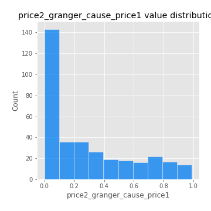

# Exploratory Data Analysis

[<< Go back](../README.md)
## Feature : target
- **Feature type** : categorical
- **Missing** : 0.0%
- **Unique** : 2
- **Count** :347
- **Unique** :2
- **Top** :simulated
- **Freq** :176

## Feature : return_mean1
- **Feature type** : continous
- **Missing** : 0.0%
- **Unique** : 347
- **Count** :347.0
- **Mean** :0.08810325788642158
- **Std** :0.08311859169557453
- **Min** :-0.17686457077756634
- **25%th Percentile** : 0.04006129831919819
- **50%th Percentile** : 0.08367692108603561
- **75%th Percentile** : 0.13333912514435722
- **Max** :0.3612366374600757

## Feature : return_mean2
- **Feature type** : continous
- **Missing** : 0.0%
- **Unique** : 347
- **Count** :347.0
- **Mean** :0.051253694407948386
- **Std** :0.09360606887865036
- **Min** :-0.24205418062825398
- **25%th Percentile** : -0.004961059144394164
- **50%th Percentile** : 0.05516611444454279
- **75%th Percentile** : 0.10909568490493396
- **Max** :0.5073625490010713

## Feature : return_sd1
- **Feature type** : continous
- **Missing** : 0.0%
- **Unique** : 347
- **Count** :347.0
- **Mean** :1.864356221291169
- **Std** :0.5401188885568348
- **Min** :0.7620831696941981
- **25%th Percentile** : 1.674345834044431
- **50%th Percentile** : 1.864693731118225
- **75%th Percentile** : 1.9517467712165262
- **Max** :5.996244884956102

## Feature : return_sd2
- **Feature type** : continous
- **Missing** : 0.0%
- **Unique** : 347
- **Count** :347.0
- **Mean** :1.841767014598206
- **Std** :0.6061979555416316
- **Min** :0.8455946193085045
- **25%th Percentile** : 1.6120544955253158
- **50%th Percentile** : 1.8095718762219717
- **75%th Percentile** : 1.8924669445915117
- **Max** :5.762808157208253

## Feature : return_skew1
- **Feature type** : continous
- **Missing** : 0.0%
- **Unique** : 347
- **Count** :347.0
- **Mean** :-0.07451691605453173
- **Std** :0.5768019783815316
- **Min** :-3.530116233761814
- **25%th Percentile** : -0.23765979219788064
- **50%th Percentile** : -0.026354401395048594
- **75%th Percentile** : 0.1416208660811315
- **Max** :2.5845963767725557

## Feature : return_skew2
- **Feature type** : continous
- **Missing** : 0.0%
- **Unique** : 347
- **Count** :347.0
- **Mean** :-0.1808015648715961
- **Std** :0.8187520582862741
- **Min** :-8.801502855292393
- **25%th Percentile** : -0.28921460009373234
- **50%th Percentile** : -0.07190039960706392
- **75%th Percentile** : 0.10656982523200273
- **Max** :2.123597625075353

## Feature : return_kurtosis1
- **Feature type** : continous
- **Missing** : 0.0%
- **Unique** : 347
- **Count** :347.0
- **Mean** :3.1507607054788345
- **Std** :5.282961125564706
- **Min** :-0.46597829819711745
- **25%th Percentile** : 0.2220953902562337
- **50%th Percentile** : 1.1751242032794065
- **75%th Percentile** : 3.7823690656803657
- **Max** :31.614652972751188

## Feature : return_kurtosis2
- **Feature type** : continous
- **Missing** : 0.0%
- **Unique** : 347
- **Count** :347.0
- **Mean** :4.32617018616351
- **Std** :10.048557893681426
- **Min** :-0.3953362706230972
- **25%th Percentile** : 0.40688995302440656
- **50%th Percentile** : 1.4162935017231706
- **75%th Percentile** : 4.532968161274026
- **Max** :143.10871011533666

## Feature : return_autocorrelation_1_lag1
- **Feature type** : continous
- **Missing** : 0.0%
- **Unique** : 347
- **Count** :347.0
- **Mean** :-0.0015864629825115483
- **Std** :0.06332444944181813
- **Min** :-0.2135576224968752
- **25%th Percentile** : -0.034142736223715844
- **50%th Percentile** : 0.004033492958383681
- **75%th Percentile** : 0.03840218199922472
- **Max** :0.13552339330561208

## Feature : return_autocorrelation_1_lag2
- **Feature type** : continous
- **Missing** : 0.0%
- **Unique** : 347
- **Count** :347.0
- **Mean** :0.0019164116057227235
- **Std** :0.0495168359509445
- **Min** :-0.13309283796645122
- **25%th Percentile** : -0.0296428227048086
- **50%th Percentile** : 0.0007450804120033817
- **75%th Percentile** : 0.03328483753134211
- **Max** :0.1561488228015672

## Feature : return_autocorrelation_1_lag3
- **Feature type** : continous
- **Missing** : 0.0%
- **Unique** : 347
- **Count** :347.0
- **Mean** :0.006675059600243657
- **Std** :0.05268052205401388
- **Min** :-0.15806635192103805
- **25%th Percentile** : -0.0279056804484097
- **50%th Percentile** : 0.009749492219968504
- **75%th Percentile** : 0.044715725435680156
- **Max** :0.14555738036329643

## Feature : return_autocorrelation_2_lag1
- **Feature type** : continous
- **Missing** : 0.0%
- **Unique** : 347
- **Count** :347.0
- **Mean** :0.002155894690960535
- **Std** :0.06702275923229499
- **Min** :-0.25075531010123286
- **25%th Percentile** : -0.03391142132851639
- **50%th Percentile** : 0.0013291127812000726
- **75%th Percentile** : 0.04530131983361173
- **Max** :0.31863413537898483

## Feature : return_autocorrelation_2_lag2
- **Feature type** : continous
- **Missing** : 0.0%
- **Unique** : 347
- **Count** :347.0
- **Mean** :0.010381055785220252
- **Std** :0.05264947801071571
- **Min** :-0.15323211089747296
- **25%th Percentile** : -0.0279126930221733
- **50%th Percentile** : 0.009334936209842284
- **75%th Percentile** : 0.04861699422304114
- **Max** :0.20974504043791217

## Feature : return_autocorrelation_2_lag3
- **Feature type** : continous
- **Missing** : 0.0%
- **Unique** : 347
- **Count** :347.0
- **Mean** :0.01013271648615392
- **Std** :0.05226383568344574
- **Min** :-0.14200107169559698
- **25%th Percentile** : -0.019092953292545962
- **50%th Percentile** : 0.009763663401848888
- **75%th Percentile** : 0.04222259067195863
- **Max** :0.15801669270923835

## Feature : return_correlation_ts1_lag_0
- **Feature type** : continous
- **Missing** : 0.0%
- **Unique** : 347
- **Count** :347.0
- **Mean** :0.34431741271385646
- **Std** :0.11021496322036221
- **Min** :-0.027089510445801036
- **25%th Percentile** : 0.2944361376441057
- **50%th Percentile** : 0.3570462652734916
- **75%th Percentile** : 0.40416397910728386
- **Max** :0.7041861626832071

## Feature : return_correlation_ts1_lag_1
- **Feature type** : continous
- **Missing** : 0.0%
- **Unique** : 347
- **Count** :347.0
- **Mean** :0.004634838069168013
- **Std** :0.05484724246970305
- **Min** :-0.16985510949917193
- **25%th Percentile** : -0.029043377050528996
- **50%th Percentile** : 0.009400671803852527
- **75%th Percentile** : 0.04041128579702892
- **Max** :0.13614240166698485

## Feature : return_correlation_ts1_lag_2
- **Feature type** : continous
- **Missing** : 0.0%
- **Unique** : 347
- **Count** :347.0
- **Mean** :0.010046728987439357
- **Std** :0.052254587900056715
- **Min** :-0.21653581047581763
- **25%th Percentile** : -0.02336061513283276
- **50%th Percentile** : 0.011336008687459032
- **75%th Percentile** : 0.04750075741120997
- **Max** :0.14429567841960572

## Feature : return_correlation_ts1_lag_3
- **Feature type** : continous
- **Missing** : 0.0%
- **Unique** : 347
- **Count** :347.0
- **Mean** :0.010068083083120204
- **Std** :0.05196312177283773
- **Min** :-0.1270218498974763
- **25%th Percentile** : -0.02223374265981811
- **50%th Percentile** : 0.01059796740812396
- **75%th Percentile** : 0.047198138152069656
- **Max** :0.1636773216468148

## Feature : return_correlation_ts2_lag_1
- **Feature type** : continous
- **Missing** : 0.0%
- **Unique** : 347
- **Count** :347.0
- **Mean** :0.0036229476879957203
- **Std** :0.056424084875278835
- **Min** :-0.2081139431093261
- **25%th Percentile** : -0.029225519867896822
- **50%th Percentile** : 0.00442344217638478
- **75%th Percentile** : 0.04054809181766782
- **Max** :0.17141563155832756

## Feature : return_correlation_ts2_lag_2
- **Feature type** : continous
- **Missing** : 0.0%
- **Unique** : 347
- **Count** :347.0
- **Mean** :0.007546882179027638
- **Std** :0.051300403382346454
- **Min** :-0.23751835475804678
- **25%th Percentile** : -0.026143714024724547
- **50%th Percentile** : 0.00783009120488281
- **75%th Percentile** : 0.03898282184880751
- **Max** :0.20772887392904255

## Feature : return_correlation_ts2_lag_3
- **Feature type** : continous
- **Missing** : 0.0%
- **Unique** : 347
- **Count** :347.0
- **Mean** :0.011724283128368316
- **Std** :0.055803339268818364
- **Min** :-0.17564076057312866
- **25%th Percentile** : -0.020756300155911286
- **50%th Percentile** : 0.01701824888168562
- **75%th Percentile** : 0.04899025971145407
- **Max** :0.13998340619747845

## Feature : sqreturn_autocorrelation_ts1_lag1
- **Feature type** : continous
- **Missing** : 0.0%
- **Unique** : 347
- **Count** :347.0
- **Mean** :0.04952094581044919
- **Std** :0.09105007878309068
- **Min** :-0.09861790189428835
- **25%th Percentile** : -0.010516968146409001
- **50%th Percentile** : 0.026073820297929373
- **75%th Percentile** : 0.08818923594086561
- **Max** :0.49414293176447355

## Feature : sqreturn_autocorrelation_ts1_lag2
- **Feature type** : continous
- **Missing** : 0.0%
- **Unique** : 347
- **Count** :347.0
- **Mean** :0.0374743658813692
- **Std** :0.09074506316239407
- **Min** :-0.11096937463537826
- **25%th Percentile** : -0.014969073059732278
- **50%th Percentile** : 0.009107520346336639
- **75%th Percentile** : 0.06418932577442714
- **Max** :0.540735851444759

## Feature : sqreturn_autocorrelation_ts1_lag3
- **Feature type** : continous
- **Missing** : 0.0%
- **Unique** : 347
- **Count** :347.0
- **Mean** :0.02991318315309425
- **Std** :0.07357914903588812
- **Min** :-0.12585516249240972
- **25%th Percentile** : -0.01618217416520701
- **50%th Percentile** : 0.015055193737716006
- **75%th Percentile** : 0.05608811939756421
- **Max** :0.3457940197475473

## Feature : sqreturn_autocorrelation_ts2_lag1
- **Feature type** : continous
- **Missing** : 0.0%
- **Unique** : 347
- **Count** :347.0
- **Mean** :0.04404580220647535
- **Std** :0.08768721935176864
- **Min** :-0.0940323071767585
- **25%th Percentile** : -0.01270012035353468
- **50%th Percentile** : 0.022033424036483094
- **75%th Percentile** : 0.07464678766495364
- **Max** :0.510085647437958

## Feature : sqreturn_autocorrelation_ts2_lag2
- **Feature type** : continous
- **Missing** : 0.0%
- **Unique** : 347
- **Count** :347.0
- **Mean** :0.03595064170546628
- **Std** :0.08379279577487289
- **Min** :-0.09143938252004619
- **25%th Percentile** : -0.01251209096667831
- **50%th Percentile** : 0.013118555313473801
- **75%th Percentile** : 0.05300105862890722
- **Max** :0.5373432415582473

## Feature : sqreturn_autocorrelation_ts2_lag3
- **Feature type** : continous
- **Missing** : 0.0%
- **Unique** : 347
- **Count** :347.0
- **Mean** :0.028174181113384808
- **Std** :0.06776351559491245
- **Min** :-0.08906675171422777
- **25%th Percentile** : -0.010644607829108609
- **50%th Percentile** : 0.01369761785042116
- **75%th Percentile** : 0.05319544954058923
- **Max** :0.31225727797735664

## Feature : sqreturn_correlation_ts1_lag_0
- **Feature type** : continous
- **Missing** : 0.0%
- **Unique** : 347
- **Count** :347.0
- **Mean** :0.34431741271385646
- **Std** :0.11021496322036221
- **Min** :-0.027089510445801036
- **25%th Percentile** : 0.2944361376441057
- **50%th Percentile** : 0.3570462652734916
- **75%th Percentile** : 0.40416397910728386
- **Max** :0.7041861626832071

## Feature : sqreturn_correlation_ts1_lag_1
- **Feature type** : continous
- **Missing** : 0.0%
- **Unique** : 347
- **Count** :347.0
- **Mean** :0.004634838069168013
- **Std** :0.05484724246970305
- **Min** :-0.16985510949917193
- **25%th Percentile** : -0.029043377050528996
- **50%th Percentile** : 0.009400671803852527
- **75%th Percentile** : 0.04041128579702892
- **Max** :0.13614240166698485

## Feature : sqreturn_correlation_ts1_lag_2
- **Feature type** : continous
- **Missing** : 0.0%
- **Unique** : 347
- **Count** :347.0
- **Mean** :0.010046728987439357
- **Std** :0.052254587900056715
- **Min** :-0.21653581047581763
- **25%th Percentile** : -0.02336061513283276
- **50%th Percentile** : 0.011336008687459032
- **75%th Percentile** : 0.04750075741120997
- **Max** :0.14429567841960572

## Feature : sqreturn_correlation_ts1_lag_3
- **Feature type** : continous
- **Missing** : 0.0%
- **Unique** : 347
- **Count** :347.0
- **Mean** :0.010068083083120204
- **Std** :0.05196312177283773
- **Min** :-0.1270218498974763
- **25%th Percentile** : -0.02223374265981811
- **50%th Percentile** : 0.01059796740812396
- **75%th Percentile** : 0.047198138152069656
- **Max** :0.1636773216468148

## Feature : sqreturn_correlation_ts2_lag_1
- **Feature type** : continous
- **Missing** : 0.0%
- **Unique** : 347
- **Count** :347.0
- **Mean** :0.0036229476879957203
- **Std** :0.056424084875278835
- **Min** :-0.2081139431093261
- **25%th Percentile** : -0.029225519867896822
- **50%th Percentile** : 0.00442344217638478
- **75%th Percentile** : 0.04054809181766782
- **Max** :0.17141563155832756

## Feature : sqreturn_correlation_ts2_lag_2
- **Feature type** : continous
- **Missing** : 0.0%
- **Unique** : 347
- **Count** :347.0
- **Mean** :0.007546882179027638
- **Std** :0.051300403382346454
- **Min** :-0.23751835475804678
- **25%th Percentile** : -0.026143714024724547
- **50%th Percentile** : 0.00783009120488281
- **75%th Percentile** : 0.03898282184880751
- **Max** :0.20772887392904255

## Feature : sqreturn_correlation_ts2_lag_3
- **Feature type** : continous
- **Missing** : 0.0%
- **Unique** : 347
- **Count** :347.0
- **Mean** :0.011724283128368316
- **Std** :0.055803339268818364
- **Min** :-0.17564076057312866
- **25%th Percentile** : -0.020756300155911286
- **50%th Percentile** : 0.01701824888168562
- **75%th Percentile** : 0.04899025971145407
- **Max** :0.13998340619747845

## Feature : price2_granger_cause_price1
- **Feature type** : continous
- **Missing** : 0.0%
- **Unique** : 347
- **Count** :347.0
- **Mean** :0.2850231952952982
- **Std** :0.2982046466619379
- **Min** :8.903158772633325e-08
- **25%th Percentile** : 0.02029219820812664
- **50%th Percentile** : 0.17743565343192882
- **75%th Percentile** : 0.4952939493477964
- **Max** :0.9885712803689185

## Feature : price1_granger_cause_price2
- **Feature type** : continous
- **Missing** : 0.0%
- **Unique** : 347
- **Count** :347.0
- **Mean** :0.22461575966521272
- **Std** :0.284392092767266
- **Min** :1.8073676425440752e-11
- **25%th Percentile** : 0.001786055734500993
- **50%th Percentile** : 0.06612827169116405
- **75%th Percentile** : 0.3675541685432851
- **Max** :0.9998351486953977

[<< Go back](../README.md)
