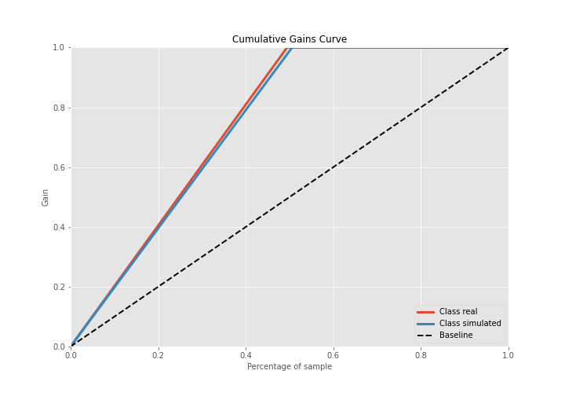
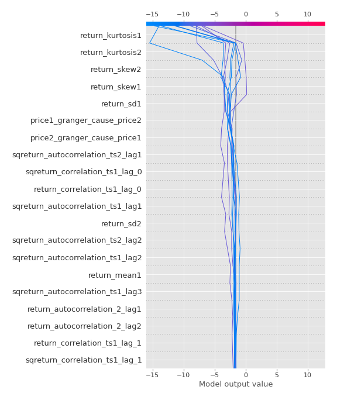

# Summary of 3_Linear

[<< Go back](../README.md)

## Logistic Regression (Linear)
- **n_jobs**: -1
- **explain_level**: 2

## Validation
 - **validation_type**: split
 - **train_ratio**: 0.75
 - **shuffle**: True
 - **stratify**: True

## Optimized metric
accuracy

## Training time

13.1 seconds

## Metric details
|           |    score |     threshold |
|:----------|---------:|--------------:|
| logloss   | 0.173938 | nan           |
| auc       | 1        | nan           |
| f1        | 1        |   0.555931    |
| accuracy  | 1        |   0.555931    |
| precision | 1        |   0.555931    |
| recall    | 1        |   3.71522e-07 |
| mcc       | 1        |   0.555931    |

## Confusion matrix (at threshold=0.555931)
|                      |   Predicted as real |   Predicted as simulated |
|:---------------------|--------------------:|-------------------------:|
| Labeled as real      |                  43 |                        0 |
| Labeled as simulated |                   0 |                       44 |

## Learning curves

## Coefficients
| feature                           |   Learner_1 |
|:----------------------------------|------------:|
| return_mean1                      |    1.22108  |
| return_autocorrelation_2_lag1     |    0.927352 |
| return_correlation_ts1_lag_0      |    0.883824 |
| sqreturn_correlation_ts1_lag_0    |    0.883824 |
| return_autocorrelation_2_lag2     |    0.872654 |
| return_correlation_ts1_lag_1      |    0.687194 |
| sqreturn_correlation_ts1_lag_1    |    0.687194 |
| return_autocorrelation_1_lag2     |    0.639573 |
| return_skew2                      |    0.63445  |
| sqreturn_correlation_ts2_lag_2    |    0.614301 |
| return_correlation_ts2_lag_2      |    0.614301 |
| return_autocorrelation_2_lag3     |    0.601381 |
| return_skew1                      |    0.572447 |
| sqreturn_correlation_ts2_lag_1    |    0.536965 |
| return_correlation_ts2_lag_1      |    0.536965 |
| sqreturn_correlation_ts1_lag_2    |    0.520566 |
| return_correlation_ts1_lag_2      |    0.520566 |
| return_autocorrelation_1_lag3     |    0.509928 |
| return_autocorrelation_1_lag1     |    0.306934 |
| sqreturn_correlation_ts2_lag_3    |    0.301411 |
| return_correlation_ts2_lag_3      |    0.301411 |
| sqreturn_correlation_ts1_lag_3    |    0.286467 |
| return_correlation_ts1_lag_3      |    0.286467 |
| return_sd1                        |    0.222215 |
| return_sd2                        |   -0.153295 |
| return_mean2                      |   -0.278935 |
| intercept                         |   -0.674172 |
| sqreturn_autocorrelation_ts2_lag3 |   -0.870663 |
| price2_granger_cause_price1       |   -1.09553  |
| sqreturn_autocorrelation_ts1_lag3 |   -1.13869  |
| sqreturn_autocorrelation_ts2_lag2 |   -1.14526  |
| sqreturn_autocorrelation_ts1_lag2 |   -1.37801  |
| return_kurtosis2                  |   -1.41164  |
| sqreturn_autocorrelation_ts2_lag1 |   -1.74069  |
| sqreturn_autocorrelation_ts1_lag1 |   -1.76098  |
| price1_granger_cause_price2       |   -1.8006   |
| return_kurtosis1                  |   -3.11687  |

## Permutation-based Importance

## Confusion Matrix

## Normalized Confusion Matrix

## ROC Curve

## Kolmogorov-Smirnov Statistic

## Precision-Recall Curve

## Calibration Curve

## Cumulative Gains Curve

## Lift Curve

## SHAP Importance

## SHAP Dependence plots

### Dependence (Fold 1)

## SHAP Decision plots

### Top-10 Worst decisions for class 0 (Fold 1)

### Top-10 Best decisions for class 0 (Fold 1)

### Top-10 Worst decisions for class 1 (Fold 1)

### Top-10 Best decisions for class 1 (Fold 1)

[<< Go back](../README.md)
