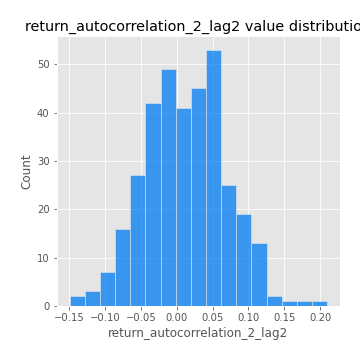
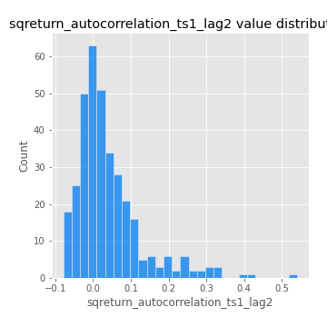

# Exploratory Data Analysis

[<< Go back](../README.md)
## Feature : target
- **Feature type** : categorical
- **Missing** : 0.0%
- **Unique** : 2
- **Count** :347
- **Unique** :2
- **Top** :simulated
- **Freq** :174

## Feature : return_mean1
- **Feature type** : continous
- **Missing** : 0.0%
- **Unique** : 347
- **Count** :347.0
- **Mean** :0.08825657881800505
- **Std** :0.08997176235206596
- **Min** :-0.22632637961920957
- **25%th Percentile** : 0.03207650456590408
- **50%th Percentile** : 0.08342294051817205
- **75%th Percentile** : 0.14509630054666078
- **Max** :0.37175100008111034

## Feature : return_mean2
- **Feature type** : continous
- **Missing** : 0.0%
- **Unique** : 347
- **Count** :347.0
- **Mean** :0.053836306417592704
- **Std** :0.09573981752525114
- **Min** :-0.24205418062825398
- **25%th Percentile** : -0.004177027636903091
- **50%th Percentile** : 0.05969114061192818
- **75%th Percentile** : 0.11406339240562627
- **Max** :0.37616608147096464

## Feature : return_sd1
- **Feature type** : continous
- **Missing** : 0.0%
- **Unique** : 347
- **Count** :347.0
- **Mean** :1.9068802078707203
- **Std** :0.7352348266502188
- **Min** :0.7470080772831957
- **25%th Percentile** : 1.668744803883524
- **50%th Percentile** : 1.8552468654041814
- **75%th Percentile** : 1.9479388123146206
- **Max** :9.236766377527575

## Feature : return_sd2
- **Feature type** : continous
- **Missing** : 0.0%
- **Unique** : 347
- **Count** :347.0
- **Mean** :1.8844932781184764
- **Std** :0.6455054237677628
- **Min** :0.8455946193085045
- **25%th Percentile** : 1.6370099273875067
- **50%th Percentile** : 1.8180031514005455
- **75%th Percentile** : 1.9170201064834271
- **Max** :5.872800253666788

## Feature : return_skew1
- **Feature type** : continous
- **Missing** : 0.0%
- **Unique** : 347
- **Count** :347.0
- **Mean** :-0.05859930170494513
- **Std** :0.5913909525775434
- **Min** :-3.453087436558107
- **25%th Percentile** : -0.1950172357357886
- **50%th Percentile** : -0.027051117038397895
- **75%th Percentile** : 0.13745920626131128
- **Max** :2.5845963767725557

## Feature : return_skew2
- **Feature type** : continous
- **Missing** : 0.0%
- **Unique** : 347
- **Count** :347.0
- **Mean** :-0.16326862640806533
- **Std** :0.8488288188204951
- **Min** :-8.801502855292393
- **25%th Percentile** : -0.3010495744996631
- **50%th Percentile** : -0.05861334764131681
- **75%th Percentile** : 0.1230225103935988
- **Max** :3.237117082638198

## Feature : return_kurtosis1
- **Feature type** : continous
- **Missing** : 0.0%
- **Unique** : 347
- **Count** :347.0
- **Mean** :3.322986251032627
- **Std** :6.043227666875218
- **Min** :-0.5533889346379763
- **25%th Percentile** : 0.21235870669384926
- **50%th Percentile** : 1.0647312473665083
- **75%th Percentile** : 3.746268461128576
- **Max** :46.07507808162177

## Feature : return_kurtosis2
- **Feature type** : continous
- **Missing** : 0.0%
- **Unique** : 347
- **Count** :347.0
- **Mean** :4.301882789240325
- **Std** :10.396014799966649
- **Min** :-0.3416795636675687
- **25%th Percentile** : 0.39752646840617145
- **50%th Percentile** : 1.463493437276878
- **75%th Percentile** : 4.381239604898888
- **Max** :143.10871011533666

## Feature : return_autocorrelation_1_lag1
- **Feature type** : continous
- **Missing** : 0.0%
- **Unique** : 347
- **Count** :347.0
- **Mean** :-0.00217803285422716
- **Std** :0.05872911563717501
- **Min** :-0.2135576224968752
- **25%th Percentile** : -0.03232219577925697
- **50%th Percentile** : 0.004491458061025537
- **75%th Percentile** : 0.034668906412354504
- **Max** :0.13330970551549

## Feature : return_autocorrelation_1_lag2
- **Feature type** : continous
- **Missing** : 0.0%
- **Unique** : 347
- **Count** :347.0
- **Mean** :0.0029250130944945586
- **Std** :0.05189889768012636
- **Min** :-0.13309283796645122
- **25%th Percentile** : -0.02817015581905203
- **50%th Percentile** : 0.0034267337013316095
- **75%th Percentile** : 0.033892350569256866
- **Max** :0.16386282959986673

## Feature : return_autocorrelation_1_lag3
- **Feature type** : continous
- **Missing** : 0.0%
- **Unique** : 347
- **Count** :347.0
- **Mean** :0.006331221644541262
- **Std** :0.0500021213747764
- **Min** :-0.15806635192103805
- **25%th Percentile** : -0.023393149984566704
- **50%th Percentile** : 0.0060136505644958795
- **75%th Percentile** : 0.04124863645558775
- **Max** :0.13313015091539232

## Feature : return_autocorrelation_2_lag1
- **Feature type** : continous
- **Missing** : 0.0%
- **Unique** : 347
- **Count** :347.0
- **Mean** :0.007447745255759788
- **Std** :0.06457839258338646
- **Min** :-0.25075531010123286
- **25%th Percentile** : -0.028219152965525893
- **50%th Percentile** : 0.013468666358166495
- **75%th Percentile** : 0.04847874714685463
- **Max** :0.31863413537898483

## Feature : return_autocorrelation_2_lag2
- **Feature type** : continous
- **Missing** : 0.0%
- **Unique** : 347
- **Count** :347.0
- **Mean** :0.012157323728646046
- **Std** :0.05638165074935643
- **Min** :-0.1495113937562178
- **25%th Percentile** : -0.028663415501346497
- **50%th Percentile** : 0.01001902404661531
- **75%th Percentile** : 0.0498514805339269
- **Max** :0.20974504043791217

## Feature : return_autocorrelation_2_lag3
- **Feature type** : continous
- **Missing** : 0.0%
- **Unique** : 347
- **Count** :347.0
- **Mean** :0.010021058368185112
- **Std** :0.052846360202131584
- **Min** :-0.14200107169559698
- **25%th Percentile** : -0.024680625186719044
- **50%th Percentile** : 0.011738986118580166
- **75%th Percentile** : 0.04888133655710891
- **Max** :0.1419999376914021

## Feature : return_correlation_ts1_lag_0
- **Feature type** : continous
- **Missing** : 0.0%
- **Unique** : 347
- **Count** :347.0
- **Mean** :0.34736021461882577
- **Std** :0.11555353854195034
- **Min** :-0.027089510445801036
- **25%th Percentile** : 0.2949672572577673
- **50%th Percentile** : 0.36381313678614025
- **75%th Percentile** : 0.40563048374189964
- **Max** :0.7041861626832071

## Feature : return_correlation_ts1_lag_1
- **Feature type** : continous
- **Missing** : 0.0%
- **Unique** : 347
- **Count** :347.0
- **Mean** :0.006434555856718213
- **Std** :0.053922969811480814
- **Min** :-0.16985510949917193
- **25%th Percentile** : -0.02855572310935425
- **50%th Percentile** : 0.00895727845766172
- **75%th Percentile** : 0.047407812472599294
- **Max** :0.1642519844862327

## Feature : return_correlation_ts1_lag_2
- **Feature type** : continous
- **Missing** : 0.0%
- **Unique** : 347
- **Count** :347.0
- **Mean** :0.010369460292784717
- **Std** :0.050882453316432805
- **Min** :-0.21653581047581763
- **25%th Percentile** : -0.0243740937564446
- **50%th Percentile** : 0.011266667935584692
- **75%th Percentile** : 0.046821543668641705
- **Max** :0.13608979058683304

## Feature : return_correlation_ts1_lag_3
- **Feature type** : continous
- **Missing** : 0.0%
- **Unique** : 347
- **Count** :347.0
- **Mean** :0.007878608420203482
- **Std** :0.05138104665183415
- **Min** :-0.1270218498974763
- **25%th Percentile** : -0.02610238231565149
- **50%th Percentile** : 0.011073121892574728
- **75%th Percentile** : 0.045024455757864616
- **Max** :0.1422809271770942

## Feature : return_correlation_ts2_lag_1
- **Feature type** : continous
- **Missing** : 0.0%
- **Unique** : 347
- **Count** :347.0
- **Mean** :0.005981159968327892
- **Std** :0.05456127788687002
- **Min** :-0.2081139431093261
- **25%th Percentile** : -0.02929432091382684
- **50%th Percentile** : 0.00821893899360348
- **75%th Percentile** : 0.03897368565691445
- **Max** :0.17208763791364762

## Feature : return_correlation_ts2_lag_2
- **Feature type** : continous
- **Missing** : 0.0%
- **Unique** : 347
- **Count** :347.0
- **Mean** :0.010665291086123439
- **Std** :0.05194665178173082
- **Min** :-0.23751835475804678
- **25%th Percentile** : -0.024464390218651627
- **50%th Percentile** : 0.012081349804213028
- **75%th Percentile** : 0.04366507141810016
- **Max** :0.20772887392904255

## Feature : return_correlation_ts2_lag_3
- **Feature type** : continous
- **Missing** : 0.0%
- **Unique** : 347
- **Count** :347.0
- **Mean** :0.006090752047814242
- **Std** :0.053401614980376835
- **Min** :-0.17564076057312866
- **25%th Percentile** : -0.0244019241024349
- **50%th Percentile** : 0.004678343036389244
- **75%th Percentile** : 0.04096519294097095
- **Max** :0.13128380114518473

## Feature : sqreturn_autocorrelation_ts1_lag1
- **Feature type** : continous
- **Missing** : 0.0%
- **Unique** : 347
- **Count** :347.0
- **Mean** :0.04410430320777971
- **Std** :0.08999606451405122
- **Min** :-0.08639131181111732
- **25%th Percentile** : -0.015589963944271198
- **50%th Percentile** : 0.02580747575724726
- **75%th Percentile** : 0.07951258026436825
- **Max** :0.49414293176447355

## Feature : sqreturn_autocorrelation_ts1_lag2
- **Feature type** : continous
- **Missing** : 0.0%
- **Unique** : 347
- **Count** :347.0
- **Mean** :0.039904666841498584
- **Std** :0.08839975156711867
- **Min** :-0.078842057648299
- **25%th Percentile** : -0.013983401931108093
- **50%th Percentile** : 0.018392236780499855
- **75%th Percentile** : 0.06572588147611967
- **Max** :0.540735851444759

## Feature : sqreturn_autocorrelation_ts1_lag3
- **Feature type** : continous
- **Missing** : 0.0%
- **Unique** : 347
- **Count** :347.0
- **Mean** :0.03531546320340575
- **Std** :0.0762738977772267
- **Min** :-0.10283422320898734
- **25%th Percentile** : -0.012130965000767463
- **50%th Percentile** : 0.015710008858549604
- **75%th Percentile** : 0.06320485632728279
- **Max** :0.3457940197475473

## Feature : sqreturn_autocorrelation_ts2_lag1
- **Feature type** : continous
- **Missing** : 0.0%
- **Unique** : 347
- **Count** :347.0
- **Mean** :0.05015550084701182
- **Std** :0.08810740474487291
- **Min** :-0.10001371562024368
- **25%th Percentile** : -0.008044984893328333
- **50%th Percentile** : 0.026533797675391678
- **75%th Percentile** : 0.08069782102925008
- **Max** :0.510085647437958

## Feature : sqreturn_autocorrelation_ts2_lag2
- **Feature type** : continous
- **Missing** : 0.0%
- **Unique** : 347
- **Count** :347.0
- **Mean** :0.03989600509950527
- **Std** :0.08383097205675841
- **Min** :-0.10104361333155777
- **25%th Percentile** : -0.01139238367968429
- **50%th Percentile** : 0.017783740767332964
- **75%th Percentile** : 0.06258918452771783
- **Max** :0.5373432415582473

## Feature : sqreturn_autocorrelation_ts2_lag3
- **Feature type** : continous
- **Missing** : 0.0%
- **Unique** : 347
- **Count** :347.0
- **Mean** :0.03003071121733608
- **Std** :0.06728121576823742
- **Min** :-0.10470809837680684
- **25%th Percentile** : -0.011915305104333586
- **50%th Percentile** : 0.016555456153511505
- **75%th Percentile** : 0.05787603967326059
- **Max** :0.31225727797735664

## Feature : sqreturn_correlation_ts1_lag_0
- **Feature type** : continous
- **Missing** : 0.0%
- **Unique** : 347
- **Count** :347.0
- **Mean** :0.34736021461882577
- **Std** :0.11555353854195034
- **Min** :-0.027089510445801036
- **25%th Percentile** : 0.2949672572577673
- **50%th Percentile** : 0.36381313678614025
- **75%th Percentile** : 0.40563048374189964
- **Max** :0.7041861626832071

## Feature : sqreturn_correlation_ts1_lag_1
- **Feature type** : continous
- **Missing** : 0.0%
- **Unique** : 347
- **Count** :347.0
- **Mean** :0.006434555856718213
- **Std** :0.053922969811480814
- **Min** :-0.16985510949917193
- **25%th Percentile** : -0.02855572310935425
- **50%th Percentile** : 0.00895727845766172
- **75%th Percentile** : 0.047407812472599294
- **Max** :0.1642519844862327

## Feature : sqreturn_correlation_ts1_lag_2
- **Feature type** : continous
- **Missing** : 0.0%
- **Unique** : 347
- **Count** :347.0
- **Mean** :0.010369460292784717
- **Std** :0.050882453316432805
- **Min** :-0.21653581047581763
- **25%th Percentile** : -0.0243740937564446
- **50%th Percentile** : 0.011266667935584692
- **75%th Percentile** : 0.046821543668641705
- **Max** :0.13608979058683304

## Feature : sqreturn_correlation_ts1_lag_3
- **Feature type** : continous
- **Missing** : 0.0%
- **Unique** : 347
- **Count** :347.0
- **Mean** :0.007878608420203482
- **Std** :0.05138104665183415
- **Min** :-0.1270218498974763
- **25%th Percentile** : -0.02610238231565149
- **50%th Percentile** : 0.011073121892574728
- **75%th Percentile** : 0.045024455757864616
- **Max** :0.1422809271770942

## Feature : sqreturn_correlation_ts2_lag_1
- **Feature type** : continous
- **Missing** : 0.0%
- **Unique** : 347
- **Count** :347.0
- **Mean** :0.005981159968327892
- **Std** :0.05456127788687002
- **Min** :-0.2081139431093261
- **25%th Percentile** : -0.02929432091382684
- **50%th Percentile** : 0.00821893899360348
- **75%th Percentile** : 0.03897368565691445
- **Max** :0.17208763791364762

## Feature : sqreturn_correlation_ts2_lag_2
- **Feature type** : continous
- **Missing** : 0.0%
- **Unique** : 347
- **Count** :347.0
- **Mean** :0.010665291086123439
- **Std** :0.05194665178173082
- **Min** :-0.23751835475804678
- **25%th Percentile** : -0.024464390218651627
- **50%th Percentile** : 0.012081349804213028
- **75%th Percentile** : 0.04366507141810016
- **Max** :0.20772887392904255

## Feature : sqreturn_correlation_ts2_lag_3
- **Feature type** : continous
- **Missing** : 0.0%
- **Unique** : 347
- **Count** :347.0
- **Mean** :0.006090752047814242
- **Std** :0.053401614980376835
- **Min** :-0.17564076057312866
- **25%th Percentile** : -0.0244019241024349
- **50%th Percentile** : 0.004678343036389244
- **75%th Percentile** : 0.04096519294097095
- **Max** :0.13128380114518473

## Feature : price2_granger_cause_price1
- **Feature type** : continous
- **Missing** : 0.0%
- **Unique** : 347
- **Count** :347.0
- **Mean** :0.26889821904541683
- **Std** :0.28218775803172536
- **Min** :8.165958619509242e-09
- **25%th Percentile** : 0.025313250488727197
- **50%th Percentile** : 0.14955128995211045
- **75%th Percentile** : 0.4696988780750527
- **Max** :0.9885712803689185

## Feature : price1_granger_cause_price2
- **Feature type** : continous
- **Missing** : 0.0%
- **Unique** : 347
- **Count** :347.0
- **Mean** :0.21304481111648646
- **Std** :0.27147680327551144
- **Min** :5.381685904021257e-13
- **25%th Percentile** : 0.0014439473345819777
- **50%th Percentile** : 0.06095474824623943
- **75%th Percentile** : 0.3752962585454995
- **Max** :0.9951398266867577

[<< Go back](../README.md)
