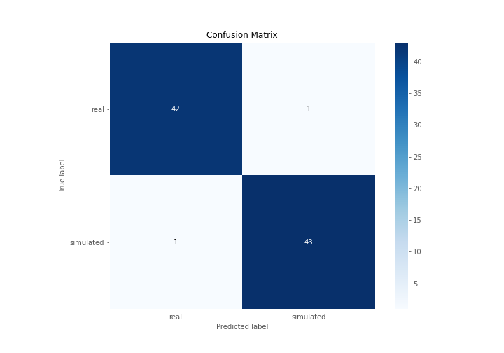
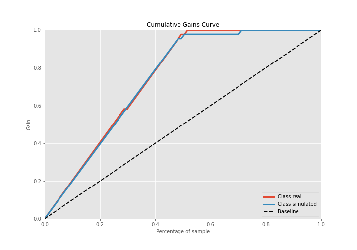
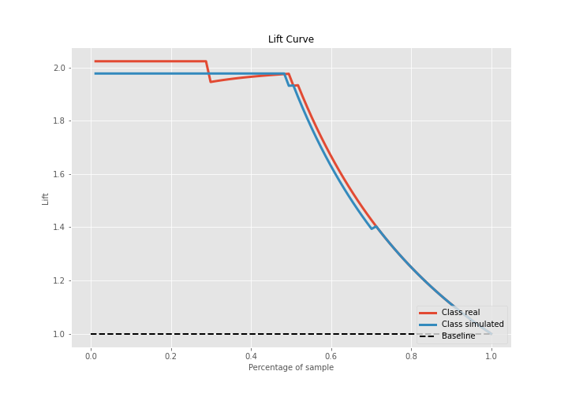

# Summary of 3_Linear

[<< Go back](../README.md)

## Logistic Regression (Linear)
- **n_jobs**: -1
- **explain_level**: 2

## Validation
 - **validation_type**: split
 - **train_ratio**: 0.75
 - **shuffle**: True
 - **stratify**: True

## Optimized metric
accuracy

## Training time

13.7 seconds

## Metric details
|           |    score |     threshold |
|:----------|---------:|--------------:|
| logloss   | 0.17181  | nan           |
| auc       | 0.989958 | nan           |
| f1        | 0.977273 |   0.553114    |
| accuracy  | 0.977011 |   0.553114    |
| precision | 1        |   0.909436    |
| recall    | 1        |   3.71281e-10 |
| mcc       | 0.954017 |   0.553114    |

## Confusion matrix (at threshold=0.553114)
|                      |   Predicted as real |   Predicted as simulated |
|:---------------------|--------------------:|-------------------------:|
| Labeled as real      |                  42 |                        1 |
| Labeled as simulated |                   1 |                       43 |

## Learning curves

## Coefficients
| feature                           |   Learner_1 |
|:----------------------------------|------------:|
| return_mean1                      |    0.971437 |
| return_autocorrelation_2_lag1     |    0.706144 |
| sqreturn_correlation_ts1_lag_0    |    0.535277 |
| return_correlation_ts1_lag_0      |    0.535277 |
| return_autocorrelation_2_lag3     |    0.523922 |
| return_skew2                      |    0.51185  |
| sqreturn_correlation_ts2_lag_1    |    0.509446 |
| return_correlation_ts2_lag_1      |    0.509446 |
| return_correlation_ts2_lag_3      |    0.491888 |
| sqreturn_correlation_ts2_lag_3    |    0.491888 |
| return_autocorrelation_2_lag2     |    0.45558  |
| return_autocorrelation_1_lag1     |    0.452103 |
| return_autocorrelation_1_lag2     |    0.435952 |
| sqreturn_correlation_ts1_lag_3    |    0.432302 |
| return_correlation_ts1_lag_3      |    0.432302 |
| return_correlation_ts1_lag_2      |    0.416533 |
| sqreturn_correlation_ts1_lag_2    |    0.416533 |
| return_correlation_ts1_lag_1      |    0.396626 |
| sqreturn_correlation_ts1_lag_1    |    0.396626 |
| sqreturn_correlation_ts2_lag_2    |    0.366659 |
| return_correlation_ts2_lag_2      |    0.366659 |
| return_sd1                        |    0.267751 |
| return_autocorrelation_1_lag3     |    0.199005 |
| return_sd2                        |   -0.196549 |
| return_mean2                      |   -0.222516 |
| return_skew1                      |   -0.334897 |
| sqreturn_autocorrelation_ts2_lag3 |   -0.785233 |
| intercept                         |   -0.883572 |
| price2_granger_cause_price1       |   -0.965252 |
| sqreturn_autocorrelation_ts1_lag3 |   -1.09869  |
| sqreturn_autocorrelation_ts2_lag2 |   -1.14287  |
| sqreturn_autocorrelation_ts2_lag1 |   -1.27451  |
| sqreturn_autocorrelation_ts1_lag1 |   -1.47371  |
| sqreturn_autocorrelation_ts1_lag2 |   -1.47546  |
| price1_granger_cause_price2       |   -1.60058  |
| return_kurtosis2                  |   -2.7187   |
| return_kurtosis1                  |   -3.58746  |

## Permutation-based Importance

## Confusion Matrix

## Normalized Confusion Matrix

## ROC Curve

## Kolmogorov-Smirnov Statistic

## Precision-Recall Curve

## Calibration Curve

## Cumulative Gains Curve

## Lift Curve

## SHAP Importance

## SHAP Dependence plots

### Dependence (Fold 1)

## SHAP Decision plots

### Top-10 Worst decisions for class 0 (Fold 1)

### Top-10 Best decisions for class 0 (Fold 1)

### Top-10 Worst decisions for class 1 (Fold 1)

### Top-10 Best decisions for class 1 (Fold 1)

[<< Go back](../README.md)
