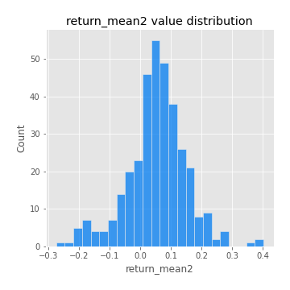

# Exploratory Data Analysis

[<< Go back](../README.md)
## Feature : target
- **Feature type** : categorical
- **Missing** : 0.0%
- **Unique** : 2
- **Count** :347
- **Unique** :2
- **Top** :simulated
- **Freq** :174

## Feature : return_mean1
- **Feature type** : continous
- **Missing** : 0.0%
- **Unique** : 347
- **Count** :347.0
- **Mean** :0.0887439658314871
- **Std** :0.09255659222137262
- **Min** :-0.22632637961920957
- **25%th Percentile** : 0.02898017724622233
- **50%th Percentile** : 0.08314491169172027
- **75%th Percentile** : 0.14838237602398063
- **Max** :0.37175100008111034

## Feature : return_mean2
- **Feature type** : continous
- **Missing** : 0.0%
- **Unique** : 347
- **Count** :347.0
- **Mean** :0.05264085399417094
- **Std** :0.09878580155268413
- **Min** :-0.2754796171755876
- **25%th Percentile** : 0.008065736104903139
- **50%th Percentile** : 0.056875843643821075
- **75%th Percentile** : 0.10807402113531198
- **Max** :0.40290179079905664

## Feature : return_sd1
- **Feature type** : continous
- **Missing** : 0.0%
- **Unique** : 347
- **Count** :347.0
- **Mean** :1.9048058465710083
- **Std** :0.7115596868104346
- **Min** :0.7470080772831957
- **25%th Percentile** : 1.6761094071152032
- **50%th Percentile** : 1.8630623230734569
- **75%th Percentile** : 1.941699043784122
- **Max** :9.236766377527575

## Feature : return_sd2
- **Feature type** : continous
- **Missing** : 0.0%
- **Unique** : 347
- **Count** :347.0
- **Mean** :1.9255904277281972
- **Std** :0.7280327490052395
- **Min** :0.8455946193085045
- **25%th Percentile** : 1.7047247041456484
- **50%th Percentile** : 1.8248246987881729
- **75%th Percentile** : 1.92295604512609
- **Max** :6.737618636746393

## Feature : return_skew1
- **Feature type** : continous
- **Missing** : 0.0%
- **Unique** : 347
- **Count** :347.0
- **Mean** :-0.10301384701210106
- **Std** :0.5924167321196873
- **Min** :-3.530116233761814
- **25%th Percentile** : -0.20949553476916727
- **50%th Percentile** : -0.03937214751560191
- **75%th Percentile** : 0.10285994627041445
- **Max** :2.5845963767725557

## Feature : return_skew2
- **Feature type** : continous
- **Missing** : 0.0%
- **Unique** : 347
- **Count** :347.0
- **Mean** :-0.18288239410085547
- **Std** :0.8332748888158459
- **Min** :-8.801502855292393
- **25%th Percentile** : -0.3085191032774344
- **50%th Percentile** : -0.07753659337968924
- **75%th Percentile** : 0.09948779080146625
- **Max** :2.2606839051517187

## Feature : return_kurtosis1
- **Feature type** : continous
- **Missing** : 0.0%
- **Unique** : 347
- **Count** :347.0
- **Mean** :3.360416443701286
- **Std** :5.870370471428292
- **Min** :-0.41553673919890244
- **25%th Percentile** : 0.22355597297738328
- **50%th Percentile** : 1.014754129978479
- **75%th Percentile** : 3.9440071575782567
- **Max** :36.91113889081053

## Feature : return_kurtosis2
- **Feature type** : continous
- **Missing** : 0.0%
- **Unique** : 347
- **Count** :347.0
- **Mean** :4.284043766173231
- **Std** :10.036628073402564
- **Min** :-0.5598554477301598
- **25%th Percentile** : 0.37479063468998786
- **50%th Percentile** : 1.6425831371067878
- **75%th Percentile** : 4.58402629538977
- **Max** :143.10871011533666

## Feature : return_autocorrelation_1_lag1
- **Feature type** : continous
- **Missing** : 0.0%
- **Unique** : 347
- **Count** :347.0
- **Mean** :-0.004176608465807291
- **Std** :0.06096648550284042
- **Min** :-0.2135576224968752
- **25%th Percentile** : -0.03389610435673063
- **50%th Percentile** : 0.0041937117351116575
- **75%th Percentile** : 0.03684934083854863
- **Max** :0.16402737774899268

## Feature : return_autocorrelation_1_lag2
- **Feature type** : continous
- **Missing** : 0.0%
- **Unique** : 347
- **Count** :347.0
- **Mean** :-0.0006225080883050517
- **Std** :0.04997004736991436
- **Min** :-0.13309283796645122
- **25%th Percentile** : -0.035155722028792094
- **50%th Percentile** : -0.0005711566725760009
- **75%th Percentile** : 0.032266618511690354
- **Max** :0.1561488228015672

## Feature : return_autocorrelation_1_lag3
- **Feature type** : continous
- **Missing** : 0.0%
- **Unique** : 347
- **Count** :347.0
- **Mean** :0.0020638053236528265
- **Std** :0.05304929714679732
- **Min** :-0.1940836867390813
- **25%th Percentile** : -0.030449107385279776
- **50%th Percentile** : 0.0019287893030567884
- **75%th Percentile** : 0.037040699390716456
- **Max** :0.17805869530681923

## Feature : return_autocorrelation_2_lag1
- **Feature type** : continous
- **Missing** : 0.0%
- **Unique** : 347
- **Count** :347.0
- **Mean** :0.0012978095052697325
- **Std** :0.06306958113125709
- **Min** :-0.25075531010123286
- **25%th Percentile** : -0.03399608444066978
- **50%th Percentile** : 0.0063706541324859926
- **75%th Percentile** : 0.041903673618873094
- **Max** :0.31863413537898483

## Feature : return_autocorrelation_2_lag2
- **Feature type** : continous
- **Missing** : 0.0%
- **Unique** : 347
- **Count** :347.0
- **Mean** :0.01286466964055552
- **Std** :0.05458501440720803
- **Min** :-0.15323211089747296
- **25%th Percentile** : -0.024982523027735036
- **50%th Percentile** : 0.01140650815019592
- **75%th Percentile** : 0.04921052186199979
- **Max** :0.20974504043791217

## Feature : return_autocorrelation_2_lag3
- **Feature type** : continous
- **Missing** : 0.0%
- **Unique** : 347
- **Count** :347.0
- **Mean** :0.007070684888403369
- **Std** :0.05382494200909051
- **Min** :-0.14200107169559698
- **25%th Percentile** : -0.028408102037505586
- **50%th Percentile** : 0.0071566782792465145
- **75%th Percentile** : 0.043805846339583426
- **Max** :0.15267975087964408

## Feature : return_correlation_ts1_lag_0
- **Feature type** : continous
- **Missing** : 0.0%
- **Unique** : 347
- **Count** :347.0
- **Mean** :0.35017936378838604
- **Std** :0.11310128256312835
- **Min** :0.005136598099876001
- **25%th Percentile** : 0.2981317922726725
- **50%th Percentile** : 0.3612432077934505
- **75%th Percentile** : 0.410102924793457
- **Max** :0.7041861626832071

## Feature : return_correlation_ts1_lag_1
- **Feature type** : continous
- **Missing** : 0.0%
- **Unique** : 347
- **Count** :347.0
- **Mean** :0.003365410118170736
- **Std** :0.05319054662346847
- **Min** :-0.16985510949917193
- **25%th Percentile** : -0.02882787802251254
- **50%th Percentile** : 0.008678756011446463
- **75%th Percentile** : 0.040470713089884154
- **Max** :0.15499424718508623

## Feature : return_correlation_ts1_lag_2
- **Feature type** : continous
- **Missing** : 0.0%
- **Unique** : 347
- **Count** :347.0
- **Mean** :0.007906759689121435
- **Std** :0.05185277046584588
- **Min** :-0.21653581047581763
- **25%th Percentile** : -0.02429553436948978
- **50%th Percentile** : 0.007204132398884849
- **75%th Percentile** : 0.04437805258611368
- **Max** :0.16569129771704902

## Feature : return_correlation_ts1_lag_3
- **Feature type** : continous
- **Missing** : 0.0%
- **Unique** : 347
- **Count** :347.0
- **Mean** :0.007408321990118643
- **Std** :0.052899264902448104
- **Min** :-0.1270218498974763
- **25%th Percentile** : -0.025911467384028646
- **50%th Percentile** : 0.00736065126750968
- **75%th Percentile** : 0.04617685962610436
- **Max** :0.1636773216468148

## Feature : return_correlation_ts2_lag_1
- **Feature type** : continous
- **Missing** : 0.0%
- **Unique** : 347
- **Count** :347.0
- **Mean** :0.0016052523191026713
- **Std** :0.05516954717344742
- **Min** :-0.20093919236581337
- **25%th Percentile** : -0.029627027188527354
- **50%th Percentile** : 0.002284256711743745
- **75%th Percentile** : 0.03766139298165884
- **Max** :0.17208763791364762

## Feature : return_correlation_ts2_lag_2
- **Feature type** : continous
- **Missing** : 0.0%
- **Unique** : 347
- **Count** :347.0
- **Mean** :0.009374128826635126
- **Std** :0.05246010724778745
- **Min** :-0.23751835475804678
- **25%th Percentile** : -0.025111646782826694
- **50%th Percentile** : 0.008690202952785409
- **75%th Percentile** : 0.04391751563817814
- **Max** :0.20772887392904255

## Feature : return_correlation_ts2_lag_3
- **Feature type** : continous
- **Missing** : 0.0%
- **Unique** : 347
- **Count** :347.0
- **Mean** :0.00476671232803195
- **Std** :0.053522631632639775
- **Min** :-0.17564076057312866
- **25%th Percentile** : -0.0249113805425263
- **50%th Percentile** : 0.005749513768547639
- **75%th Percentile** : 0.04052225629529471
- **Max** :0.18413359631053616

## Feature : sqreturn_autocorrelation_ts1_lag1
- **Feature type** : continous
- **Missing** : 0.0%
- **Unique** : 347
- **Count** :347.0
- **Mean** :0.050239153931892516
- **Std** :0.09658411829574612
- **Min** :-0.09102928648659106
- **25%th Percentile** : -0.017263950169432718
- **50%th Percentile** : 0.027173887150484778
- **75%th Percentile** : 0.08734031096560474
- **Max** :0.4439086285737898

## Feature : sqreturn_autocorrelation_ts1_lag2
- **Feature type** : continous
- **Missing** : 0.0%
- **Unique** : 347
- **Count** :347.0
- **Mean** :0.049311864109068355
- **Std** :0.09659744070300753
- **Min** :-0.11598698485333865
- **25%th Percentile** : -0.00962456781072029
- **50%th Percentile** : 0.01999232770740945
- **75%th Percentile** : 0.07767733956874293
- **Max** :0.540735851444759

## Feature : sqreturn_autocorrelation_ts1_lag3
- **Feature type** : continous
- **Missing** : 0.0%
- **Unique** : 347
- **Count** :347.0
- **Mean** :0.03627551190575359
- **Std** :0.08296798645811668
- **Min** :-0.09845084349639409
- **25%th Percentile** : -0.01461245787344127
- **50%th Percentile** : 0.012680766069520899
- **75%th Percentile** : 0.06411415209195377
- **Max** :0.44755937369538146

## Feature : sqreturn_autocorrelation_ts2_lag1
- **Feature type** : continous
- **Missing** : 0.0%
- **Unique** : 347
- **Count** :347.0
- **Mean** :0.045262321300618566
- **Std** :0.08441355228265646
- **Min** :-0.09724541911708416
- **25%th Percentile** : -0.01270012035353468
- **50%th Percentile** : 0.027520139397595855
- **75%th Percentile** : 0.07860888023126378
- **Max** :0.4190090519891419

## Feature : sqreturn_autocorrelation_ts2_lag2
- **Feature type** : continous
- **Missing** : 0.0%
- **Unique** : 347
- **Count** :347.0
- **Mean** :0.038270709833256984
- **Std** :0.09132831630927468
- **Min** :-0.08800154512662514
- **25%th Percentile** : -0.014878169276887863
- **50%th Percentile** : 0.012367098888812732
- **75%th Percentile** : 0.051553409325158464
- **Max** :0.5373432415582473

## Feature : sqreturn_autocorrelation_ts2_lag3
- **Feature type** : continous
- **Missing** : 0.0%
- **Unique** : 347
- **Count** :347.0
- **Mean** :0.030038214511136845
- **Std** :0.06776205182415948
- **Min** :-0.08059201573435719
- **25%th Percentile** : -0.011609073449784157
- **50%th Percentile** : 0.014769757066949494
- **75%th Percentile** : 0.05206604101942755
- **Max** :0.31225727797735664

## Feature : sqreturn_correlation_ts1_lag_0
- **Feature type** : continous
- **Missing** : 0.0%
- **Unique** : 347
- **Count** :347.0
- **Mean** :0.35017936378838604
- **Std** :0.11310128256312835
- **Min** :0.005136598099876001
- **25%th Percentile** : 0.2981317922726725
- **50%th Percentile** : 0.3612432077934505
- **75%th Percentile** : 0.410102924793457
- **Max** :0.7041861626832071

## Feature : sqreturn_correlation_ts1_lag_1
- **Feature type** : continous
- **Missing** : 0.0%
- **Unique** : 347
- **Count** :347.0
- **Mean** :0.003365410118170736
- **Std** :0.05319054662346847
- **Min** :-0.16985510949917193
- **25%th Percentile** : -0.02882787802251254
- **50%th Percentile** : 0.008678756011446463
- **75%th Percentile** : 0.040470713089884154
- **Max** :0.15499424718508623

## Feature : sqreturn_correlation_ts1_lag_2
- **Feature type** : continous
- **Missing** : 0.0%
- **Unique** : 347
- **Count** :347.0
- **Mean** :0.007906759689121435
- **Std** :0.05185277046584588
- **Min** :-0.21653581047581763
- **25%th Percentile** : -0.02429553436948978
- **50%th Percentile** : 0.007204132398884849
- **75%th Percentile** : 0.04437805258611368
- **Max** :0.16569129771704902

## Feature : sqreturn_correlation_ts1_lag_3
- **Feature type** : continous
- **Missing** : 0.0%
- **Unique** : 347
- **Count** :347.0
- **Mean** :0.007408321990118643
- **Std** :0.052899264902448104
- **Min** :-0.1270218498974763
- **25%th Percentile** : -0.025911467384028646
- **50%th Percentile** : 0.00736065126750968
- **75%th Percentile** : 0.04617685962610436
- **Max** :0.1636773216468148

## Feature : sqreturn_correlation_ts2_lag_1
- **Feature type** : continous
- **Missing** : 0.0%
- **Unique** : 347
- **Count** :347.0
- **Mean** :0.0016052523191026713
- **Std** :0.05516954717344742
- **Min** :-0.20093919236581337
- **25%th Percentile** : -0.029627027188527354
- **50%th Percentile** : 0.002284256711743745
- **75%th Percentile** : 0.03766139298165884
- **Max** :0.17208763791364762

## Feature : sqreturn_correlation_ts2_lag_2
- **Feature type** : continous
- **Missing** : 0.0%
- **Unique** : 347
- **Count** :347.0
- **Mean** :0.009374128826635126
- **Std** :0.05246010724778745
- **Min** :-0.23751835475804678
- **25%th Percentile** : -0.025111646782826694
- **50%th Percentile** : 0.008690202952785409
- **75%th Percentile** : 0.04391751563817814
- **Max** :0.20772887392904255

## Feature : sqreturn_correlation_ts2_lag_3
- **Feature type** : continous
- **Missing** : 0.0%
- **Unique** : 347
- **Count** :347.0
- **Mean** :0.00476671232803195
- **Std** :0.053522631632639775
- **Min** :-0.17564076057312866
- **25%th Percentile** : -0.0249113805425263
- **50%th Percentile** : 0.005749513768547639
- **75%th Percentile** : 0.04052225629529471
- **Max** :0.18413359631053616

## Feature : price2_granger_cause_price1
- **Feature type** : continous
- **Missing** : 0.0%
- **Unique** : 347
- **Count** :347.0
- **Mean** :0.3085186885043004
- **Std** :0.29944663302222446
- **Min** :1.2062034931535436e-07
- **25%th Percentile** : 0.040672097003844665
- **50%th Percentile** : 0.2236758368349714
- **75%th Percentile** : 0.5124188906177447
- **Max** :0.9885712803689185

## Feature : price1_granger_cause_price2
- **Feature type** : continous
- **Missing** : 0.0%
- **Unique** : 347
- **Count** :347.0
- **Mean** :0.20609183205199005
- **Std** :0.2652960037235846
- **Min** :3.971736344803969e-12
- **25%th Percentile** : 0.0013593907867512126
- **50%th Percentile** : 0.0627376244279088
- **75%th Percentile** : 0.3532415911390157
- **Max** :0.9991818838253774

[<< Go back](../README.md)
