# Summary of 3_Linear

[<< Go back](../README.md)

## Logistic Regression (Linear)
- **n_jobs**: -1
- **explain_level**: 2

## Validation
 - **validation_type**: split
 - **train_ratio**: 0.75
 - **shuffle**: True
 - **stratify**: True

## Optimized metric
accuracy

## Training time

14.3 seconds

## Metric details
|           |    score |     threshold |
|:----------|---------:|--------------:|
| logloss   | 0.147213 | nan           |
| auc       | 0.993658 | nan           |
| f1        | 0.963855 |   0.65778     |
| accuracy  | 0.965517 |   0.65778     |
| precision | 1        |   0.901046    |
| recall    | 1        |   2.01544e-11 |
| mcc       | 0.933197 |   0.65778     |

## Confusion matrix (at threshold=0.65778)
|                      |   Predicted as real |   Predicted as simulated |
|:---------------------|--------------------:|-------------------------:|
| Labeled as real      |                  44 |                        0 |
| Labeled as simulated |                   3 |                       40 |

## Learning curves
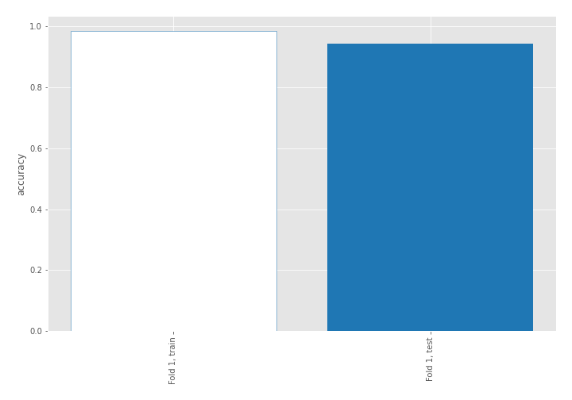

## Coefficients
| feature                           |   Learner_1 |
|:----------------------------------|------------:|
| return_mean1                      |   0.992432  |
| return_autocorrelation_2_lag1     |   0.80532   |
| sqreturn_correlation_ts1_lag_0    |   0.675789  |
| return_correlation_ts1_lag_0      |   0.675789  |
| return_autocorrelation_2_lag3     |   0.659002  |
| sqreturn_correlation_ts1_lag_1    |   0.641367  |
| return_correlation_ts1_lag_1      |   0.641367  |
| sqreturn_correlation_ts2_lag_1    |   0.633132  |
| return_correlation_ts2_lag_1      |   0.633132  |
| return_correlation_ts2_lag_3      |   0.607868  |
| sqreturn_correlation_ts2_lag_3    |   0.607868  |
| return_skew1                      |   0.580562  |
| return_skew2                      |   0.509351  |
| return_autocorrelation_2_lag2     |   0.503503  |
| return_autocorrelation_1_lag3     |   0.446916  |
| sqreturn_correlation_ts1_lag_3    |   0.419002  |
| return_correlation_ts1_lag_3      |   0.419002  |
| return_autocorrelation_1_lag2     |   0.389028  |
| return_autocorrelation_1_lag1     |   0.369657  |
| return_correlation_ts1_lag_2      |   0.290429  |
| sqreturn_correlation_ts1_lag_2    |   0.290429  |
| return_sd1                        |   0.288251  |
| sqreturn_correlation_ts2_lag_2    |   0.231369  |
| return_correlation_ts2_lag_2      |   0.231369  |
| return_sd2                        |   0.0979562 |
| return_mean2                      |  -0.329906  |
| sqreturn_autocorrelation_ts2_lag3 |  -0.979768  |
| intercept                         |  -1.05257   |
| sqreturn_autocorrelation_ts2_lag2 |  -1.14408   |
| sqreturn_autocorrelation_ts1_lag3 |  -1.16532   |
| price2_granger_cause_price1       |  -1.20388   |
| sqreturn_autocorrelation_ts1_lag2 |  -1.26034   |
| sqreturn_autocorrelation_ts2_lag1 |  -1.34478   |
| sqreturn_autocorrelation_ts1_lag1 |  -1.44653   |
| price1_granger_cause_price2       |  -1.52033   |
| return_kurtosis2                  |  -2.75455   |
| return_kurtosis1                  |  -3.72168   |

## Permutation-based Importance
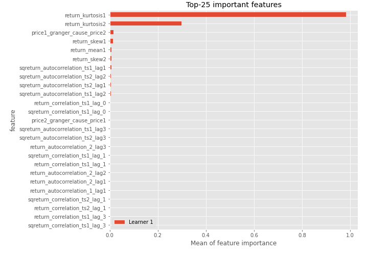
## Confusion Matrix

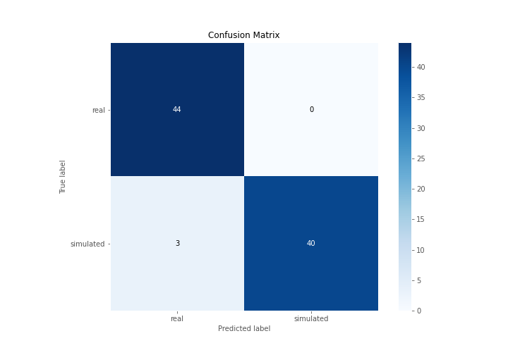

## Normalized Confusion Matrix

## ROC Curve

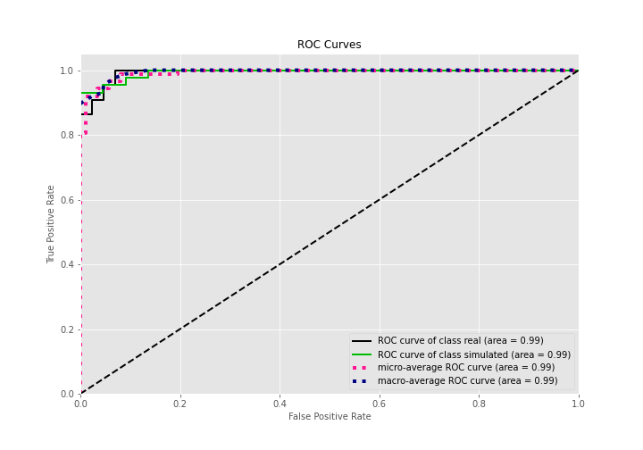

## Kolmogorov-Smirnov Statistic

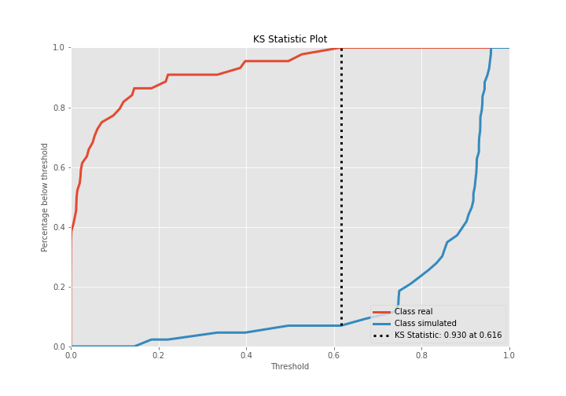

## Precision-Recall Curve

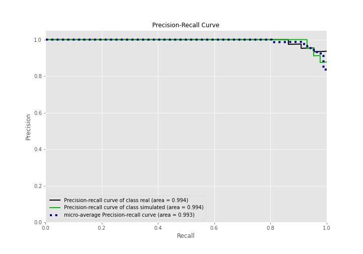

## Calibration Curve

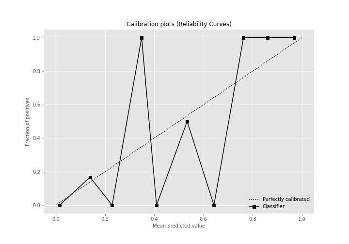

## Cumulative Gains Curve

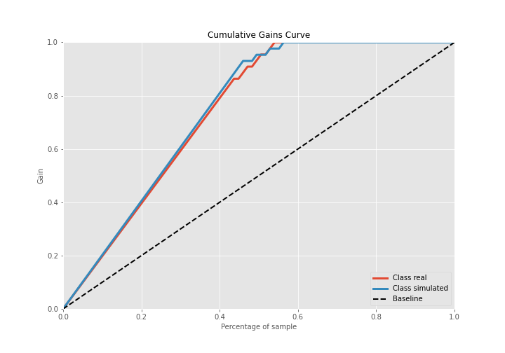

## Lift Curve

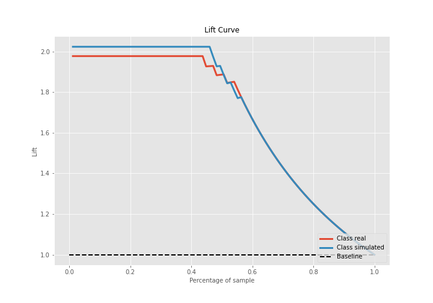

## SHAP Importance
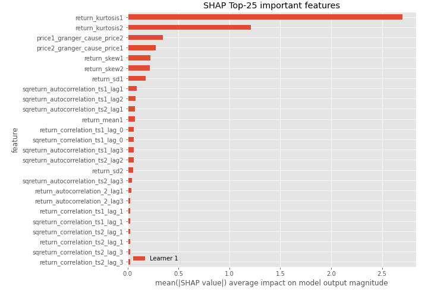

## SHAP Dependence plots

### Dependence (Fold 1)
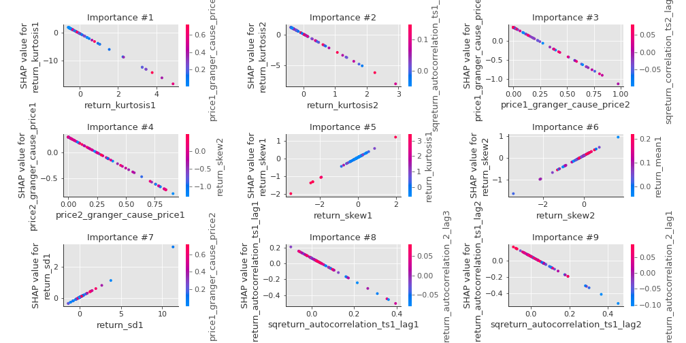

## SHAP Decision plots

### Top-10 Worst decisions for class 0 (Fold 1)
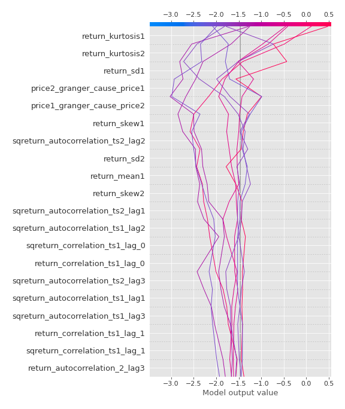
### Top-10 Best decisions for class 0 (Fold 1)
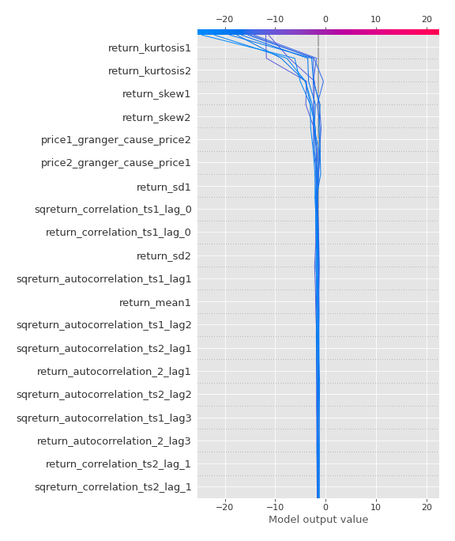
### Top-10 Worst decisions for class 1 (Fold 1)
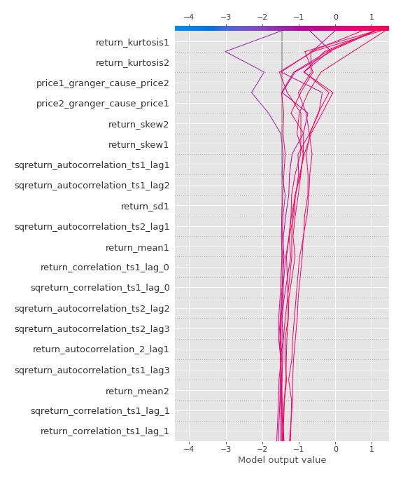
### Top-10 Best decisions for class 1 (Fold 1)
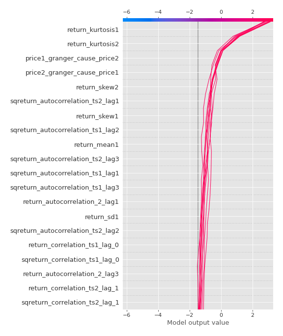

[<< Go back](../README.md)
