# Exploratory Data Analysis

[<< Go back](../README.md)
## Feature : target
- **Feature type** : categorical
- **Missing** : 0.0%
- **Unique** : 2
- **Count** :347
- **Unique** :2
- **Top** :real
- **Freq** :174

## Feature : return_mean1
- **Feature type** : continous
- **Missing** : 0.0%
- **Unique** : 347
- **Count** :347.0
- **Mean** :0.0897159328088465
- **Std** :0.08508521464480184
- **Min** :-0.22632637961920957
- **25%th Percentile** : 0.03485568115871613
- **50%th Percentile** : 0.08598798212598331
- **75%th Percentile** : 0.13707030264268766
- **Max** :0.37175100008111034

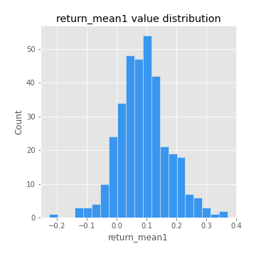
## Feature : return_mean2
- **Feature type** : continous
- **Missing** : 0.0%
- **Unique** : 347
- **Count** :347.0
- **Mean** :0.049844423925972464
- **Std** :0.09240156718979035
- **Min** :-0.2346344635611267
- **25%th Percentile** : 0.0004864529594523386
- **50%th Percentile** : 0.050746476006068325
- **75%th Percentile** : 0.099977210824122
- **Max** :0.5579679436232712

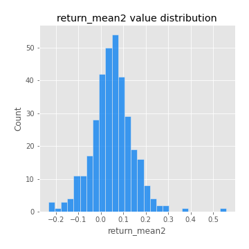
## Feature : return_sd1
- **Feature type** : continous
- **Missing** : 0.0%
- **Unique** : 347
- **Count** :347.0
- **Mean** :1.8959529203986585
- **Std** :0.7334412163147476
- **Min** :0.7470080772831957
- **25%th Percentile** : 1.6613148468316
- **50%th Percentile** : 1.8665125866341938
- **75%th Percentile** : 1.9531426990023928
- **Max** :9.236766377527575

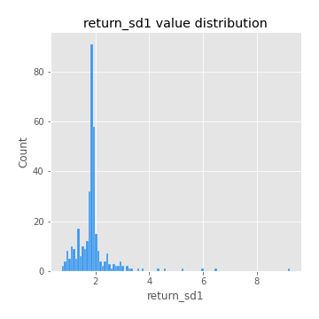
## Feature : return_sd2
- **Feature type** : continous
- **Missing** : 0.0%
- **Unique** : 347
- **Count** :347.0
- **Mean** :1.8277137370820253
- **Std** :0.616386887313038
- **Min** :0.8455946193085045
- **25%th Percentile** : 1.5831731667512812
- **50%th Percentile** : 1.8137577078815084
- **75%th Percentile** : 1.9024512846696293
- **Max** :6.737618636746393

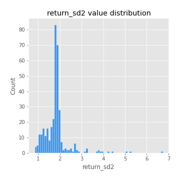
## Feature : return_skew1
- **Feature type** : continous
- **Missing** : 0.0%
- **Unique** : 347
- **Count** :347.0
- **Mean** :-0.11284029037734152
- **Std** :0.5940071365071714
- **Min** :-3.530116233761814
- **25%th Percentile** : -0.22829524877558255
- **50%th Percentile** : -0.041074629078840366
- **75%th Percentile** : 0.10260905324392239
- **Max** :2.5845963767725557

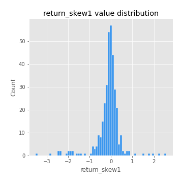
## Feature : return_skew2
- **Feature type** : continous
- **Missing** : 0.0%
- **Unique** : 347
- **Count** :347.0
- **Mean** :-0.18092399378442203
- **Std** :0.7519061629261682
- **Min** :-8.801502855292393
- **25%th Percentile** : -0.3191696695042983
- **50%th Percentile** : -0.06435511014366882
- **75%th Percentile** : 0.10689641841897482
- **Max** :2.2606839051517187

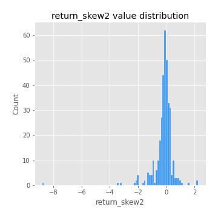
## Feature : return_kurtosis1
- **Feature type** : continous
- **Missing** : 0.0%
- **Unique** : 347
- **Count** :347.0
- **Mean** :3.4918694654910074
- **Std** :6.1795680702182425
- **Min** :-0.31870928454863323
- **25%th Percentile** : 0.17962077250177266
- **50%th Percentile** : 1.0647312473665083
- **75%th Percentile** : 3.7947014876293275
- **Max** :36.91113889081053

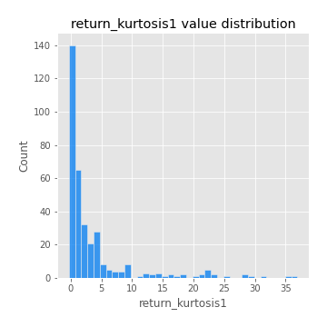
## Feature : return_kurtosis2
- **Feature type** : continous
- **Missing** : 0.0%
- **Unique** : 347
- **Count** :347.0
- **Mean** :3.976464851174281
- **Std** :9.313623694257421
- **Min** :-0.3674482369396048
- **25%th Percentile** : 0.42196688359408063
- **50%th Percentile** : 1.5181030749800626
- **75%th Percentile** : 4.269069100980115
- **Max** :143.10871011533666

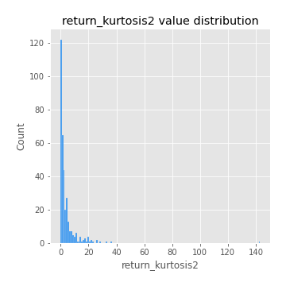
## Feature : return_autocorrelation_1_lag1
- **Feature type** : continous
- **Missing** : 0.0%
- **Unique** : 347
- **Count** :347.0
- **Mean** :-0.009804893582038223
- **Std** :0.060266410721586935
- **Min** :-0.20673896439036124
- **25%th Percentile** : -0.045112630263924355
- **50%th Percentile** : -0.004452624207810848
- **75%th Percentile** : 0.029468744659308575
- **Max** :0.15415360230830738

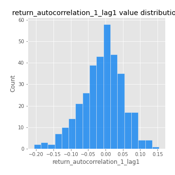
## Feature : return_autocorrelation_1_lag2
- **Feature type** : continous
- **Missing** : 0.0%
- **Unique** : 347
- **Count** :347.0
- **Mean** :0.004844550279450526
- **Std** :0.050653365407502204
- **Min** :-0.12172858720259
- **25%th Percentile** : -0.025651892336307488
- **50%th Percentile** : 0.004416715040297694
- **75%th Percentile** : 0.034985237142889314
- **Max** :0.16163430819084101

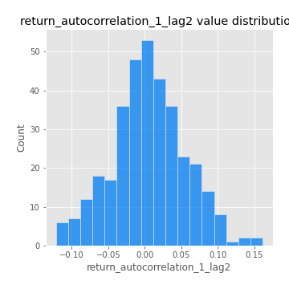
## Feature : return_autocorrelation_1_lag3
- **Feature type** : continous
- **Missing** : 0.0%
- **Unique** : 347
- **Count** :347.0
- **Mean** :0.00242360736915985
- **Std** :0.05312755734196731
- **Min** :-0.1940836867390813
- **25%th Percentile** : -0.029440623152263975
- **50%th Percentile** : 0.004436988975015801
- **75%th Percentile** : 0.036952874676350805
- **Max** :0.17805869530681923

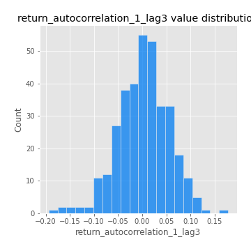
## Feature : return_autocorrelation_2_lag1
- **Feature type** : continous
- **Missing** : 0.0%
- **Unique** : 347
- **Count** :347.0
- **Mean** :-4.784917955043718e-05
- **Std** :0.06218036422942614
- **Min** :-0.25075531010123286
- **25%th Percentile** : -0.034755728840078895
- **50%th Percentile** : 0.007804554257029409
- **75%th Percentile** : 0.039152374462450235
- **Max** :0.15230603506141935

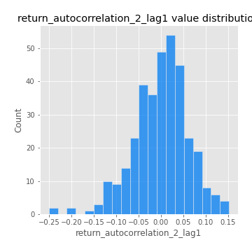
## Feature : return_autocorrelation_2_lag2
- **Feature type** : continous
- **Missing** : 0.0%
- **Unique** : 347
- **Count** :347.0
- **Mean** :0.012425722891641441
- **Std** :0.05195202212323367
- **Min** :-0.1495113937562178
- **25%th Percentile** : -0.022277560791535464
- **50%th Percentile** : 0.008940436263044485
- **75%th Percentile** : 0.04759086707691643
- **Max** :0.1735398560230086

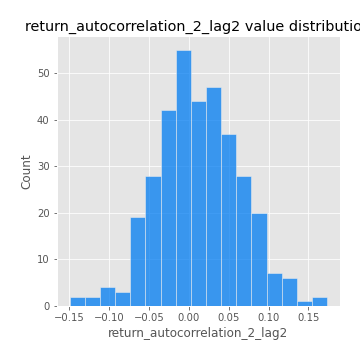
## Feature : return_autocorrelation_2_lag3
- **Feature type** : continous
- **Missing** : 0.0%
- **Unique** : 347
- **Count** :347.0
- **Mean** :0.007971211940346497
- **Std** :0.055724942046465394
- **Min** :-0.14200107169559698
- **25%th Percentile** : -0.025635801109983616
- **50%th Percentile** : 0.00902305949370405
- **75%th Percentile** : 0.04395773855278447
- **Max** :0.16462847446409312

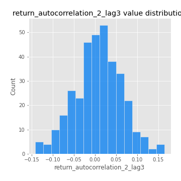
## Feature : return_correlation_ts1_lag_0
- **Feature type** : continous
- **Missing** : 0.0%
- **Unique** : 347
- **Count** :347.0
- **Mean** :0.3457438053770554
- **Std** :0.11451760428353808
- **Min** :-0.027089510445801036
- **25%th Percentile** : 0.2855951167770276
- **50%th Percentile** : 0.3644165675402887
- **75%th Percentile** : 0.41432657494987724
- **Max** :0.7028422087350163

## Feature : return_correlation_ts1_lag_1
- **Feature type** : continous
- **Missing** : 0.0%
- **Unique** : 347
- **Count** :347.0
- **Mean** :0.0034751711705859937
- **Std** :0.05350376976753418
- **Min** :-0.1549695474991776
- **25%th Percentile** : -0.03227758557609832
- **50%th Percentile** : 0.006789869244345442
- **75%th Percentile** : 0.03893787585327725
- **Max** :0.16253131313425473

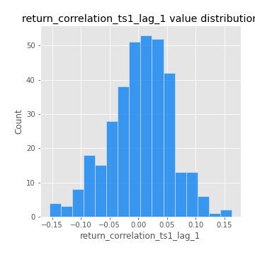
## Feature : return_correlation_ts1_lag_2
- **Feature type** : continous
- **Missing** : 0.0%
- **Unique** : 347
- **Count** :347.0
- **Mean** :0.01039045939376176
- **Std** :0.04802472795054028
- **Min** :-0.1246451147068724
- **25%th Percentile** : -0.024475296775775653
- **50%th Percentile** : 0.011450292221684625
- **75%th Percentile** : 0.04444259811920841
- **Max** :0.13921885667121797

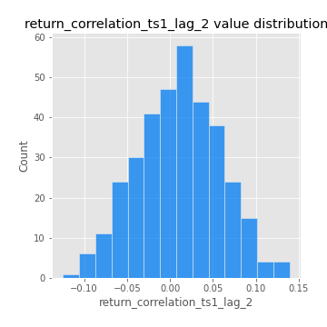
## Feature : return_correlation_ts1_lag_3
- **Feature type** : continous
- **Missing** : 0.0%
- **Unique** : 347
- **Count** :347.0
- **Mean** :0.006626607498153633
- **Std** :0.05283745298170606
- **Min** :-0.1270218498974763
- **25%th Percentile** : -0.02813771297182627
- **50%th Percentile** : 0.009096450421338017
- **75%th Percentile** : 0.04268499495175823
- **Max** :0.1636773216468148

## Feature : return_correlation_ts2_lag_1
- **Feature type** : continous
- **Missing** : 0.0%
- **Unique** : 347
- **Count** :347.0
- **Mean** :0.00138154402772607
- **Std** :0.053741198236852576
- **Min** :-0.2081139431093261
- **25%th Percentile** : -0.027949036791984617
- **50%th Percentile** : 0.002284256711743745
- **75%th Percentile** : 0.038508257516869995
- **Max** :0.14158241477773836

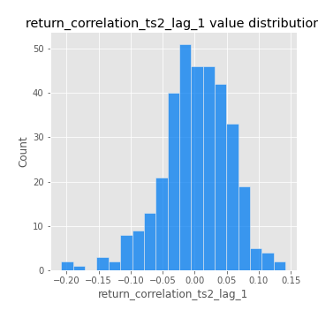
## Feature : return_correlation_ts2_lag_2
- **Feature type** : continous
- **Missing** : 0.0%
- **Unique** : 347
- **Count** :347.0
- **Mean** :0.009901194325559633
- **Std** :0.0531040425007223
- **Min** :-0.23751835475804678
- **25%th Percentile** : -0.024606161022301152
- **50%th Percentile** : 0.004624144408871608
- **75%th Percentile** : 0.0440703784081154
- **Max** :0.20772887392904255

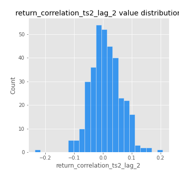
## Feature : return_correlation_ts2_lag_3
- **Feature type** : continous
- **Missing** : 0.0%
- **Unique** : 347
- **Count** :347.0
- **Mean** :0.0071664802316400945
- **Std** :0.05445432895026663
- **Min** :-0.17564076057312866
- **25%th Percentile** : -0.02109425412850289
- **50%th Percentile** : 0.008409519615872153
- **75%th Percentile** : 0.04661543068575004
- **Max** :0.14682380896860156

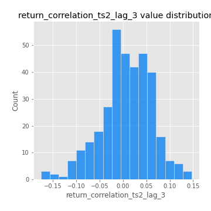
## Feature : sqreturn_autocorrelation_ts1_lag1
- **Feature type** : continous
- **Missing** : 0.0%
- **Unique** : 347
- **Count** :347.0
- **Mean** :0.045258444782534255
- **Std** :0.08804185316000757
- **Min** :-0.10324380184535373
- **25%th Percentile** : -0.009272082340446536
- **50%th Percentile** : 0.023310769431763186
- **75%th Percentile** : 0.08699344943840129
- **Max** :0.4439086285737898

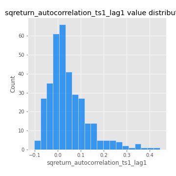
## Feature : sqreturn_autocorrelation_ts1_lag2
- **Feature type** : continous
- **Missing** : 0.0%
- **Unique** : 347
- **Count** :347.0
- **Mean** :0.04077801551990311
- **Std** :0.08976537262778712
- **Min** :-0.09952831905737125
- **25%th Percentile** : -0.012170982655841253
- **50%th Percentile** : 0.02010815593178196
- **75%th Percentile** : 0.06533332142248152
- **Max** :0.4522162366773919

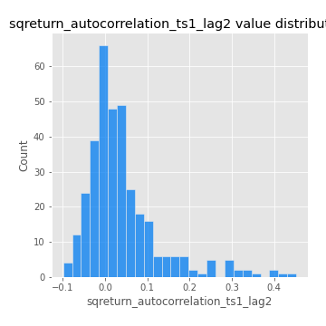
## Feature : sqreturn_autocorrelation_ts1_lag3
- **Feature type** : continous
- **Missing** : 0.0%
- **Unique** : 347
- **Count** :347.0
- **Mean** :0.03244176262125145
- **Std** :0.0772417523224774
- **Min** :-0.11545223958691324
- **25%th Percentile** : -0.014555457194997198
- **50%th Percentile** : 0.013848336968993439
- **75%th Percentile** : 0.057312513267566506
- **Max** :0.41030914918857014

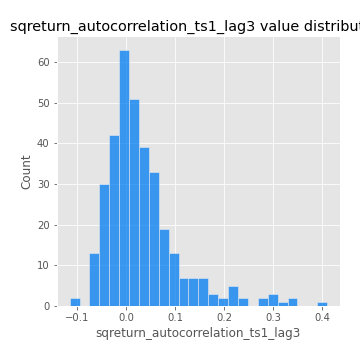
## Feature : sqreturn_autocorrelation_ts2_lag1
- **Feature type** : continous
- **Missing** : 0.0%
- **Unique** : 347
- **Count** :347.0
- **Mean** :0.04785348387033694
- **Std** :0.08733453325920265
- **Min** :-0.09518358622133148
- **25%th Percentile** : -0.004750677092747734
- **50%th Percentile** : 0.02709071866601176
- **75%th Percentile** : 0.07485164938878894
- **Max** :0.510085647437958

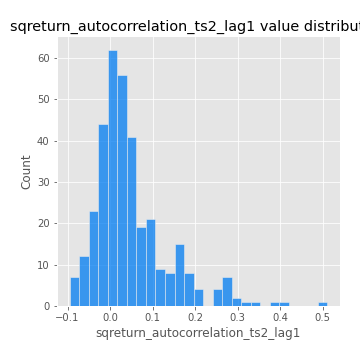
## Feature : sqreturn_autocorrelation_ts2_lag2
- **Feature type** : continous
- **Missing** : 0.0%
- **Unique** : 347
- **Count** :347.0
- **Mean** :0.04086947557963389
- **Std** :0.08766641399647704
- **Min** :-0.08502324709631606
- **25%th Percentile** : -0.009324734249541746
- **50%th Percentile** : 0.01521180592899285
- **75%th Percentile** : 0.056000198497215214
- **Max** :0.45676817892778204

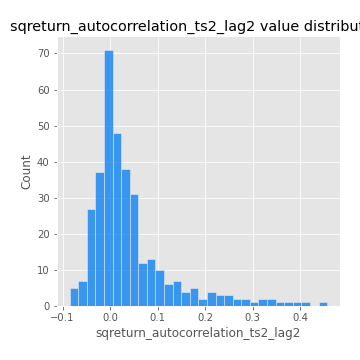
## Feature : sqreturn_autocorrelation_ts2_lag3
- **Feature type** : continous
- **Missing** : 0.0%
- **Unique** : 347
- **Count** :347.0
- **Mean** :0.028590437207809707
- **Std** :0.07048381656425749
- **Min** :-0.10678735983483541
- **25%th Percentile** : -0.01733938267950502
- **50%th Percentile** : 0.014214142378236996
- **75%th Percentile** : 0.057352720598132206
- **Max** :0.31225727797735664

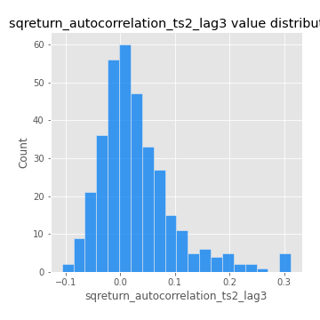
## Feature : sqreturn_correlation_ts1_lag_0
- **Feature type** : continous
- **Missing** : 0.0%
- **Unique** : 347
- **Count** :347.0
- **Mean** :0.3457438053770554
- **Std** :0.11451760428353808
- **Min** :-0.027089510445801036
- **25%th Percentile** : 0.2855951167770276
- **50%th Percentile** : 0.3644165675402887
- **75%th Percentile** : 0.41432657494987724
- **Max** :0.7028422087350163

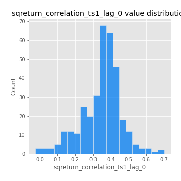
## Feature : sqreturn_correlation_ts1_lag_1
- **Feature type** : continous
- **Missing** : 0.0%
- **Unique** : 347
- **Count** :347.0
- **Mean** :0.0034751711705859937
- **Std** :0.05350376976753418
- **Min** :-0.1549695474991776
- **25%th Percentile** : -0.03227758557609832
- **50%th Percentile** : 0.006789869244345442
- **75%th Percentile** : 0.03893787585327725
- **Max** :0.16253131313425473

## Feature : sqreturn_correlation_ts1_lag_2
- **Feature type** : continous
- **Missing** : 0.0%
- **Unique** : 347
- **Count** :347.0
- **Mean** :0.01039045939376176
- **Std** :0.04802472795054028
- **Min** :-0.1246451147068724
- **25%th Percentile** : -0.024475296775775653
- **50%th Percentile** : 0.011450292221684625
- **75%th Percentile** : 0.04444259811920841
- **Max** :0.13921885667121797

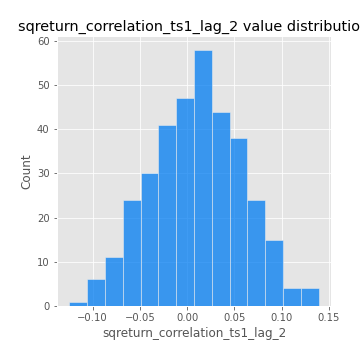
## Feature : sqreturn_correlation_ts1_lag_3
- **Feature type** : continous
- **Missing** : 0.0%
- **Unique** : 347
- **Count** :347.0
- **Mean** :0.006626607498153633
- **Std** :0.05283745298170606
- **Min** :-0.1270218498974763
- **25%th Percentile** : -0.02813771297182627
- **50%th Percentile** : 0.009096450421338017
- **75%th Percentile** : 0.04268499495175823
- **Max** :0.1636773216468148

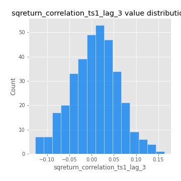
## Feature : sqreturn_correlation_ts2_lag_1
- **Feature type** : continous
- **Missing** : 0.0%
- **Unique** : 347
- **Count** :347.0
- **Mean** :0.00138154402772607
- **Std** :0.053741198236852576
- **Min** :-0.2081139431093261
- **25%th Percentile** : -0.027949036791984617
- **50%th Percentile** : 0.002284256711743745
- **75%th Percentile** : 0.038508257516869995
- **Max** :0.14158241477773836

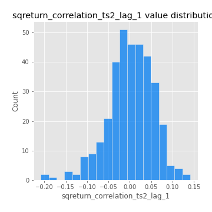
## Feature : sqreturn_correlation_ts2_lag_2
- **Feature type** : continous
- **Missing** : 0.0%
- **Unique** : 347
- **Count** :347.0
- **Mean** :0.009901194325559633
- **Std** :0.0531040425007223
- **Min** :-0.23751835475804678
- **25%th Percentile** : -0.024606161022301152
- **50%th Percentile** : 0.004624144408871608
- **75%th Percentile** : 0.0440703784081154
- **Max** :0.20772887392904255

## Feature : sqreturn_correlation_ts2_lag_3
- **Feature type** : continous
- **Missing** : 0.0%
- **Unique** : 347
- **Count** :347.0
- **Mean** :0.0071664802316400945
- **Std** :0.05445432895026663
- **Min** :-0.17564076057312866
- **25%th Percentile** : -0.02109425412850289
- **50%th Percentile** : 0.008409519615872153
- **75%th Percentile** : 0.04661543068575004
- **Max** :0.14682380896860156

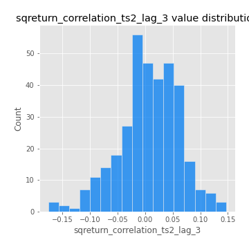
## Feature : price2_granger_cause_price1
- **Feature type** : continous
- **Missing** : 0.0%
- **Unique** : 347
- **Count** :347.0
- **Mean** :0.27827417712031255
- **Std** :0.28243078745365646
- **Min** :9.506092092042416e-08
- **25%th Percentile** : 0.026476323402624687
- **50%th Percentile** : 0.18335968001925124
- **75%th Percentile** : 0.4723862910923957
- **Max** :0.9885712803689185

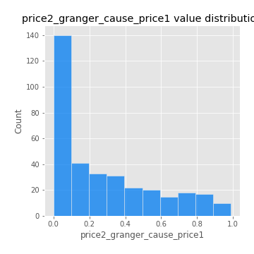
## Feature : price1_granger_cause_price2
- **Feature type** : continous
- **Missing** : 0.0%
- **Unique** : 347
- **Count** :347.0
- **Mean** :0.2024062910481477
- **Std** :0.2697341859271076
- **Min** :2.1872428056188508e-12
- **25%th Percentile** : 0.002034371170348678
- **50%th Percentile** : 0.04982366121739722
- **75%th Percentile** : 0.3359859250445608
- **Max** :0.989236354534381

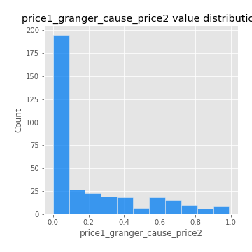

[<< Go back](../README.md)
