# Summary of 2_DecisionTree

[<< Go back](../README.md)

## Decision Tree
- **n_jobs**: -1
- **criterion**: gini
- **max_depth**: 3
- **explain_level**: 2

## Validation
 - **validation_type**: split
 - **train_ratio**: 0.75
 - **shuffle**: True
 - **stratify**: True

## Optimized metric
accuracy

## Training time

16.1 seconds

## Metric details
|           |    score |    threshold |
|:----------|---------:|-------------:|
| logloss   | 0.621511 | nan          |
| auc       | 0.940539 | nan          |
| f1        | 0.895833 |   0.00854701 |
| accuracy  | 0.896552 |   0.504274   |
| precision | 0.926829 |   0.504274   |
| recall    | 1        |   0          |
| mcc       | 0.795131 |   0.504274   |

## Confusion matrix (at threshold=0.504274)
|                      |   Predicted as real |   Predicted as simulated |
|:---------------------|--------------------:|-------------------------:|
| Labeled as real      |                  40 |                        3 |
| Labeled as simulated |                   6 |                       38 |

## Learning curves
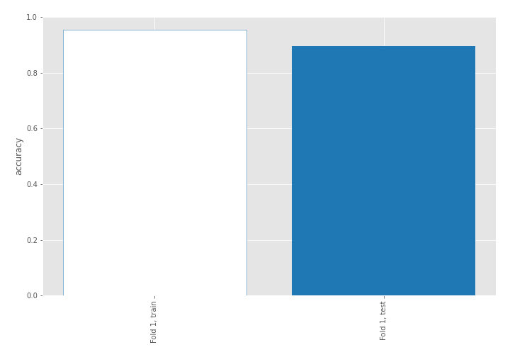

## Decision Tree 

### Tree #1
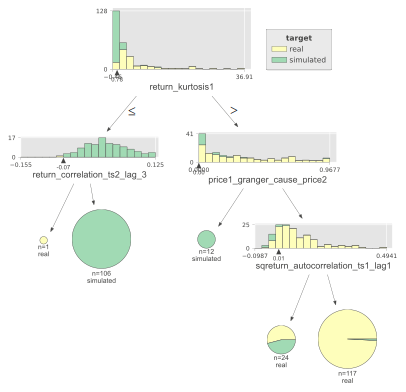

### Rules

if (return_kurtosis1 > 0.78) and (price1_granger_cause_price2 > 0.0) and (sqreturn_autocorrelation_ts1_lag1 > 0.008) then class: real (proba: 99.15%) | based on 117 samples

if (return_kurtosis1 <= 0.78) and (return_correlation_ts2_lag_3 > -0.066) then class: simulated (proba: 100.0%) | based on 106 samples

if (return_kurtosis1 > 0.78) and (price1_granger_cause_price2 > 0.0) and (sqreturn_autocorrelation_ts1_lag1 <= 0.008) then class: real (proba: 54.17%) | based on 24 samples

if (return_kurtosis1 > 0.78) and (price1_granger_cause_price2 <= 0.0) then class: simulated (proba: 100.0%) | based on 12 samples

if (return_kurtosis1 <= 0.78) and (return_correlation_ts2_lag_3 <= -0.066) then class: real (proba: 100.0%) | based on 1 samples

## Permutation-based Importance
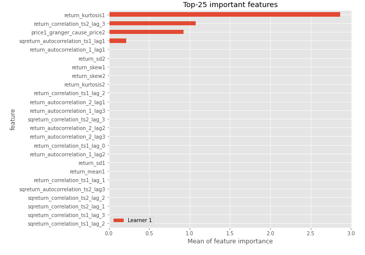
## Confusion Matrix

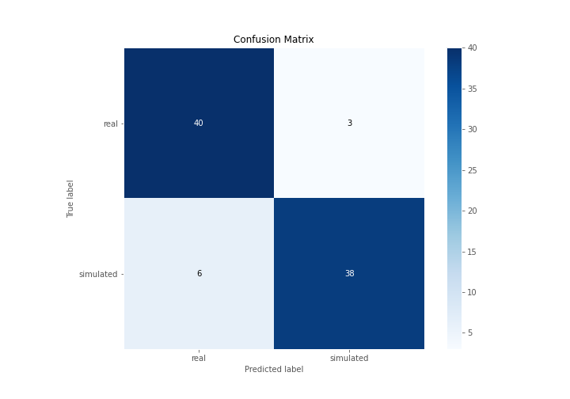

## Normalized Confusion Matrix

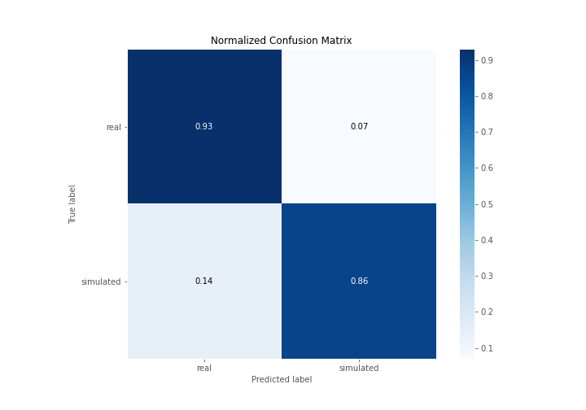

## ROC Curve

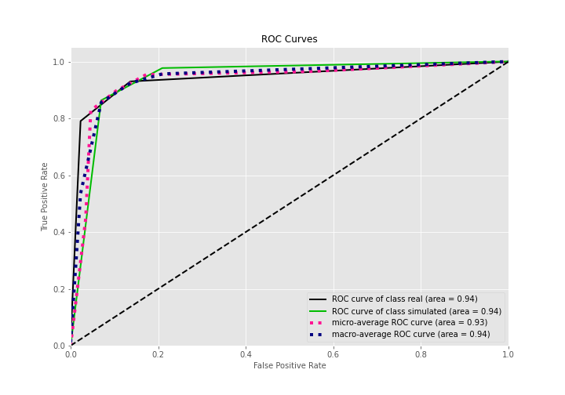

## Kolmogorov-Smirnov Statistic

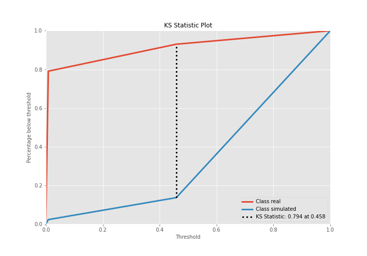

## Precision-Recall Curve

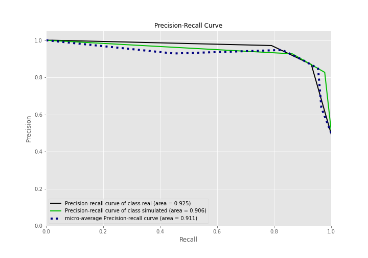

## Calibration Curve

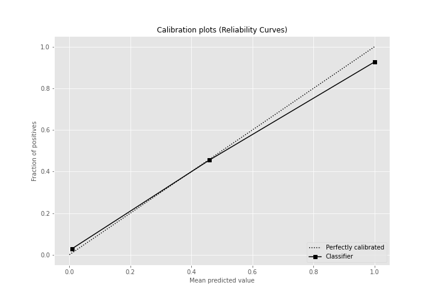

## Cumulative Gains Curve

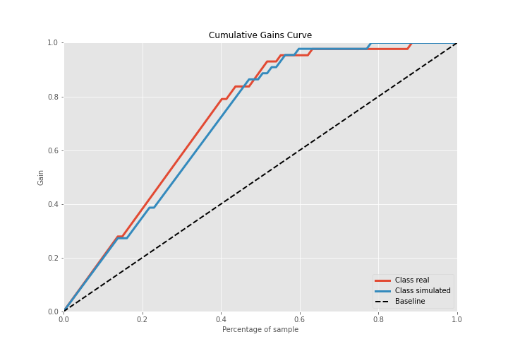

## Lift Curve

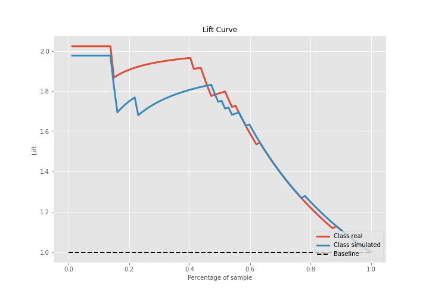

## SHAP Importance
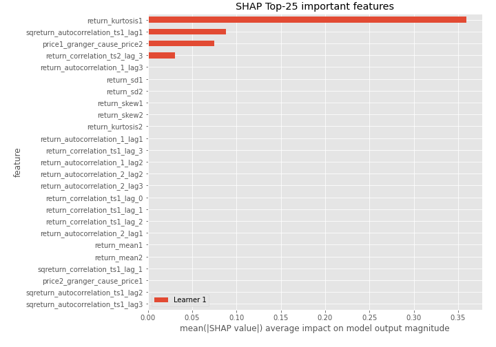

## SHAP Dependence plots

### Dependence (Fold 1)
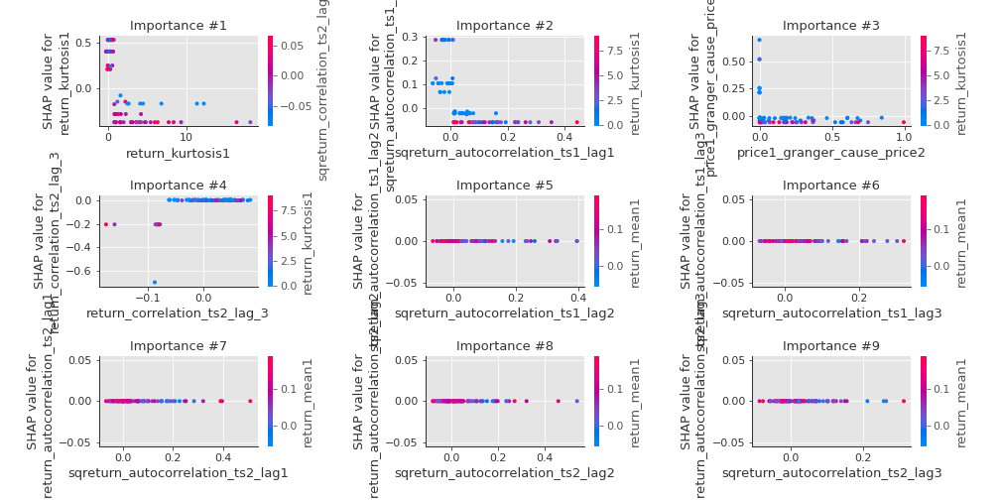

## SHAP Decision plots

### Top-10 Worst decisions for class 0 (Fold 1)
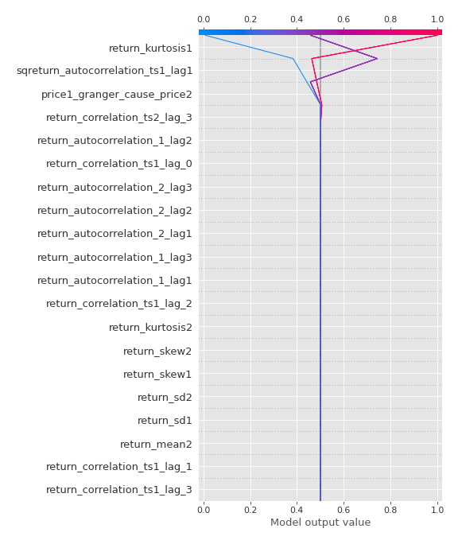
### Top-10 Best decisions for class 0 (Fold 1)
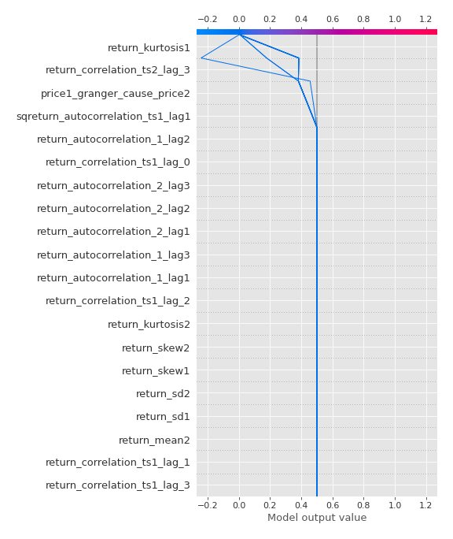
### Top-10 Worst decisions for class 1 (Fold 1)

### Top-10 Best decisions for class 1 (Fold 1)
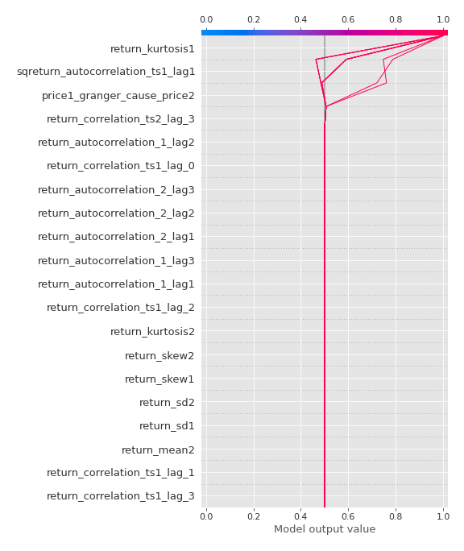

[<< Go back](../README.md)
