# Summary of 3_Linear

[<< Go back](../README.md)

## Logistic Regression (Linear)
- **n_jobs**: -1
- **explain_level**: 2

## Validation
 - **validation_type**: split
 - **train_ratio**: 0.75
 - **shuffle**: True
 - **stratify**: True

## Optimized metric
accuracy

## Training time

15.6 seconds

## Metric details
|           |    score |     threshold |
|:----------|---------:|--------------:|
| logloss   | 0.194328 | nan           |
| auc       | 0.991543 | nan           |
| f1        | 0.977778 |   0.520888    |
| accuracy  | 0.977011 |   0.520888    |
| precision | 1        |   0.901324    |
| recall    | 1        |   4.37708e-09 |
| mcc       | 0.955004 |   0.520888    |

## Confusion matrix (at threshold=0.520888)
|                      |   Predicted as real |   Predicted as simulated |
|:---------------------|--------------------:|-------------------------:|
| Labeled as real      |                  41 |                        2 |
| Labeled as simulated |                   0 |                       44 |

## Learning curves
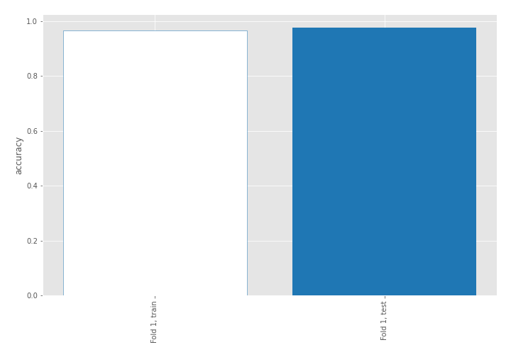

## Coefficients
| feature                           |   Learner_1 |
|:----------------------------------|------------:|
| return_correlation_ts1_lag_0      |   0.910409  |
| sqreturn_correlation_ts1_lag_0    |   0.910409  |
| return_autocorrelation_2_lag1     |   0.815965  |
| sqreturn_correlation_ts2_lag_1    |   0.749658  |
| return_correlation_ts2_lag_1      |   0.749658  |
| return_skew2                      |   0.743422  |
| return_autocorrelation_2_lag3     |   0.738203  |
| return_autocorrelation_2_lag2     |   0.675418  |
| sqreturn_correlation_ts1_lag_3    |   0.674681  |
| return_correlation_ts1_lag_3      |   0.674681  |
| sqreturn_correlation_ts2_lag_3    |   0.578703  |
| return_correlation_ts2_lag_3      |   0.578703  |
| return_correlation_ts1_lag_2      |   0.572114  |
| sqreturn_correlation_ts1_lag_2    |   0.572114  |
| return_correlation_ts1_lag_1      |   0.557573  |
| sqreturn_correlation_ts1_lag_1    |   0.557573  |
| return_autocorrelation_1_lag1     |   0.545532  |
| return_mean1                      |   0.526005  |
| return_autocorrelation_1_lag3     |   0.476903  |
| return_autocorrelation_1_lag2     |   0.37144   |
| sqreturn_correlation_ts2_lag_2    |   0.292703  |
| return_correlation_ts2_lag_2      |   0.292703  |
| return_sd1                        |   0.184862  |
| return_skew1                      |   0.0417709 |
| return_sd2                        |  -0.130861  |
| return_mean2                      |  -0.323512  |
| intercept                         |  -0.435417  |
| sqreturn_autocorrelation_ts2_lag3 |  -0.743606  |
| sqreturn_autocorrelation_ts1_lag3 |  -1.11751   |
| price2_granger_cause_price1       |  -1.30633   |
| sqreturn_autocorrelation_ts2_lag2 |  -1.49126   |
| sqreturn_autocorrelation_ts2_lag1 |  -1.51522   |
| sqreturn_autocorrelation_ts1_lag1 |  -1.62367   |
| sqreturn_autocorrelation_ts1_lag2 |  -1.66329   |
| price1_granger_cause_price2       |  -1.98208   |
| return_kurtosis2                  |  -1.98324   |
| return_kurtosis1                  |  -2.49745   |

## Permutation-based Importance

## Confusion Matrix

## Normalized Confusion Matrix

## ROC Curve

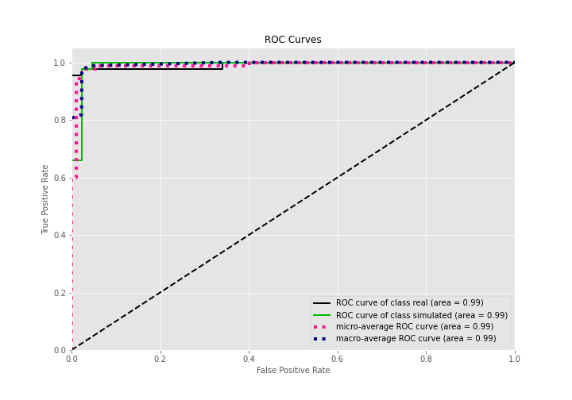

## Kolmogorov-Smirnov Statistic

## Precision-Recall Curve

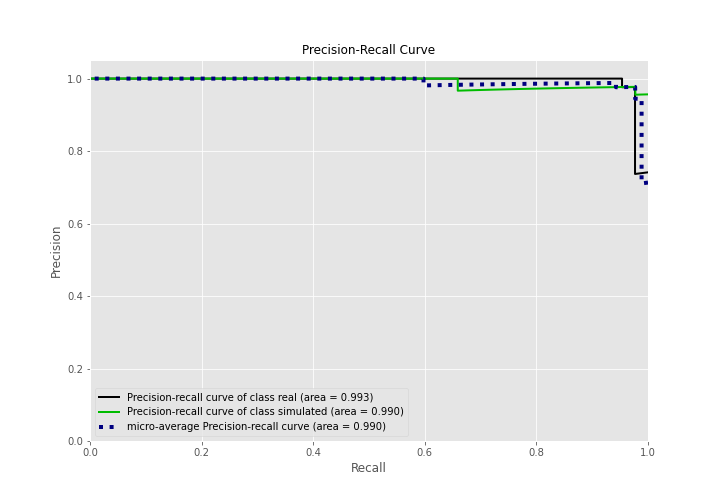

## Calibration Curve

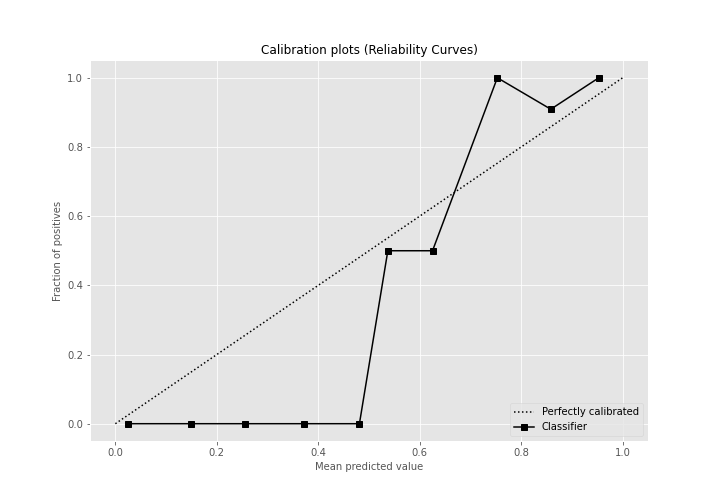

## Cumulative Gains Curve

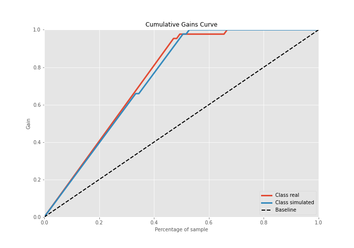

## Lift Curve

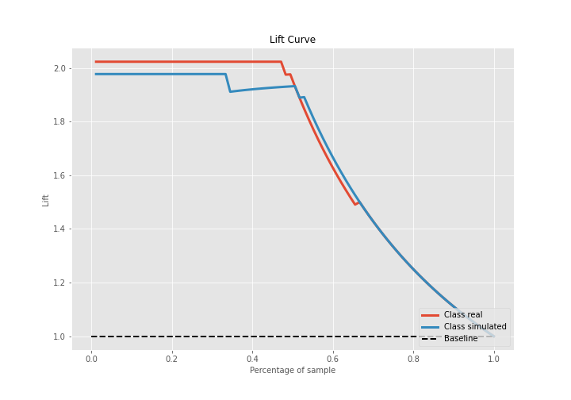

## SHAP Importance
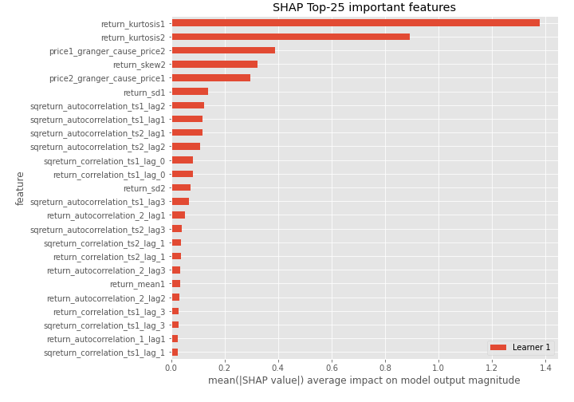

## SHAP Dependence plots

### Dependence (Fold 1)
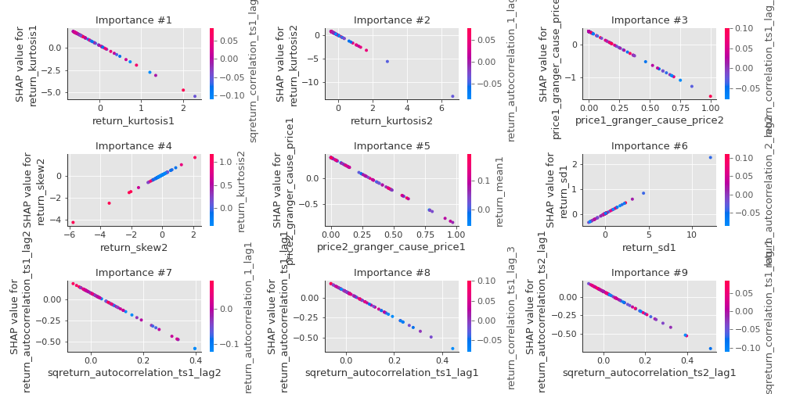

## SHAP Decision plots

### Top-10 Worst decisions for class 0 (Fold 1)
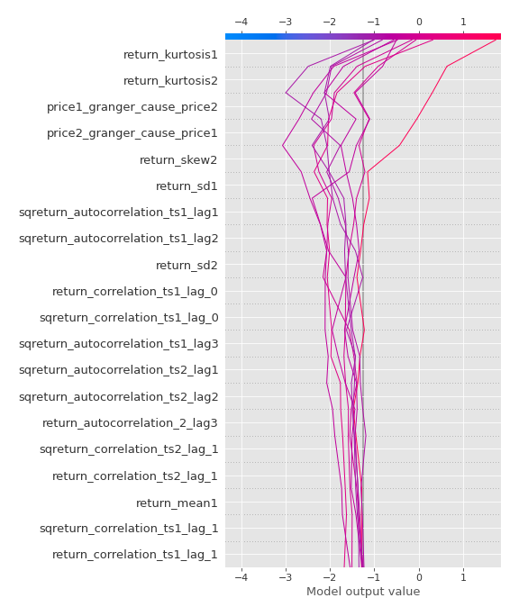
### Top-10 Best decisions for class 0 (Fold 1)
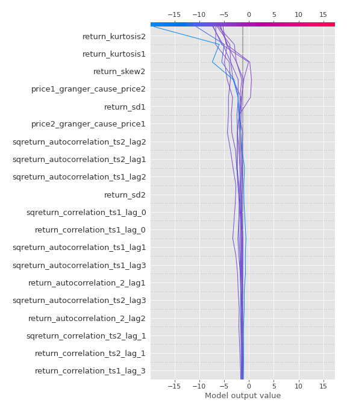
### Top-10 Worst decisions for class 1 (Fold 1)
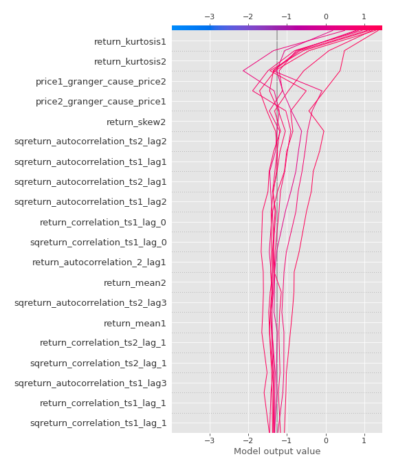
### Top-10 Best decisions for class 1 (Fold 1)
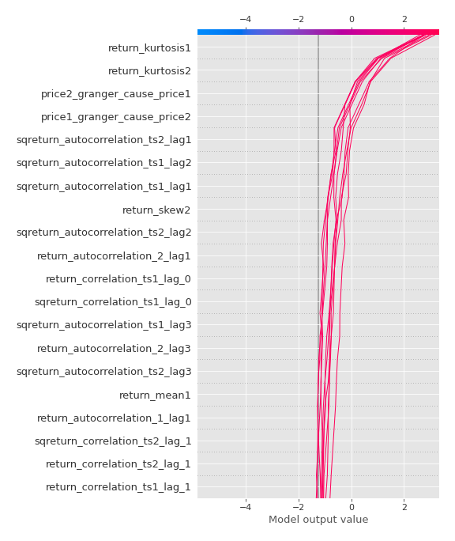

[<< Go back](../README.md)
