# Exploratory Data Analysis

[<< Go back](../README.md)
## Feature : target
- **Feature type** : categorical
- **Missing** : 0.0%
- **Unique** : 2
- **Count** :347
- **Unique** :2
- **Top** :simulated
- **Freq** :174

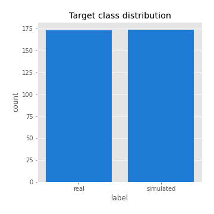
## Feature : return_mean1
- **Feature type** : continous
- **Missing** : 0.0%
- **Unique** : 347
- **Count** :347.0
- **Mean** :0.09073808447197958
- **Std** :0.08415198928880653
- **Min** :-0.22632637961920957
- **25%th Percentile** : 0.03485568115871613
- **50%th Percentile** : 0.08421804623938986
- **75%th Percentile** : 0.1392784300419163
- **Max** :0.37175100008111034

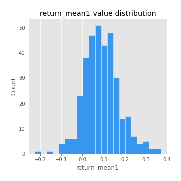
## Feature : return_mean2
- **Feature type** : continous
- **Missing** : 0.0%
- **Unique** : 347
- **Count** :347.0
- **Mean** :0.05461670131413229
- **Std** :0.09770206564663562
- **Min** :-0.24557661868044425
- **25%th Percentile** : 0.0031721519680823532
- **50%th Percentile** : 0.054841082725239486
- **75%th Percentile** : 0.10556817984918199
- **Max** :0.6248912884940913

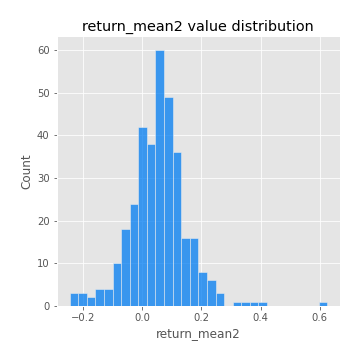
## Feature : return_sd1
- **Feature type** : continous
- **Missing** : 0.0%
- **Unique** : 347
- **Count** :347.0
- **Mean** :1.9155974974843546
- **Std** :0.7242045463558341
- **Min** :0.7470080772831957
- **25%th Percentile** : 1.6902017658202082
- **50%th Percentile** : 1.8713627253730805
- **75%th Percentile** : 1.9710665442727326
- **Max** :9.236766377527575

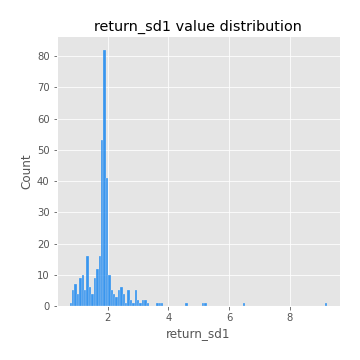
## Feature : return_sd2
- **Feature type** : continous
- **Missing** : 0.0%
- **Unique** : 347
- **Count** :347.0
- **Mean** :1.9050098122285695
- **Std** :0.7484141790360486
- **Min** :0.8592887433004143
- **25%th Percentile** : 1.6370099273875067
- **50%th Percentile** : 1.8116042576427729
- **75%th Percentile** : 1.9017938677783057
- **Max** :6.737618636746393

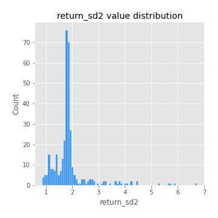
## Feature : return_skew1
- **Feature type** : continous
- **Missing** : 0.0%
- **Unique** : 347
- **Count** :347.0
- **Mean** :-0.08324678680897898
- **Std** :0.5953655217038646
- **Min** :-3.530116233761814
- **25%th Percentile** : -0.25123938729194734
- **50%th Percentile** : -0.041074629078840366
- **75%th Percentile** : 0.12664500511870247
- **Max** :2.5845963767725557

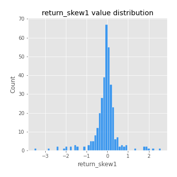
## Feature : return_skew2
- **Feature type** : continous
- **Missing** : 0.0%
- **Unique** : 347
- **Count** :347.0
- **Mean** :-0.16249969252063268
- **Std** :0.814545905652683
- **Min** :-8.801502855292393
- **25%th Percentile** : -0.2873287566189011
- **50%th Percentile** : -0.06356962241973688
- **75%th Percentile** : 0.098971563325562
- **Max** :2.2606839051517187

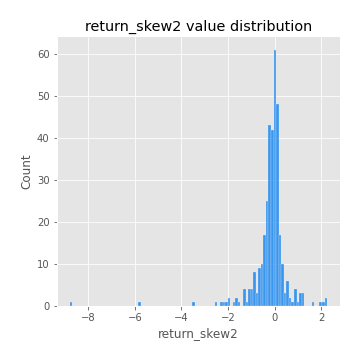
## Feature : return_kurtosis1
- **Feature type** : continous
- **Missing** : 0.0%
- **Unique** : 347
- **Count** :347.0
- **Mean** :3.379914392104491
- **Std** :5.747937615205298
- **Min** :-0.46407909469844943
- **25%th Percentile** : 0.22160453429287585
- **50%th Percentile** : 1.2545724966276413
- **75%th Percentile** : 3.9672030656784054
- **Max** :36.91113889081053

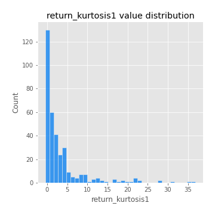
## Feature : return_kurtosis2
- **Feature type** : continous
- **Missing** : 0.0%
- **Unique** : 347
- **Count** :347.0
- **Mean** :4.0870407435252165
- **Std** :9.852049787981288
- **Min** :-0.2806772053936064
- **25%th Percentile** : 0.3907472278941577
- **50%th Percentile** : 1.5360937349625146
- **75%th Percentile** : 4.381239604898888
- **Max** :143.10871011533666

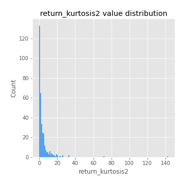
## Feature : return_autocorrelation_1_lag1
- **Feature type** : continous
- **Missing** : 0.0%
- **Unique** : 347
- **Count** :347.0
- **Mean** :-0.004003265011776554
- **Std** :0.05921154401993011
- **Min** :-0.20673896439036124
- **25%th Percentile** : -0.03383746716215904
- **50%th Percentile** : 0.0013045641608180033
- **75%th Percentile** : 0.03753059350616274
- **Max** :0.12943685414585854

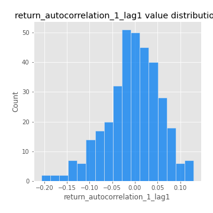
## Feature : return_autocorrelation_1_lag2
- **Feature type** : continous
- **Missing** : 0.0%
- **Unique** : 347
- **Count** :347.0
- **Mean** :0.0013626036563212586
- **Std** :0.05354632621067047
- **Min** :-0.13309283796645122
- **25%th Percentile** : -0.030786072166414897
- **50%th Percentile** : 0.0013652155019176293
- **75%th Percentile** : 0.03764775936444917
- **Max** :0.1561488228015672

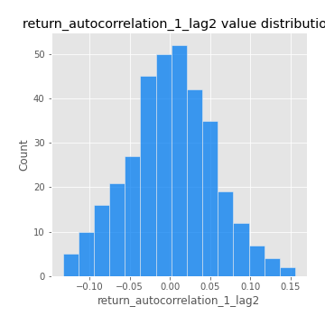
## Feature : return_autocorrelation_1_lag3
- **Feature type** : continous
- **Missing** : 0.0%
- **Unique** : 347
- **Count** :347.0
- **Mean** :0.004926300946117832
- **Std** :0.052178301230880124
- **Min** :-0.1940836867390813
- **25%th Percentile** : -0.029269536532889648
- **50%th Percentile** : 0.005438996974153567
- **75%th Percentile** : 0.041361516875772705
- **Max** :0.17805869530681923

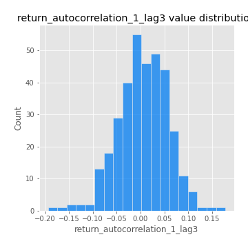
## Feature : return_autocorrelation_2_lag1
- **Feature type** : continous
- **Missing** : 0.0%
- **Unique** : 347
- **Count** :347.0
- **Mean** :0.0020018779006438065
- **Std** :0.06837040741587443
- **Min** :-0.25075531010123286
- **25%th Percentile** : -0.03492766519971577
- **50%th Percentile** : 0.008187356111218446
- **75%th Percentile** : 0.044652312981112025
- **Max** :0.31863413537898483

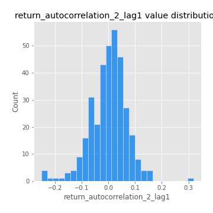
## Feature : return_autocorrelation_2_lag2
- **Feature type** : continous
- **Missing** : 0.0%
- **Unique** : 347
- **Count** :347.0
- **Mean** :0.012387298183999848
- **Std** :0.05227573479274487
- **Min** :-0.15323211089747296
- **25%th Percentile** : -0.02214785489941133
- **50%th Percentile** : 0.012255853450786107
- **75%th Percentile** : 0.047384429638639716
- **Max** :0.20974504043791217

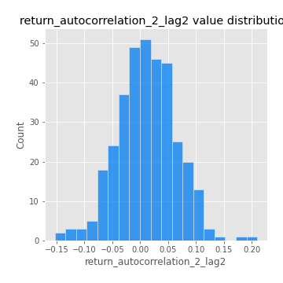
## Feature : return_autocorrelation_2_lag3
- **Feature type** : continous
- **Missing** : 0.0%
- **Unique** : 347
- **Count** :347.0
- **Mean** :0.010077472805734273
- **Std** :0.05303362203457527
- **Min** :-0.14200107169559698
- **25%th Percentile** : -0.022462610791974834
- **50%th Percentile** : 0.014773134076362016
- **75%th Percentile** : 0.0465243085174029
- **Max** :0.1419999376914021

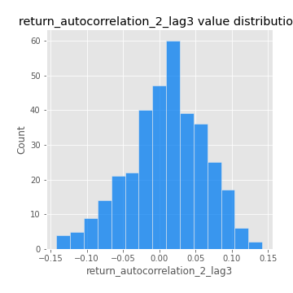
## Feature : return_correlation_ts1_lag_0
- **Feature type** : continous
- **Missing** : 0.0%
- **Unique** : 347
- **Count** :347.0
- **Mean** :0.3497037450654079
- **Std** :0.11266166969189985
- **Min** :0.005136598099876001
- **25%th Percentile** : 0.29854793082492387
- **50%th Percentile** : 0.3652108044830807
- **75%th Percentile** : 0.41201801839221275
- **Max** :0.7041861626832071

## Feature : return_correlation_ts1_lag_1
- **Feature type** : continous
- **Missing** : 0.0%
- **Unique** : 347
- **Count** :347.0
- **Mean** :0.005250974156238035
- **Std** :0.05333201604417897
- **Min** :-0.1506680294614535
- **25%th Percentile** : -0.025430375089126395
- **50%th Percentile** : 0.009371584599300127
- **75%th Percentile** : 0.04264114875772276
- **Max** :0.15499424718508623

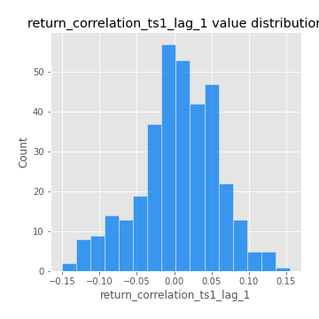
## Feature : return_correlation_ts1_lag_2
- **Feature type** : continous
- **Missing** : 0.0%
- **Unique** : 347
- **Count** :347.0
- **Mean** :0.007032834544589543
- **Std** :0.048042693841285976
- **Min** :-0.1246451147068724
- **25%th Percentile** : -0.026067799975751177
- **50%th Percentile** : 0.008039070975697536
- **75%th Percentile** : 0.041690458291491
- **Max** :0.12761617071802248

## Feature : return_correlation_ts1_lag_3
- **Feature type** : continous
- **Missing** : 0.0%
- **Unique** : 347
- **Count** :347.0
- **Mean** :0.011588679466329396
- **Std** :0.05399864204822971
- **Min** :-0.1270218498974763
- **25%th Percentile** : -0.022969644352796532
- **50%th Percentile** : 0.013522733053949984
- **75%th Percentile** : 0.04764990117885597
- **Max** :0.1636773216468148

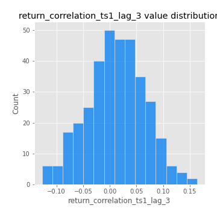
## Feature : return_correlation_ts2_lag_1
- **Feature type** : continous
- **Missing** : 0.0%
- **Unique** : 347
- **Count** :347.0
- **Mean** :0.003543023279826694
- **Std** :0.05894116054461158
- **Min** :-0.2081139431093261
- **25%th Percentile** : -0.03352618511395783
- **50%th Percentile** : 0.008564086511707975
- **75%th Percentile** : 0.041180890493799485
- **Max** :0.17208763791364762

## Feature : return_correlation_ts2_lag_2
- **Feature type** : continous
- **Missing** : 0.0%
- **Unique** : 347
- **Count** :347.0
- **Mean** :0.012095230328103054
- **Std** :0.049939002612924804
- **Min** :-0.15299951737180204
- **25%th Percentile** : -0.020720424750637078
- **50%th Percentile** : 0.01050210513748634
- **75%th Percentile** : 0.04629195286678432
- **Max** :0.20772887392904255

## Feature : return_correlation_ts2_lag_3
- **Feature type** : continous
- **Missing** : 0.0%
- **Unique** : 347
- **Count** :347.0
- **Mean** :0.006931716525189169
- **Std** :0.05182637785294579
- **Min** :-0.17564076057312866
- **25%th Percentile** : -0.021510788176477627
- **50%th Percentile** : 0.008409519615872153
- **75%th Percentile** : 0.044106247036731897
- **Max** :0.12502781355851633

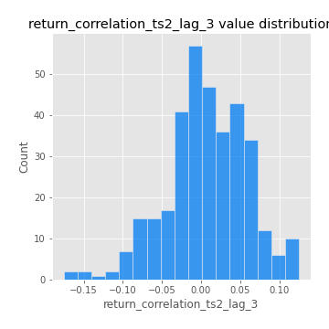
## Feature : sqreturn_autocorrelation_ts1_lag1
- **Feature type** : continous
- **Missing** : 0.0%
- **Unique** : 347
- **Count** :347.0
- **Mean** :0.05108289675181509
- **Std** :0.09390907522343286
- **Min** :-0.09868053361704486
- **25%th Percentile** : -0.011019623738617684
- **50%th Percentile** : 0.02672915646187806
- **75%th Percentile** : 0.08429396048780433
- **Max** :0.49414293176447355

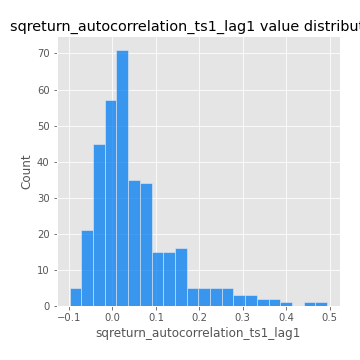
## Feature : sqreturn_autocorrelation_ts1_lag2
- **Feature type** : continous
- **Missing** : 0.0%
- **Unique** : 347
- **Count** :347.0
- **Mean** :0.04433526930230145
- **Std** :0.09488247734232295
- **Min** :-0.10321765833105431
- **25%th Percentile** : -0.014109417842855097
- **50%th Percentile** : 0.019026525573813947
- **75%th Percentile** : 0.07074404550229185
- **Max** :0.540735851444759

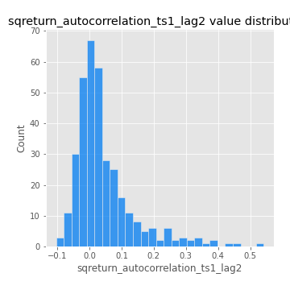
## Feature : sqreturn_autocorrelation_ts1_lag3
- **Feature type** : continous
- **Missing** : 0.0%
- **Unique** : 347
- **Count** :347.0
- **Mean** :0.035790928046877495
- **Std** :0.08243352662201167
- **Min** :-0.08037001203762775
- **25%th Percentile** : -0.015434869558457524
- **50%th Percentile** : 0.013014190554133217
- **75%th Percentile** : 0.06302625843491666
- **Max** :0.44755937369538146

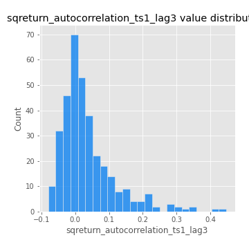
## Feature : sqreturn_autocorrelation_ts2_lag1
- **Feature type** : continous
- **Missing** : 0.0%
- **Unique** : 347
- **Count** :347.0
- **Mean** :0.05007821372560804
- **Std** :0.09144212207280587
- **Min** :-0.08520586663750691
- **25%th Percentile** : -0.007672428623372758
- **50%th Percentile** : 0.02695770886205464
- **75%th Percentile** : 0.0854166329998345
- **Max** :0.510085647437958

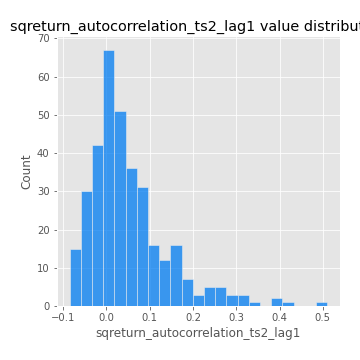
## Feature : sqreturn_autocorrelation_ts2_lag2
- **Feature type** : continous
- **Missing** : 0.0%
- **Unique** : 347
- **Count** :347.0
- **Mean** :0.03833870452651309
- **Std** :0.09216639984446633
- **Min** :-0.1047826429496116
- **25%th Percentile** : -0.01560241083004315
- **50%th Percentile** : 0.011289564776062327
- **75%th Percentile** : 0.0565896462224666
- **Max** :0.5373432415582473

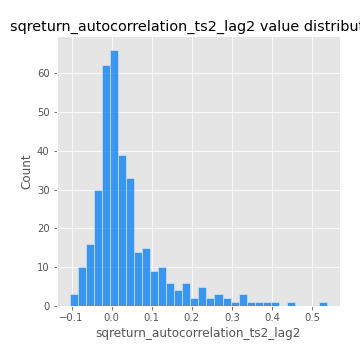
## Feature : sqreturn_autocorrelation_ts2_lag3
- **Feature type** : continous
- **Missing** : 0.0%
- **Unique** : 347
- **Count** :347.0
- **Mean** :0.029461493795625963
- **Std** :0.06854912545471911
- **Min** :-0.08759572250026516
- **25%th Percentile** : -0.013720241318428437
- **50%th Percentile** : 0.015600659260481023
- **75%th Percentile** : 0.05319544954058923
- **Max** :0.31225727797735664

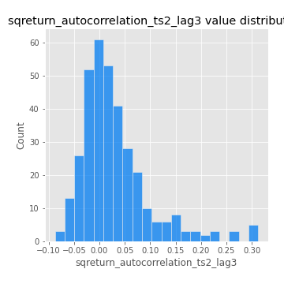
## Feature : sqreturn_correlation_ts1_lag_0
- **Feature type** : continous
- **Missing** : 0.0%
- **Unique** : 347
- **Count** :347.0
- **Mean** :0.3497037450654079
- **Std** :0.11266166969189985
- **Min** :0.005136598099876001
- **25%th Percentile** : 0.29854793082492387
- **50%th Percentile** : 0.3652108044830807
- **75%th Percentile** : 0.41201801839221275
- **Max** :0.7041861626832071

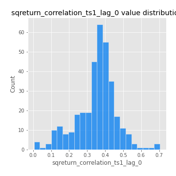
## Feature : sqreturn_correlation_ts1_lag_1
- **Feature type** : continous
- **Missing** : 0.0%
- **Unique** : 347
- **Count** :347.0
- **Mean** :0.005250974156238035
- **Std** :0.05333201604417897
- **Min** :-0.1506680294614535
- **25%th Percentile** : -0.025430375089126395
- **50%th Percentile** : 0.009371584599300127
- **75%th Percentile** : 0.04264114875772276
- **Max** :0.15499424718508623

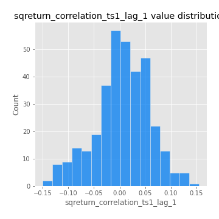
## Feature : sqreturn_correlation_ts1_lag_2
- **Feature type** : continous
- **Missing** : 0.0%
- **Unique** : 347
- **Count** :347.0
- **Mean** :0.007032834544589543
- **Std** :0.048042693841285976
- **Min** :-0.1246451147068724
- **25%th Percentile** : -0.026067799975751177
- **50%th Percentile** : 0.008039070975697536
- **75%th Percentile** : 0.041690458291491
- **Max** :0.12761617071802248

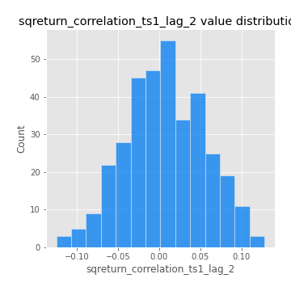
## Feature : sqreturn_correlation_ts1_lag_3
- **Feature type** : continous
- **Missing** : 0.0%
- **Unique** : 347
- **Count** :347.0
- **Mean** :0.011588679466329396
- **Std** :0.05399864204822971
- **Min** :-0.1270218498974763
- **25%th Percentile** : -0.022969644352796532
- **50%th Percentile** : 0.013522733053949984
- **75%th Percentile** : 0.04764990117885597
- **Max** :0.1636773216468148

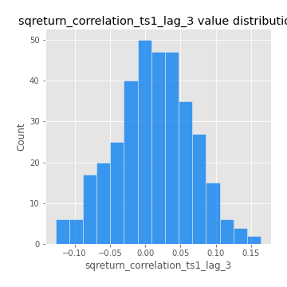
## Feature : sqreturn_correlation_ts2_lag_1
- **Feature type** : continous
- **Missing** : 0.0%
- **Unique** : 347
- **Count** :347.0
- **Mean** :0.003543023279826694
- **Std** :0.05894116054461158
- **Min** :-0.2081139431093261
- **25%th Percentile** : -0.03352618511395783
- **50%th Percentile** : 0.008564086511707975
- **75%th Percentile** : 0.041180890493799485
- **Max** :0.17208763791364762

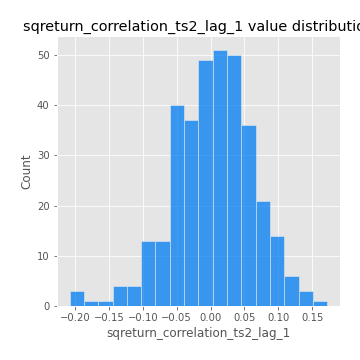
## Feature : sqreturn_correlation_ts2_lag_2
- **Feature type** : continous
- **Missing** : 0.0%
- **Unique** : 347
- **Count** :347.0
- **Mean** :0.012095230328103054
- **Std** :0.049939002612924804
- **Min** :-0.15299951737180204
- **25%th Percentile** : -0.020720424750637078
- **50%th Percentile** : 0.01050210513748634
- **75%th Percentile** : 0.04629195286678432
- **Max** :0.20772887392904255

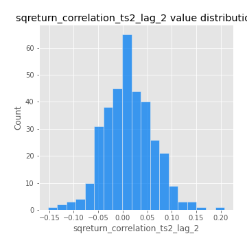
## Feature : sqreturn_correlation_ts2_lag_3
- **Feature type** : continous
- **Missing** : 0.0%
- **Unique** : 347
- **Count** :347.0
- **Mean** :0.006931716525189169
- **Std** :0.05182637785294579
- **Min** :-0.17564076057312866
- **25%th Percentile** : -0.021510788176477627
- **50%th Percentile** : 0.008409519615872153
- **75%th Percentile** : 0.044106247036731897
- **Max** :0.12502781355851633

## Feature : price2_granger_cause_price1
- **Feature type** : continous
- **Missing** : 0.0%
- **Unique** : 347
- **Count** :347.0
- **Mean** :0.27744714252430674
- **Std** :0.2855102286532201
- **Min** :1.4265828711554518e-07
- **25%th Percentile** : 0.02769502060703789
- **50%th Percentile** : 0.17740073106828966
- **75%th Percentile** : 0.4713688149971046
- **Max** :0.9885712803689185

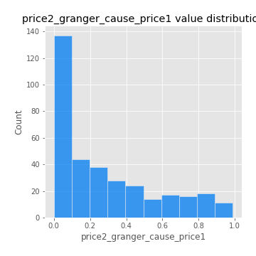
## Feature : price1_granger_cause_price2
- **Feature type** : continous
- **Missing** : 0.0%
- **Unique** : 347
- **Count** :347.0
- **Mean** :0.19834777522534716
- **Std** :0.2606190567607024
- **Min** :6.625871834011311e-11
- **25%th Percentile** : 0.001573891669421746
- **50%th Percentile** : 0.06382814877787765
- **75%th Percentile** : 0.3138525965529918
- **Max** :0.9951398266867577

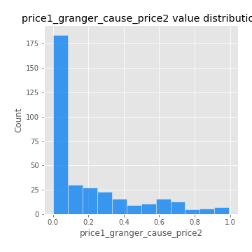

[<< Go back](../README.md)
