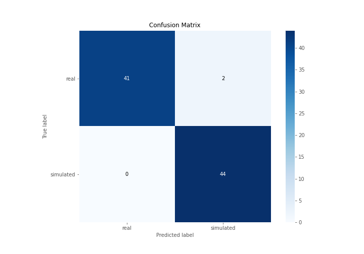
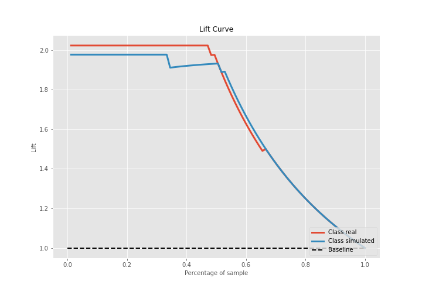

# Summary of Ensemble

[<< Go back](../README.md)

## Ensemble structure
| Model    |   Weight |
|:---------|---------:|
| 3_Linear |        1 |

## Metric details
|           |    score |     threshold |
|:----------|---------:|--------------:|
| logloss   | 0.194328 | nan           |
| auc       | 0.991543 | nan           |
| f1        | 0.977778 |   0.520888    |
| accuracy  | 0.977011 |   0.520888    |
| precision | 1        |   0.901324    |
| recall    | 1        |   4.37708e-09 |
| mcc       | 0.955004 |   0.520888    |

## Confusion matrix (at threshold=0.520888)
|                      |   Predicted as real |   Predicted as simulated |
|:---------------------|--------------------:|-------------------------:|
| Labeled as real      |                  41 |                        2 |
| Labeled as simulated |                   0 |                       44 |

## Learning curves

## Confusion Matrix

## Normalized Confusion Matrix

## ROC Curve

## Kolmogorov-Smirnov Statistic

## Precision-Recall Curve

## Calibration Curve

## Cumulative Gains Curve

## Lift Curve

[<< Go back](../README.md)
