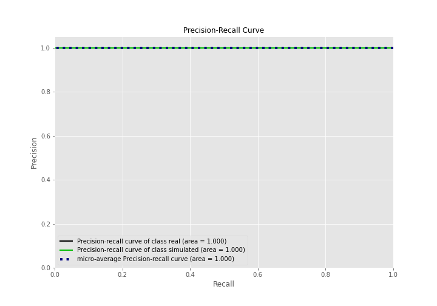
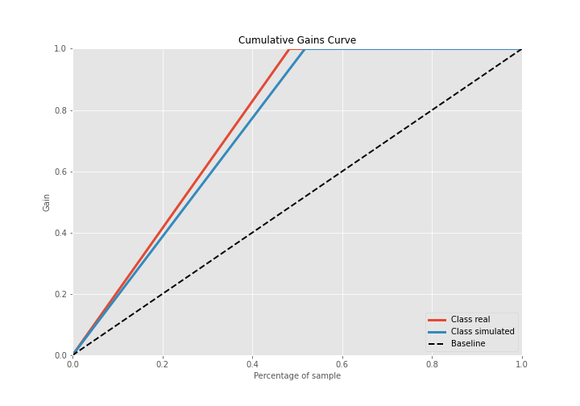

# Summary of 3_Linear

[<< Go back](../README.md)

## Logistic Regression (Linear)
- **n_jobs**: -1
- **explain_level**: 2

## Validation
 - **validation_type**: split
 - **train_ratio**: 0.75
 - **shuffle**: True
 - **stratify**: True

## Optimized metric
accuracy

## Training time

16.9 seconds

## Metric details
|           |    score |     threshold |
|:----------|---------:|--------------:|
| logloss   | 0.119809 | nan           |
| auc       | 1        | nan           |
| f1        | 1        |   0.652779    |
| accuracy  | 1        |   0.652779    |
| precision | 1        |   0.930314    |
| recall    | 1        |   2.06228e-07 |
| mcc       | 1        |   0.652779    |

## Confusion matrix (at threshold=0.652779)
|                      |   Predicted as real |   Predicted as simulated |
|:---------------------|--------------------:|-------------------------:|
| Labeled as real      |                  42 |                        0 |
| Labeled as simulated |                   0 |                       45 |

## Learning curves

## Coefficients
| feature                           |   Learner_1 |
|:----------------------------------|------------:|
| return_mean1                      |    1.24511  |
| return_autocorrelation_2_lag2     |    0.824525 |
| return_autocorrelation_2_lag1     |    0.802295 |
| return_skew1                      |    0.801865 |
| return_correlation_ts1_lag_0      |    0.784532 |
| sqreturn_correlation_ts1_lag_0    |    0.784532 |
| return_correlation_ts1_lag_1      |    0.608459 |
| sqreturn_correlation_ts1_lag_1    |    0.608459 |
| return_correlation_ts1_lag_3      |    0.561729 |
| sqreturn_correlation_ts1_lag_3    |    0.561729 |
| return_autocorrelation_1_lag2     |    0.515814 |
| return_autocorrelation_2_lag3     |    0.514674 |
| return_autocorrelation_1_lag3     |    0.513574 |
| return_skew2                      |    0.469682 |
| return_correlation_ts2_lag_1      |    0.461741 |
| sqreturn_correlation_ts2_lag_1    |    0.461741 |
| sqreturn_correlation_ts1_lag_2    |    0.435471 |
| return_correlation_ts1_lag_2      |    0.435471 |
| return_autocorrelation_1_lag1     |    0.403095 |
| return_correlation_ts2_lag_3      |    0.329791 |
| sqreturn_correlation_ts2_lag_3    |    0.329791 |
| return_correlation_ts2_lag_2      |    0.312505 |
| sqreturn_correlation_ts2_lag_2    |    0.312505 |
| return_sd1                        |    0.126349 |
| return_sd2                        |   -0.025221 |
| return_mean2                      |   -0.195334 |
| intercept                         |   -0.842773 |
| sqreturn_autocorrelation_ts2_lag3 |   -1.08776  |
| sqreturn_autocorrelation_ts2_lag2 |   -1.14224  |
| price2_granger_cause_price1       |   -1.1696   |
| sqreturn_autocorrelation_ts1_lag2 |   -1.17414  |
| sqreturn_autocorrelation_ts1_lag3 |   -1.4717   |
| sqreturn_autocorrelation_ts2_lag1 |   -1.50225  |
| sqreturn_autocorrelation_ts1_lag1 |   -1.58572  |
| price1_granger_cause_price2       |   -1.59126  |
| return_kurtosis2                  |   -2.11805  |
| return_kurtosis1                  |   -3.46206  |

## Permutation-based Importance

## Confusion Matrix

## Normalized Confusion Matrix

## ROC Curve

## Kolmogorov-Smirnov Statistic

## Precision-Recall Curve

## Calibration Curve

## Cumulative Gains Curve

## Lift Curve

## SHAP Importance

## SHAP Dependence plots

### Dependence (Fold 1)

## SHAP Decision plots

### Top-10 Worst decisions for class 0 (Fold 1)

### Top-10 Best decisions for class 0 (Fold 1)

### Top-10 Worst decisions for class 1 (Fold 1)

### Top-10 Best decisions for class 1 (Fold 1)

[<< Go back](../README.md)
