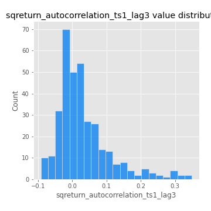

# Exploratory Data Analysis

[<< Go back](../README.md)
## Feature : target
- **Feature type** : categorical
- **Missing** : 0.0%
- **Unique** : 2
- **Count** :347
- **Unique** :2
- **Top** :simulated
- **Freq** :178

## Feature : return_mean1
- **Feature type** : continous
- **Missing** : 0.0%
- **Unique** : 347
- **Count** :347.0
- **Mean** :0.08950970808154768
- **Std** :0.09249690927608774
- **Min** :-0.22632637961920957
- **25%th Percentile** : 0.03250903500246879
- **50%th Percentile** : 0.0816045919498401
- **75%th Percentile** : 0.14723059005796807
- **Max** :0.37638416707691896

## Feature : return_mean2
- **Feature type** : continous
- **Missing** : 0.0%
- **Unique** : 347
- **Count** :347.0
- **Mean** :0.049689175637391024
- **Std** :0.09173136515988099
- **Min** :-0.27213370953375565
- **25%th Percentile** : -0.00830789146974285
- **50%th Percentile** : 0.05400363030829556
- **75%th Percentile** : 0.10463380712093326
- **Max** :0.46496916284194284

## Feature : return_sd1
- **Feature type** : continous
- **Missing** : 0.0%
- **Unique** : 347
- **Count** :347.0
- **Mean** :1.9238733007167923
- **Std** :0.7808797218274824
- **Min** :0.7470080772831957
- **25%th Percentile** : 1.6550956419156755
- **50%th Percentile** : 1.8618708938734543
- **75%th Percentile** : 1.9414355573494049
- **Max** :9.236766377527575

## Feature : return_sd2
- **Feature type** : continous
- **Missing** : 0.0%
- **Unique** : 347
- **Count** :347.0
- **Mean** :1.8567067218971007
- **Std** :0.5768873389694418
- **Min** :0.8455946193085045
- **25%th Percentile** : 1.6538414588482508
- **50%th Percentile** : 1.8164592977174576
- **75%th Percentile** : 1.9156132336837186
- **Max** :5.042707010333888

## Feature : return_skew1
- **Feature type** : continous
- **Missing** : 0.0%
- **Unique** : 347
- **Count** :347.0
- **Mean** :-0.042202546095195144
- **Std** :0.5691275022673362
- **Min** :-2.817259764925239
- **25%th Percentile** : -0.1584130452306401
- **50%th Percentile** : -0.014871030183300864
- **75%th Percentile** : 0.13238448666784086
- **Max** :2.5845963767725557

## Feature : return_skew2
- **Feature type** : continous
- **Missing** : 0.0%
- **Unique** : 347
- **Count** :347.0
- **Mean** :-0.1328151240646572
- **Std** :0.7504430342841913
- **Min** :-8.801502855292393
- **25%th Percentile** : -0.2461753916191839
- **50%th Percentile** : -0.049046564016661735
- **75%th Percentile** : 0.11070345441070177
- **Max** :2.2606839051517187

## Feature : return_kurtosis1
- **Feature type** : continous
- **Missing** : 0.0%
- **Unique** : 347
- **Count** :347.0
- **Mean** :3.244065252609463
- **Std** :5.588473011968021
- **Min** :-0.38026552614011244
- **25%th Percentile** : 0.17065569854825813
- **50%th Percentile** : 0.9526663009767273
- **75%th Percentile** : 3.767479093377704
- **Max** :36.91113889081053

## Feature : return_kurtosis2
- **Feature type** : continous
- **Missing** : 0.0%
- **Unique** : 347
- **Count** :347.0
- **Mean** :3.91275164749363
- **Std** :9.258393028183535
- **Min** :-0.31572799175210164
- **25%th Percentile** : 0.298171060211883
- **50%th Percentile** : 1.3958568493781196
- **75%th Percentile** : 4.355071582584159
- **Max** :143.10871011533666

## Feature : return_autocorrelation_1_lag1
- **Feature type** : continous
- **Missing** : 0.0%
- **Unique** : 347
- **Count** :347.0
- **Mean** :-0.002728440290875546
- **Std** :0.060253303859729414
- **Min** :-0.2135576224968752
- **25%th Percentile** : -0.03455552744875732
- **50%th Percentile** : 0.004491458061025537
- **75%th Percentile** : 0.037398224611146294
- **Max** :0.1366590273436737

## Feature : return_autocorrelation_1_lag2
- **Feature type** : continous
- **Missing** : 0.0%
- **Unique** : 347
- **Count** :347.0
- **Mean** :0.00015735353655935955
- **Std** :0.05075088895672007
- **Min** :-0.12172858720259
- **25%th Percentile** : -0.03315036162275482
- **50%th Percentile** : -0.001451661306835569
- **75%th Percentile** : 0.03239605849437735
- **Max** :0.1561488228015672

## Feature : return_autocorrelation_1_lag3
- **Feature type** : continous
- **Missing** : 0.0%
- **Unique** : 347
- **Count** :347.0
- **Mean** :0.00514044485006778
- **Std** :0.05120925018628528
- **Min** :-0.1940836867390813
- **25%th Percentile** : -0.02754442566324955
- **50%th Percentile** : 0.008773996435449793
- **75%th Percentile** : 0.04077026668106165
- **Max** :0.13246577943619103

## Feature : return_autocorrelation_2_lag1
- **Feature type** : continous
- **Missing** : 0.0%
- **Unique** : 347
- **Count** :347.0
- **Mean** :0.0057481640777103295
- **Std** :0.06180014706429744
- **Min** :-0.25075531010123286
- **25%th Percentile** : -0.03279229814071105
- **50%th Percentile** : 0.012100415081109716
- **75%th Percentile** : 0.04886664325302233
- **Max** :0.15315521500196358

## Feature : return_autocorrelation_2_lag2
- **Feature type** : continous
- **Missing** : 0.0%
- **Unique** : 347
- **Count** :347.0
- **Mean** :0.008829026333368553
- **Std** :0.053566410819266136
- **Min** :-0.15323211089747296
- **25%th Percentile** : -0.030396960360539696
- **50%th Percentile** : 0.006201924858693792
- **75%th Percentile** : 0.049522459647167796
- **Max** :0.1735398560230086

## Feature : return_autocorrelation_2_lag3
- **Feature type** : continous
- **Missing** : 0.0%
- **Unique** : 347
- **Count** :347.0
- **Mean** :0.008565191353836729
- **Std** :0.05092538092306205
- **Min** :-0.14200107169559698
- **25%th Percentile** : -0.025298262747671045
- **50%th Percentile** : 0.007244861029842025
- **75%th Percentile** : 0.04461272416208557
- **Max** :0.1419999376914021

## Feature : return_correlation_ts1_lag_0
- **Feature type** : continous
- **Missing** : 0.0%
- **Unique** : 347
- **Count** :347.0
- **Mean** :0.34910995237697806
- **Std** :0.11092144661743199
- **Min** :-0.027089510445801036
- **25%th Percentile** : 0.29689037833369447
- **50%th Percentile** : 0.36815572056523227
- **75%th Percentile** : 0.41231138012603263
- **Max** :0.7041861626832071

## Feature : return_correlation_ts1_lag_1
- **Feature type** : continous
- **Missing** : 0.0%
- **Unique** : 347
- **Count** :347.0
- **Mean** :0.004625393932949068
- **Std** :0.05538904561194897
- **Min** :-0.16985510949917193
- **25%th Percentile** : -0.028415850287469367
- **50%th Percentile** : 0.009949715882685884
- **75%th Percentile** : 0.04091850908647754
- **Max** :0.16197814163255708

## Feature : return_correlation_ts1_lag_2
- **Feature type** : continous
- **Missing** : 0.0%
- **Unique** : 347
- **Count** :347.0
- **Mean** :0.009366255171831912
- **Std** :0.048068218110665646
- **Min** :-0.21653581047581763
- **25%th Percentile** : -0.019905203707295177
- **50%th Percentile** : 0.009823009051634288
- **75%th Percentile** : 0.04535421272460527
- **Max** :0.11803061491127094

## Feature : return_correlation_ts1_lag_3
- **Feature type** : continous
- **Missing** : 0.0%
- **Unique** : 347
- **Count** :347.0
- **Mean** :0.013012632905907423
- **Std** :0.05252355207096085
- **Min** :-0.1270218498974763
- **25%th Percentile** : -0.021572176384039812
- **50%th Percentile** : 0.014648083977077089
- **75%th Percentile** : 0.05106008629257622
- **Max** :0.1636773216468148

## Feature : return_correlation_ts2_lag_1
- **Feature type** : continous
- **Missing** : 0.0%
- **Unique** : 347
- **Count** :347.0
- **Mean** :0.006471163700046139
- **Std** :0.05543481472240745
- **Min** :-0.2081139431093261
- **25%th Percentile** : -0.028693921637393205
- **50%th Percentile** : 0.004562290060482424
- **75%th Percentile** : 0.04399105195773963
- **Max** :0.17208763791364762

## Feature : return_correlation_ts2_lag_2
- **Feature type** : continous
- **Missing** : 0.0%
- **Unique** : 347
- **Count** :347.0
- **Mean** :0.008939594580999681
- **Std** :0.05270808684271228
- **Min** :-0.23751835475804678
- **25%th Percentile** : -0.027952212665296627
- **50%th Percentile** : 0.010863470063083157
- **75%th Percentile** : 0.04356397124978855
- **Max** :0.20772887392904255

## Feature : return_correlation_ts2_lag_3
- **Feature type** : continous
- **Missing** : 0.0%
- **Unique** : 347
- **Count** :347.0
- **Mean** :0.005969320516328859
- **Std** :0.05090403968404974
- **Min** :-0.17564076057312866
- **25%th Percentile** : -0.021372567439004817
- **50%th Percentile** : 0.0018133829300501134
- **75%th Percentile** : 0.04016222298657607
- **Max** :0.15848610260180732

## Feature : sqreturn_autocorrelation_ts1_lag1
- **Feature type** : continous
- **Missing** : 0.0%
- **Unique** : 347
- **Count** :347.0
- **Mean** :0.04804168880038795
- **Std** :0.09450148893888972
- **Min** :-0.11987008960286451
- **25%th Percentile** : -0.01061922766466147
- **50%th Percentile** : 0.027526459453190984
- **75%th Percentile** : 0.08196061160329236
- **Max** :0.4439086285737898

## Feature : sqreturn_autocorrelation_ts1_lag2
- **Feature type** : continous
- **Missing** : 0.0%
- **Unique** : 347
- **Count** :347.0
- **Mean** :0.03996285305364934
- **Std** :0.08744646662717138
- **Min** :-0.10315422515573411
- **25%th Percentile** : -0.012337074225929785
- **50%th Percentile** : 0.017808563180305836
- **75%th Percentile** : 0.06678465199301753
- **Max** :0.42719220751700526

## Feature : sqreturn_autocorrelation_ts1_lag3
- **Feature type** : continous
- **Missing** : 0.0%
- **Unique** : 347
- **Count** :347.0
- **Mean** :0.03224944358100824
- **Std** :0.07843012947699288
- **Min** :-0.09141932390982369
- **25%th Percentile** : -0.01897364620322403
- **50%th Percentile** : 0.014192075737303375
- **75%th Percentile** : 0.05827660118103575
- **Max** :0.34857575772959026

## Feature : sqreturn_autocorrelation_ts2_lag1
- **Feature type** : continous
- **Missing** : 0.0%
- **Unique** : 347
- **Count** :347.0
- **Mean** :0.044689455671282484
- **Std** :0.0824181950615531
- **Min** :-0.08860113986041583
- **25%th Percentile** : -0.011669841331216475
- **50%th Percentile** : 0.025064663625994105
- **75%th Percentile** : 0.07442679304748173
- **Max** :0.4190090519891419

## Feature : sqreturn_autocorrelation_ts2_lag2
- **Feature type** : continous
- **Missing** : 0.0%
- **Unique** : 347
- **Count** :347.0
- **Mean** :0.039661187405044256
- **Std** :0.0867369098406647
- **Min** :-0.09137322377796707
- **25%th Percentile** : -0.010199579326885255
- **50%th Percentile** : 0.01814012081111259
- **75%th Percentile** : 0.055858645211951816
- **Max** :0.5373432415582473

## Feature : sqreturn_autocorrelation_ts2_lag3
- **Feature type** : continous
- **Missing** : 0.0%
- **Unique** : 347
- **Count** :347.0
- **Mean** :0.025017577626936283
- **Std** :0.0727721060742999
- **Min** :-0.08930971679079694
- **25%th Percentile** : -0.021139154826070608
- **50%th Percentile** : 0.009021562115445775
- **75%th Percentile** : 0.05410362666462204
- **Max** :0.31225727797735664

## Feature : sqreturn_correlation_ts1_lag_0
- **Feature type** : continous
- **Missing** : 0.0%
- **Unique** : 347
- **Count** :347.0
- **Mean** :0.34910995237697806
- **Std** :0.11092144661743199
- **Min** :-0.027089510445801036
- **25%th Percentile** : 0.29689037833369447
- **50%th Percentile** : 0.36815572056523227
- **75%th Percentile** : 0.41231138012603263
- **Max** :0.7041861626832071

## Feature : sqreturn_correlation_ts1_lag_1
- **Feature type** : continous
- **Missing** : 0.0%
- **Unique** : 347
- **Count** :347.0
- **Mean** :0.004625393932949068
- **Std** :0.05538904561194897
- **Min** :-0.16985510949917193
- **25%th Percentile** : -0.028415850287469367
- **50%th Percentile** : 0.009949715882685884
- **75%th Percentile** : 0.04091850908647754
- **Max** :0.16197814163255708

## Feature : sqreturn_correlation_ts1_lag_2
- **Feature type** : continous
- **Missing** : 0.0%
- **Unique** : 347
- **Count** :347.0
- **Mean** :0.009366255171831912
- **Std** :0.048068218110665646
- **Min** :-0.21653581047581763
- **25%th Percentile** : -0.019905203707295177
- **50%th Percentile** : 0.009823009051634288
- **75%th Percentile** : 0.04535421272460527
- **Max** :0.11803061491127094

## Feature : sqreturn_correlation_ts1_lag_3
- **Feature type** : continous
- **Missing** : 0.0%
- **Unique** : 347
- **Count** :347.0
- **Mean** :0.013012632905907423
- **Std** :0.05252355207096085
- **Min** :-0.1270218498974763
- **25%th Percentile** : -0.021572176384039812
- **50%th Percentile** : 0.014648083977077089
- **75%th Percentile** : 0.05106008629257622
- **Max** :0.1636773216468148

## Feature : sqreturn_correlation_ts2_lag_1
- **Feature type** : continous
- **Missing** : 0.0%
- **Unique** : 347
- **Count** :347.0
- **Mean** :0.006471163700046139
- **Std** :0.05543481472240745
- **Min** :-0.2081139431093261
- **25%th Percentile** : -0.028693921637393205
- **50%th Percentile** : 0.004562290060482424
- **75%th Percentile** : 0.04399105195773963
- **Max** :0.17208763791364762

## Feature : sqreturn_correlation_ts2_lag_2
- **Feature type** : continous
- **Missing** : 0.0%
- **Unique** : 347
- **Count** :347.0
- **Mean** :0.008939594580999681
- **Std** :0.05270808684271228
- **Min** :-0.23751835475804678
- **25%th Percentile** : -0.027952212665296627
- **50%th Percentile** : 0.010863470063083157
- **75%th Percentile** : 0.04356397124978855
- **Max** :0.20772887392904255

## Feature : sqreturn_correlation_ts2_lag_3
- **Feature type** : continous
- **Missing** : 0.0%
- **Unique** : 347
- **Count** :347.0
- **Mean** :0.005969320516328859
- **Std** :0.05090403968404974
- **Min** :-0.17564076057312866
- **25%th Percentile** : -0.021372567439004817
- **50%th Percentile** : 0.0018133829300501134
- **75%th Percentile** : 0.04016222298657607
- **Max** :0.15848610260180732

## Feature : price2_granger_cause_price1
- **Feature type** : continous
- **Missing** : 0.0%
- **Unique** : 347
- **Count** :347.0
- **Mean** :0.26950689503686126
- **Std** :0.28012258955449854
- **Min** :1.1217300727787884e-07
- **25%th Percentile** : 0.017126741585912438
- **50%th Percentile** : 0.16203299715662245
- **75%th Percentile** : 0.4617612936792791
- **Max** :0.9853666024514321

## Feature : price1_granger_cause_price2
- **Feature type** : continous
- **Missing** : 0.0%
- **Unique** : 347
- **Count** :347.0
- **Mean** :0.20347507556789227
- **Std** :0.26164136224794016
- **Min** :8.967538904510979e-14
- **25%th Percentile** : 0.0018194590008693613
- **50%th Percentile** : 0.06530460014136993
- **75%th Percentile** : 0.31546983274011153
- **Max** :0.9951398266867577

[<< Go back](../README.md)
