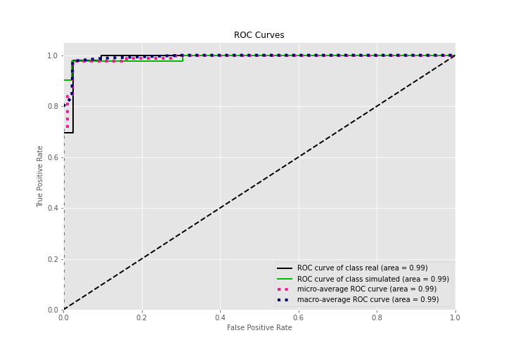
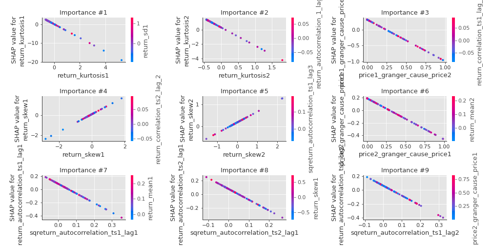

# Summary of 3_Linear

[<< Go back](../README.md)

## Logistic Regression (Linear)
- **n_jobs**: -1
- **explain_level**: 2

## Validation
 - **validation_type**: split
 - **train_ratio**: 0.75
 - **shuffle**: True
 - **stratify**: True

## Optimized metric
accuracy

## Training time

17.1 seconds

## Metric details
|           |    score |     threshold |
|:----------|---------:|--------------:|
| logloss   | 0.192527 | nan           |
| auc       | 0.990986 | nan           |
| f1        | 0.97561  |   0.474333    |
| accuracy  | 0.977011 |   0.474333    |
| precision | 1        |   0.735661    |
| recall    | 1        |   5.87908e-11 |
| mcc       | 0.953871 |   0.474333    |

## Confusion matrix (at threshold=0.474333)
|                      |   Predicted as real |   Predicted as simulated |
|:---------------------|--------------------:|-------------------------:|
| Labeled as real      |                  45 |                        1 |
| Labeled as simulated |                   1 |                       40 |

## Learning curves

## Coefficients
| feature                           |   Learner_1 |
|:----------------------------------|------------:|
| return_mean1                      |    0.975706 |
| return_skew1                      |    0.879683 |
| return_correlation_ts1_lag_0      |    0.772411 |
| sqreturn_correlation_ts1_lag_0    |    0.772411 |
| return_correlation_ts1_lag_1      |    0.708207 |
| sqreturn_correlation_ts1_lag_1    |    0.708207 |
| return_autocorrelation_2_lag2     |    0.675283 |
| return_autocorrelation_2_lag1     |    0.62691  |
| return_correlation_ts2_lag_1      |    0.626476 |
| sqreturn_correlation_ts2_lag_1    |    0.626476 |
| return_autocorrelation_1_lag1     |    0.575834 |
| return_skew2                      |    0.488929 |
| sqreturn_correlation_ts2_lag_2    |    0.463842 |
| return_correlation_ts2_lag_2      |    0.463842 |
| sqreturn_correlation_ts1_lag_2    |    0.462599 |
| return_correlation_ts1_lag_2      |    0.462599 |
| return_autocorrelation_2_lag3     |    0.455835 |
| sqreturn_correlation_ts1_lag_3    |    0.36883  |
| return_correlation_ts1_lag_3      |    0.36883  |
| return_autocorrelation_1_lag3     |    0.352794 |
| return_autocorrelation_1_lag2     |    0.314485 |
| return_correlation_ts2_lag_3      |    0.304668 |
| sqreturn_correlation_ts2_lag_3    |    0.304668 |
| return_sd1                        |    0.223962 |
| return_sd2                        |    0.013072 |
| return_mean2                      |   -0.477808 |
| price2_granger_cause_price1       |   -0.655614 |
| sqreturn_autocorrelation_ts2_lag3 |   -0.83038  |
| sqreturn_autocorrelation_ts1_lag3 |   -0.969145 |
| sqreturn_autocorrelation_ts2_lag2 |   -1.02267  |
| price1_granger_cause_price2       |   -1.317    |
| sqreturn_autocorrelation_ts1_lag2 |   -1.43024  |
| sqreturn_autocorrelation_ts1_lag1 |   -1.45035  |
| intercept                         |   -1.48496  |
| sqreturn_autocorrelation_ts2_lag1 |   -1.57189  |
| return_kurtosis2                  |   -2.53099  |
| return_kurtosis1                  |   -3.67702  |

## Permutation-based Importance

## Confusion Matrix

## Normalized Confusion Matrix

## ROC Curve

## Kolmogorov-Smirnov Statistic

## Precision-Recall Curve

## Calibration Curve

## Cumulative Gains Curve

## Lift Curve

## SHAP Importance

## SHAP Dependence plots

### Dependence (Fold 1)

## SHAP Decision plots

### Top-10 Worst decisions for class 0 (Fold 1)

### Top-10 Best decisions for class 0 (Fold 1)

### Top-10 Worst decisions for class 1 (Fold 1)

### Top-10 Best decisions for class 1 (Fold 1)

[<< Go back](../README.md)
