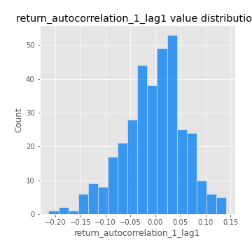
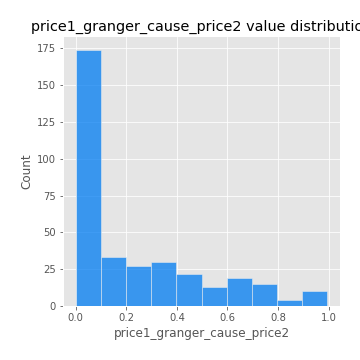

# Exploratory Data Analysis

[<< Go back](../README.md)
## Feature : target
- **Feature type** : categorical
- **Missing** : 0.0%
- **Unique** : 2
- **Count** :347
- **Unique** :2
- **Top** :real
- **Freq** :183

## Feature : return_mean1
- **Feature type** : continous
- **Missing** : 0.0%
- **Unique** : 347
- **Count** :347.0
- **Mean** :0.08135163006191905
- **Std** :0.08970050839963697
- **Min** :-0.22632637961920957
- **25%th Percentile** : 0.02555493627699502
- **50%th Percentile** : 0.0793011458129832
- **75%th Percentile** : 0.12389063430833396
- **Max** :0.4446448714709865

## Feature : return_mean2
- **Feature type** : continous
- **Missing** : 0.0%
- **Unique** : 347
- **Count** :347.0
- **Mean** :0.04710925573582207
- **Std** :0.09752314373441769
- **Min** :-0.24815640090186514
- **25%th Percentile** : -0.004948167495810054
- **50%th Percentile** : 0.05099701279202439
- **75%th Percentile** : 0.09957859037956274
- **Max** :0.4341920689634046

## Feature : return_sd1
- **Feature type** : continous
- **Missing** : 0.0%
- **Unique** : 347
- **Count** :347.0
- **Mean** :1.9036365399725506
- **Std** :0.7243925311772571
- **Min** :0.7470080772831957
- **25%th Percentile** : 1.6271228751864786
- **50%th Percentile** : 1.8644849489574424
- **75%th Percentile** : 1.9476313353496346
- **Max** :9.236766377527575

## Feature : return_sd2
- **Feature type** : continous
- **Missing** : 0.0%
- **Unique** : 347
- **Count** :347.0
- **Mean** :1.8629095966131715
- **Std** :0.6637845946721562
- **Min** :0.8592887433004143
- **25%th Percentile** : 1.5913104126821354
- **50%th Percentile** : 1.8091106145994358
- **75%th Percentile** : 1.8930947055985023
- **Max** :5.762808157208253

## Feature : return_skew1
- **Feature type** : continous
- **Missing** : 0.0%
- **Unique** : 347
- **Count** :347.0
- **Mean** :-0.1279844406534374
- **Std** :0.6279450988606814
- **Min** :-3.530116233761814
- **25%th Percentile** : -0.23999181075326756
- **50%th Percentile** : -0.03987191965901491
- **75%th Percentile** : 0.11844013856271704
- **Max** :2.5845963767725557

## Feature : return_skew2
- **Feature type** : continous
- **Missing** : 0.0%
- **Unique** : 347
- **Count** :347.0
- **Mean** :-0.1764551966859748
- **Std** :0.8527975919248022
- **Min** :-8.801502855292393
- **25%th Percentile** : -0.2860737399741948
- **50%th Percentile** : -0.061985967118078564
- **75%th Percentile** : 0.12959691577106158
- **Max** :2.2606839051517187

## Feature : return_kurtosis1
- **Feature type** : continous
- **Missing** : 0.0%
- **Unique** : 347
- **Count** :347.0
- **Mean** :3.668644849858652
- **Std** :6.316610103850411
- **Min** :-0.4048275349174748
- **25%th Percentile** : 0.24056449728645757
- **50%th Percentile** : 1.3297826391761158
- **75%th Percentile** : 3.9930614339876844
- **Max** :46.07507808162177

## Feature : return_kurtosis2
- **Feature type** : continous
- **Missing** : 0.0%
- **Unique** : 347
- **Count** :347.0
- **Mean** :4.5789871010629435
- **Std** :10.598888132536045
- **Min** :-0.4160671127631459
- **25%th Percentile** : 0.3800675036238408
- **50%th Percentile** : 1.5659528273509236
- **75%th Percentile** : 4.509524281407296
- **Max** :143.10871011533666

## Feature : return_autocorrelation_1_lag1
- **Feature type** : continous
- **Missing** : 0.0%
- **Unique** : 347
- **Count** :347.0
- **Mean** :-0.004226794484649084
- **Std** :0.06107366339575673
- **Min** :-0.2135576224968752
- **25%th Percentile** : -0.039780058043307795
- **50%th Percentile** : 0.0031323608899887882
- **75%th Percentile** : 0.033540559264537376
- **Max** :0.14132710750005578

## Feature : return_autocorrelation_1_lag2
- **Feature type** : continous
- **Missing** : 0.0%
- **Unique** : 347
- **Count** :347.0
- **Mean** :0.001874451888537581
- **Std** :0.05478915778912209
- **Min** :-0.13309283796645122
- **25%th Percentile** : -0.0329912998067401
- **50%th Percentile** : 0.0003661615583269806
- **75%th Percentile** : 0.035272831359123624
- **Max** :0.1561488228015672

## Feature : return_autocorrelation_1_lag3
- **Feature type** : continous
- **Missing** : 0.0%
- **Unique** : 347
- **Count** :347.0
- **Mean** :0.0065838583691719115
- **Std** :0.05242263454211408
- **Min** :-0.1940836867390813
- **25%th Percentile** : -0.028074393431145116
- **50%th Percentile** : 0.010237831540945567
- **75%th Percentile** : 0.0433104300684542
- **Max** :0.17805869530681923

## Feature : return_autocorrelation_2_lag1
- **Feature type** : continous
- **Missing** : 0.0%
- **Unique** : 347
- **Count** :347.0
- **Mean** :0.0029475821611156623
- **Std** :0.0640774317690185
- **Min** :-0.24590087874039124
- **25%th Percentile** : -0.0336071449499115
- **50%th Percentile** : 0.009456607610058105
- **75%th Percentile** : 0.04294762630760712
- **Max** :0.31863413537898483

## Feature : return_autocorrelation_2_lag2
- **Feature type** : continous
- **Missing** : 0.0%
- **Unique** : 347
- **Count** :347.0
- **Mean** :0.008791051084805298
- **Std** :0.05325560661678723
- **Min** :-0.13300063901033632
- **25%th Percentile** : -0.030026568016001235
- **50%th Percentile** : 0.0062061766555751895
- **75%th Percentile** : 0.04443089183314866
- **Max** :0.20974504043791217

## Feature : return_autocorrelation_2_lag3
- **Feature type** : continous
- **Missing** : 0.0%
- **Unique** : 347
- **Count** :347.0
- **Mean** :0.005285063303984881
- **Std** :0.05333397723759066
- **Min** :-0.14200107169559698
- **25%th Percentile** : -0.02753370803783281
- **50%th Percentile** : 0.006076462886470466
- **75%th Percentile** : 0.041633058128676424
- **Max** :0.1528706956768271

## Feature : return_correlation_ts1_lag_0
- **Feature type** : continous
- **Missing** : 0.0%
- **Unique** : 347
- **Count** :347.0
- **Mean** :0.3463284565821485
- **Std** :0.11668602834967963
- **Min** :-0.027089510445801036
- **25%th Percentile** : 0.29777046429887
- **50%th Percentile** : 0.3586107047625378
- **75%th Percentile** : 0.404567797459549
- **Max** :0.7041861626832071

## Feature : return_correlation_ts1_lag_1
- **Feature type** : continous
- **Missing** : 0.0%
- **Unique** : 347
- **Count** :347.0
- **Mean** :0.00355310702942007
- **Std** :0.055816777460965215
- **Min** :-0.16985510949917193
- **25%th Percentile** : -0.029144375436695763
- **50%th Percentile** : 0.005557129202355131
- **75%th Percentile** : 0.04297293007357825
- **Max** :0.15499424718508623

## Feature : return_correlation_ts1_lag_2
- **Feature type** : continous
- **Missing** : 0.0%
- **Unique** : 347
- **Count** :347.0
- **Mean** :0.007255245824905651
- **Std** :0.05165901074624978
- **Min** :-0.21653581047581763
- **25%th Percentile** : -0.02665461805093
- **50%th Percentile** : 0.010439191803824624
- **75%th Percentile** : 0.04223838477037893
- **Max** :0.1336583991578267

## Feature : return_correlation_ts1_lag_3
- **Feature type** : continous
- **Missing** : 0.0%
- **Unique** : 347
- **Count** :347.0
- **Mean** :0.007808013358913501
- **Std** :0.05355724801329367
- **Min** :-0.1288409059705338
- **25%th Percentile** : -0.025805790224176176
- **50%th Percentile** : 0.010719813820880242
- **75%th Percentile** : 0.04433340573385054
- **Max** :0.1636773216468148

## Feature : return_correlation_ts2_lag_1
- **Feature type** : continous
- **Missing** : 0.0%
- **Unique** : 347
- **Count** :347.0
- **Mean** :0.0029327353547342074
- **Std** :0.05590991339804015
- **Min** :-0.20093919236581337
- **25%th Percentile** : -0.030505645147937663
- **50%th Percentile** : 0.00468819680025162
- **75%th Percentile** : 0.03966445155261005
- **Max** :0.16347501818570886

## Feature : return_correlation_ts2_lag_2
- **Feature type** : continous
- **Missing** : 0.0%
- **Unique** : 347
- **Count** :347.0
- **Mean** :0.009693166805697253
- **Std** :0.04912851790173859
- **Min** :-0.15299951737180204
- **25%th Percentile** : -0.02531774600363481
- **50%th Percentile** : 0.008789670935894913
- **75%th Percentile** : 0.04093682693546457
- **Max** :0.20772887392904255

## Feature : return_correlation_ts2_lag_3
- **Feature type** : continous
- **Missing** : 0.0%
- **Unique** : 347
- **Count** :347.0
- **Mean** :0.006188823637375356
- **Std** :0.05358569480903492
- **Min** :-0.17564076057312866
- **25%th Percentile** : -0.021789451003863425
- **50%th Percentile** : 0.007815717087483463
- **75%th Percentile** : 0.042260017389617516
- **Max** :0.13128380114518473

## Feature : sqreturn_autocorrelation_ts1_lag1
- **Feature type** : continous
- **Missing** : 0.0%
- **Unique** : 347
- **Count** :347.0
- **Mean** :0.05164129577899982
- **Std** :0.09332626982573389
- **Min** :-0.11628939959814873
- **25%th Percentile** : -0.013600441041442968
- **50%th Percentile** : 0.028796089537889404
- **75%th Percentile** : 0.08734031096560474
- **Max** :0.4439086285737898

## Feature : sqreturn_autocorrelation_ts1_lag2
- **Feature type** : continous
- **Missing** : 0.0%
- **Unique** : 347
- **Count** :347.0
- **Mean** :0.04256364269917404
- **Std** :0.0935367846267835
- **Min** :-0.12789445283809037
- **25%th Percentile** : -0.0125280865027021
- **50%th Percentile** : 0.01567642475884366
- **75%th Percentile** : 0.06572588147611967
- **Max** :0.540735851444759

## Feature : sqreturn_autocorrelation_ts1_lag3
- **Feature type** : continous
- **Missing** : 0.0%
- **Unique** : 347
- **Count** :347.0
- **Mean** :0.03549943817438492
- **Std** :0.0826125442267736
- **Min** :-0.11268170197482366
- **25%th Percentile** : -0.014021903852205532
- **50%th Percentile** : 0.016546489321200404
- **75%th Percentile** : 0.06300278372234294
- **Max** :0.44755937369538146

## Feature : sqreturn_autocorrelation_ts2_lag1
- **Feature type** : continous
- **Missing** : 0.0%
- **Unique** : 347
- **Count** :347.0
- **Mean** :0.04865587609726191
- **Std** :0.08784661446595265
- **Min** :-0.11054386578897804
- **25%th Percentile** : -0.009827407467786913
- **50%th Percentile** : 0.02982522024063108
- **75%th Percentile** : 0.083660930017084
- **Max** :0.510085647437958

## Feature : sqreturn_autocorrelation_ts2_lag2
- **Feature type** : continous
- **Missing** : 0.0%
- **Unique** : 347
- **Count** :347.0
- **Mean** :0.04362488947495937
- **Std** :0.08857589401425738
- **Min** :-0.11788759835691337
- **25%th Percentile** : -0.010235102054409953
- **50%th Percentile** : 0.02220869683078531
- **75%th Percentile** : 0.06935269464771768
- **Max** :0.5373432415582473

## Feature : sqreturn_autocorrelation_ts2_lag3
- **Feature type** : continous
- **Missing** : 0.0%
- **Unique** : 347
- **Count** :347.0
- **Mean** :0.030910656967297764
- **Std** :0.06915156879872159
- **Min** :-0.1260247584099652
- **25%th Percentile** : -0.012887118392567218
- **50%th Percentile** : 0.017754331608716898
- **75%th Percentile** : 0.05860552217915736
- **Max** :0.31225727797735664

## Feature : sqreturn_correlation_ts1_lag_0
- **Feature type** : continous
- **Missing** : 0.0%
- **Unique** : 347
- **Count** :347.0
- **Mean** :0.3463284565821485
- **Std** :0.11668602834967963
- **Min** :-0.027089510445801036
- **25%th Percentile** : 0.29777046429887
- **50%th Percentile** : 0.3586107047625378
- **75%th Percentile** : 0.404567797459549
- **Max** :0.7041861626832071

## Feature : sqreturn_correlation_ts1_lag_1
- **Feature type** : continous
- **Missing** : 0.0%
- **Unique** : 347
- **Count** :347.0
- **Mean** :0.00355310702942007
- **Std** :0.055816777460965215
- **Min** :-0.16985510949917193
- **25%th Percentile** : -0.029144375436695763
- **50%th Percentile** : 0.005557129202355131
- **75%th Percentile** : 0.04297293007357825
- **Max** :0.15499424718508623

## Feature : sqreturn_correlation_ts1_lag_2
- **Feature type** : continous
- **Missing** : 0.0%
- **Unique** : 347
- **Count** :347.0
- **Mean** :0.007255245824905651
- **Std** :0.05165901074624978
- **Min** :-0.21653581047581763
- **25%th Percentile** : -0.02665461805093
- **50%th Percentile** : 0.010439191803824624
- **75%th Percentile** : 0.04223838477037893
- **Max** :0.1336583991578267

## Feature : sqreturn_correlation_ts1_lag_3
- **Feature type** : continous
- **Missing** : 0.0%
- **Unique** : 347
- **Count** :347.0
- **Mean** :0.007808013358913501
- **Std** :0.05355724801329367
- **Min** :-0.1288409059705338
- **25%th Percentile** : -0.025805790224176176
- **50%th Percentile** : 0.010719813820880242
- **75%th Percentile** : 0.04433340573385054
- **Max** :0.1636773216468148

## Feature : sqreturn_correlation_ts2_lag_1
- **Feature type** : continous
- **Missing** : 0.0%
- **Unique** : 347
- **Count** :347.0
- **Mean** :0.0029327353547342074
- **Std** :0.05590991339804015
- **Min** :-0.20093919236581337
- **25%th Percentile** : -0.030505645147937663
- **50%th Percentile** : 0.00468819680025162
- **75%th Percentile** : 0.03966445155261005
- **Max** :0.16347501818570886

## Feature : sqreturn_correlation_ts2_lag_2
- **Feature type** : continous
- **Missing** : 0.0%
- **Unique** : 347
- **Count** :347.0
- **Mean** :0.009693166805697253
- **Std** :0.04912851790173859
- **Min** :-0.15299951737180204
- **25%th Percentile** : -0.02531774600363481
- **50%th Percentile** : 0.008789670935894913
- **75%th Percentile** : 0.04093682693546457
- **Max** :0.20772887392904255

## Feature : sqreturn_correlation_ts2_lag_3
- **Feature type** : continous
- **Missing** : 0.0%
- **Unique** : 347
- **Count** :347.0
- **Mean** :0.006188823637375356
- **Std** :0.05358569480903492
- **Min** :-0.17564076057312866
- **25%th Percentile** : -0.021789451003863425
- **50%th Percentile** : 0.007815717087483463
- **75%th Percentile** : 0.042260017389617516
- **Max** :0.13128380114518473

## Feature : price2_granger_cause_price1
- **Feature type** : continous
- **Missing** : 0.0%
- **Unique** : 347
- **Count** :347.0
- **Mean** :0.2880838509222616
- **Std** :0.2866292234410117
- **Min** :3.44842093152579e-09
- **25%th Percentile** : 0.03828456643611847
- **50%th Percentile** : 0.18845811474378177
- **75%th Percentile** : 0.4863118215076281
- **Max** :0.9885712803689185

## Feature : price1_granger_cause_price2
- **Feature type** : continous
- **Missing** : 0.0%
- **Unique** : 347
- **Count** :347.0
- **Mean** :0.2279238316253998
- **Std** :0.2688674081479933
- **Min** :5.234102486008961e-13
- **25%th Percentile** : 0.005897614308454334
- **50%th Percentile** : 0.09621411770137972
- **75%th Percentile** : 0.3788034282809633
- **Max** :0.9951398266867577

[<< Go back](../README.md)
