# Summary of 2_DecisionTree

[<< Go back](../README.md)

## Decision Tree
- **n_jobs**: -1
- **criterion**: gini
- **max_depth**: 3
- **explain_level**: 2

## Validation
 - **validation_type**: split
 - **train_ratio**: 0.75
 - **shuffle**: True
 - **stratify**: True

## Optimized metric
accuracy

## Training time

18.8 seconds

## Metric details
|           |    score |   threshold |
|:----------|---------:|------------:|
| logloss   | 0.737845 |  nan        |
| auc       | 0.881871 |  nan        |
| f1        | 0.911111 |    0.504547 |
| accuracy  | 0.908046 |    0.504547 |
| precision | 0.891304 |    0.504547 |
| recall    | 1        |    0        |
| mcc       | 0.816835 |    0.504547 |

## Confusion matrix (at threshold=0.504547)
|                      |   Predicted as real |   Predicted as simulated |
|:---------------------|--------------------:|-------------------------:|
| Labeled as real      |                  38 |                        5 |
| Labeled as simulated |                   3 |                       41 |

## Learning curves
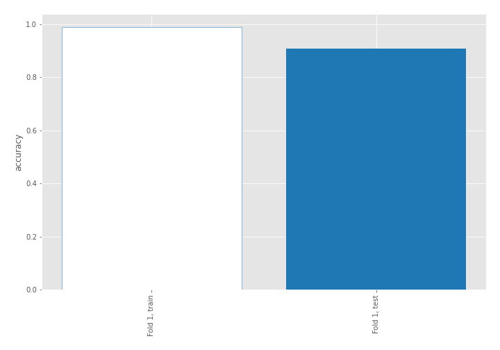

## Decision Tree 

### Tree #1
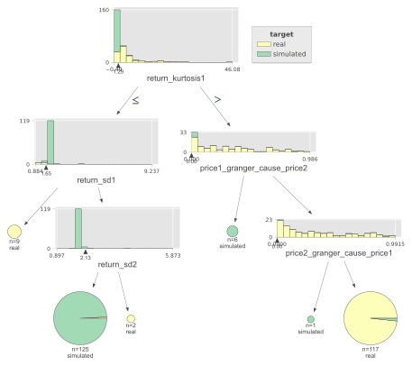

### Rules

if (return_kurtosis1 <= 1.292) and (return_sd1 > 1.653) and (return_sd2 <= 2.125) then class: simulated (proba: 99.2%) | based on 125 samples

if (return_kurtosis1 > 1.292) and (price1_granger_cause_price2 > 0.0) and (price2_granger_cause_price1 > 0.001) then class: real (proba: 98.29%) | based on 117 samples

if (return_kurtosis1 <= 1.292) and (return_sd1 <= 1.653) then class: real (proba: 100.0%) | based on 9 samples

if (return_kurtosis1 > 1.292) and (price1_granger_cause_price2 <= 0.0) then class: simulated (proba: 100.0%) | based on 6 samples

if (return_kurtosis1 <= 1.292) and (return_sd1 > 1.653) and (return_sd2 > 2.125) then class: real (proba: 100.0%) | based on 2 samples

if (return_kurtosis1 > 1.292) and (price1_granger_cause_price2 > 0.0) and (price2_granger_cause_price1 <= 0.001) then class: simulated (proba: 100.0%) | based on 1 samples

## Permutation-based Importance
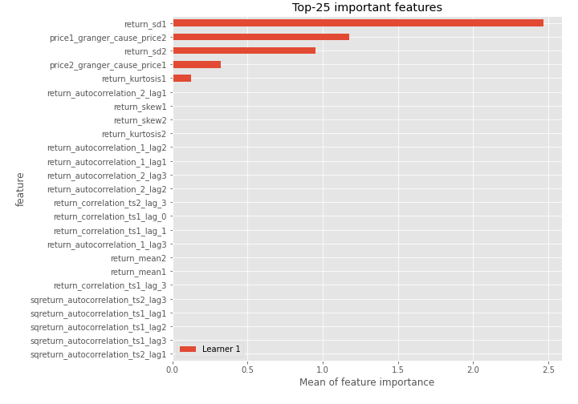
## Confusion Matrix

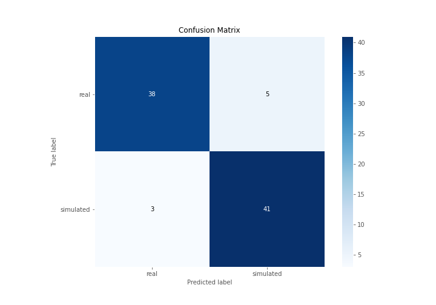

## Normalized Confusion Matrix

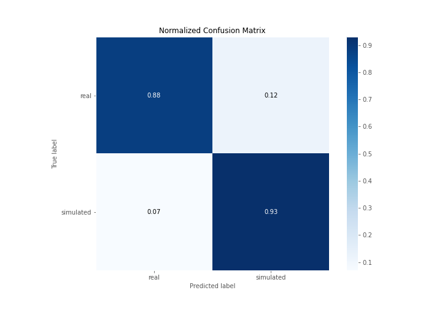

## ROC Curve

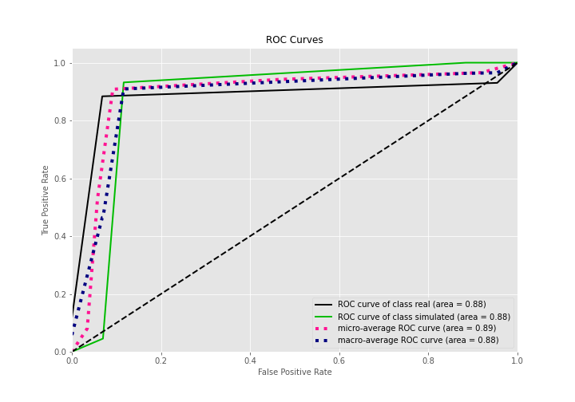

## Kolmogorov-Smirnov Statistic

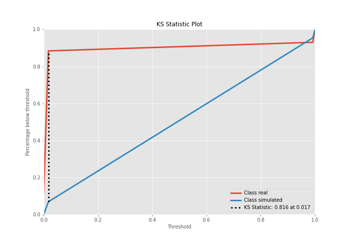

## Precision-Recall Curve

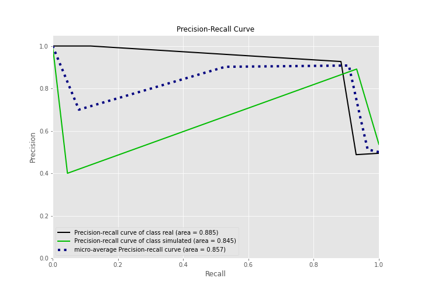

## Calibration Curve

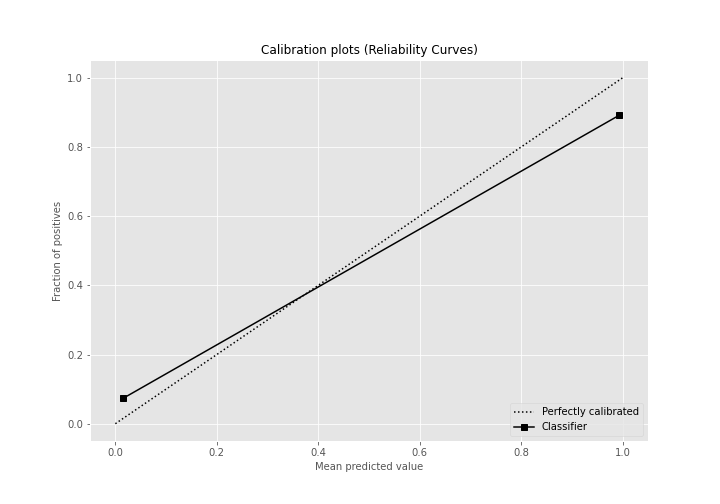

## Cumulative Gains Curve

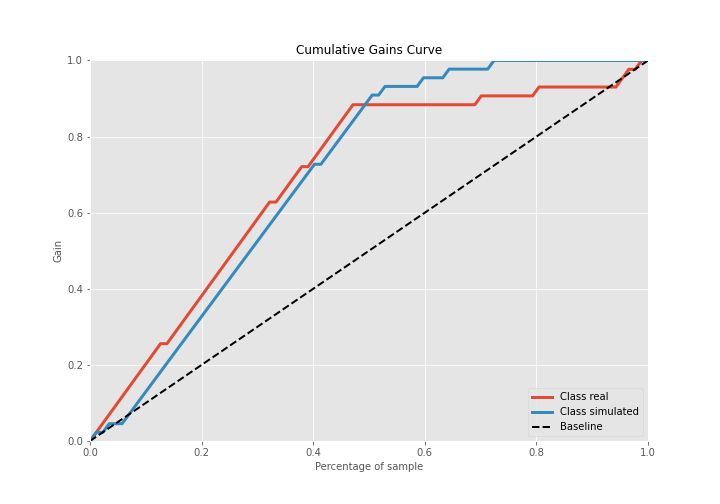

## Lift Curve

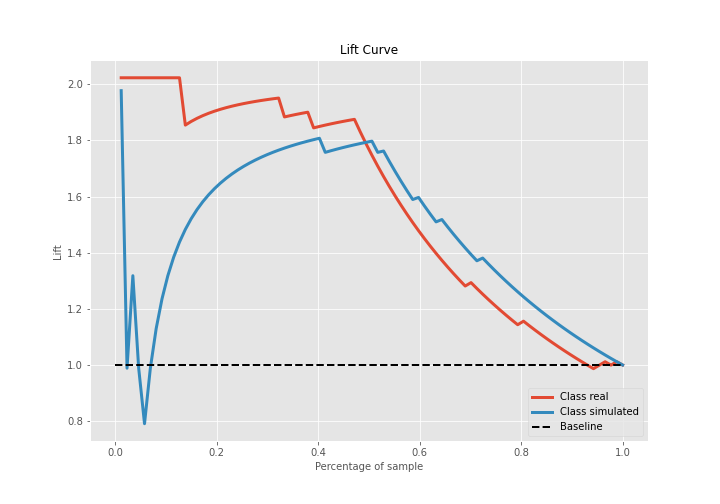

## SHAP Importance
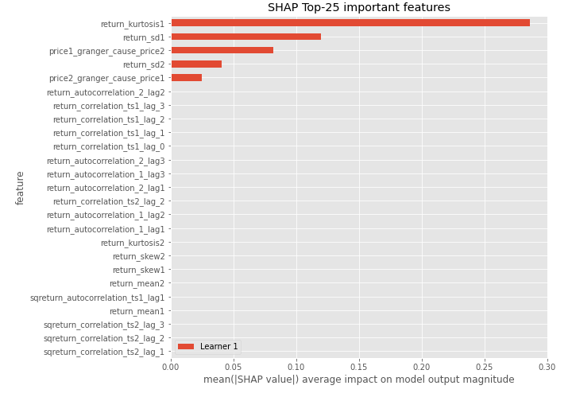

## SHAP Dependence plots

### Dependence (Fold 1)
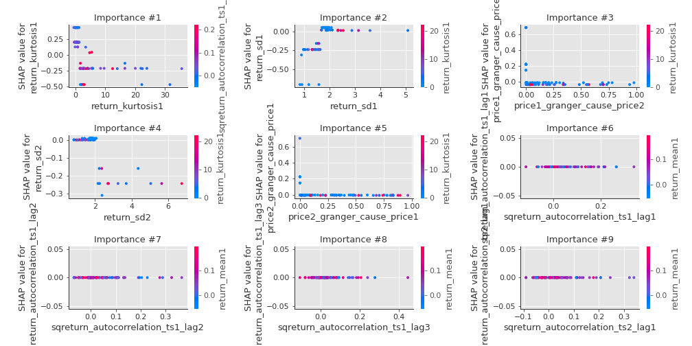

## SHAP Decision plots

### Top-10 Worst decisions for class 0 (Fold 1)
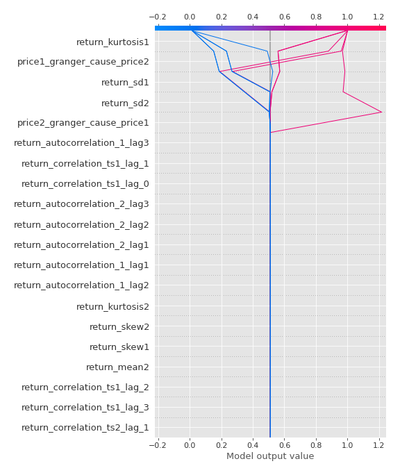
### Top-10 Best decisions for class 0 (Fold 1)
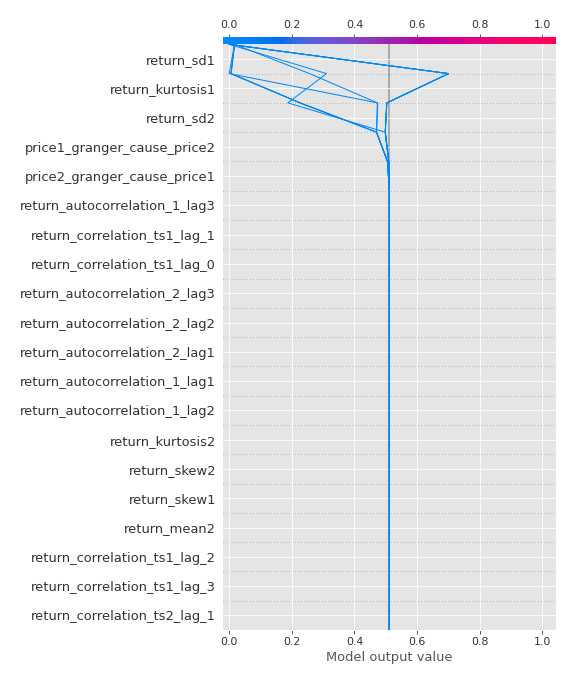
### Top-10 Worst decisions for class 1 (Fold 1)
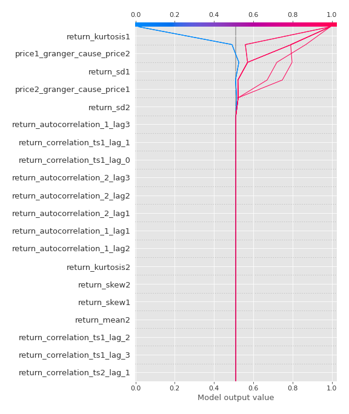
### Top-10 Best decisions for class 1 (Fold 1)
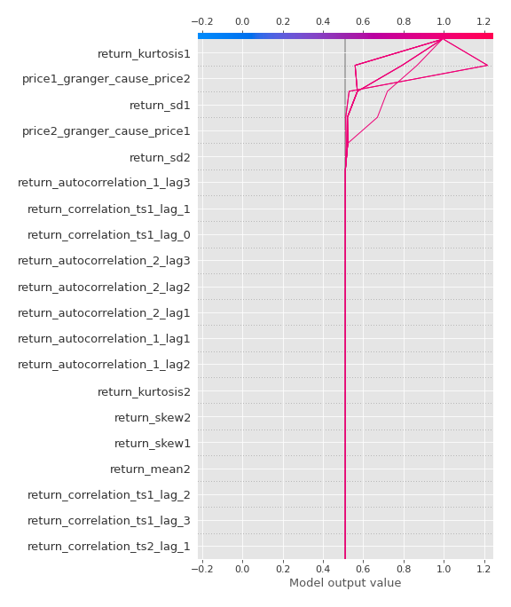

[<< Go back](../README.md)
