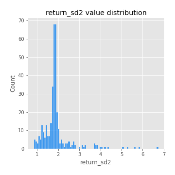
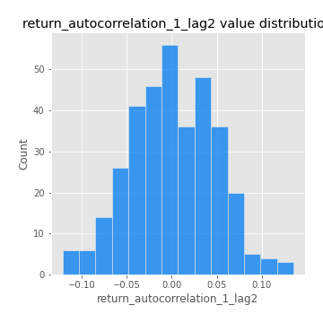

# Exploratory Data Analysis

[<< Go back](../README.md)
## Feature : target
- **Feature type** : categorical
- **Missing** : 0.0%
- **Unique** : 2
- **Count** :347
- **Unique** :2
- **Top** :simulated
- **Freq** :177

## Feature : return_mean1
- **Feature type** : continous
- **Missing** : 0.0%
- **Unique** : 347
- **Count** :347.0
- **Mean** :0.08236277283650525
- **Std** :0.08658764997059407
- **Min** :-0.22632637961920957
- **25%th Percentile** : 0.03536025303380608
- **50%th Percentile** : 0.0793011458129832
- **75%th Percentile** : 0.13197061791964848
- **Max** :0.37175100008111034

## Feature : return_mean2
- **Feature type** : continous
- **Missing** : 0.0%
- **Unique** : 347
- **Count** :347.0
- **Mean** :0.050864789464533974
- **Std** :0.09675418044869717
- **Min** :-0.2144814672643959
- **25%th Percentile** : -0.007898068480513706
- **50%th Percentile** : 0.047313553750560455
- **75%th Percentile** : 0.09785996068306571
- **Max** :0.5272251636343063

## Feature : return_sd1
- **Feature type** : continous
- **Missing** : 0.0%
- **Unique** : 347
- **Count** :347.0
- **Mean** :1.897057099208748
- **Std** :0.7259035455155888
- **Min** :0.8382061051466024
- **25%th Percentile** : 1.6613148468316
- **50%th Percentile** : 1.8547541021663054
- **75%th Percentile** : 1.936969058162109
- **Max** :9.236766377527575

## Feature : return_sd2
- **Feature type** : continous
- **Missing** : 0.0%
- **Unique** : 347
- **Count** :347.0
- **Mean** :1.9027171511932899
- **Std** :0.712897266461811
- **Min** :0.8455946193085045
- **25%th Percentile** : 1.6523437309660587
- **50%th Percentile** : 1.8238541383992672
- **75%th Percentile** : 1.9035538632373967
- **Max** :6.737618636746393

## Feature : return_skew1
- **Feature type** : continous
- **Missing** : 0.0%
- **Unique** : 347
- **Count** :347.0
- **Mean** :-0.1327430501522368
- **Std** :0.5874792344641572
- **Min** :-3.530116233761814
- **25%th Percentile** : -0.2596787222029533
- **50%th Percentile** : -0.039664855319331276
- **75%th Percentile** : 0.10029377094848597
- **Max** :2.5845963767725557

## Feature : return_skew2
- **Feature type** : continous
- **Missing** : 0.0%
- **Unique** : 347
- **Count** :347.0
- **Mean** :-0.16066794350241076
- **Std** :0.727002279769492
- **Min** :-5.778144124281153
- **25%th Percentile** : -0.30442403162343823
- **50%th Percentile** : -0.06356962241973688
- **75%th Percentile** : 0.12425874506559369
- **Max** :2.2606839051517187

## Feature : return_kurtosis1
- **Feature type** : continous
- **Missing** : 0.0%
- **Unique** : 347
- **Count** :347.0
- **Mean** :3.318538214830289
- **Std** :5.949881631301883
- **Min** :-0.5150445221458702
- **25%th Percentile** : 0.19651639761089124
- **50%th Percentile** : 1.1730981195410402
- **75%th Percentile** : 3.62603624026087
- **Max** :46.07507808162177

## Feature : return_kurtosis2
- **Feature type** : continous
- **Missing** : 0.0%
- **Unique** : 347
- **Count** :347.0
- **Mean** :4.2829298122581125
- **Std** :7.486819496304021
- **Min** :-0.37781305254261355
- **25%th Percentile** : 0.361863461228191
- **50%th Percentile** : 1.6759816258384803
- **75%th Percentile** : 4.796260923687616
- **Max** :71.39844769176813

## Feature : return_autocorrelation_1_lag1
- **Feature type** : continous
- **Missing** : 0.0%
- **Unique** : 347
- **Count** :347.0
- **Mean** :-0.003903928361756959
- **Std** :0.061241082766627486
- **Min** :-0.2135576224968752
- **25%th Percentile** : -0.036510452734058466
- **50%th Percentile** : 0.004264692603848277
- **75%th Percentile** : 0.03145575015255671
- **Max** :0.12810656890648087

## Feature : return_autocorrelation_1_lag2
- **Feature type** : continous
- **Missing** : 0.0%
- **Unique** : 347
- **Count** :347.0
- **Mean** :0.0008705138755875574
- **Std** :0.04735029161821387
- **Min** :-0.12172858720259
- **25%th Percentile** : -0.033894335010256835
- **50%th Percentile** : 0.00014326011491862313
- **75%th Percentile** : 0.0336541603196491
- **Max** :0.13553587149024285

## Feature : return_autocorrelation_1_lag3
- **Feature type** : continous
- **Missing** : 0.0%
- **Unique** : 347
- **Count** :347.0
- **Mean** :0.008023560188889348
- **Std** :0.05407039263320323
- **Min** :-0.1940836867390813
- **25%th Percentile** : -0.02535076551042865
- **50%th Percentile** : 0.004788560599982717
- **75%th Percentile** : 0.044835006492909085
- **Max** :0.17805869530681923

## Feature : return_autocorrelation_2_lag1
- **Feature type** : continous
- **Missing** : 0.0%
- **Unique** : 347
- **Count** :347.0
- **Mean** :0.0041777343582673826
- **Std** :0.06532061232159632
- **Min** :-0.24590087874039124
- **25%th Percentile** : -0.029802578855334348
- **50%th Percentile** : 0.012714737294129088
- **75%th Percentile** : 0.04460197124778123
- **Max** :0.31863413537898483

## Feature : return_autocorrelation_2_lag2
- **Feature type** : continous
- **Missing** : 0.0%
- **Unique** : 347
- **Count** :347.0
- **Mean** :0.009472423765490366
- **Std** :0.055357762327152435
- **Min** :-0.15323211089747296
- **25%th Percentile** : -0.031863046304821493
- **50%th Percentile** : 0.009903459602465
- **75%th Percentile** : 0.042134186488661615
- **Max** :0.20974504043791217

## Feature : return_autocorrelation_2_lag3
- **Feature type** : continous
- **Missing** : 0.0%
- **Unique** : 347
- **Count** :347.0
- **Mean** :0.011932799810245413
- **Std** :0.05167667434207261
- **Min** :-0.14200107169559698
- **25%th Percentile** : -0.017947328788763643
- **50%th Percentile** : 0.012377620832973443
- **75%th Percentile** : 0.044614467761375606
- **Max** :0.181145209498058

## Feature : return_correlation_ts1_lag_0
- **Feature type** : continous
- **Missing** : 0.0%
- **Unique** : 347
- **Count** :347.0
- **Mean** :0.34391558991437804
- **Std** :0.1125819345744384
- **Min** :-0.027089510445801036
- **25%th Percentile** : 0.29556047839194877
- **50%th Percentile** : 0.36084213231741136
- **75%th Percentile** : 0.41343401440987015
- **Max** :0.7041861626832071

## Feature : return_correlation_ts1_lag_1
- **Feature type** : continous
- **Missing** : 0.0%
- **Unique** : 347
- **Count** :347.0
- **Mean** :0.00664368620080916
- **Std** :0.05419037497723027
- **Min** :-0.16985510949917193
- **25%th Percentile** : -0.029248722319784357
- **50%th Percentile** : 0.008678756011446463
- **75%th Percentile** : 0.04343549119119389
- **Max** :0.15499424718508623

## Feature : return_correlation_ts1_lag_2
- **Feature type** : continous
- **Missing** : 0.0%
- **Unique** : 347
- **Count** :347.0
- **Mean** :0.0036979290393845056
- **Std** :0.04910552739214634
- **Min** :-0.21653581047581763
- **25%th Percentile** : -0.02989380310957896
- **50%th Percentile** : 0.0016583588001591704
- **75%th Percentile** : 0.038770139964563605
- **Max** :0.15826077279858441

## Feature : return_correlation_ts1_lag_3
- **Feature type** : continous
- **Missing** : 0.0%
- **Unique** : 347
- **Count** :347.0
- **Mean** :0.012116757683747485
- **Std** :0.052988013147648866
- **Min** :-0.12306593817498207
- **25%th Percentile** : -0.021449959272189394
- **50%th Percentile** : 0.009968678623312103
- **75%th Percentile** : 0.04760526324155413
- **Max** :0.19834645768101333

## Feature : return_correlation_ts2_lag_1
- **Feature type** : continous
- **Missing** : 0.0%
- **Unique** : 347
- **Count** :347.0
- **Mean** :0.005466133310012366
- **Std** :0.05718913596465221
- **Min** :-0.2081139431093261
- **25%th Percentile** : -0.03076488436964185
- **50%th Percentile** : 0.0069091566983762375
- **75%th Percentile** : 0.04391395499963825
- **Max** :0.16257646977760773

## Feature : return_correlation_ts2_lag_2
- **Feature type** : continous
- **Missing** : 0.0%
- **Unique** : 347
- **Count** :347.0
- **Mean** :0.006645198925040924
- **Std** :0.04936008464386148
- **Min** :-0.23751835475804678
- **25%th Percentile** : -0.020820666544710015
- **50%th Percentile** : 0.006274099574710472
- **75%th Percentile** : 0.03655874885576438
- **Max** :0.15500084419783888

## Feature : return_correlation_ts2_lag_3
- **Feature type** : continous
- **Missing** : 0.0%
- **Unique** : 347
- **Count** :347.0
- **Mean** :0.01514263845196807
- **Std** :0.05116117109268865
- **Min** :-0.15490495486968472
- **25%th Percentile** : -0.01597201469579384
- **50%th Percentile** : 0.015016898604519425
- **75%th Percentile** : 0.05086171704743743
- **Max** :0.14906155832037282

## Feature : sqreturn_autocorrelation_ts1_lag1
- **Feature type** : continous
- **Missing** : 0.0%
- **Unique** : 347
- **Count** :347.0
- **Mean** :0.053516988237017823
- **Std** :0.09270613543750557
- **Min** :-0.11453981728982936
- **25%th Percentile** : -0.0072283572725882084
- **50%th Percentile** : 0.030371069946436353
- **75%th Percentile** : 0.0879243935161117
- **Max** :0.49414293176447355

## Feature : sqreturn_autocorrelation_ts1_lag2
- **Feature type** : continous
- **Missing** : 0.0%
- **Unique** : 347
- **Count** :347.0
- **Mean** :0.04307187705530991
- **Std** :0.09123396155314459
- **Min** :-0.0940242880570514
- **25%th Percentile** : -0.010293103050855554
- **50%th Percentile** : 0.01626135840334948
- **75%th Percentile** : 0.06671149386051531
- **Max** :0.540735851444759

## Feature : sqreturn_autocorrelation_ts1_lag3
- **Feature type** : continous
- **Missing** : 0.0%
- **Unique** : 347
- **Count** :347.0
- **Mean** :0.035764072411659874
- **Std** :0.08249083011776964
- **Min** :-0.10526476506197317
- **25%th Percentile** : -0.014868005362252135
- **50%th Percentile** : 0.01927985098606797
- **75%th Percentile** : 0.05496456686710034
- **Max** :0.44755937369538146

## Feature : sqreturn_autocorrelation_ts2_lag1
- **Feature type** : continous
- **Missing** : 0.0%
- **Unique** : 347
- **Count** :347.0
- **Mean** :0.045920635754967604
- **Std** :0.08895301078395801
- **Min** :-0.09238313033459779
- **25%th Percentile** : -0.013556665939404954
- **50%th Percentile** : 0.025695549370206412
- **75%th Percentile** : 0.07464678766495364
- **Max** :0.510085647437958

## Feature : sqreturn_autocorrelation_ts2_lag2
- **Feature type** : continous
- **Missing** : 0.0%
- **Unique** : 347
- **Count** :347.0
- **Mean** :0.0367475846817445
- **Std** :0.0867963404541192
- **Min** :-0.14376393143370522
- **25%th Percentile** : -0.013924086494652469
- **50%th Percentile** : 0.012375866706371325
- **75%th Percentile** : 0.053790087741862405
- **Max** :0.5373432415582473

## Feature : sqreturn_autocorrelation_ts2_lag3
- **Feature type** : continous
- **Missing** : 0.0%
- **Unique** : 347
- **Count** :347.0
- **Mean** :0.025276714197892947
- **Std** :0.0672555990949677
- **Min** :-0.1137758607993114
- **25%th Percentile** : -0.016146837066040785
- **50%th Percentile** : 0.010183227334158442
- **75%th Percentile** : 0.04612240031314967
- **Max** :0.30256115637327263

## Feature : sqreturn_correlation_ts1_lag_0
- **Feature type** : continous
- **Missing** : 0.0%
- **Unique** : 347
- **Count** :347.0
- **Mean** :0.34391558991437804
- **Std** :0.1125819345744384
- **Min** :-0.027089510445801036
- **25%th Percentile** : 0.29556047839194877
- **50%th Percentile** : 0.36084213231741136
- **75%th Percentile** : 0.41343401440987015
- **Max** :0.7041861626832071

## Feature : sqreturn_correlation_ts1_lag_1
- **Feature type** : continous
- **Missing** : 0.0%
- **Unique** : 347
- **Count** :347.0
- **Mean** :0.00664368620080916
- **Std** :0.05419037497723027
- **Min** :-0.16985510949917193
- **25%th Percentile** : -0.029248722319784357
- **50%th Percentile** : 0.008678756011446463
- **75%th Percentile** : 0.04343549119119389
- **Max** :0.15499424718508623

## Feature : sqreturn_correlation_ts1_lag_2
- **Feature type** : continous
- **Missing** : 0.0%
- **Unique** : 347
- **Count** :347.0
- **Mean** :0.0036979290393845056
- **Std** :0.04910552739214634
- **Min** :-0.21653581047581763
- **25%th Percentile** : -0.02989380310957896
- **50%th Percentile** : 0.0016583588001591704
- **75%th Percentile** : 0.038770139964563605
- **Max** :0.15826077279858441

## Feature : sqreturn_correlation_ts1_lag_3
- **Feature type** : continous
- **Missing** : 0.0%
- **Unique** : 347
- **Count** :347.0
- **Mean** :0.012116757683747485
- **Std** :0.052988013147648866
- **Min** :-0.12306593817498207
- **25%th Percentile** : -0.021449959272189394
- **50%th Percentile** : 0.009968678623312103
- **75%th Percentile** : 0.04760526324155413
- **Max** :0.19834645768101333

## Feature : sqreturn_correlation_ts2_lag_1
- **Feature type** : continous
- **Missing** : 0.0%
- **Unique** : 347
- **Count** :347.0
- **Mean** :0.005466133310012366
- **Std** :0.05718913596465221
- **Min** :-0.2081139431093261
- **25%th Percentile** : -0.03076488436964185
- **50%th Percentile** : 0.0069091566983762375
- **75%th Percentile** : 0.04391395499963825
- **Max** :0.16257646977760773

## Feature : sqreturn_correlation_ts2_lag_2
- **Feature type** : continous
- **Missing** : 0.0%
- **Unique** : 347
- **Count** :347.0
- **Mean** :0.006645198925040924
- **Std** :0.04936008464386148
- **Min** :-0.23751835475804678
- **25%th Percentile** : -0.020820666544710015
- **50%th Percentile** : 0.006274099574710472
- **75%th Percentile** : 0.03655874885576438
- **Max** :0.15500084419783888

## Feature : sqreturn_correlation_ts2_lag_3
- **Feature type** : continous
- **Missing** : 0.0%
- **Unique** : 347
- **Count** :347.0
- **Mean** :0.01514263845196807
- **Std** :0.05116117109268865
- **Min** :-0.15490495486968472
- **25%th Percentile** : -0.01597201469579384
- **50%th Percentile** : 0.015016898604519425
- **75%th Percentile** : 0.05086171704743743
- **Max** :0.14906155832037282

## Feature : price2_granger_cause_price1
- **Feature type** : continous
- **Missing** : 0.0%
- **Unique** : 347
- **Count** :347.0
- **Mean** :0.27071530332215904
- **Std** :0.2809278811587122
- **Min** :1.8276900781986826e-08
- **25%th Percentile** : 0.032324169426242
- **50%th Percentile** : 0.15894523573871971
- **75%th Percentile** : 0.45129226550629864
- **Max** :0.9914661801466478

## Feature : price1_granger_cause_price2
- **Feature type** : continous
- **Missing** : 0.0%
- **Unique** : 347
- **Count** :347.0
- **Mean** :0.1955910703264811
- **Std** :0.26047971931953384
- **Min** :3.939962890995524e-12
- **25%th Percentile** : 0.0013537569280404403
- **50%th Percentile** : 0.05842970145901395
- **75%th Percentile** : 0.30873130582747194
- **Max** :0.9860859807803883

[<< Go back](../README.md)
