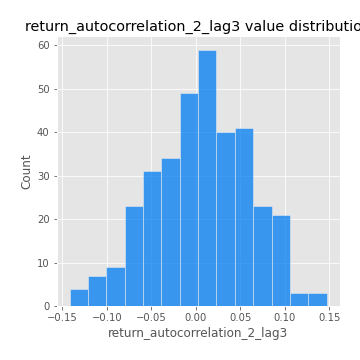
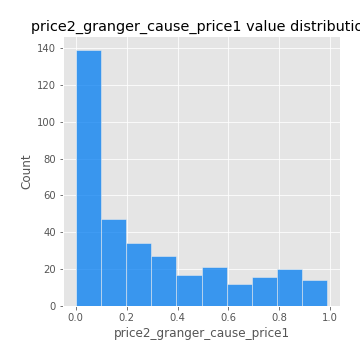

# Exploratory Data Analysis

[<< Go back](../README.md)
## Feature : target
- **Feature type** : categorical
- **Missing** : 0.0%
- **Unique** : 2
- **Count** :347
- **Unique** :2
- **Top** :simulated
- **Freq** :174

## Feature : return_mean1
- **Feature type** : continous
- **Missing** : 0.0%
- **Unique** : 347
- **Count** :347.0
- **Mean** :0.08369193967862437
- **Std** :0.08737080440073768
- **Min** :-0.22632637961920957
- **25%th Percentile** : 0.03197126413106608
- **50%th Percentile** : 0.0800870163237768
- **75%th Percentile** : 0.13847831929789162
- **Max** :0.37175100008111034

## Feature : return_mean2
- **Feature type** : continous
- **Missing** : 0.0%
- **Unique** : 347
- **Count** :347.0
- **Mean** :0.05654657134950708
- **Std** :0.09792399710183247
- **Min** :-0.2719192576430847
- **25%th Percentile** : 0.004575731148152826
- **50%th Percentile** : 0.05807570450544911
- **75%th Percentile** : 0.11304839396916339
- **Max** :0.5035964189981239

## Feature : return_sd1
- **Feature type** : continous
- **Missing** : 0.0%
- **Unique** : 347
- **Count** :347.0
- **Mean** :1.9238753786107945
- **Std** :0.752807324445934
- **Min** :0.7620831696941981
- **25%th Percentile** : 1.6703461105138246
- **50%th Percentile** : 1.8648987400727592
- **75%th Percentile** : 1.9455339271036407
- **Max** :9.236766377527575

## Feature : return_sd2
- **Feature type** : continous
- **Missing** : 0.0%
- **Unique** : 347
- **Count** :347.0
- **Mean** :1.8868665051525921
- **Std** :0.6665023509726997
- **Min** :0.8592887433004143
- **25%th Percentile** : 1.6305473706656817
- **50%th Percentile** : 1.8191232522081813
- **75%th Percentile** : 1.91380968751846
- **Max** :6.737618636746393

## Feature : return_skew1
- **Feature type** : continous
- **Missing** : 0.0%
- **Unique** : 347
- **Count** :347.0
- **Mean** :-0.08965663263058699
- **Std** :0.6189229621044984
- **Min** :-3.530116233761814
- **25%th Percentile** : -0.21009903602353627
- **50%th Percentile** : -0.021808600897521912
- **75%th Percentile** : 0.12200647012804902
- **Max** :2.5845963767725557

## Feature : return_skew2
- **Feature type** : continous
- **Missing** : 0.0%
- **Unique** : 347
- **Count** :347.0
- **Mean** :-0.13859569917381545
- **Std** :0.6225571701352601
- **Min** :-3.436088288137694
- **25%th Percentile** : -0.30206739427313556
- **50%th Percentile** : -0.06524477192000544
- **75%th Percentile** : 0.1149849321325501
- **Max** :2.2606839051517187

## Feature : return_kurtosis1
- **Feature type** : continous
- **Missing** : 0.0%
- **Unique** : 347
- **Count** :347.0
- **Mean** :3.504366907888816
- **Std** :6.0482816039341625
- **Min** :-0.41212491400539086
- **25%th Percentile** : 0.20841198333477928
- **50%th Percentile** : 1.1580919336635707
- **75%th Percentile** : 4.009156393045629
- **Max** :36.91113889081053

## Feature : return_kurtosis2
- **Feature type** : continous
- **Missing** : 0.0%
- **Unique** : 347
- **Count** :347.0
- **Mean** :3.838960800314645
- **Std** :5.986665296648404
- **Min** :-0.4338056280894409
- **25%th Percentile** : 0.38249670007419545
- **50%th Percentile** : 1.564186275378479
- **75%th Percentile** : 4.3840343020263415
- **Max** :36.023880269969645

## Feature : return_autocorrelation_1_lag1
- **Feature type** : continous
- **Missing** : 0.0%
- **Unique** : 347
- **Count** :347.0
- **Mean** :-0.007495490806154606
- **Std** :0.059083509669398515
- **Min** :-0.2135576224968752
- **25%th Percentile** : -0.03654790664024178
- **50%th Percentile** : -0.0037624471867330595
- **75%th Percentile** : 0.030291279064517326
- **Max** :0.1293242192746881

## Feature : return_autocorrelation_1_lag2
- **Feature type** : continous
- **Missing** : 0.0%
- **Unique** : 347
- **Count** :347.0
- **Mean** :0.0004842563021531487
- **Std** :0.05043258750632962
- **Min** :-0.12172858720259
- **25%th Percentile** : -0.031003074344610457
- **50%th Percentile** : 0.0007051414831206275
- **75%th Percentile** : 0.032222761653582024
- **Max** :0.1561488228015672

## Feature : return_autocorrelation_1_lag3
- **Feature type** : continous
- **Missing** : 0.0%
- **Unique** : 347
- **Count** :347.0
- **Mean** :0.0029213784220891476
- **Std** :0.05247389572259433
- **Min** :-0.1940836867390813
- **25%th Percentile** : -0.027811712630099787
- **50%th Percentile** : 0.005873073413312456
- **75%th Percentile** : 0.03646794792755828
- **Max** :0.17805869530681923

## Feature : return_autocorrelation_2_lag1
- **Feature type** : continous
- **Missing** : 0.0%
- **Unique** : 347
- **Count** :347.0
- **Mean** :0.003913353043087928
- **Std** :0.06207107065582137
- **Min** :-0.25075531010123286
- **25%th Percentile** : -0.026901264377911425
- **50%th Percentile** : 0.009707075541884803
- **75%th Percentile** : 0.043756307107960996
- **Max** :0.16349871797309318

## Feature : return_autocorrelation_2_lag2
- **Feature type** : continous
- **Missing** : 0.0%
- **Unique** : 347
- **Count** :347.0
- **Mean** :0.0086617516247298
- **Std** :0.05334186744246141
- **Min** :-0.15323211089747296
- **25%th Percentile** : -0.031863046304821493
- **50%th Percentile** : 0.00725134453875335
- **75%th Percentile** : 0.047069326793395615
- **Max** :0.1735398560230086

## Feature : return_autocorrelation_2_lag3
- **Feature type** : continous
- **Missing** : 0.0%
- **Unique** : 347
- **Count** :347.0
- **Mean** :0.005924613983771347
- **Std** :0.05396475197580077
- **Min** :-0.14200107169559698
- **25%th Percentile** : -0.027888686191798573
- **50%th Percentile** : 0.008542090710160917
- **75%th Percentile** : 0.04508017517796142
- **Max** :0.1468332559925586

## Feature : return_correlation_ts1_lag_0
- **Feature type** : continous
- **Missing** : 0.0%
- **Unique** : 347
- **Count** :347.0
- **Mean** :0.35040994442155915
- **Std** :0.116147296049199
- **Min** :-0.027089510445801036
- **25%th Percentile** : 0.3083566981334097
- **50%th Percentile** : 0.36482787816618356
- **75%th Percentile** : 0.40886056841480134
- **Max** :0.7041861626832071

## Feature : return_correlation_ts1_lag_1
- **Feature type** : continous
- **Missing** : 0.0%
- **Unique** : 347
- **Count** :347.0
- **Mean** :0.0017299347774219773
- **Std** :0.05326234936187656
- **Min** :-0.16985510949917193
- **25%th Percentile** : -0.032186483279437975
- **50%th Percentile** : 0.006113250164646503
- **75%th Percentile** : 0.03849565954057756
- **Max** :0.15977598733858847

## Feature : return_correlation_ts1_lag_2
- **Feature type** : continous
- **Missing** : 0.0%
- **Unique** : 347
- **Count** :347.0
- **Mean** :0.004934994744571186
- **Std** :0.04843369542445103
- **Min** :-0.21653581047581763
- **25%th Percentile** : -0.02648779338106623
- **50%th Percentile** : 0.0021618620295670503
- **75%th Percentile** : 0.04231094401082782
- **Max** :0.14194259509588716

## Feature : return_correlation_ts1_lag_3
- **Feature type** : continous
- **Missing** : 0.0%
- **Unique** : 347
- **Count** :347.0
- **Mean** :0.007263869138660491
- **Std** :0.051670107729236296
- **Min** :-0.1270218498974763
- **25%th Percentile** : -0.02739558461813578
- **50%th Percentile** : 0.008606126968461924
- **75%th Percentile** : 0.04629114578142211
- **Max** :0.1436571462833919

## Feature : return_correlation_ts2_lag_1
- **Feature type** : continous
- **Missing** : 0.0%
- **Unique** : 347
- **Count** :347.0
- **Mean** :0.004066012657158103
- **Std** :0.05253032317757854
- **Min** :-0.19671969155495325
- **25%th Percentile** : -0.029506011878126844
- **50%th Percentile** : 0.00822484917473478
- **75%th Percentile** : 0.0378144585504111
- **Max** :0.14639163638155017

## Feature : return_correlation_ts2_lag_2
- **Feature type** : continous
- **Missing** : 0.0%
- **Unique** : 347
- **Count** :347.0
- **Mean** :0.006910351859802782
- **Std** :0.051914606601948514
- **Min** :-0.23751835475804678
- **25%th Percentile** : -0.02554626882816337
- **50%th Percentile** : 0.004624144408871608
- **75%th Percentile** : 0.04060935055180673
- **Max** :0.20772887392904255

## Feature : return_correlation_ts2_lag_3
- **Feature type** : continous
- **Missing** : 0.0%
- **Unique** : 347
- **Count** :347.0
- **Mean** :0.00610470732325452
- **Std** :0.05183621527896542
- **Min** :-0.17564076057312866
- **25%th Percentile** : -0.02597100432801512
- **50%th Percentile** : 0.005482077127536081
- **75%th Percentile** : 0.04334003758546649
- **Max** :0.12578577770423086

## Feature : sqreturn_autocorrelation_ts1_lag1
- **Feature type** : continous
- **Missing** : 0.0%
- **Unique** : 347
- **Count** :347.0
- **Mean** :0.053795402570738844
- **Std** :0.09329628608817503
- **Min** :-0.08496224892915205
- **25%th Percentile** : -0.009358964157765961
- **50%th Percentile** : 0.02646910530292259
- **75%th Percentile** : 0.0888127248600663
- **Max** :0.4439086285737898

## Feature : sqreturn_autocorrelation_ts1_lag2
- **Feature type** : continous
- **Missing** : 0.0%
- **Unique** : 347
- **Count** :347.0
- **Mean** :0.04584921554749971
- **Std** :0.09731254675116172
- **Min** :-0.12061582105445444
- **25%th Percentile** : -0.014115238917580071
- **50%th Percentile** : 0.022317839758589822
- **75%th Percentile** : 0.07497081683023984
- **Max** :0.540735851444759

## Feature : sqreturn_autocorrelation_ts1_lag3
- **Feature type** : continous
- **Missing** : 0.0%
- **Unique** : 347
- **Count** :347.0
- **Mean** :0.036976188012519284
- **Std** :0.08467729550997437
- **Min** :-0.10454539724110437
- **25%th Percentile** : -0.01576939561046645
- **50%th Percentile** : 0.014106261936845383
- **75%th Percentile** : 0.06578617238383039
- **Max** :0.44755937369538146

## Feature : sqreturn_autocorrelation_ts2_lag1
- **Feature type** : continous
- **Missing** : 0.0%
- **Unique** : 347
- **Count** :347.0
- **Mean** :0.045028249740252414
- **Std** :0.08607250184451534
- **Min** :-0.10362812992122893
- **25%th Percentile** : -0.010769047955056517
- **50%th Percentile** : 0.02371064480804844
- **75%th Percentile** : 0.0800553650747687
- **Max** :0.510085647437958

## Feature : sqreturn_autocorrelation_ts2_lag2
- **Feature type** : continous
- **Missing** : 0.0%
- **Unique** : 347
- **Count** :347.0
- **Mean** :0.041365056097936816
- **Std** :0.08776381716287515
- **Min** :-0.08171095312614468
- **25%th Percentile** : -0.010807620834657888
- **50%th Percentile** : 0.017910399080895156
- **75%th Percentile** : 0.06073994788421799
- **Max** :0.5373432415582473

## Feature : sqreturn_autocorrelation_ts2_lag3
- **Feature type** : continous
- **Missing** : 0.0%
- **Unique** : 347
- **Count** :347.0
- **Mean** :0.02940902355147082
- **Std** :0.06960603157501172
- **Min** :-0.08569115559707023
- **25%th Percentile** : -0.014573826625300821
- **50%th Percentile** : 0.01369761785042116
- **75%th Percentile** : 0.054638027281812246
- **Max** :0.31225727797735664

## Feature : sqreturn_correlation_ts1_lag_0
- **Feature type** : continous
- **Missing** : 0.0%
- **Unique** : 347
- **Count** :347.0
- **Mean** :0.35040994442155915
- **Std** :0.116147296049199
- **Min** :-0.027089510445801036
- **25%th Percentile** : 0.3083566981334097
- **50%th Percentile** : 0.36482787816618356
- **75%th Percentile** : 0.40886056841480134
- **Max** :0.7041861626832071

## Feature : sqreturn_correlation_ts1_lag_1
- **Feature type** : continous
- **Missing** : 0.0%
- **Unique** : 347
- **Count** :347.0
- **Mean** :0.0017299347774219773
- **Std** :0.05326234936187656
- **Min** :-0.16985510949917193
- **25%th Percentile** : -0.032186483279437975
- **50%th Percentile** : 0.006113250164646503
- **75%th Percentile** : 0.03849565954057756
- **Max** :0.15977598733858847

## Feature : sqreturn_correlation_ts1_lag_2
- **Feature type** : continous
- **Missing** : 0.0%
- **Unique** : 347
- **Count** :347.0
- **Mean** :0.004934994744571186
- **Std** :0.04843369542445103
- **Min** :-0.21653581047581763
- **25%th Percentile** : -0.02648779338106623
- **50%th Percentile** : 0.0021618620295670503
- **75%th Percentile** : 0.04231094401082782
- **Max** :0.14194259509588716

## Feature : sqreturn_correlation_ts1_lag_3
- **Feature type** : continous
- **Missing** : 0.0%
- **Unique** : 347
- **Count** :347.0
- **Mean** :0.007263869138660491
- **Std** :0.051670107729236296
- **Min** :-0.1270218498974763
- **25%th Percentile** : -0.02739558461813578
- **50%th Percentile** : 0.008606126968461924
- **75%th Percentile** : 0.04629114578142211
- **Max** :0.1436571462833919

## Feature : sqreturn_correlation_ts2_lag_1
- **Feature type** : continous
- **Missing** : 0.0%
- **Unique** : 347
- **Count** :347.0
- **Mean** :0.004066012657158103
- **Std** :0.05253032317757854
- **Min** :-0.19671969155495325
- **25%th Percentile** : -0.029506011878126844
- **50%th Percentile** : 0.00822484917473478
- **75%th Percentile** : 0.0378144585504111
- **Max** :0.14639163638155017

## Feature : sqreturn_correlation_ts2_lag_2
- **Feature type** : continous
- **Missing** : 0.0%
- **Unique** : 347
- **Count** :347.0
- **Mean** :0.006910351859802782
- **Std** :0.051914606601948514
- **Min** :-0.23751835475804678
- **25%th Percentile** : -0.02554626882816337
- **50%th Percentile** : 0.004624144408871608
- **75%th Percentile** : 0.04060935055180673
- **Max** :0.20772887392904255

## Feature : sqreturn_correlation_ts2_lag_3
- **Feature type** : continous
- **Missing** : 0.0%
- **Unique** : 347
- **Count** :347.0
- **Mean** :0.00610470732325452
- **Std** :0.05183621527896542
- **Min** :-0.17564076057312866
- **25%th Percentile** : -0.02597100432801512
- **50%th Percentile** : 0.005482077127536081
- **75%th Percentile** : 0.04334003758546649
- **Max** :0.12578577770423086

## Feature : price2_granger_cause_price1
- **Feature type** : continous
- **Missing** : 0.0%
- **Unique** : 347
- **Count** :347.0
- **Mean** :0.281212824203701
- **Std** :0.29364223249419846
- **Min** :3.283777282458758e-08
- **25%th Percentile** : 0.02706865365049903
- **50%th Percentile** : 0.17012744905391608
- **75%th Percentile** : 0.4819067746963265
- **Max** :0.9885712803689185

## Feature : price1_granger_cause_price2
- **Feature type** : continous
- **Missing** : 0.0%
- **Unique** : 347
- **Count** :347.0
- **Mean** :0.2324108943268839
- **Std** :0.27855764066325517
- **Min** :7.596962080461798e-11
- **25%th Percentile** : 0.00251257863043762
- **50%th Percentile** : 0.09364507256791606
- **75%th Percentile** : 0.37432364805427737
- **Max** :0.9836479544789198

[<< Go back](../README.md)
