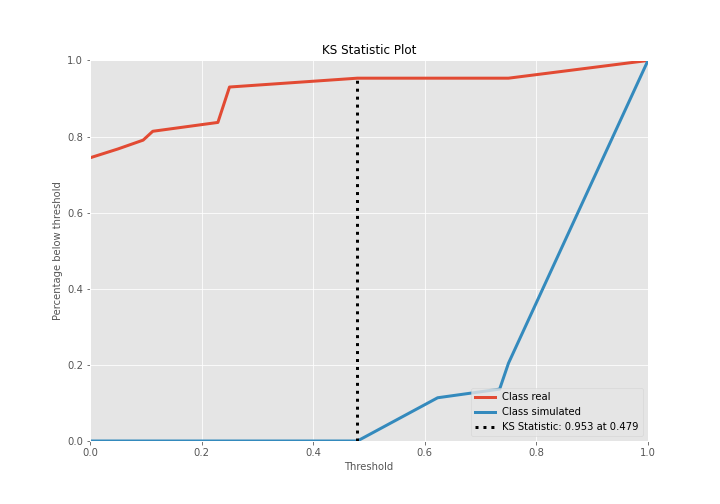

# Summary of Ensemble

[<< Go back](../README.md)

## Ensemble structure
| Model                  |   Weight |
|:-----------------------|---------:|
| 6_Default_RandomForest |        1 |

## Metric details
|           |    score |   threshold |
|:----------|---------:|------------:|
| logloss   | 0.385094 |     nan     |
| auc       | 0.971987 |     nan     |
| f1        | 0.917647 |       0.625 |
| accuracy  | 0.91954  |       0.625 |
| precision | 0.95122  |       0.625 |
| recall    | 1        |       0     |
| mcc       | 0.841187 |       0.625 |

## Confusion matrix (at threshold=0.625)
|                      |   Predicted as real |   Predicted as simulated |
|:---------------------|--------------------:|-------------------------:|
| Labeled as real      |                  41 |                        2 |
| Labeled as simulated |                   5 |                       39 |

## Learning curves

## Confusion Matrix

## Normalized Confusion Matrix

## ROC Curve

## Kolmogorov-Smirnov Statistic

## Precision-Recall Curve

## Calibration Curve

## Cumulative Gains Curve

## Lift Curve

[<< Go back](../README.md)
