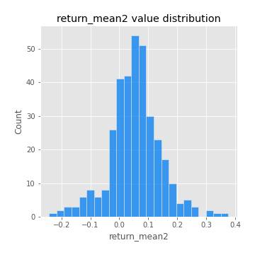
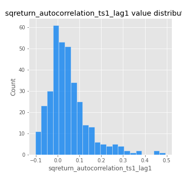
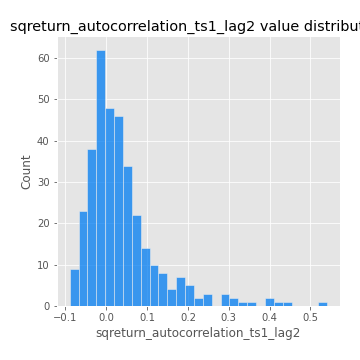

# Exploratory Data Analysis

[<< Go back](../README.md)
## Feature : target
- **Feature type** : categorical
- **Missing** : 0.0%
- **Unique** : 2
- **Count** :347
- **Unique** :2
- **Top** :simulated
- **Freq** :181

## Feature : return_mean1
- **Feature type** : continous
- **Missing** : 0.0%
- **Unique** : 347
- **Count** :347.0
- **Mean** :0.04221602930982941
- **Std** :0.07728152175846555
- **Min** :-0.22632637961920957
- **25%th Percentile** : -0.005477547187790739
- **50%th Percentile** : 0.04513042342819799
- **75%th Percentile** : 0.0842326192425875
- **Max** :0.37175100008111034

## Feature : return_mean2
- **Feature type** : continous
- **Missing** : 0.0%
- **Unique** : 347
- **Count** :347.0
- **Mean** :0.05351597102038453
- **Std** :0.08792719823593587
- **Min** :-0.24205418062825398
- **25%th Percentile** : 0.006357980884264567
- **50%th Percentile** : 0.05546152343077972
- **75%th Percentile** : 0.0997882634960865
- **Max** :0.37616608147096464

## Feature : return_sd1
- **Feature type** : continous
- **Missing** : 0.0%
- **Unique** : 347
- **Count** :347.0
- **Mean** :1.7815779451529425
- **Std** :0.7786356718183655
- **Min** :0.7470080772831957
- **25%th Percentile** : 1.5426040715298908
- **50%th Percentile** : 1.5998597302354827
- **75%th Percentile** : 1.7048139958825783
- **Max** :9.236766377527575

## Feature : return_sd2
- **Feature type** : continous
- **Missing** : 0.0%
- **Unique** : 347
- **Count** :347.0
- **Mean** :1.781097774825405
- **Std** :0.7371677523419401
- **Min** :0.8455946193085045
- **25%th Percentile** : 1.5182020544864108
- **50%th Percentile** : 1.5939212068888076
- **75%th Percentile** : 1.6852030681666492
- **Max** :6.737618636746393

## Feature : return_skew1
- **Feature type** : continous
- **Missing** : 0.0%
- **Unique** : 347
- **Count** :347.0
- **Mean** :-0.08484921525145105
- **Std** :0.6102135958243452
- **Min** :-3.453087436558107
- **25%th Percentile** : -0.16981335112560392
- **50%th Percentile** : -0.012715812124780226
- **75%th Percentile** : 0.10587985320741228
- **Max** :2.5845963767725557

## Feature : return_skew2
- **Feature type** : continous
- **Missing** : 0.0%
- **Unique** : 347
- **Count** :347.0
- **Mean** :-0.1360050291441972
- **Std** :0.5792752537739195
- **Min** :-3.4392142944489743
- **25%th Percentile** : -0.2305507292799489
- **50%th Percentile** : -0.04573174667155976
- **75%th Percentile** : 0.07875348354099118
- **Max** :2.2606839051517187

## Feature : return_kurtosis1
- **Feature type** : continous
- **Missing** : 0.0%
- **Unique** : 347
- **Count** :347.0
- **Mean** :3.054302625369351
- **Std** :6.057571005541661
- **Min** :-0.481391487981377
- **25%th Percentile** : -0.03328049628544183
- **50%th Percentile** : 0.3917585352266557
- **75%th Percentile** : 3.601784904080982
- **Max** :46.07507808162177

## Feature : return_kurtosis2
- **Feature type** : continous
- **Missing** : 0.0%
- **Unique** : 347
- **Count** :347.0
- **Mean** :3.252937436529565
- **Std** :6.322165105537387
- **Min** :-0.45475261258082034
- **25%th Percentile** : -0.00667364769294343
- **50%th Percentile** : 0.3863337956252626
- **75%th Percentile** : 4.063516554723738
- **Max** :57.31293005729889

## Feature : return_autocorrelation_1_lag1
- **Feature type** : continous
- **Missing** : 0.0%
- **Unique** : 347
- **Count** :347.0
- **Mean** :-0.010388101699187666
- **Std** :0.060551608218335905
- **Min** :-0.2135576224968752
- **25%th Percentile** : -0.04257956983606406
- **50%th Percentile** : -0.003654705826058786
- **75%th Percentile** : 0.0272210472994283
- **Max** :0.12970530203258832

## Feature : return_autocorrelation_1_lag2
- **Feature type** : continous
- **Missing** : 0.0%
- **Unique** : 347
- **Count** :347.0
- **Mean** :-0.00991811027759613
- **Std** :0.04754667035029804
- **Min** :-0.13309283796645122
- **25%th Percentile** : -0.04076637197652984
- **50%th Percentile** : -0.006557321691557163
- **75%th Percentile** : 0.021239946665608675
- **Max** :0.1561488228015672

## Feature : return_autocorrelation_1_lag3
- **Feature type** : continous
- **Missing** : 0.0%
- **Unique** : 347
- **Count** :347.0
- **Mean** :-0.004077621087548734
- **Std** :0.05238431288663874
- **Min** :-0.1940836867390813
- **25%th Percentile** : -0.03875906367626811
- **50%th Percentile** : -0.0012629815503095384
- **75%th Percentile** : 0.031958260168015104
- **Max** :0.17805869530681923

## Feature : return_autocorrelation_2_lag1
- **Feature type** : continous
- **Missing** : 0.0%
- **Unique** : 347
- **Count** :347.0
- **Mean** :-0.009404527741566747
- **Std** :0.05746076497308216
- **Min** :-0.24590087874039124
- **25%th Percentile** : -0.038965176777712746
- **50%th Percentile** : -0.005852565602720252
- **75%th Percentile** : 0.029619990942050235
- **Max** :0.16349871797309318

## Feature : return_autocorrelation_2_lag2
- **Feature type** : continous
- **Missing** : 0.0%
- **Unique** : 347
- **Count** :347.0
- **Mean** :-0.0008977034468562589
- **Std** :0.05224717571806544
- **Min** :-0.16320551736155842
- **25%th Percentile** : -0.035699212095288466
- **50%th Percentile** : -0.0019786601520114383
- **75%th Percentile** : 0.032891798864718436
- **Max** :0.1735398560230086

## Feature : return_autocorrelation_2_lag3
- **Feature type** : continous
- **Missing** : 0.0%
- **Unique** : 347
- **Count** :347.0
- **Mean** :0.000287403614065014
- **Std** :0.049631316470856134
- **Min** :-0.14200107169559698
- **25%th Percentile** : -0.02813638233301087
- **50%th Percentile** : 0.001330144512028808
- **75%th Percentile** : 0.03076980129708376
- **Max** :0.15147546700456554

## Feature : return_correlation_ts1_lag_0
- **Feature type** : continous
- **Missing** : 0.0%
- **Unique** : 347
- **Count** :347.0
- **Mean** :0.32494462055847434
- **Std** :0.10862644929875943
- **Min** :-0.027089510445801036
- **25%th Percentile** : 0.27031732479886805
- **50%th Percentile** : 0.325709245209129
- **75%th Percentile** : 0.3693446686861381
- **Max** :0.6949986865664105

## Feature : return_correlation_ts1_lag_1
- **Feature type** : continous
- **Missing** : 0.0%
- **Unique** : 347
- **Count** :347.0
- **Mean** :-0.010158579816729829
- **Std** :0.05313488196288542
- **Min** :-0.1732990112826614
- **25%th Percentile** : -0.04246547504668276
- **50%th Percentile** : -0.005833586645313906
- **75%th Percentile** : 0.02751781718818264
- **Max** :0.15499424718508623

## Feature : return_correlation_ts1_lag_2
- **Feature type** : continous
- **Missing** : 0.0%
- **Unique** : 347
- **Count** :347.0
- **Mean** :-0.0051945693046170065
- **Std** :0.04761080252526308
- **Min** :-0.21653581047581763
- **25%th Percentile** : -0.036679744727939584
- **50%th Percentile** : -0.004073576314118441
- **75%th Percentile** : 0.02607849405099413
- **Max** :0.1142754076284107

## Feature : return_correlation_ts1_lag_3
- **Feature type** : continous
- **Missing** : 0.0%
- **Unique** : 347
- **Count** :347.0
- **Mean** :0.0013766484998583477
- **Std** :0.05019787615689461
- **Min** :-0.1270218498974763
- **25%th Percentile** : -0.033758332906943384
- **50%th Percentile** : -0.0001681933719661222
- **75%th Percentile** : 0.03581926914816842
- **Max** :0.1422809271770942

## Feature : return_correlation_ts2_lag_1
- **Feature type** : continous
- **Missing** : 0.0%
- **Unique** : 347
- **Count** :347.0
- **Mean** :-0.006217176835253792
- **Std** :0.052731370984465405
- **Min** :-0.19671969155495325
- **25%th Percentile** : -0.03998183556252297
- **50%th Percentile** : -0.006191372768774982
- **75%th Percentile** : 0.031495529910732366
- **Max** :0.17208763791364762

## Feature : return_correlation_ts2_lag_2
- **Feature type** : continous
- **Missing** : 0.0%
- **Unique** : 347
- **Count** :347.0
- **Mean** :-0.0034291737111191317
- **Std** :0.049912030517089256
- **Min** :-0.23751835475804678
- **25%th Percentile** : -0.03766424586887239
- **50%th Percentile** : -0.0036835229366234297
- **75%th Percentile** : 0.023743426912974847
- **Max** :0.20772887392904255

## Feature : return_correlation_ts2_lag_3
- **Feature type** : continous
- **Missing** : 0.0%
- **Unique** : 347
- **Count** :347.0
- **Mean** :-0.0017186411563051035
- **Std** :0.052343621977401
- **Min** :-0.17564076057312866
- **25%th Percentile** : -0.03328100893803432
- **50%th Percentile** : -0.0014930972633726716
- **75%th Percentile** : 0.035698136539133014
- **Max** :0.1325838957632939

## Feature : sqreturn_autocorrelation_ts1_lag1
- **Feature type** : continous
- **Missing** : 0.0%
- **Unique** : 347
- **Count** :347.0
- **Mean** :0.04735979362337209
- **Std** :0.09381757424971719
- **Min** :-0.10328937407677691
- **25%th Percentile** : -0.013893503696513806
- **50%th Percentile** : 0.031150751121438773
- **75%th Percentile** : 0.08285521688957861
- **Max** :0.49414293176447355

## Feature : sqreturn_autocorrelation_ts1_lag2
- **Feature type** : continous
- **Missing** : 0.0%
- **Unique** : 347
- **Count** :347.0
- **Mean** :0.03792118064505698
- **Std** :0.09095095574297211
- **Min** :-0.08939811391458129
- **25%th Percentile** : -0.014555509025686243
- **50%th Percentile** : 0.015577744408285576
- **75%th Percentile** : 0.06287505926873135
- **Max** :0.540735851444759

## Feature : sqreturn_autocorrelation_ts1_lag3
- **Feature type** : continous
- **Missing** : 0.0%
- **Unique** : 347
- **Count** :347.0
- **Mean** :0.03049927603011728
- **Std** :0.07759773547606223
- **Min** :-0.10484695944137055
- **25%th Percentile** : -0.018998528630252906
- **50%th Percentile** : 0.014190656914810508
- **75%th Percentile** : 0.06269104546144452
- **Max** :0.41030914918857014

## Feature : sqreturn_autocorrelation_ts2_lag1
- **Feature type** : continous
- **Missing** : 0.0%
- **Unique** : 347
- **Count** :347.0
- **Mean** :0.04250566819928875
- **Std** :0.08853428069551722
- **Min** :-0.1158416916118223
- **25%th Percentile** : -0.015692252757486584
- **50%th Percentile** : 0.022529642572539425
- **75%th Percentile** : 0.07317653774074089
- **Max** :0.510085647437958

## Feature : sqreturn_autocorrelation_ts2_lag2
- **Feature type** : continous
- **Missing** : 0.0%
- **Unique** : 347
- **Count** :347.0
- **Mean** :0.034941708869657084
- **Std** :0.08833043157331473
- **Min** :-0.11685888700308122
- **25%th Percentile** : -0.016181196458720164
- **50%th Percentile** : 0.01396074743994295
- **75%th Percentile** : 0.05515004319446216
- **Max** :0.45676817892778204

## Feature : sqreturn_autocorrelation_ts2_lag3
- **Feature type** : continous
- **Missing** : 0.0%
- **Unique** : 347
- **Count** :347.0
- **Mean** :0.027034078884059003
- **Std** :0.0706334177317493
- **Min** :-0.09719442956601446
- **25%th Percentile** : -0.016172496640895553
- **50%th Percentile** : 0.009762111462428103
- **75%th Percentile** : 0.05361003763325662
- **Max** :0.31225727797735664

## Feature : sqreturn_correlation_ts1_lag_0
- **Feature type** : continous
- **Missing** : 0.0%
- **Unique** : 347
- **Count** :347.0
- **Mean** :0.32494462055847434
- **Std** :0.10862644929875943
- **Min** :-0.027089510445801036
- **25%th Percentile** : 0.27031732479886805
- **50%th Percentile** : 0.325709245209129
- **75%th Percentile** : 0.3693446686861381
- **Max** :0.6949986865664105

## Feature : sqreturn_correlation_ts1_lag_1
- **Feature type** : continous
- **Missing** : 0.0%
- **Unique** : 347
- **Count** :347.0
- **Mean** :-0.010158579816729829
- **Std** :0.05313488196288542
- **Min** :-0.1732990112826614
- **25%th Percentile** : -0.04246547504668276
- **50%th Percentile** : -0.005833586645313906
- **75%th Percentile** : 0.02751781718818264
- **Max** :0.15499424718508623

## Feature : sqreturn_correlation_ts1_lag_2
- **Feature type** : continous
- **Missing** : 0.0%
- **Unique** : 347
- **Count** :347.0
- **Mean** :-0.0051945693046170065
- **Std** :0.04761080252526308
- **Min** :-0.21653581047581763
- **25%th Percentile** : -0.036679744727939584
- **50%th Percentile** : -0.004073576314118441
- **75%th Percentile** : 0.02607849405099413
- **Max** :0.1142754076284107

## Feature : sqreturn_correlation_ts1_lag_3
- **Feature type** : continous
- **Missing** : 0.0%
- **Unique** : 347
- **Count** :347.0
- **Mean** :0.0013766484998583477
- **Std** :0.05019787615689461
- **Min** :-0.1270218498974763
- **25%th Percentile** : -0.033758332906943384
- **50%th Percentile** : -0.0001681933719661222
- **75%th Percentile** : 0.03581926914816842
- **Max** :0.1422809271770942

## Feature : sqreturn_correlation_ts2_lag_1
- **Feature type** : continous
- **Missing** : 0.0%
- **Unique** : 347
- **Count** :347.0
- **Mean** :-0.006217176835253792
- **Std** :0.052731370984465405
- **Min** :-0.19671969155495325
- **25%th Percentile** : -0.03998183556252297
- **50%th Percentile** : -0.006191372768774982
- **75%th Percentile** : 0.031495529910732366
- **Max** :0.17208763791364762

## Feature : sqreturn_correlation_ts2_lag_2
- **Feature type** : continous
- **Missing** : 0.0%
- **Unique** : 347
- **Count** :347.0
- **Mean** :-0.0034291737111191317
- **Std** :0.049912030517089256
- **Min** :-0.23751835475804678
- **25%th Percentile** : -0.03766424586887239
- **50%th Percentile** : -0.0036835229366234297
- **75%th Percentile** : 0.023743426912974847
- **Max** :0.20772887392904255

## Feature : sqreturn_correlation_ts2_lag_3
- **Feature type** : continous
- **Missing** : 0.0%
- **Unique** : 347
- **Count** :347.0
- **Mean** :-0.0017186411563051035
- **Std** :0.052343621977401
- **Min** :-0.17564076057312866
- **25%th Percentile** : -0.03328100893803432
- **50%th Percentile** : -0.0014930972633726716
- **75%th Percentile** : 0.035698136539133014
- **Max** :0.1325838957632939

## Feature : price2_granger_cause_price1
- **Feature type** : continous
- **Missing** : 0.0%
- **Unique** : 347
- **Count** :347.0
- **Mean** :0.3252516038298319
- **Std** :0.29895085914529074
- **Min** :2.9220030221537097e-06
- **25%th Percentile** : 0.060849256416702954
- **50%th Percentile** : 0.24060042484908745
- **75%th Percentile** : 0.5480089474623427
- **Max** :0.9931723548952144

## Feature : price1_granger_cause_price2
- **Feature type** : continous
- **Missing** : 0.0%
- **Unique** : 347
- **Count** :347.0
- **Mean** :0.29365086594158823
- **Std** :0.28614932895386075
- **Min** :8.866548396828024e-07
- **25%th Percentile** : 0.04245550326766319
- **50%th Percentile** : 0.21544702794312137
- **75%th Percentile** : 0.4892447515115569
- **Max** :0.9951398266867577

[<< Go back](../README.md)
