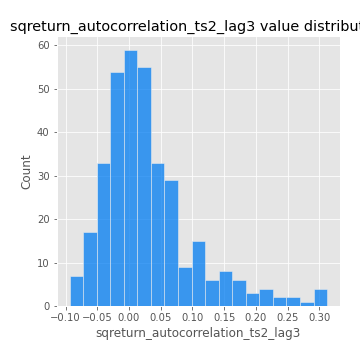

# Exploratory Data Analysis

[<< Go back](../README.md)
## Feature : target
- **Feature type** : categorical
- **Missing** : 0.0%
- **Unique** : 2
- **Count** :347
- **Unique** :2
- **Top** :real
- **Freq** :176

## Feature : return_mean1
- **Feature type** : continous
- **Missing** : 0.0%
- **Unique** : 347
- **Count** :347.0
- **Mean** :0.0822522417204795
- **Std** :0.08542487911373582
- **Min** :-0.22632637961920957
- **25%th Percentile** : 0.02549654663452846
- **50%th Percentile** : 0.08314491169172027
- **75%th Percentile** : 0.13662035982659215
- **Max** :0.3612366374600757

## Feature : return_mean2
- **Feature type** : continous
- **Missing** : 0.0%
- **Unique** : 347
- **Count** :347.0
- **Mean** :0.05213486280576311
- **Std** :0.09100583245886217
- **Min** :-0.2627735051700911
- **25%th Percentile** : -0.0032209121904067
- **50%th Percentile** : 0.05303573645302218
- **75%th Percentile** : 0.10272479869969892
- **Max** :0.37616608147096464

## Feature : return_sd1
- **Feature type** : continous
- **Missing** : 0.0%
- **Unique** : 347
- **Count** :347.0
- **Mean** :1.914777596686568
- **Std** :0.6999829632931943
- **Min** :0.8382061051466024
- **25%th Percentile** : 1.674952288994973
- **50%th Percentile** : 1.8698852102414478
- **75%th Percentile** : 1.9520494440201137
- **Max** :9.236766377527575

## Feature : return_sd2
- **Feature type** : continous
- **Missing** : 0.0%
- **Unique** : 347
- **Count** :347.0
- **Mean** :1.8930147546163703
- **Std** :0.7067614406122614
- **Min** :0.8592887433004143
- **25%th Percentile** : 1.636970291287255
- **50%th Percentile** : 1.811221229295349
- **75%th Percentile** : 1.9049268985653858
- **Max** :6.737618636746393

## Feature : return_skew1
- **Feature type** : continous
- **Missing** : 0.0%
- **Unique** : 347
- **Count** :347.0
- **Mean** :-0.07593664537418904
- **Std** :0.6047068841952954
- **Min** :-3.530116233761814
- **25%th Percentile** : -0.21343367588791107
- **50%th Percentile** : -0.02964896212695917
- **75%th Percentile** : 0.12570439955361842
- **Max** :2.5845963767725557

## Feature : return_skew2
- **Feature type** : continous
- **Missing** : 0.0%
- **Unique** : 347
- **Count** :347.0
- **Mean** :-0.16440341709085124
- **Std** :0.7974116602713146
- **Min** :-8.801502855292393
- **25%th Percentile** : -0.2741701878308881
- **50%th Percentile** : -0.05065889439877937
- **75%th Percentile** : 0.1278550217794623
- **Max** :2.242019525651531

## Feature : return_kurtosis1
- **Feature type** : continous
- **Missing** : 0.0%
- **Unique** : 347
- **Count** :347.0
- **Mean** :3.4673996071683595
- **Std** :6.295321941542133
- **Min** :-0.37267883954754266
- **25%th Percentile** : 0.21624645293302436
- **50%th Percentile** : 1.010609846496601
- **75%th Percentile** : 3.477511278091915
- **Max** :46.07507808162177

## Feature : return_kurtosis2
- **Feature type** : continous
- **Missing** : 0.0%
- **Unique** : 347
- **Count** :347.0
- **Mean** :4.224910527043909
- **Std** :10.417702898272468
- **Min** :-0.2934677713214473
- **25%th Percentile** : 0.3907478457466389
- **50%th Percentile** : 1.51620699728011
- **75%th Percentile** : 4.309734573198868
- **Max** :143.10871011533666

## Feature : return_autocorrelation_1_lag1
- **Feature type** : continous
- **Missing** : 0.0%
- **Unique** : 347
- **Count** :347.0
- **Mean** :-0.008331368864997295
- **Std** :0.060807353009471696
- **Min** :-0.2135576224968752
- **25%th Percentile** : -0.039549696726514774
- **50%th Percentile** : 0.0008142407897543741
- **75%th Percentile** : 0.030754690087593028
- **Max** :0.12830653214740378

## Feature : return_autocorrelation_1_lag2
- **Feature type** : continous
- **Missing** : 0.0%
- **Unique** : 347
- **Count** :347.0
- **Mean** :0.004793583993389216
- **Std** :0.050157964908487465
- **Min** :-0.12172858720259
- **25%th Percentile** : -0.025238022800159403
- **50%th Percentile** : 0.005149896120765142
- **75%th Percentile** : 0.03639612858863113
- **Max** :0.1561488228015672

## Feature : return_autocorrelation_1_lag3
- **Feature type** : continous
- **Missing** : 0.0%
- **Unique** : 347
- **Count** :347.0
- **Mean** :0.0069431877815925545
- **Std** :0.05188440733048336
- **Min** :-0.1940836867390813
- **25%th Percentile** : -0.026799265101061287
- **50%th Percentile** : 0.009841239866575636
- **75%th Percentile** : 0.04079202756963958
- **Max** :0.17805869530681923

## Feature : return_autocorrelation_2_lag1
- **Feature type** : continous
- **Missing** : 0.0%
- **Unique** : 347
- **Count** :347.0
- **Mean** :0.001494082316485301
- **Std** :0.06417540574604223
- **Min** :-0.24590087874039124
- **25%th Percentile** : -0.03408043659644798
- **50%th Percentile** : 0.006773562559814355
- **75%th Percentile** : 0.04292001549264821
- **Max** :0.31863413537898483

## Feature : return_autocorrelation_2_lag2
- **Feature type** : continous
- **Missing** : 0.0%
- **Unique** : 347
- **Count** :347.0
- **Mean** :0.009835014397696702
- **Std** :0.05567780912596836
- **Min** :-0.1495113937562178
- **25%th Percentile** : -0.031038240128230282
- **50%th Percentile** : 0.01140650815019592
- **75%th Percentile** : 0.048092474704058946
- **Max** :0.20974504043791217

## Feature : return_autocorrelation_2_lag3
- **Feature type** : continous
- **Missing** : 0.0%
- **Unique** : 347
- **Count** :347.0
- **Mean** :0.008864479253580918
- **Std** :0.05233088017903602
- **Min** :-0.1344316177078651
- **25%th Percentile** : -0.02459875146521911
- **50%th Percentile** : 0.00914148907308524
- **75%th Percentile** : 0.04360195198819238
- **Max** :0.18129633517417434

## Feature : return_correlation_ts1_lag_0
- **Feature type** : continous
- **Missing** : 0.0%
- **Unique** : 347
- **Count** :347.0
- **Mean** :0.34901744648774913
- **Std** :0.11101344230537241
- **Min** :-0.027089510445801036
- **25%th Percentile** : 0.29737647538749173
- **50%th Percentile** : 0.3670440650392536
- **75%th Percentile** : 0.408704114747806
- **Max** :0.7028422087350163

## Feature : return_correlation_ts1_lag_1
- **Feature type** : continous
- **Missing** : 0.0%
- **Unique** : 347
- **Count** :347.0
- **Mean** :0.0012029409321391502
- **Std** :0.05442711614966717
- **Min** :-0.16985510949917193
- **25%th Percentile** : -0.034550839516429455
- **50%th Percentile** : 0.006707617298899329
- **75%th Percentile** : 0.040669223339688414
- **Max** :0.1824986715771451

## Feature : return_correlation_ts1_lag_2
- **Feature type** : continous
- **Missing** : 0.0%
- **Unique** : 347
- **Count** :347.0
- **Mean** :0.007659232126872129
- **Std** :0.05026695590151517
- **Min** :-0.21653581047581763
- **25%th Percentile** : -0.023606273329066053
- **50%th Percentile** : 0.010119841302262681
- **75%th Percentile** : 0.04131239660138916
- **Max** :0.1348329832203658

## Feature : return_correlation_ts1_lag_3
- **Feature type** : continous
- **Missing** : 0.0%
- **Unique** : 347
- **Count** :347.0
- **Mean** :0.009597936719404496
- **Std** :0.05030112152343671
- **Min** :-0.1270218498974763
- **25%th Percentile** : -0.021263563864301897
- **50%th Percentile** : 0.01173575913232367
- **75%th Percentile** : 0.04413817672499436
- **Max** :0.1636773216468148

## Feature : return_correlation_ts2_lag_1
- **Feature type** : continous
- **Missing** : 0.0%
- **Unique** : 347
- **Count** :347.0
- **Mean** :0.003554414306928435
- **Std** :0.0537068412917022
- **Min** :-0.2081139431093261
- **25%th Percentile** : -0.027149148368729274
- **50%th Percentile** : 0.0033367070186551416
- **75%th Percentile** : 0.038169618025675284
- **Max** :0.13045838720062458

## Feature : return_correlation_ts2_lag_2
- **Feature type** : continous
- **Missing** : 0.0%
- **Unique** : 347
- **Count** :347.0
- **Mean** :0.007443761273445937
- **Std** :0.05179328608928792
- **Min** :-0.23751835475804678
- **25%th Percentile** : -0.024919433075677046
- **50%th Percentile** : 0.006274099574710472
- **75%th Percentile** : 0.04170415586272379
- **Max** :0.20772887392904255

## Feature : return_correlation_ts2_lag_3
- **Feature type** : continous
- **Missing** : 0.0%
- **Unique** : 347
- **Count** :347.0
- **Mean** :0.009066418180573877
- **Std** :0.05484454921764304
- **Min** :-0.17564076057312866
- **25%th Percentile** : -0.022280231284084816
- **50%th Percentile** : 0.014499301547532458
- **75%th Percentile** : 0.04829014041065014
- **Max** :0.1263336043784333

## Feature : sqreturn_autocorrelation_ts1_lag1
- **Feature type** : continous
- **Missing** : 0.0%
- **Unique** : 347
- **Count** :347.0
- **Mean** :0.05181038506618869
- **Std** :0.09025855100353967
- **Min** :-0.1150797285889168
- **25%th Percentile** : -0.010838457441423963
- **50%th Percentile** : 0.027526459453190984
- **75%th Percentile** : 0.08838670726689835
- **Max** :0.4439086285737898

## Feature : sqreturn_autocorrelation_ts1_lag2
- **Feature type** : continous
- **Missing** : 0.0%
- **Unique** : 347
- **Count** :347.0
- **Mean** :0.04234037752971947
- **Std** :0.09318154350990751
- **Min** :-0.09634544066423228
- **25%th Percentile** : -0.01622298709721573
- **50%th Percentile** : 0.01644181868742781
- **75%th Percentile** : 0.07094213139199904
- **Max** :0.4522162366773919

## Feature : sqreturn_autocorrelation_ts1_lag3
- **Feature type** : continous
- **Missing** : 0.0%
- **Unique** : 347
- **Count** :347.0
- **Mean** :0.037662042996482716
- **Std** :0.08310700652857826
- **Min** :-0.08518927711302446
- **25%th Percentile** : -0.013379380204807724
- **50%th Percentile** : 0.01732698705104041
- **75%th Percentile** : 0.07095666551046048
- **Max** :0.44755937369538146

## Feature : sqreturn_autocorrelation_ts2_lag1
- **Feature type** : continous
- **Missing** : 0.0%
- **Unique** : 347
- **Count** :347.0
- **Mean** :0.04724157658343945
- **Std** :0.08659528522562267
- **Min** :-0.08520586663750691
- **25%th Percentile** : -0.009952175426342837
- **50%th Percentile** : 0.02982522024063108
- **75%th Percentile** : 0.07353819757056218
- **Max** :0.4190090519891419

## Feature : sqreturn_autocorrelation_ts2_lag2
- **Feature type** : continous
- **Missing** : 0.0%
- **Unique** : 347
- **Count** :347.0
- **Mean** :0.03881643175546568
- **Std** :0.08943044897678248
- **Min** :-0.11313819706093098
- **25%th Percentile** : -0.01220271540775833
- **50%th Percentile** : 0.013631430386169102
- **75%th Percentile** : 0.057620366262740315
- **Max** :0.45676817892778204

## Feature : sqreturn_autocorrelation_ts2_lag3
- **Feature type** : continous
- **Missing** : 0.0%
- **Unique** : 347
- **Count** :347.0
- **Mean** :0.029674863931090145
- **Std** :0.07210434422630495
- **Min** :-0.09357967779767411
- **25%th Percentile** : -0.019352044310551715
- **50%th Percentile** : 0.015815173259987117
- **75%th Percentile** : 0.05674937875714488
- **Max** :0.31225727797735664

## Feature : sqreturn_correlation_ts1_lag_0
- **Feature type** : continous
- **Missing** : 0.0%
- **Unique** : 347
- **Count** :347.0
- **Mean** :0.34901744648774913
- **Std** :0.11101344230537241
- **Min** :-0.027089510445801036
- **25%th Percentile** : 0.29737647538749173
- **50%th Percentile** : 0.3670440650392536
- **75%th Percentile** : 0.408704114747806
- **Max** :0.7028422087350163

## Feature : sqreturn_correlation_ts1_lag_1
- **Feature type** : continous
- **Missing** : 0.0%
- **Unique** : 347
- **Count** :347.0
- **Mean** :0.0012029409321391502
- **Std** :0.05442711614966717
- **Min** :-0.16985510949917193
- **25%th Percentile** : -0.034550839516429455
- **50%th Percentile** : 0.006707617298899329
- **75%th Percentile** : 0.040669223339688414
- **Max** :0.1824986715771451

## Feature : sqreturn_correlation_ts1_lag_2
- **Feature type** : continous
- **Missing** : 0.0%
- **Unique** : 347
- **Count** :347.0
- **Mean** :0.007659232126872129
- **Std** :0.05026695590151517
- **Min** :-0.21653581047581763
- **25%th Percentile** : -0.023606273329066053
- **50%th Percentile** : 0.010119841302262681
- **75%th Percentile** : 0.04131239660138916
- **Max** :0.1348329832203658

## Feature : sqreturn_correlation_ts1_lag_3
- **Feature type** : continous
- **Missing** : 0.0%
- **Unique** : 347
- **Count** :347.0
- **Mean** :0.009597936719404496
- **Std** :0.05030112152343671
- **Min** :-0.1270218498974763
- **25%th Percentile** : -0.021263563864301897
- **50%th Percentile** : 0.01173575913232367
- **75%th Percentile** : 0.04413817672499436
- **Max** :0.1636773216468148

## Feature : sqreturn_correlation_ts2_lag_1
- **Feature type** : continous
- **Missing** : 0.0%
- **Unique** : 347
- **Count** :347.0
- **Mean** :0.003554414306928435
- **Std** :0.0537068412917022
- **Min** :-0.2081139431093261
- **25%th Percentile** : -0.027149148368729274
- **50%th Percentile** : 0.0033367070186551416
- **75%th Percentile** : 0.038169618025675284
- **Max** :0.13045838720062458

## Feature : sqreturn_correlation_ts2_lag_2
- **Feature type** : continous
- **Missing** : 0.0%
- **Unique** : 347
- **Count** :347.0
- **Mean** :0.007443761273445937
- **Std** :0.05179328608928792
- **Min** :-0.23751835475804678
- **25%th Percentile** : -0.024919433075677046
- **50%th Percentile** : 0.006274099574710472
- **75%th Percentile** : 0.04170415586272379
- **Max** :0.20772887392904255

## Feature : sqreturn_correlation_ts2_lag_3
- **Feature type** : continous
- **Missing** : 0.0%
- **Unique** : 347
- **Count** :347.0
- **Mean** :0.009066418180573877
- **Std** :0.05484454921764304
- **Min** :-0.17564076057312866
- **25%th Percentile** : -0.022280231284084816
- **50%th Percentile** : 0.014499301547532458
- **75%th Percentile** : 0.04829014041065014
- **Max** :0.1263336043784333

## Feature : price2_granger_cause_price1
- **Feature type** : continous
- **Missing** : 0.0%
- **Unique** : 347
- **Count** :347.0
- **Mean** :0.2846415599355402
- **Std** :0.3005689671778917
- **Min** :2.9788841425714045e-09
- **25%th Percentile** : 0.026476323402624687
- **50%th Percentile** : 0.16123031390690826
- **75%th Percentile** : 0.49547822784637485
- **Max** :0.9956658248275414

## Feature : price1_granger_cause_price2
- **Feature type** : continous
- **Missing** : 0.0%
- **Unique** : 347
- **Count** :347.0
- **Mean** :0.20959088842626306
- **Std** :0.26207301332721444
- **Min** :1.4858780108138004e-11
- **25%th Percentile** : 0.0024006637793003616
- **50%th Percentile** : 0.07231758909231967
- **75%th Percentile** : 0.37195900124447795
- **Max** :0.9951398266867577

[<< Go back](../README.md)
