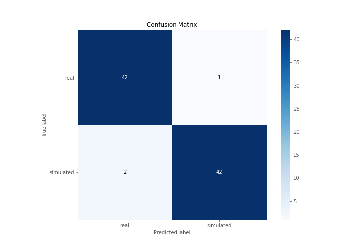

# Summary of 3_Linear

[<< Go back](../README.md)

## Logistic Regression (Linear)
- **n_jobs**: -1
- **explain_level**: 2

## Validation
 - **validation_type**: split
 - **train_ratio**: 0.75
 - **shuffle**: True
 - **stratify**: True

## Optimized metric
accuracy

## Training time

3.5 seconds

## Metric details
|           |    score |    threshold |
|:----------|---------:|-------------:|
| logloss   | 0.176987 | nan          |
| auc       | 0.993658 | nan          |
| f1        | 0.965517 |   0.658493   |
| accuracy  | 0.965517 |   0.658493   |
| precision | 1        |   0.871421   |
| recall    | 1        |   9.4881e-26 |
| mcc       | 0.93129  |   0.658493   |

## Confusion matrix (at threshold=0.658493)
|                      |   Predicted as real |   Predicted as simulated |
|:---------------------|--------------------:|-------------------------:|
| Labeled as real      |                  42 |                        1 |
| Labeled as simulated |                   2 |                       42 |

## Learning curves

## Coefficients
| feature                           |   Learner_1 |
|:----------------------------------|------------:|
| return_autocorrelation_2_lag1     |  0.696142   |
| sqreturn_correlation_ts2_lag_3    |  0.468266   |
| return_correlation_ts2_lag_3      |  0.468266   |
| return_autocorrelation_2_lag3     |  0.462235   |
| return_correlation_ts2_lag_1      |  0.427529   |
| sqreturn_correlation_ts2_lag_1    |  0.427529   |
| return_correlation_ts1_lag_1      |  0.418232   |
| sqreturn_correlation_ts1_lag_1    |  0.418232   |
| return_autocorrelation_1_lag3     |  0.413705   |
| return_autocorrelation_2_lag2     |  0.374467   |
| sqreturn_correlation_ts1_lag_2    |  0.343534   |
| return_correlation_ts1_lag_2      |  0.343534   |
| return_autocorrelation_1_lag2     |  0.297632   |
| return_correlation_ts1_lag_3      |  0.239472   |
| sqreturn_correlation_ts1_lag_3    |  0.239472   |
| return_autocorrelation_1_lag1     |  0.229659   |
| return_mean2                      |  0.0537751  |
| return_correlation_ts2_lag_2      | -0.00562451 |
| sqreturn_correlation_ts2_lag_2    | -0.00562451 |
| return_sd1                        | -0.156212   |
| return_skew2                      | -0.221832   |
| return_sd2                        | -0.316906   |
| return_correlation_ts1_lag_0      | -0.333154   |
| sqreturn_correlation_ts1_lag_0    | -0.333154   |
| return_skew1                      | -0.393071   |
| price1_granger_cause_price2       | -0.616982   |
| intercept                         | -0.703606   |
| sqreturn_autocorrelation_ts2_lag3 | -0.768671   |
| price2_granger_cause_price1       | -0.830452   |
| sqreturn_autocorrelation_ts1_lag2 | -1.02011    |
| return_mean1                      | -1.04531    |
| sqreturn_autocorrelation_ts2_lag2 | -1.07988    |
| sqreturn_autocorrelation_ts1_lag3 | -1.09646    |
| sqreturn_autocorrelation_ts1_lag1 | -1.28732    |
| sqreturn_autocorrelation_ts2_lag1 | -1.51379    |
| return_kurtosis2                  | -2.8565     |
| return_kurtosis1                  | -3.3734     |

## Permutation-based Importance

## Confusion Matrix

## Normalized Confusion Matrix

## ROC Curve

## Kolmogorov-Smirnov Statistic

## Precision-Recall Curve

## Calibration Curve

## Cumulative Gains Curve

## Lift Curve

## SHAP Importance

## SHAP Dependence plots

### Dependence (Fold 1)

## SHAP Decision plots

### Top-10 Worst decisions for class 0 (Fold 1)

### Top-10 Best decisions for class 0 (Fold 1)

### Top-10 Worst decisions for class 1 (Fold 1)

### Top-10 Best decisions for class 1 (Fold 1)

[<< Go back](../README.md)
