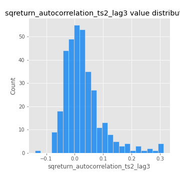

# Exploratory Data Analysis

[<< Go back](../README.md)
## Feature : target
- **Feature type** : categorical
- **Missing** : 0.0%
- **Unique** : 2
- **Count** :347
- **Unique** :2
- **Top** :simulated
- **Freq** :175

## Feature : return_mean1
- **Feature type** : continous
- **Missing** : 0.0%
- **Unique** : 347
- **Count** :347.0
- **Mean** :0.03223465604910194
- **Std** :0.07565355730877317
- **Min** :-0.22632637961920957
- **25%th Percentile** : -0.012764291605308942
- **50%th Percentile** : 0.028477738821159712
- **75%th Percentile** : 0.07809923348098521
- **Max** :0.37175100008111034

## Feature : return_mean2
- **Feature type** : continous
- **Missing** : 0.0%
- **Unique** : 347
- **Count** :347.0
- **Mean** :0.06781371195218906
- **Std** :0.09011300237608609
- **Min** :-0.24205418062825398
- **25%th Percentile** : 0.016972440791064212
- **50%th Percentile** : 0.06648790061648883
- **75%th Percentile** : 0.1175539172985261
- **Max** :0.37616608147096464

## Feature : return_sd1
- **Feature type** : continous
- **Missing** : 0.0%
- **Unique** : 347
- **Count** :347.0
- **Mean** :1.6940544007839964
- **Std** :0.7752247331413201
- **Min** :0.7470080772831957
- **25%th Percentile** : 1.424761363027582
- **50%th Percentile** : 1.489830756855249
- **75%th Percentile** : 1.639378088300305
- **Max** :9.236766377527575

## Feature : return_sd2
- **Feature type** : continous
- **Missing** : 0.0%
- **Unique** : 347
- **Count** :347.0
- **Mean** :1.763342325585704
- **Std** :0.7676772856329924
- **Min** :0.8455946193085045
- **25%th Percentile** : 1.4915701224953501
- **50%th Percentile** : 1.568912585693473
- **75%th Percentile** : 1.6603877590740268
- **Max** :6.737618636746393

## Feature : return_skew1
- **Feature type** : continous
- **Missing** : 0.0%
- **Unique** : 347
- **Count** :347.0
- **Mean** :-0.11456918735391045
- **Std** :0.6206795625601703
- **Min** :-3.530116233761814
- **25%th Percentile** : -0.2633304765756256
- **50%th Percentile** : -0.05876919356780939
- **75%th Percentile** : 0.0910060669296938
- **Max** :2.5845963767725557

## Feature : return_skew2
- **Feature type** : continous
- **Missing** : 0.0%
- **Unique** : 347
- **Count** :347.0
- **Mean** :-0.2192804196650571
- **Std** :0.8370115621166848
- **Min** :-8.801502855292393
- **25%th Percentile** : -0.372956706825014
- **50%th Percentile** : -0.11012306731211187
- **75%th Percentile** : 0.0701796073887678
- **Max** :2.242019525651531

## Feature : return_kurtosis1
- **Feature type** : continous
- **Missing** : 0.0%
- **Unique** : 347
- **Count** :347.0
- **Mean** :3.3792060320164103
- **Std** :6.027223183619709
- **Min** :-0.37428751409178407
- **25%th Percentile** : 0.2862422949144545
- **50%th Percentile** : 1.04340540881512
- **75%th Percentile** : 3.583058820532593
- **Max** :46.07507808162177

## Feature : return_kurtosis2
- **Feature type** : continous
- **Missing** : 0.0%
- **Unique** : 347
- **Count** :347.0
- **Mean** :4.520991817845746
- **Std** :10.485715229377814
- **Min** :-0.11536877492638808
- **25%th Percentile** : 0.611907314105183
- **50%th Percentile** : 1.564186275378479
- **75%th Percentile** : 4.384931738830142
- **Max** :143.10871011533666

## Feature : return_autocorrelation_1_lag1
- **Feature type** : continous
- **Missing** : 0.0%
- **Unique** : 347
- **Count** :347.0
- **Mean** :-0.00901017109500243
- **Std** :0.05380584315273915
- **Min** :-0.19339575314049967
- **25%th Percentile** : -0.03631988730038739
- **50%th Percentile** : -0.0028390486627186398
- **75%th Percentile** : 0.02684179426352298
- **Max** :0.12810656890648087

## Feature : return_autocorrelation_1_lag2
- **Feature type** : continous
- **Missing** : 0.0%
- **Unique** : 347
- **Count** :347.0
- **Mean** :-0.004883458326457953
- **Std** :0.04782731665937477
- **Min** :-0.13309283796645122
- **25%th Percentile** : -0.033206717412408826
- **50%th Percentile** : -0.004305746691502902
- **75%th Percentile** : 0.0279989649031109
- **Max** :0.1561488228015672

## Feature : return_autocorrelation_1_lag3
- **Feature type** : continous
- **Missing** : 0.0%
- **Unique** : 347
- **Count** :347.0
- **Mean** :0.0009450713356315508
- **Std** :0.05100621840731418
- **Min** :-0.1940836867390813
- **25%th Percentile** : -0.027754932076744246
- **50%th Percentile** : -0.00038564435691356786
- **75%th Percentile** : 0.0342045028322665
- **Max** :0.17805869530681923

## Feature : return_autocorrelation_2_lag1
- **Feature type** : continous
- **Missing** : 0.0%
- **Unique** : 347
- **Count** :347.0
- **Mean** :-0.001489990728440254
- **Std** :0.061684573453420204
- **Min** :-0.25075531010123286
- **25%th Percentile** : -0.0356730311824736
- **50%th Percentile** : 0.002621753646315134
- **75%th Percentile** : 0.034946894940847566
- **Max** :0.31863413537898483

## Feature : return_autocorrelation_2_lag2
- **Feature type** : continous
- **Missing** : 0.0%
- **Unique** : 347
- **Count** :347.0
- **Mean** :0.0026000985897288074
- **Std** :0.05337094458898875
- **Min** :-0.15323211089747296
- **25%th Percentile** : -0.0320672196102129
- **50%th Percentile** : 0.0018785238113544211
- **75%th Percentile** : 0.03948956140290005
- **Max** :0.20974504043791217

## Feature : return_autocorrelation_2_lag3
- **Feature type** : continous
- **Missing** : 0.0%
- **Unique** : 347
- **Count** :347.0
- **Mean** :0.002432474782369522
- **Std** :0.0474929454356512
- **Min** :-0.14200107169559698
- **25%th Percentile** : -0.028316400067741717
- **50%th Percentile** : 0.0026790259892069254
- **75%th Percentile** : 0.036758824683795585
- **Max** :0.1419999376914021

## Feature : return_correlation_ts1_lag_0
- **Feature type** : continous
- **Missing** : 0.0%
- **Unique** : 347
- **Count** :347.0
- **Mean** :0.3041450522923243
- **Std** :0.11157328733161843
- **Min** :-0.027089510445801036
- **25%th Percentile** : 0.24904891997795303
- **50%th Percentile** : 0.3019435233703488
- **75%th Percentile** : 0.3425961278474123
- **Max** :0.7041861626832071

## Feature : return_correlation_ts1_lag_1
- **Feature type** : continous
- **Missing** : 0.0%
- **Unique** : 347
- **Count** :347.0
- **Mean** :-0.0022270687861996705
- **Std** :0.05143987611835319
- **Min** :-0.15776193292681923
- **25%th Percentile** : -0.03539381518310038
- **50%th Percentile** : 0.002157207880544263
- **75%th Percentile** : 0.034260673848351894
- **Max** :0.15499424718508623

## Feature : return_correlation_ts1_lag_2
- **Feature type** : continous
- **Missing** : 0.0%
- **Unique** : 347
- **Count** :347.0
- **Mean** :-0.0003128641649597448
- **Std** :0.04847949357915904
- **Min** :-0.12864410180561703
- **25%th Percentile** : -0.03339479317768104
- **50%th Percentile** : -0.0014534736287393124
- **75%th Percentile** : 0.03516767542556985
- **Max** :0.12689062309166713

## Feature : return_correlation_ts1_lag_3
- **Feature type** : continous
- **Missing** : 0.0%
- **Unique** : 347
- **Count** :347.0
- **Mean** :0.002558387991618418
- **Std** :0.0476942612620119
- **Min** :-0.1270218498974763
- **25%th Percentile** : -0.027317724013231504
- **50%th Percentile** : 0.003586528888343079
- **75%th Percentile** : 0.03231417630617238
- **Max** :0.1636773216468148

## Feature : return_correlation_ts2_lag_1
- **Feature type** : continous
- **Missing** : 0.0%
- **Unique** : 347
- **Count** :347.0
- **Mean** :-0.002133186066125436
- **Std** :0.05333051151437729
- **Min** :-0.20093919236581337
- **25%th Percentile** : -0.03293172931708202
- **50%th Percentile** : -0.002433855301034179
- **75%th Percentile** : 0.03103475813201887
- **Max** :0.17208763791364762

## Feature : return_correlation_ts2_lag_2
- **Feature type** : continous
- **Missing** : 0.0%
- **Unique** : 347
- **Count** :347.0
- **Mean** :0.0027317946978511875
- **Std** :0.049470903678710924
- **Min** :-0.23751835475804678
- **25%th Percentile** : -0.028833762237755904
- **50%th Percentile** : 0.0032986826391803235
- **75%th Percentile** : 0.031290080937517235
- **Max** :0.20772887392904255

## Feature : return_correlation_ts2_lag_3
- **Feature type** : continous
- **Missing** : 0.0%
- **Unique** : 347
- **Count** :347.0
- **Mean** :0.0004647621729633824
- **Std** :0.05151791043105814
- **Min** :-0.17564076057312866
- **25%th Percentile** : -0.02921008290978764
- **50%th Percentile** : -0.0011263914179240767
- **75%th Percentile** : 0.0358978211082525
- **Max** :0.13128380114518473

## Feature : sqreturn_autocorrelation_ts1_lag1
- **Feature type** : continous
- **Missing** : 0.0%
- **Unique** : 347
- **Count** :347.0
- **Mean** :0.04704471401674681
- **Std** :0.09373454236113246
- **Min** :-0.09745846267669418
- **25%th Percentile** : -0.012223942679065462
- **50%th Percentile** : 0.02417154477171563
- **75%th Percentile** : 0.0800738403567664
- **Max** :0.49414293176447355

## Feature : sqreturn_autocorrelation_ts1_lag2
- **Feature type** : continous
- **Missing** : 0.0%
- **Unique** : 347
- **Count** :347.0
- **Mean** :0.0422299175253684
- **Std** :0.08939352185977531
- **Min** :-0.10343605683112862
- **25%th Percentile** : -0.009637516889925264
- **50%th Percentile** : 0.01908567291658636
- **75%th Percentile** : 0.06747793932158909
- **Max** :0.540735851444759

## Feature : sqreturn_autocorrelation_ts1_lag3
- **Feature type** : continous
- **Missing** : 0.0%
- **Unique** : 347
- **Count** :347.0
- **Mean** :0.03253430705509418
- **Std** :0.07639825456249058
- **Min** :-0.08643452544392445
- **25%th Percentile** : -0.015904534299809245
- **50%th Percentile** : 0.013631050949169946
- **75%th Percentile** : 0.056613900596630524
- **Max** :0.41030914918857014

## Feature : sqreturn_autocorrelation_ts2_lag1
- **Feature type** : continous
- **Missing** : 0.0%
- **Unique** : 347
- **Count** :347.0
- **Mean** :0.04534290495645759
- **Std** :0.08810777386842265
- **Min** :-0.10972227162312137
- **25%th Percentile** : -0.012583685073507092
- **50%th Percentile** : 0.024001793134355548
- **75%th Percentile** : 0.07472999510584083
- **Max** :0.510085647437958

## Feature : sqreturn_autocorrelation_ts2_lag2
- **Feature type** : continous
- **Missing** : 0.0%
- **Unique** : 347
- **Count** :347.0
- **Mean** :0.03686066082517821
- **Std** :0.08549335932748373
- **Min** :-0.105593010725546
- **25%th Percentile** : -0.0148503194401685
- **50%th Percentile** : 0.015185213759964006
- **75%th Percentile** : 0.05721613262555929
- **Max** :0.45676817892778204

## Feature : sqreturn_autocorrelation_ts2_lag3
- **Feature type** : continous
- **Missing** : 0.0%
- **Unique** : 347
- **Count** :347.0
- **Mean** :0.028264790217992965
- **Std** :0.06843919387316688
- **Min** :-0.14031395962179655
- **25%th Percentile** : -0.016212452439311416
- **50%th Percentile** : 0.015600659260481023
- **75%th Percentile** : 0.054521413117997214
- **Max** :0.31225727797735664

## Feature : sqreturn_correlation_ts1_lag_0
- **Feature type** : continous
- **Missing** : 0.0%
- **Unique** : 347
- **Count** :347.0
- **Mean** :0.3041450522923243
- **Std** :0.11157328733161843
- **Min** :-0.027089510445801036
- **25%th Percentile** : 0.24904891997795303
- **50%th Percentile** : 0.3019435233703488
- **75%th Percentile** : 0.3425961278474123
- **Max** :0.7041861626832071

## Feature : sqreturn_correlation_ts1_lag_1
- **Feature type** : continous
- **Missing** : 0.0%
- **Unique** : 347
- **Count** :347.0
- **Mean** :-0.0022270687861996705
- **Std** :0.05143987611835319
- **Min** :-0.15776193292681923
- **25%th Percentile** : -0.03539381518310038
- **50%th Percentile** : 0.002157207880544263
- **75%th Percentile** : 0.034260673848351894
- **Max** :0.15499424718508623

## Feature : sqreturn_correlation_ts1_lag_2
- **Feature type** : continous
- **Missing** : 0.0%
- **Unique** : 347
- **Count** :347.0
- **Mean** :-0.0003128641649597448
- **Std** :0.04847949357915904
- **Min** :-0.12864410180561703
- **25%th Percentile** : -0.03339479317768104
- **50%th Percentile** : -0.0014534736287393124
- **75%th Percentile** : 0.03516767542556985
- **Max** :0.12689062309166713

## Feature : sqreturn_correlation_ts1_lag_3
- **Feature type** : continous
- **Missing** : 0.0%
- **Unique** : 347
- **Count** :347.0
- **Mean** :0.002558387991618418
- **Std** :0.0476942612620119
- **Min** :-0.1270218498974763
- **25%th Percentile** : -0.027317724013231504
- **50%th Percentile** : 0.003586528888343079
- **75%th Percentile** : 0.03231417630617238
- **Max** :0.1636773216468148

## Feature : sqreturn_correlation_ts2_lag_1
- **Feature type** : continous
- **Missing** : 0.0%
- **Unique** : 347
- **Count** :347.0
- **Mean** :-0.002133186066125436
- **Std** :0.05333051151437729
- **Min** :-0.20093919236581337
- **25%th Percentile** : -0.03293172931708202
- **50%th Percentile** : -0.002433855301034179
- **75%th Percentile** : 0.03103475813201887
- **Max** :0.17208763791364762

## Feature : sqreturn_correlation_ts2_lag_2
- **Feature type** : continous
- **Missing** : 0.0%
- **Unique** : 347
- **Count** :347.0
- **Mean** :0.0027317946978511875
- **Std** :0.049470903678710924
- **Min** :-0.23751835475804678
- **25%th Percentile** : -0.028833762237755904
- **50%th Percentile** : 0.0032986826391803235
- **75%th Percentile** : 0.031290080937517235
- **Max** :0.20772887392904255

## Feature : sqreturn_correlation_ts2_lag_3
- **Feature type** : continous
- **Missing** : 0.0%
- **Unique** : 347
- **Count** :347.0
- **Mean** :0.0004647621729633824
- **Std** :0.05151791043105814
- **Min** :-0.17564076057312866
- **25%th Percentile** : -0.02921008290978764
- **50%th Percentile** : -0.0011263914179240767
- **75%th Percentile** : 0.0358978211082525
- **Max** :0.13128380114518473

## Feature : price2_granger_cause_price1
- **Feature type** : continous
- **Missing** : 0.0%
- **Unique** : 347
- **Count** :347.0
- **Mean** :0.32357012348538916
- **Std** :0.29622662900822844
- **Min** :4.461801326019722e-06
- **25%th Percentile** : 0.05360180238306297
- **50%th Percentile** : 0.2514555440401201
- **75%th Percentile** : 0.5685245539155751
- **Max** :0.9954754872740125

## Feature : price1_granger_cause_price2
- **Feature type** : continous
- **Missing** : 0.0%
- **Unique** : 347
- **Count** :347.0
- **Mean** :0.2633820520796621
- **Std** :0.27045761238717586
- **Min** :2.4503636570221738e-09
- **25%th Percentile** : 0.0367710535553538
- **50%th Percentile** : 0.16229991765524363
- **75%th Percentile** : 0.43047011401652213
- **Max** :0.9951398266867577

[<< Go back](../README.md)
