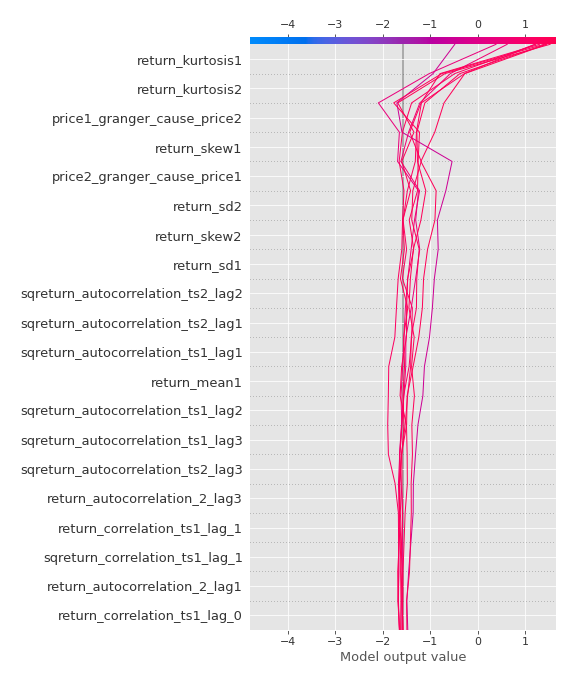

# Summary of 3_Linear

[<< Go back](../README.md)

## Logistic Regression (Linear)
- **n_jobs**: -1
- **explain_level**: 2

## Validation
 - **validation_type**: split
 - **train_ratio**: 0.75
 - **shuffle**: True
 - **stratify**: True

## Optimized metric
accuracy

## Training time

3.9 seconds

## Metric details
|           |    score |    threshold |
|:----------|---------:|-------------:|
| logloss   | 0.223403 | nan          |
| auc       | 0.984144 | nan          |
| f1        | 0.952381 |   0.751477   |
| accuracy  | 0.954023 |   0.751477   |
| precision | 1        |   0.883544   |
| recall    | 1        |   5.8469e-18 |
| mcc       | 0.908948 |   0.751477   |

## Confusion matrix (at threshold=0.751477)
|                      |   Predicted as real |   Predicted as simulated |
|:---------------------|--------------------:|-------------------------:|
| Labeled as real      |                  43 |                        1 |
| Labeled as simulated |                   3 |                       40 |

## Learning curves

## Coefficients
| feature                           |   Learner_1 |
|:----------------------------------|------------:|
| return_autocorrelation_2_lag3     |  0.627857   |
| return_autocorrelation_2_lag1     |  0.554235   |
| return_autocorrelation_2_lag2     |  0.490733   |
| sqreturn_correlation_ts1_lag_1    |  0.454783   |
| return_correlation_ts1_lag_1      |  0.454783   |
| return_correlation_ts2_lag_3      |  0.348771   |
| sqreturn_correlation_ts2_lag_3    |  0.348771   |
| return_correlation_ts2_lag_1      |  0.316434   |
| sqreturn_correlation_ts2_lag_1    |  0.316434   |
| return_autocorrelation_1_lag3     |  0.302577   |
| return_autocorrelation_1_lag1     |  0.267883   |
| return_mean2                      |  0.214031   |
| sqreturn_correlation_ts1_lag_3    |  0.195493   |
| return_correlation_ts1_lag_3      |  0.195493   |
| sqreturn_correlation_ts2_lag_2    |  0.088824   |
| return_correlation_ts2_lag_2      |  0.088824   |
| return_autocorrelation_1_lag2     | -0.00176355 |
| return_correlation_ts1_lag_2      | -0.0691714  |
| sqreturn_correlation_ts1_lag_2    | -0.0691714  |
| return_sd1                        | -0.28031    |
| return_skew2                      | -0.302877   |
| return_correlation_ts1_lag_0      | -0.338918   |
| sqreturn_correlation_ts1_lag_0    | -0.338918   |
| return_sd2                        | -0.532687   |
| sqreturn_autocorrelation_ts2_lag3 | -0.64807    |
| price2_granger_cause_price1       | -0.669901   |
| price1_granger_cause_price2       | -0.813401   |
| return_mean1                      | -0.87297    |
| sqreturn_autocorrelation_ts1_lag3 | -0.889748   |
| intercept                         | -0.909963   |
| sqreturn_autocorrelation_ts2_lag2 | -0.969675   |
| sqreturn_autocorrelation_ts1_lag2 | -1.1925     |
| sqreturn_autocorrelation_ts2_lag1 | -1.19955    |
| sqreturn_autocorrelation_ts1_lag1 | -1.34606    |
| return_skew1                      | -1.43706    |
| return_kurtosis2                  | -2.54114    |
| return_kurtosis1                  | -4.0322     |

## Permutation-based Importance

## Confusion Matrix

## Normalized Confusion Matrix

## ROC Curve

## Kolmogorov-Smirnov Statistic

## Precision-Recall Curve

## Calibration Curve

## Cumulative Gains Curve

## Lift Curve

## SHAP Importance

## SHAP Dependence plots

### Dependence (Fold 1)

## SHAP Decision plots

### Top-10 Worst decisions for class 0 (Fold 1)

### Top-10 Best decisions for class 0 (Fold 1)

### Top-10 Worst decisions for class 1 (Fold 1)

### Top-10 Best decisions for class 1 (Fold 1)

[<< Go back](../README.md)
