# Exploratory Data Analysis

[<< Go back](../README.md)
## Feature : target
- **Feature type** : categorical
- **Missing** : 0.0%
- **Unique** : 2
- **Count** :347
- **Unique** :2
- **Top** :real
- **Freq** :175

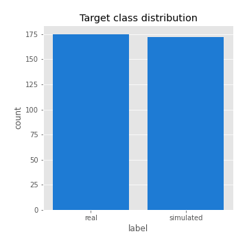
## Feature : return_mean1
- **Feature type** : continous
- **Missing** : 0.0%
- **Unique** : 347
- **Count** :347.0
- **Mean** :0.03009585697515215
- **Std** :0.07907799742585406
- **Min** :-0.17924187353925866
- **25%th Percentile** : -0.01723721005304365
- **50%th Percentile** : 0.03306055348799087
- **75%th Percentile** : 0.07881488616256903
- **Max** :0.37175100008111034

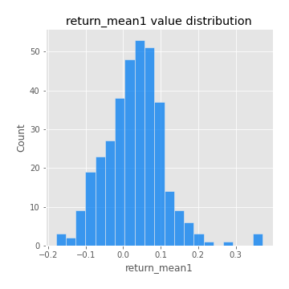
## Feature : return_mean2
- **Feature type** : continous
- **Missing** : 0.0%
- **Unique** : 347
- **Count** :347.0
- **Mean** :0.07140735666984623
- **Std** :0.09476729291183868
- **Min** :-0.27871311849716435
- **25%th Percentile** : 0.022623341779110406
- **50%th Percentile** : 0.0692072284406488
- **75%th Percentile** : 0.11867488433816084
- **Max** :0.4991643164469491

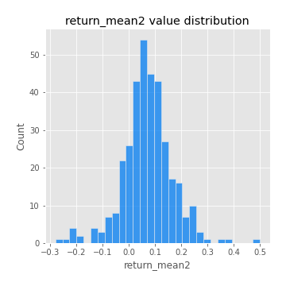
## Feature : return_sd1
- **Feature type** : continous
- **Missing** : 0.0%
- **Unique** : 347
- **Count** :347.0
- **Mean** :1.7168432853867952
- **Std** :0.7146736832398981
- **Min** :0.7470080772831957
- **25%th Percentile** : 1.434060501301197
- **50%th Percentile** : 1.4896283505346413
- **75%th Percentile** : 1.6975652767055474
- **Max** :6.495661311240861

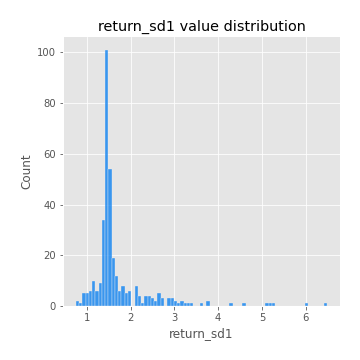
## Feature : return_sd2
- **Feature type** : continous
- **Missing** : 0.0%
- **Unique** : 347
- **Count** :347.0
- **Mean** :1.752070406744775
- **Std** :0.6853041137311702
- **Min** :0.8592887433004143
- **25%th Percentile** : 1.489880268841452
- **50%th Percentile** : 1.5673658408505518
- **75%th Percentile** : 1.6855441135428864
- **Max** :5.762808157208253

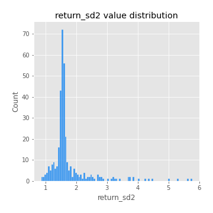
## Feature : return_skew1
- **Feature type** : continous
- **Missing** : 0.0%
- **Unique** : 347
- **Count** :347.0
- **Mean** :-0.12178028279147432
- **Std** :0.6464764944897111
- **Min** :-3.530116233761814
- **25%th Percentile** : -0.26255927066003265
- **50%th Percentile** : -0.07701938379921452
- **75%th Percentile** : 0.06597598331232449
- **Max** :2.5845963767725557

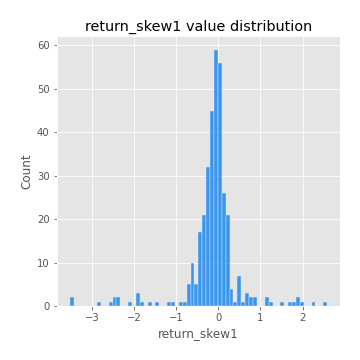
## Feature : return_skew2
- **Feature type** : continous
- **Missing** : 0.0%
- **Unique** : 347
- **Count** :347.0
- **Mean** :-0.25527561423256845
- **Std** :0.8311787543642836
- **Min** :-8.801502855292393
- **25%th Percentile** : -0.3714060588456542
- **50%th Percentile** : -0.12933582268459215
- **75%th Percentile** : 0.02090891424540846
- **Max** :2.242019525651531

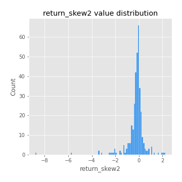
## Feature : return_kurtosis1
- **Feature type** : continous
- **Missing** : 0.0%
- **Unique** : 347
- **Count** :347.0
- **Mean** :3.5207461830758295
- **Std** :6.245054598762
- **Min** :-0.3814692278104914
- **25%th Percentile** : 0.22074204647005935
- **50%th Percentile** : 1.1288324810375587
- **75%th Percentile** : 3.7064897671791717
- **Max** :46.07507808162177

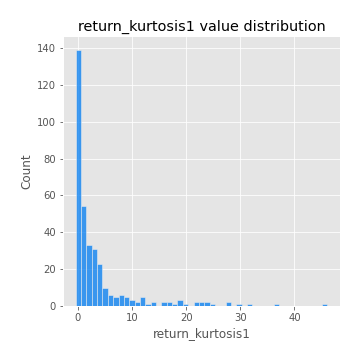
## Feature : return_kurtosis2
- **Feature type** : continous
- **Missing** : 0.0%
- **Unique** : 347
- **Count** :347.0
- **Mean** :4.540582170686065
- **Std** :10.587722691029878
- **Min** :-0.35294746144466593
- **25%th Percentile** : 0.5078935001807898
- **50%th Percentile** : 1.764037863973591
- **75%th Percentile** : 4.381239604898888
- **Max** :143.10871011533666

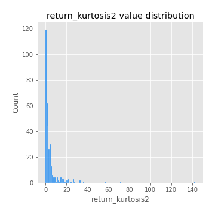
## Feature : return_autocorrelation_1_lag1
- **Feature type** : continous
- **Missing** : 0.0%
- **Unique** : 347
- **Count** :347.0
- **Mean** :-0.010824168982655421
- **Std** :0.05846233541130773
- **Min** :-0.20673896439036124
- **25%th Percentile** : -0.045582435498085994
- **50%th Percentile** : -0.005531135838396722
- **75%th Percentile** : 0.027780887698352803
- **Max** :0.12810656890648087

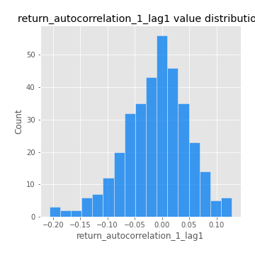
## Feature : return_autocorrelation_1_lag2
- **Feature type** : continous
- **Missing** : 0.0%
- **Unique** : 347
- **Count** :347.0
- **Mean** :-0.004310784925585589
- **Std** :0.05020984892878298
- **Min** :-0.13309283796645122
- **25%th Percentile** : -0.0347872385675464
- **50%th Percentile** : -0.002366576803299343
- **75%th Percentile** : 0.02776132334019954
- **Max** :0.1561488228015672

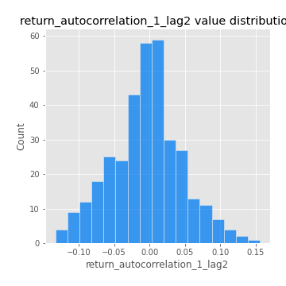
## Feature : return_autocorrelation_1_lag3
- **Feature type** : continous
- **Missing** : 0.0%
- **Unique** : 347
- **Count** :347.0
- **Mean** :-0.003189337462486762
- **Std** :0.05304175096192792
- **Min** :-0.1940836867390813
- **25%th Percentile** : -0.0360343851155097
- **50%th Percentile** : -0.001593208013365921
- **75%th Percentile** : 0.031948709226002577
- **Max** :0.17805869530681923

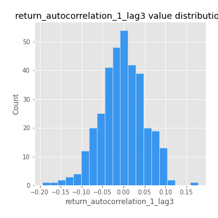
## Feature : return_autocorrelation_2_lag1
- **Feature type** : continous
- **Missing** : 0.0%
- **Unique** : 347
- **Count** :347.0
- **Mean** :0.0006046678663864391
- **Std** :0.06168958545261033
- **Min** :-0.24590087874039124
- **25%th Percentile** : -0.03433560806340487
- **50%th Percentile** : 0.0038365925428886292
- **75%th Percentile** : 0.04056322832760306
- **Max** :0.31863413537898483

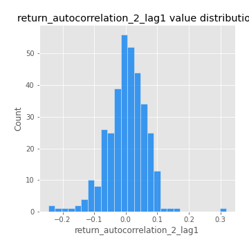
## Feature : return_autocorrelation_2_lag2
- **Feature type** : continous
- **Missing** : 0.0%
- **Unique** : 347
- **Count** :347.0
- **Mean** :0.007004198978610931
- **Std** :0.05329551505290649
- **Min** :-0.15323211089747296
- **25%th Percentile** : -0.031718621497970154
- **50%th Percentile** : 0.004982593045969046
- **75%th Percentile** : 0.04505358909450678
- **Max** :0.20974504043791217

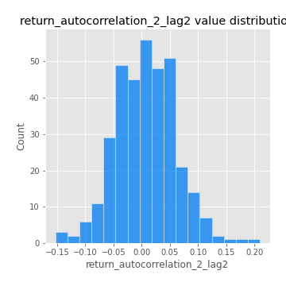
## Feature : return_autocorrelation_2_lag3
- **Feature type** : continous
- **Missing** : 0.0%
- **Unique** : 347
- **Count** :347.0
- **Mean** :0.0027657691771726675
- **Std** :0.05043878556205464
- **Min** :-0.14200107169559698
- **25%th Percentile** : -0.028059694061936556
- **50%th Percentile** : 0.005739890011516906
- **75%th Percentile** : 0.03573700962718041
- **Max** :0.1419999376914021

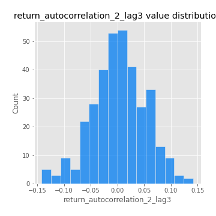
## Feature : return_correlation_ts1_lag_0
- **Feature type** : continous
- **Missing** : 0.0%
- **Unique** : 347
- **Count** :347.0
- **Mean** :0.30921903913944765
- **Std** :0.11016906405012834
- **Min** :0.013725064995079429
- **25%th Percentile** : 0.2500366864509665
- **50%th Percentile** : 0.2988879159592923
- **75%th Percentile** : 0.35172073381685165
- **Max** :0.7041861626832071

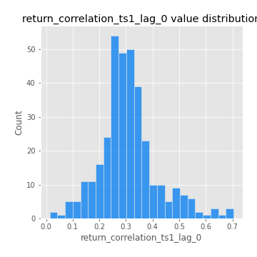
## Feature : return_correlation_ts1_lag_1
- **Feature type** : continous
- **Missing** : 0.0%
- **Unique** : 347
- **Count** :347.0
- **Mean** :-0.003918055704986222
- **Std** :0.05143703013881607
- **Min** :-0.15776193292681923
- **25%th Percentile** : -0.03853611362034812
- **50%th Percentile** : 0.0008555593415918072
- **75%th Percentile** : 0.03481602939300861
- **Max** :0.13385382553247563

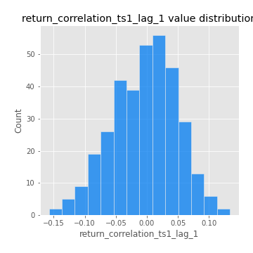
## Feature : return_correlation_ts1_lag_2
- **Feature type** : continous
- **Missing** : 0.0%
- **Unique** : 347
- **Count** :347.0
- **Mean** :0.0029670218339980757
- **Std** :0.04632894157412827
- **Min** :-0.12864410180561703
- **25%th Percentile** : -0.029341314499256
- **50%th Percentile** : 0.0050422785329039205
- **75%th Percentile** : 0.034606166551256826
- **Max** :0.12411816012143453

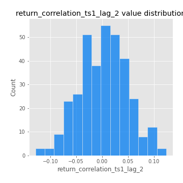
## Feature : return_correlation_ts1_lag_3
- **Feature type** : continous
- **Missing** : 0.0%
- **Unique** : 347
- **Count** :347.0
- **Mean** :-0.004360042743654661
- **Std** :0.04953612789460196
- **Min** :-0.1270218498974763
- **25%th Percentile** : -0.04070849909297683
- **50%th Percentile** : -0.004179797020357867
- **75%th Percentile** : 0.031650804409083744
- **Max** :0.10591749046396597

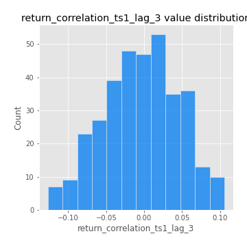
## Feature : return_correlation_ts2_lag_1
- **Feature type** : continous
- **Missing** : 0.0%
- **Unique** : 347
- **Count** :347.0
- **Mean** :-0.004867772439166138
- **Std** :0.05131563987572649
- **Min** :-0.2081139431093261
- **25%th Percentile** : -0.03861940918008894
- **50%th Percentile** : -0.004748320710641742
- **75%th Percentile** : 0.02866725128125902
- **Max** :0.12089745832196941

## Feature : return_correlation_ts2_lag_2
- **Feature type** : continous
- **Missing** : 0.0%
- **Unique** : 347
- **Count** :347.0
- **Mean** :0.0012078564437607512
- **Std** :0.0482523704044829
- **Min** :-0.15299951737180204
- **25%th Percentile** : -0.03142664451923767
- **50%th Percentile** : -0.0013878315666683337
- **75%th Percentile** : 0.028826280247426977
- **Max** :0.20772887392904255

## Feature : return_correlation_ts2_lag_3
- **Feature type** : continous
- **Missing** : 0.0%
- **Unique** : 347
- **Count** :347.0
- **Mean** :-0.0008442800064407974
- **Std** :0.052972967833214965
- **Min** :-0.17564076057312866
- **25%th Percentile** : -0.030698968802299935
- **50%th Percentile** : 0.0007260048395978244
- **75%th Percentile** : 0.03549763167344745
- **Max** :0.13128380114518473

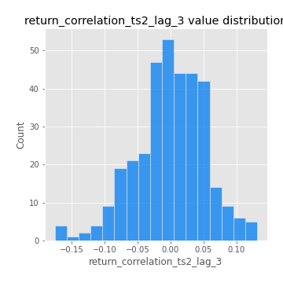
## Feature : sqreturn_autocorrelation_ts1_lag1
- **Feature type** : continous
- **Missing** : 0.0%
- **Unique** : 347
- **Count** :347.0
- **Mean** :0.05092604916229907
- **Std** :0.09336071577435306
- **Min** :-0.09489029933425935
- **25%th Percentile** : -0.009954245551483434
- **50%th Percentile** : 0.02672915646187806
- **75%th Percentile** : 0.08196061160329236
- **Max** :0.4439086285737898

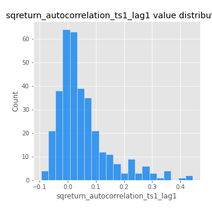
## Feature : sqreturn_autocorrelation_ts1_lag2
- **Feature type** : continous
- **Missing** : 0.0%
- **Unique** : 347
- **Count** :347.0
- **Mean** :0.04446762824677904
- **Std** :0.09542072116229801
- **Min** :-0.1108505571730204
- **25%th Percentile** : -0.012478374862928271
- **50%th Percentile** : 0.01742381197615294
- **75%th Percentile** : 0.06606918478632223
- **Max** :0.540735851444759

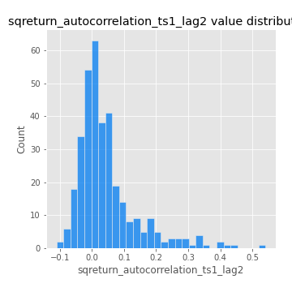
## Feature : sqreturn_autocorrelation_ts1_lag3
- **Feature type** : continous
- **Missing** : 0.0%
- **Unique** : 347
- **Count** :347.0
- **Mean** :0.03707686868588626
- **Std** :0.08647757130255418
- **Min** :-0.09462317990169636
- **25%th Percentile** : -0.015247673622747385
- **50%th Percentile** : 0.012593715022244586
- **75%th Percentile** : 0.06302625843491666
- **Max** :0.44755937369538146

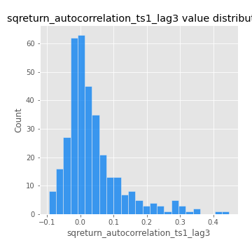
## Feature : sqreturn_autocorrelation_ts2_lag1
- **Feature type** : continous
- **Missing** : 0.0%
- **Unique** : 347
- **Count** :347.0
- **Mean** :0.049128591254344135
- **Std** :0.0857103162956864
- **Min** :-0.08520586663750691
- **25%th Percentile** : -0.01055118065854799
- **50%th Percentile** : 0.031192427314539892
- **75%th Percentile** : 0.08432500946327709
- **Max** :0.510085647437958

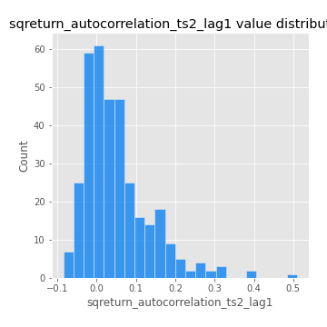
## Feature : sqreturn_autocorrelation_ts2_lag2
- **Feature type** : continous
- **Missing** : 0.0%
- **Unique** : 347
- **Count** :347.0
- **Mean** :0.041134263540096104
- **Std** :0.08968310988834102
- **Min** :-0.088645650513594
- **25%th Percentile** : -0.009875662869796315
- **50%th Percentile** : 0.01627639484191419
- **75%th Percentile** : 0.06468187506073686
- **Max** :0.5373432415582473

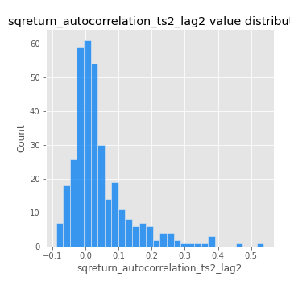
## Feature : sqreturn_autocorrelation_ts2_lag3
- **Feature type** : continous
- **Missing** : 0.0%
- **Unique** : 347
- **Count** :347.0
- **Mean** :0.030902737939575185
- **Std** :0.07233716064550036
- **Min** :-0.08261378650525153
- **25%th Percentile** : -0.01685618560010345
- **50%th Percentile** : 0.01369761785042116
- **75%th Percentile** : 0.05581422918683039
- **Max** :0.31225727797735664

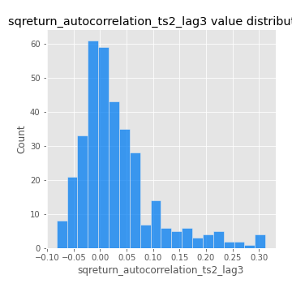
## Feature : sqreturn_correlation_ts1_lag_0
- **Feature type** : continous
- **Missing** : 0.0%
- **Unique** : 347
- **Count** :347.0
- **Mean** :0.30921903913944765
- **Std** :0.11016906405012834
- **Min** :0.013725064995079429
- **25%th Percentile** : 0.2500366864509665
- **50%th Percentile** : 0.2988879159592923
- **75%th Percentile** : 0.35172073381685165
- **Max** :0.7041861626832071

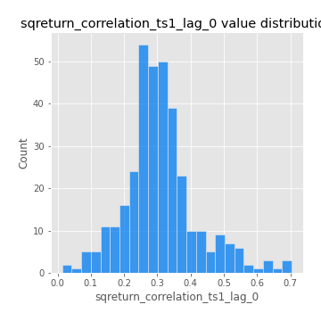
## Feature : sqreturn_correlation_ts1_lag_1
- **Feature type** : continous
- **Missing** : 0.0%
- **Unique** : 347
- **Count** :347.0
- **Mean** :-0.003918055704986222
- **Std** :0.05143703013881607
- **Min** :-0.15776193292681923
- **25%th Percentile** : -0.03853611362034812
- **50%th Percentile** : 0.0008555593415918072
- **75%th Percentile** : 0.03481602939300861
- **Max** :0.13385382553247563

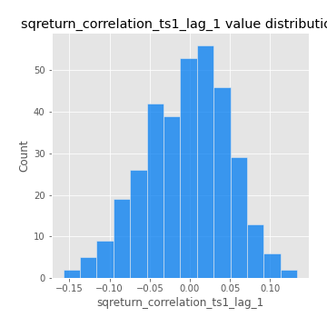
## Feature : sqreturn_correlation_ts1_lag_2
- **Feature type** : continous
- **Missing** : 0.0%
- **Unique** : 347
- **Count** :347.0
- **Mean** :0.0029670218339980757
- **Std** :0.04632894157412827
- **Min** :-0.12864410180561703
- **25%th Percentile** : -0.029341314499256
- **50%th Percentile** : 0.0050422785329039205
- **75%th Percentile** : 0.034606166551256826
- **Max** :0.12411816012143453

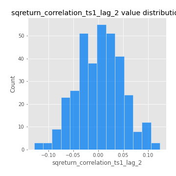
## Feature : sqreturn_correlation_ts1_lag_3
- **Feature type** : continous
- **Missing** : 0.0%
- **Unique** : 347
- **Count** :347.0
- **Mean** :-0.004360042743654661
- **Std** :0.04953612789460196
- **Min** :-0.1270218498974763
- **25%th Percentile** : -0.04070849909297683
- **50%th Percentile** : -0.004179797020357867
- **75%th Percentile** : 0.031650804409083744
- **Max** :0.10591749046396597

## Feature : sqreturn_correlation_ts2_lag_1
- **Feature type** : continous
- **Missing** : 0.0%
- **Unique** : 347
- **Count** :347.0
- **Mean** :-0.004867772439166138
- **Std** :0.05131563987572649
- **Min** :-0.2081139431093261
- **25%th Percentile** : -0.03861940918008894
- **50%th Percentile** : -0.004748320710641742
- **75%th Percentile** : 0.02866725128125902
- **Max** :0.12089745832196941

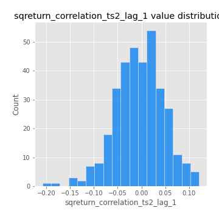
## Feature : sqreturn_correlation_ts2_lag_2
- **Feature type** : continous
- **Missing** : 0.0%
- **Unique** : 347
- **Count** :347.0
- **Mean** :0.0012078564437607512
- **Std** :0.0482523704044829
- **Min** :-0.15299951737180204
- **25%th Percentile** : -0.03142664451923767
- **50%th Percentile** : -0.0013878315666683337
- **75%th Percentile** : 0.028826280247426977
- **Max** :0.20772887392904255

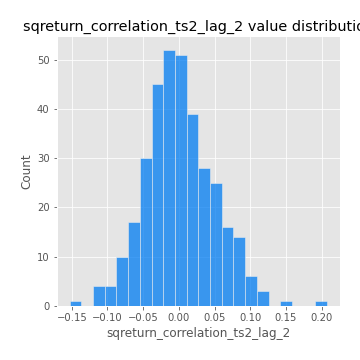
## Feature : sqreturn_correlation_ts2_lag_3
- **Feature type** : continous
- **Missing** : 0.0%
- **Unique** : 347
- **Count** :347.0
- **Mean** :-0.0008442800064407974
- **Std** :0.052972967833214965
- **Min** :-0.17564076057312866
- **25%th Percentile** : -0.030698968802299935
- **50%th Percentile** : 0.0007260048395978244
- **75%th Percentile** : 0.03549763167344745
- **Max** :0.13128380114518473

## Feature : price2_granger_cause_price1
- **Feature type** : continous
- **Missing** : 0.0%
- **Unique** : 347
- **Count** :347.0
- **Mean** :0.3298809904147636
- **Std** :0.30295153106492034
- **Min** :1.754451168725191e-05
- **25%th Percentile** : 0.053837467677762416
- **50%th Percentile** : 0.24060042484908745
- **75%th Percentile** : 0.5671591097456913
- **Max** :0.9968348825794081

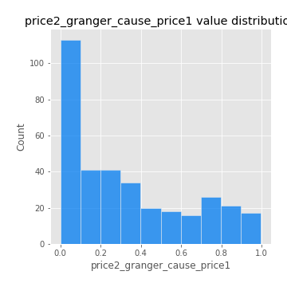
## Feature : price1_granger_cause_price2
- **Feature type** : continous
- **Missing** : 0.0%
- **Unique** : 347
- **Count** :347.0
- **Mean** :0.26154222774384356
- **Std** :0.2838414002678722
- **Min** :8.393222241978007e-09
- **25%th Percentile** : 0.019394675153655214
- **50%th Percentile** : 0.15921880515735812
- **75%th Percentile** : 0.43047011401652213
- **Max** :0.9951398266867577

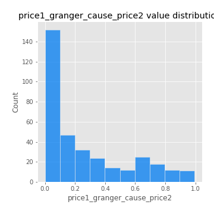

[<< Go back](../README.md)
