# Summary of 2_DecisionTree

[<< Go back](../README.md)

## Decision Tree
- **n_jobs**: -1
- **criterion**: gini
- **max_depth**: 3
- **explain_level**: 2

## Validation
 - **validation_type**: split
 - **train_ratio**: 0.75
 - **shuffle**: True
 - **stratify**: True

## Optimized metric
accuracy

## Training time

13.4 seconds

## Metric details
|           |    score |   threshold |
|:----------|---------:|------------:|
| logloss   | 1.91798  |         nan |
| auc       | 0.859259 |         nan |
| f1        | 0.840909 |           0 |
| accuracy  | 0.83908  |           0 |
| precision | 0.860465 |           0 |
| recall    | 0.822222 |           0 |
| mcc       | 0        |           0 |

## Confusion matrix (at threshold=0.0)
|                      |   Predicted as real |   Predicted as simulated |
|:---------------------|--------------------:|-------------------------:|
| Labeled as real      |                  36 |                        6 |
| Labeled as simulated |                   8 |                       37 |

## Learning curves
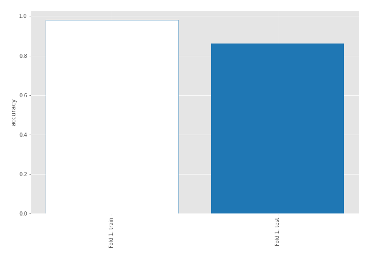

## Decision Tree 

### Tree #1
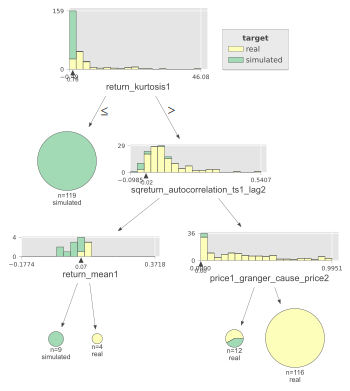

### Rules

if (return_kurtosis1 <= 0.764) then class: simulated (proba: 100.0%) | based on 119 samples

if (return_kurtosis1 > 0.764) and (sqreturn_autocorrelation_ts1_lag2 > -0.022) and (price1_granger_cause_price2 > 0.003) then class: real (proba: 100.0%) | based on 116 samples

if (return_kurtosis1 > 0.764) and (sqreturn_autocorrelation_ts1_lag2 > -0.022) and (price1_granger_cause_price2 <= 0.003) then class: real (proba: 58.33%) | based on 12 samples

if (return_kurtosis1 > 0.764) and (sqreturn_autocorrelation_ts1_lag2 <= -0.022) and (return_mean1 <= 0.068) then class: simulated (proba: 100.0%) | based on 9 samples

if (return_kurtosis1 > 0.764) and (sqreturn_autocorrelation_ts1_lag2 <= -0.022) and (return_mean1 > 0.068) then class: real (proba: 100.0%) | based on 4 samples

## Permutation-based Importance
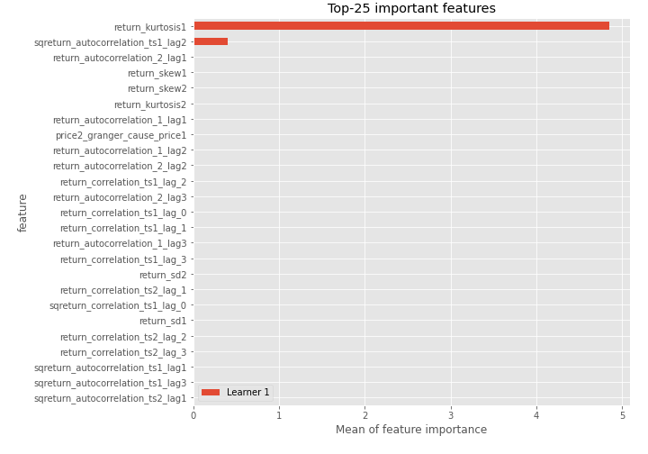
## Confusion Matrix

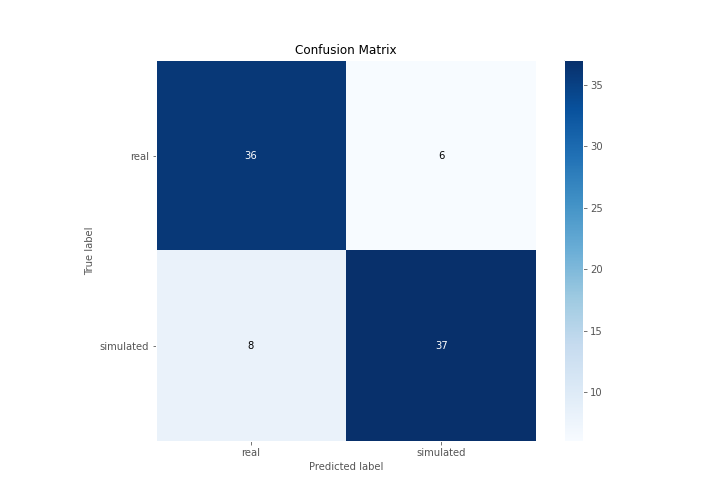

## Normalized Confusion Matrix

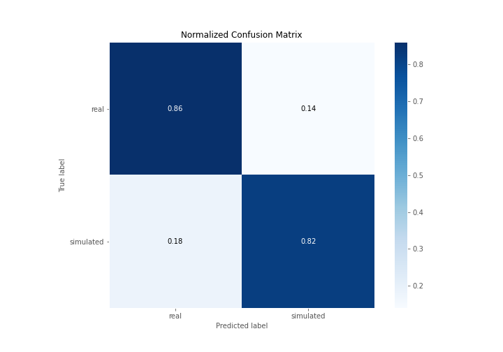

## ROC Curve

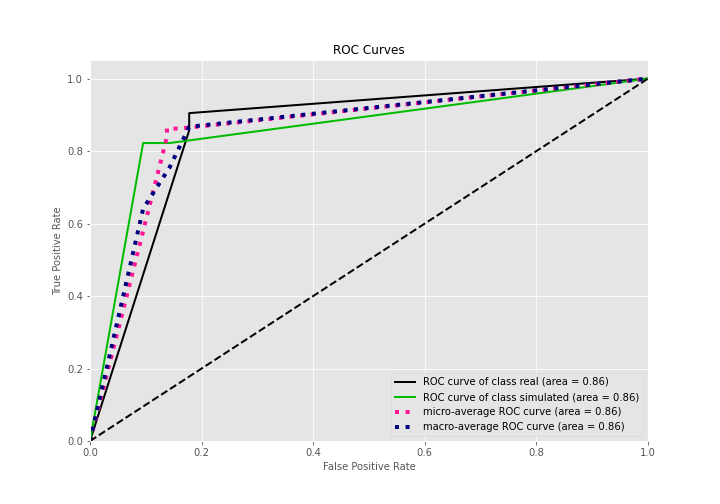

## Kolmogorov-Smirnov Statistic

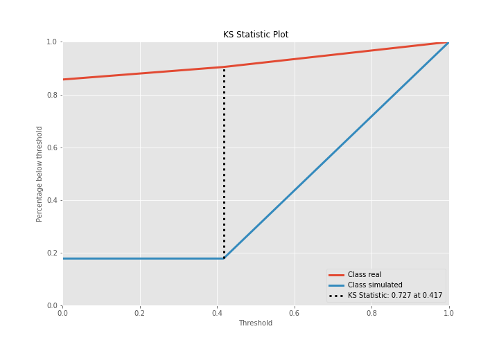

## Precision-Recall Curve

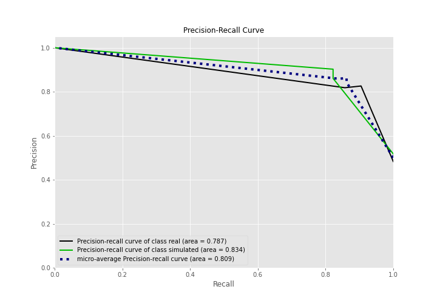

## Calibration Curve

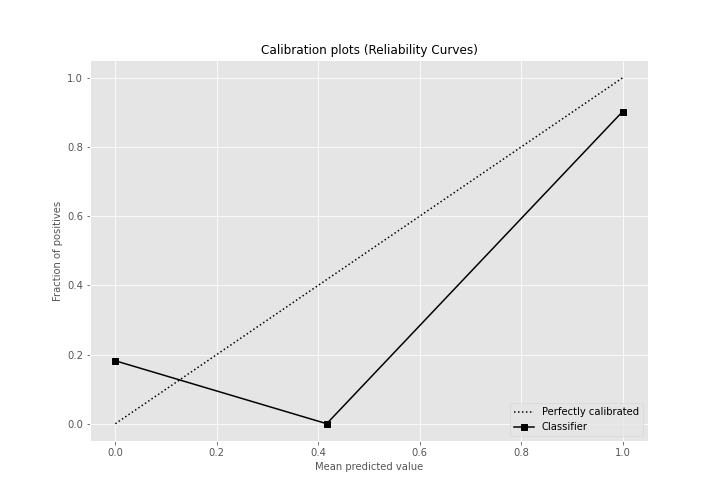

## Cumulative Gains Curve

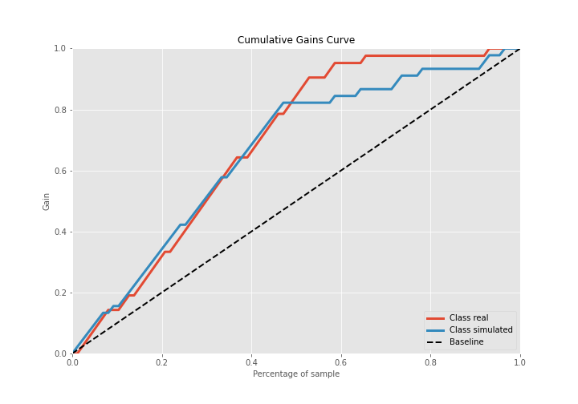

## Lift Curve

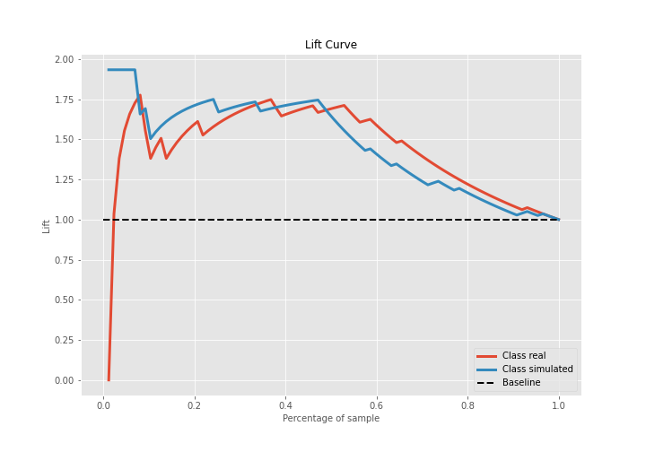

## SHAP Importance
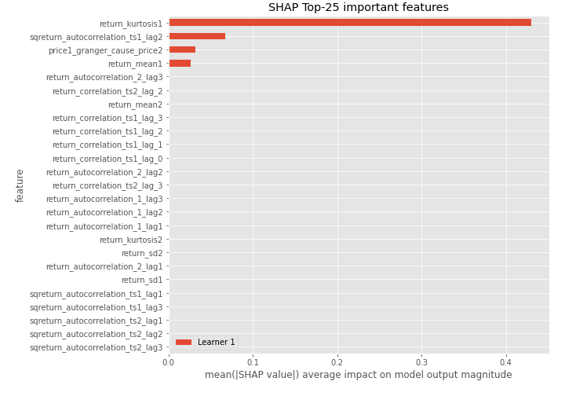

## SHAP Dependence plots

### Dependence (Fold 1)
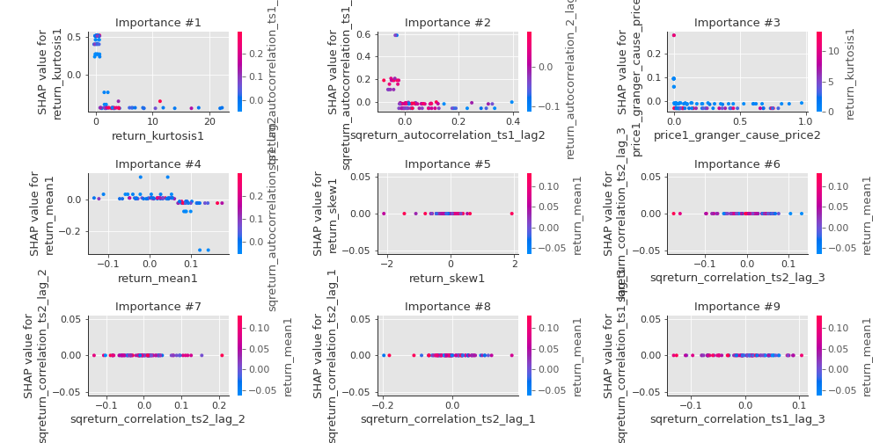

## SHAP Decision plots

### Top-10 Worst decisions for class 0 (Fold 1)
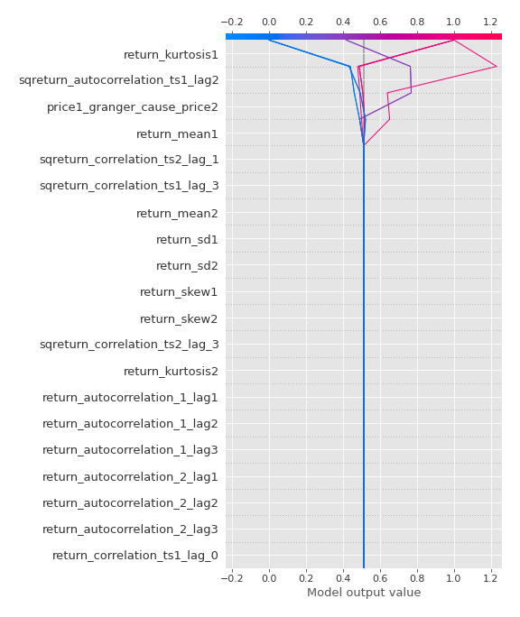
### Top-10 Best decisions for class 0 (Fold 1)
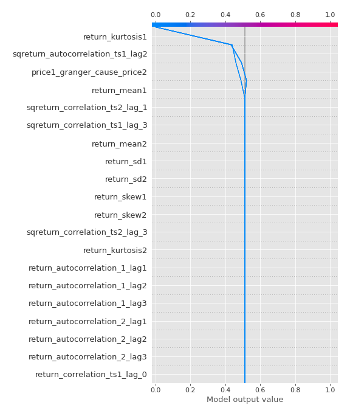
### Top-10 Worst decisions for class 1 (Fold 1)
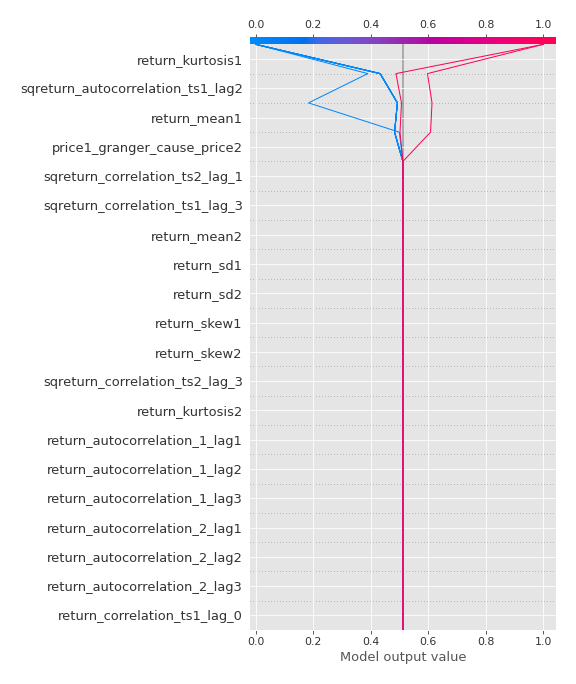
### Top-10 Best decisions for class 1 (Fold 1)
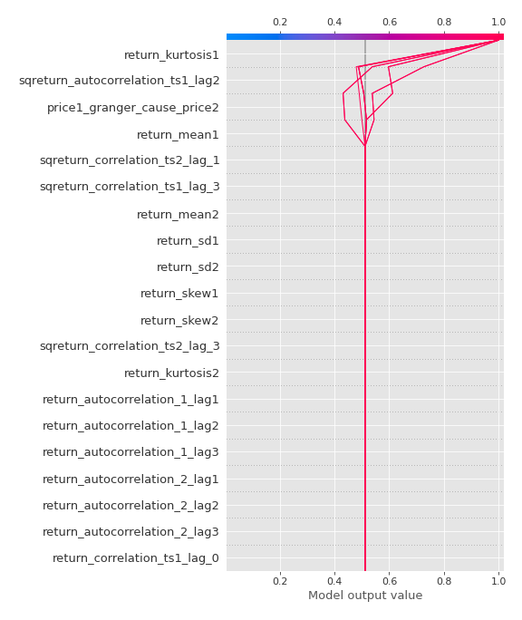

[<< Go back](../README.md)
