# Summary of 3_Linear

[<< Go back](../README.md)

## Logistic Regression (Linear)
- **n_jobs**: -1
- **explain_level**: 2

## Validation
 - **validation_type**: split
 - **train_ratio**: 0.75
 - **shuffle**: True
 - **stratify**: True

## Optimized metric
accuracy

## Training time

4.7 seconds

## Metric details
|           |    score |     threshold |
|:----------|---------:|--------------:|
| logloss   | 0.249165 | nan           |
| auc       | 0.966138 | nan           |
| f1        | 0.911111 |   0.723102    |
| accuracy  | 0.908046 |   0.723102    |
| precision | 1        |   0.916053    |
| recall    | 1        |   2.39696e-07 |
| mcc       | 0.815873 |   0.723102    |

## Confusion matrix (at threshold=0.723102)
|                      |   Predicted as real |   Predicted as simulated |
|:---------------------|--------------------:|-------------------------:|
| Labeled as real      |                  38 |                        4 |
| Labeled as simulated |                   4 |                       41 |

## Learning curves
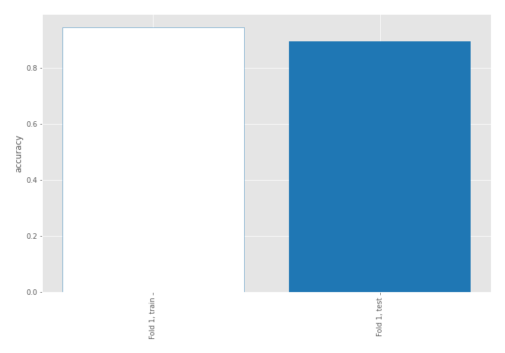

## Coefficients
| feature                           |   Learner_1 |
|:----------------------------------|------------:|
| return_autocorrelation_2_lag2     |   0.543472  |
| return_autocorrelation_2_lag1     |   0.51597   |
| return_autocorrelation_2_lag3     |   0.488214  |
| return_correlation_ts2_lag_1      |   0.387018  |
| sqreturn_correlation_ts2_lag_1    |   0.387018  |
| sqreturn_correlation_ts1_lag_1    |   0.314195  |
| return_correlation_ts1_lag_1      |   0.314195  |
| sqreturn_correlation_ts1_lag_3    |   0.295298  |
| return_correlation_ts1_lag_3      |   0.295298  |
| return_mean2                      |   0.259971  |
| return_correlation_ts1_lag_2      |   0.221385  |
| sqreturn_correlation_ts1_lag_2    |   0.221385  |
| return_autocorrelation_1_lag3     |   0.221014  |
| return_autocorrelation_1_lag1     |   0.21021   |
| sqreturn_correlation_ts2_lag_3    |   0.140898  |
| return_correlation_ts2_lag_3      |   0.140898  |
| sqreturn_correlation_ts2_lag_2    |   0.122881  |
| return_correlation_ts2_lag_2      |   0.122881  |
| return_autocorrelation_1_lag2     |   0.0963861 |
| price2_granger_cause_price1       |  -0.0206047 |
| return_sd2                        |  -0.318009  |
| return_skew2                      |  -0.332381  |
| return_skew1                      |  -0.632094  |
| return_mean1                      |  -0.647122  |
| price1_granger_cause_price2       |  -0.674249  |
| return_sd1                        |  -0.677362  |
| sqreturn_correlation_ts1_lag_0    |  -0.737836  |
| return_correlation_ts1_lag_0      |  -0.737836  |
| intercept                         |  -0.850273  |
| sqreturn_autocorrelation_ts2_lag3 |  -0.86486   |
| sqreturn_autocorrelation_ts1_lag3 |  -0.934764  |
| sqreturn_autocorrelation_ts2_lag2 |  -1.0824    |
| sqreturn_autocorrelation_ts2_lag1 |  -1.1974    |
| sqreturn_autocorrelation_ts1_lag2 |  -1.21925   |
| sqreturn_autocorrelation_ts1_lag1 |  -1.4258    |
| return_kurtosis2                  |  -3.0945    |
| return_kurtosis1                  |  -4.07907   |

## Permutation-based Importance
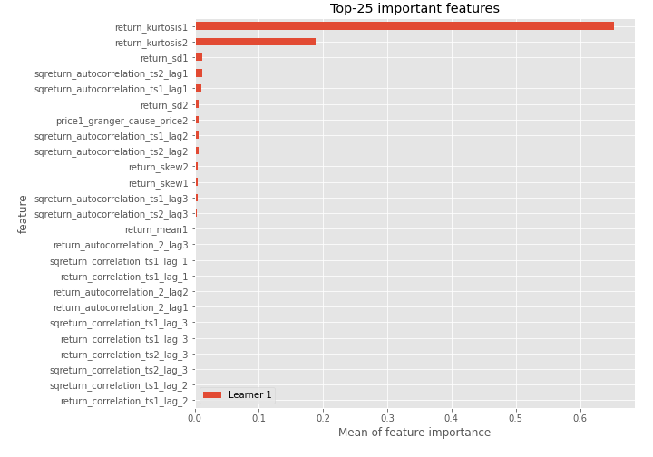
## Confusion Matrix

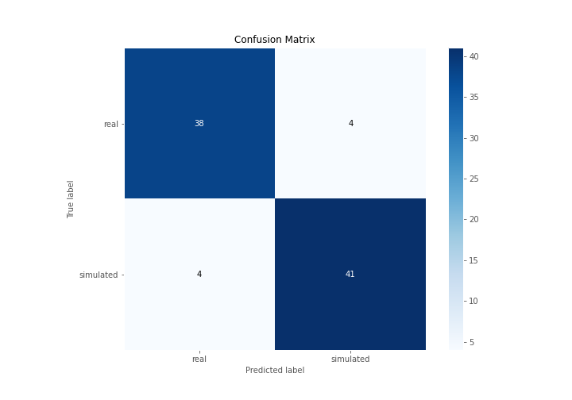

## Normalized Confusion Matrix

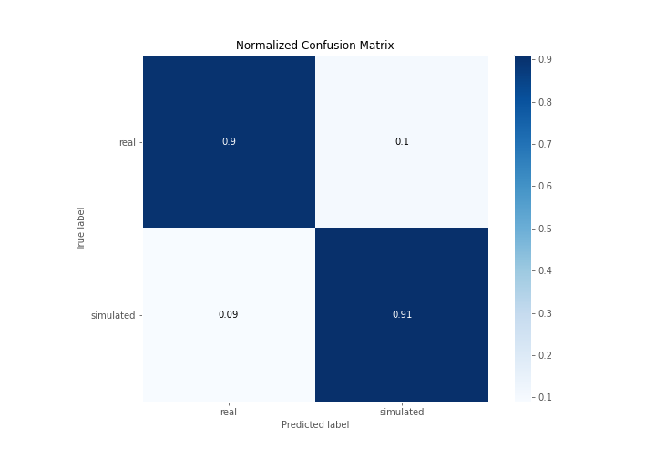

## ROC Curve

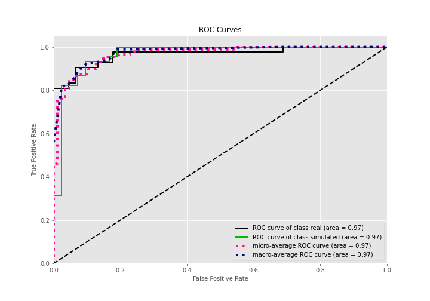

## Kolmogorov-Smirnov Statistic

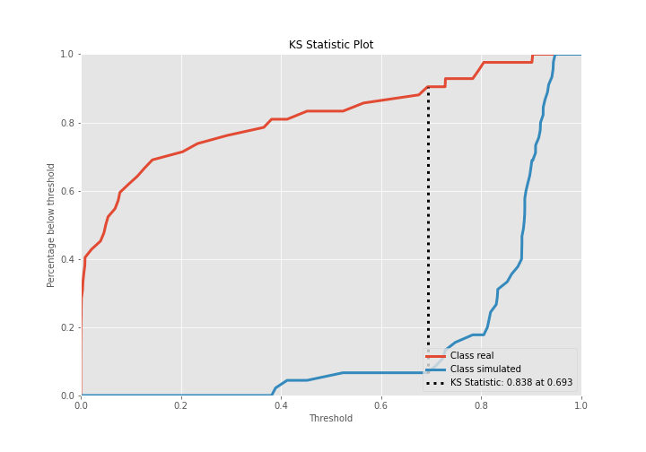

## Precision-Recall Curve

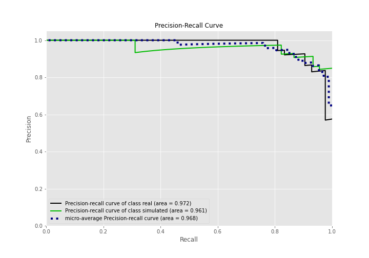

## Calibration Curve

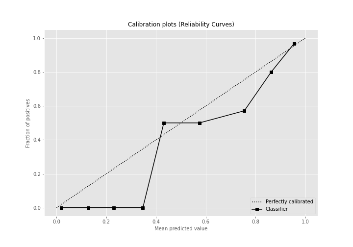

## Cumulative Gains Curve

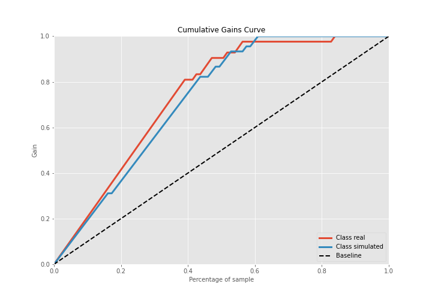

## Lift Curve

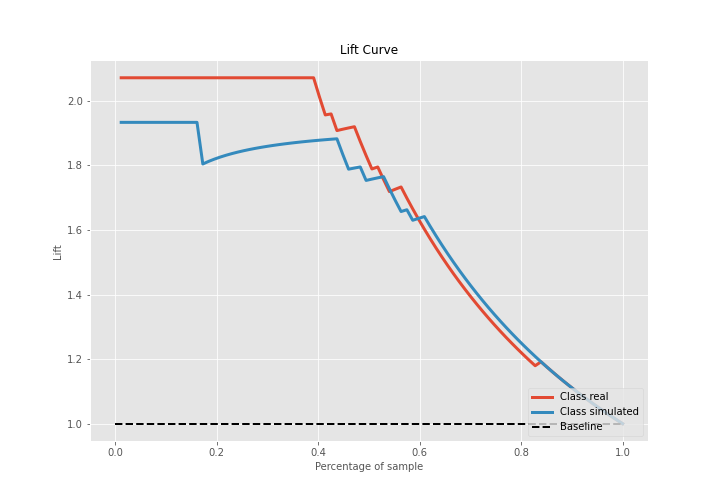

## SHAP Importance
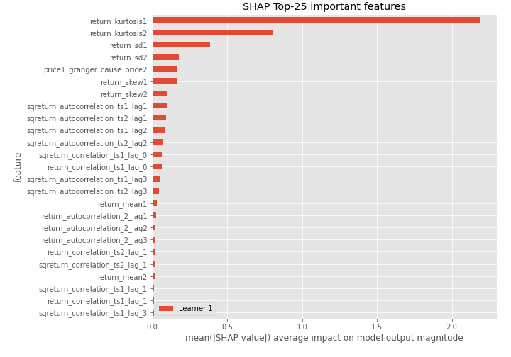

## SHAP Dependence plots

### Dependence (Fold 1)
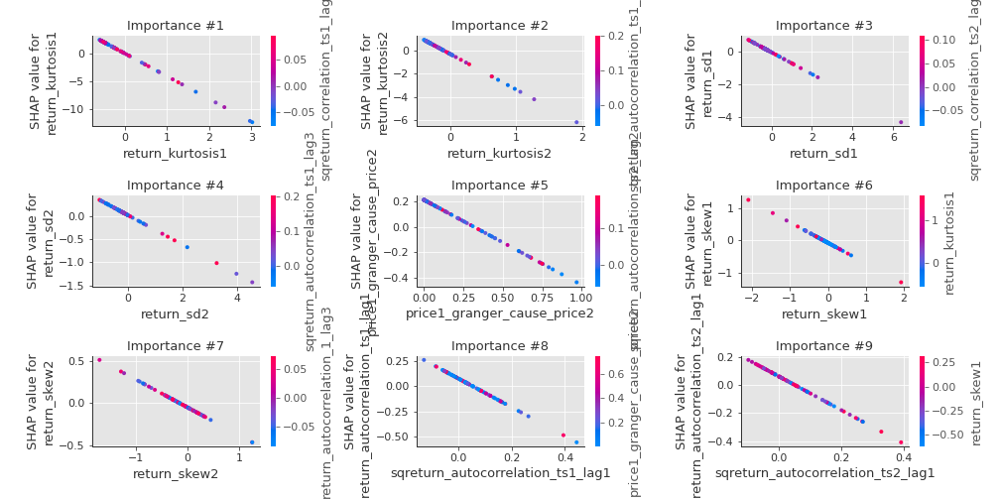

## SHAP Decision plots

### Top-10 Worst decisions for class 0 (Fold 1)
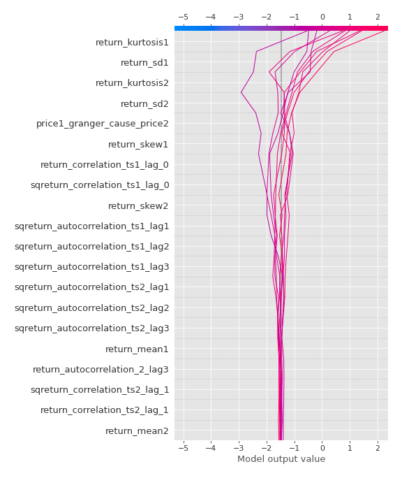
### Top-10 Best decisions for class 0 (Fold 1)
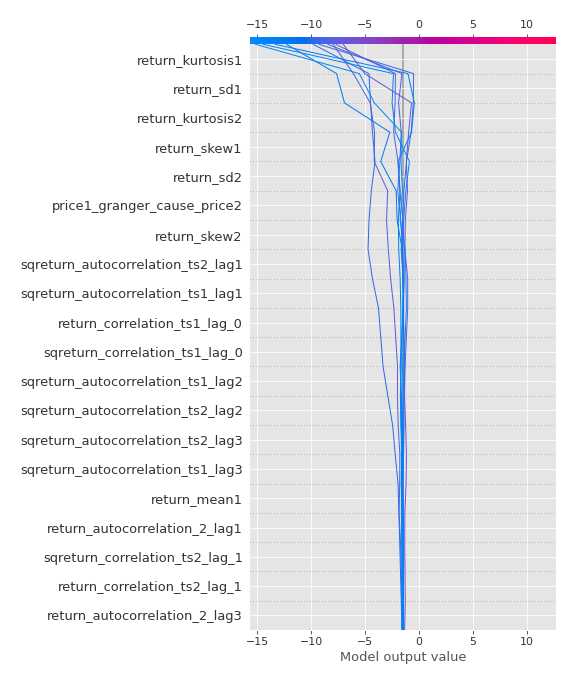
### Top-10 Worst decisions for class 1 (Fold 1)
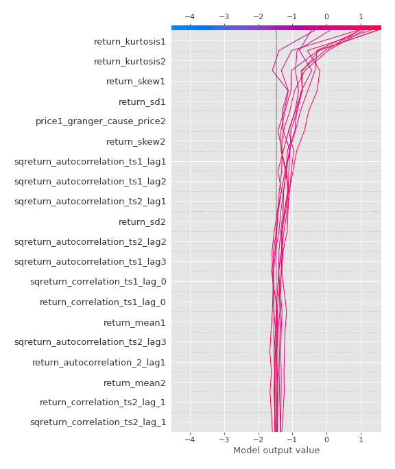
### Top-10 Best decisions for class 1 (Fold 1)
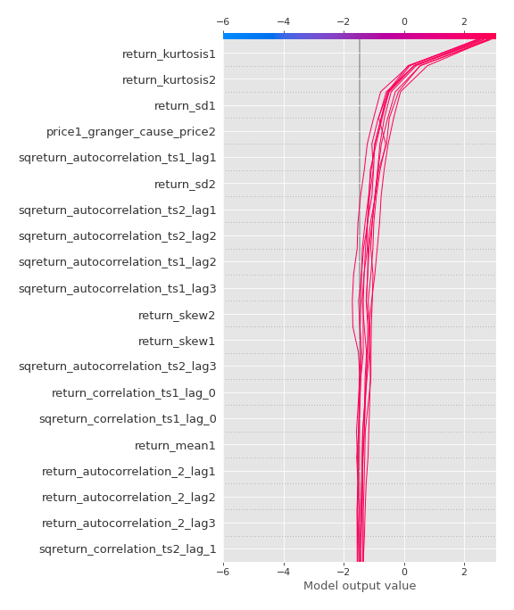

[<< Go back](../README.md)
