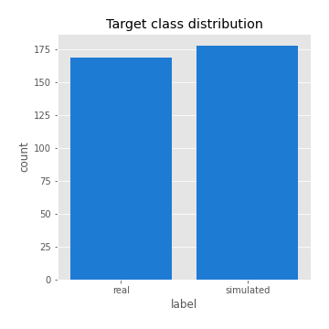

# Exploratory Data Analysis

[<< Go back](../README.md)
## Feature : target
- **Feature type** : categorical
- **Missing** : 0.0%
- **Unique** : 2
- **Count** :347
- **Unique** :2
- **Top** :simulated
- **Freq** :178

## Feature : return_mean1
- **Feature type** : continous
- **Missing** : 0.0%
- **Unique** : 347
- **Count** :347.0
- **Mean** :0.03529190699474529
- **Std** :0.07338443343932131
- **Min** :-0.17738969509652883
- **25%th Percentile** : -0.011357114235232304
- **50%th Percentile** : 0.03512638441177084
- **75%th Percentile** : 0.08334594201754894
- **Max** :0.37175100008111034

## Feature : return_mean2
- **Feature type** : continous
- **Missing** : 0.0%
- **Unique** : 347
- **Count** :347.0
- **Mean** :0.06720804311274613
- **Std** :0.08842082465458877
- **Min** :-0.21818165578778434
- **25%th Percentile** : 0.021426668071370905
- **50%th Percentile** : 0.06186970012177531
- **75%th Percentile** : 0.11373768682194167
- **Max** :0.37616608147096464

## Feature : return_sd1
- **Feature type** : continous
- **Missing** : 0.0%
- **Unique** : 347
- **Count** :347.0
- **Mean** :1.686428781285319
- **Std** :0.6658771894737906
- **Min** :0.7470080772831957
- **25%th Percentile** : 1.4257572680566197
- **50%th Percentile** : 1.490651870252239
- **75%th Percentile** : 1.6533767460973428
- **Max** :6.495661311240861

## Feature : return_sd2
- **Feature type** : continous
- **Missing** : 0.0%
- **Unique** : 347
- **Count** :347.0
- **Mean** :1.7070745520871264
- **Std** :0.5884422654583208
- **Min** :0.8455946193085045
- **25%th Percentile** : 1.4873409012902263
- **50%th Percentile** : 1.572878368788157
- **75%th Percentile** : 1.6594247617528637
- **Max** :5.042707010333888

## Feature : return_skew1
- **Feature type** : continous
- **Missing** : 0.0%
- **Unique** : 347
- **Count** :347.0
- **Mean** :-0.115335125361897
- **Std** :0.6091425923213756
- **Min** :-3.530116233761814
- **25%th Percentile** : -0.22999278840433623
- **50%th Percentile** : -0.07152046950841208
- **75%th Percentile** : 0.07206106954848988
- **Max** :2.5845963767725557

## Feature : return_skew2
- **Feature type** : continous
- **Missing** : 0.0%
- **Unique** : 347
- **Count** :347.0
- **Mean** :-0.22499308700613105
- **Std** :0.8110575931338292
- **Min** :-8.801502855292393
- **25%th Percentile** : -0.36797011552842024
- **50%th Percentile** : -0.14941190117924177
- **75%th Percentile** : 0.042054737613143545
- **Max** :2.2606839051517187

## Feature : return_kurtosis1
- **Feature type** : continous
- **Missing** : 0.0%
- **Unique** : 347
- **Count** :347.0
- **Mean** :3.3218141151852048
- **Std** :5.901597009738153
- **Min** :-0.4930855133267502
- **25%th Percentile** : 0.18414475220881643
- **50%th Percentile** : 1.036885937644493
- **75%th Percentile** : 3.691025264972352
- **Max** :46.07507808162177

## Feature : return_kurtosis2
- **Feature type** : continous
- **Missing** : 0.0%
- **Unique** : 347
- **Count** :347.0
- **Mean** :4.114169242334617
- **Std** :10.153319853591476
- **Min** :-0.2857203163782973
- **25%th Percentile** : 0.6196167931379957
- **50%th Percentile** : 1.495181828389176
- **75%th Percentile** : 4.101810584478865
- **Max** :143.10871011533666

## Feature : return_autocorrelation_1_lag1
- **Feature type** : continous
- **Missing** : 0.0%
- **Unique** : 347
- **Count** :347.0
- **Mean** :-0.01534536969820459
- **Std** :0.05568748901749262
- **Min** :-0.2135576224968752
- **25%th Percentile** : -0.04552700537237704
- **50%th Percentile** : -0.010187421640847096
- **75%th Percentile** : 0.02218868088254842
- **Max** :0.1077806171879921

## Feature : return_autocorrelation_1_lag2
- **Feature type** : continous
- **Missing** : 0.0%
- **Unique** : 347
- **Count** :347.0
- **Mean** :-0.004837935666447009
- **Std** :0.05071063345453133
- **Min** :-0.16649945039776973
- **25%th Percentile** : -0.03733367077534049
- **50%th Percentile** : -0.003362474849857754
- **75%th Percentile** : 0.02791608832873236
- **Max** :0.1624486376330088

## Feature : return_autocorrelation_1_lag3
- **Feature type** : continous
- **Missing** : 0.0%
- **Unique** : 347
- **Count** :347.0
- **Mean** :-0.003555630877894428
- **Std** :0.05064590744750211
- **Min** :-0.15806635192103805
- **25%th Percentile** : -0.03695970759049355
- **50%th Percentile** : -0.001642406075705222
- **75%th Percentile** : 0.0332314214069962
- **Max** :0.11028973727744579

## Feature : return_autocorrelation_2_lag1
- **Feature type** : continous
- **Missing** : 0.0%
- **Unique** : 347
- **Count** :347.0
- **Mean** :-0.0012828997673048949
- **Std** :0.06129180123153675
- **Min** :-0.25075531010123286
- **25%th Percentile** : -0.03391142132851639
- **50%th Percentile** : 0.003650849424585343
- **75%th Percentile** : 0.03978168342509285
- **Max** :0.31863413537898483

## Feature : return_autocorrelation_2_lag2
- **Feature type** : continous
- **Missing** : 0.0%
- **Unique** : 347
- **Count** :347.0
- **Mean** :0.004810954596010394
- **Std** :0.050802980966762785
- **Min** :-0.1495113937562178
- **25%th Percentile** : -0.029201478709591125
- **50%th Percentile** : 0.0048419188489633065
- **75%th Percentile** : 0.0395424487265105
- **Max** :0.20974504043791217

## Feature : return_autocorrelation_2_lag3
- **Feature type** : continous
- **Missing** : 0.0%
- **Unique** : 347
- **Count** :347.0
- **Mean** :0.005958431701673702
- **Std** :0.050568726161195426
- **Min** :-0.14200107169559698
- **25%th Percentile** : -0.026639560807721105
- **50%th Percentile** : 0.005486115970858677
- **75%th Percentile** : 0.041900403867350666
- **Max** :0.1419999376914021

## Feature : return_correlation_ts1_lag_0
- **Feature type** : continous
- **Missing** : 0.0%
- **Unique** : 347
- **Count** :347.0
- **Mean** :0.3086782253997913
- **Std** :0.11223378667622097
- **Min** :0.005136598099876001
- **25%th Percentile** : 0.24734770102348957
- **50%th Percentile** : 0.29701257567964834
- **75%th Percentile** : 0.35118772800927445
- **Max** :0.7028422087350163

## Feature : return_correlation_ts1_lag_1
- **Feature type** : continous
- **Missing** : 0.0%
- **Unique** : 347
- **Count** :347.0
- **Mean** :-0.008949235024789884
- **Std** :0.05266367930748709
- **Min** :-0.16985510949917193
- **25%th Percentile** : -0.043223344343525275
- **50%th Percentile** : -0.003756099526548236
- **75%th Percentile** : 0.02927216657894877
- **Max** :0.12004722186140242

## Feature : return_correlation_ts1_lag_2
- **Feature type** : continous
- **Missing** : 0.0%
- **Unique** : 347
- **Count** :347.0
- **Mean** :0.003973239476008841
- **Std** :0.04967667174149607
- **Min** :-0.21653581047581763
- **25%th Percentile** : -0.02918874462750256
- **50%th Percentile** : 0.0017440570037897262
- **75%th Percentile** : 0.040881786435728706
- **Max** :0.1462100168322647

## Feature : return_correlation_ts1_lag_3
- **Feature type** : continous
- **Missing** : 0.0%
- **Unique** : 347
- **Count** :347.0
- **Mean** :0.001397996884267027
- **Std** :0.05182507270437238
- **Min** :-0.13234518941407658
- **25%th Percentile** : -0.033484238272945756
- **50%th Percentile** : 0.004058162162078666
- **75%th Percentile** : 0.03658379390988663
- **Max** :0.1422809271770942

## Feature : return_correlation_ts2_lag_1
- **Feature type** : continous
- **Missing** : 0.0%
- **Unique** : 347
- **Count** :347.0
- **Mean** :-0.0015639391039425504
- **Std** :0.0521019340854447
- **Min** :-0.2081139431093261
- **25%th Percentile** : -0.03263619132913249
- **50%th Percentile** : -0.004876884790633577
- **75%th Percentile** : 0.03209222925180358
- **Max** :0.17208763791364762

## Feature : return_correlation_ts2_lag_2
- **Feature type** : continous
- **Missing** : 0.0%
- **Unique** : 347
- **Count** :347.0
- **Mean** :-0.0011609159578473594
- **Std** :0.05300073386881088
- **Min** :-0.23751835475804678
- **25%th Percentile** : -0.0380987478916274
- **50%th Percentile** : -0.0018815495464095055
- **75%th Percentile** : 0.031922013457392595
- **Max** :0.20772887392904255

## Feature : return_correlation_ts2_lag_3
- **Feature type** : continous
- **Missing** : 0.0%
- **Unique** : 347
- **Count** :347.0
- **Mean** :0.003469145412772562
- **Std** :0.05061419154128312
- **Min** :-0.17564076057312866
- **25%th Percentile** : -0.02621850512171689
- **50%th Percentile** : 0.002871215178689631
- **75%th Percentile** : 0.03877383380708876
- **Max** :0.1475122879386088

## Feature : sqreturn_autocorrelation_ts1_lag1
- **Feature type** : continous
- **Missing** : 0.0%
- **Unique** : 347
- **Count** :347.0
- **Mean** :0.04490170346738716
- **Std** :0.08702463594265282
- **Min** :-0.12856918931621922
- **25%th Percentile** : -0.009298740628603367
- **50%th Percentile** : 0.02646910530292259
- **75%th Percentile** : 0.07973688075171828
- **Max** :0.4439086285737898

## Feature : sqreturn_autocorrelation_ts1_lag2
- **Feature type** : continous
- **Missing** : 0.0%
- **Unique** : 347
- **Count** :347.0
- **Mean** :0.03732631177430437
- **Std** :0.090746342574058
- **Min** :-0.09846508616768906
- **25%th Percentile** : -0.017281276676379475
- **50%th Percentile** : 0.013614749563585297
- **75%th Percentile** : 0.06559144137208814
- **Max** :0.540735851444759

## Feature : sqreturn_autocorrelation_ts1_lag3
- **Feature type** : continous
- **Missing** : 0.0%
- **Unique** : 347
- **Count** :347.0
- **Mean** :0.03311213142771707
- **Std** :0.07623828989434653
- **Min** :-0.0976216375502929
- **25%th Percentile** : -0.011760402846095176
- **50%th Percentile** : 0.014269743043924777
- **75%th Percentile** : 0.05908960840570426
- **Max** :0.3457940197475473

## Feature : sqreturn_autocorrelation_ts2_lag1
- **Feature type** : continous
- **Missing** : 0.0%
- **Unique** : 347
- **Count** :347.0
- **Mean** :0.047107283333666636
- **Std** :0.08701262632402629
- **Min** :-0.10370741710427127
- **25%th Percentile** : -0.011988249621564289
- **50%th Percentile** : 0.022529642572539425
- **75%th Percentile** : 0.08175870480823681
- **Max** :0.3965571120415088

## Feature : sqreturn_autocorrelation_ts2_lag2
- **Feature type** : continous
- **Missing** : 0.0%
- **Unique** : 347
- **Count** :347.0
- **Mean** :0.03934192301921787
- **Std** :0.08866878107853927
- **Min** :-0.09154608559446763
- **25%th Percentile** : -0.012568599338182771
- **50%th Percentile** : 0.01388716120748918
- **75%th Percentile** : 0.06363789412591268
- **Max** :0.5373432415582473

## Feature : sqreturn_autocorrelation_ts2_lag3
- **Feature type** : continous
- **Missing** : 0.0%
- **Unique** : 347
- **Count** :347.0
- **Mean** :0.028554607220536633
- **Std** :0.0710571730854543
- **Min** :-0.0995078451515619
- **25%th Percentile** : -0.014972905068593143
- **50%th Percentile** : 0.013290789320237409
- **75%th Percentile** : 0.05072551628207648
- **Max** :0.31225727797735664

## Feature : sqreturn_correlation_ts1_lag_0
- **Feature type** : continous
- **Missing** : 0.0%
- **Unique** : 347
- **Count** :347.0
- **Mean** :0.3086782253997913
- **Std** :0.11223378667622097
- **Min** :0.005136598099876001
- **25%th Percentile** : 0.24734770102348957
- **50%th Percentile** : 0.29701257567964834
- **75%th Percentile** : 0.35118772800927445
- **Max** :0.7028422087350163

## Feature : sqreturn_correlation_ts1_lag_1
- **Feature type** : continous
- **Missing** : 0.0%
- **Unique** : 347
- **Count** :347.0
- **Mean** :-0.008949235024789884
- **Std** :0.05266367930748709
- **Min** :-0.16985510949917193
- **25%th Percentile** : -0.043223344343525275
- **50%th Percentile** : -0.003756099526548236
- **75%th Percentile** : 0.02927216657894877
- **Max** :0.12004722186140242

## Feature : sqreturn_correlation_ts1_lag_2
- **Feature type** : continous
- **Missing** : 0.0%
- **Unique** : 347
- **Count** :347.0
- **Mean** :0.003973239476008841
- **Std** :0.04967667174149607
- **Min** :-0.21653581047581763
- **25%th Percentile** : -0.02918874462750256
- **50%th Percentile** : 0.0017440570037897262
- **75%th Percentile** : 0.040881786435728706
- **Max** :0.1462100168322647

## Feature : sqreturn_correlation_ts1_lag_3
- **Feature type** : continous
- **Missing** : 0.0%
- **Unique** : 347
- **Count** :347.0
- **Mean** :0.001397996884267027
- **Std** :0.05182507270437238
- **Min** :-0.13234518941407658
- **25%th Percentile** : -0.033484238272945756
- **50%th Percentile** : 0.004058162162078666
- **75%th Percentile** : 0.03658379390988663
- **Max** :0.1422809271770942

## Feature : sqreturn_correlation_ts2_lag_1
- **Feature type** : continous
- **Missing** : 0.0%
- **Unique** : 347
- **Count** :347.0
- **Mean** :-0.0015639391039425504
- **Std** :0.0521019340854447
- **Min** :-0.2081139431093261
- **25%th Percentile** : -0.03263619132913249
- **50%th Percentile** : -0.004876884790633577
- **75%th Percentile** : 0.03209222925180358
- **Max** :0.17208763791364762

## Feature : sqreturn_correlation_ts2_lag_2
- **Feature type** : continous
- **Missing** : 0.0%
- **Unique** : 347
- **Count** :347.0
- **Mean** :-0.0011609159578473594
- **Std** :0.05300073386881088
- **Min** :-0.23751835475804678
- **25%th Percentile** : -0.0380987478916274
- **50%th Percentile** : -0.0018815495464095055
- **75%th Percentile** : 0.031922013457392595
- **Max** :0.20772887392904255

## Feature : sqreturn_correlation_ts2_lag_3
- **Feature type** : continous
- **Missing** : 0.0%
- **Unique** : 347
- **Count** :347.0
- **Mean** :0.003469145412772562
- **Std** :0.05061419154128312
- **Min** :-0.17564076057312866
- **25%th Percentile** : -0.02621850512171689
- **50%th Percentile** : 0.002871215178689631
- **75%th Percentile** : 0.03877383380708876
- **Max** :0.1475122879386088

## Feature : price2_granger_cause_price1
- **Feature type** : continous
- **Missing** : 0.0%
- **Unique** : 347
- **Count** :347.0
- **Mean** :0.3124508724397524
- **Std** :0.2887751897780703
- **Min** :4.054552017082159e-06
- **25%th Percentile** : 0.04283938978956456
- **50%th Percentile** : 0.2369928032318464
- **75%th Percentile** : 0.5267401001145366
- **Max** :0.9853666024514321

## Feature : price1_granger_cause_price2
- **Feature type** : continous
- **Missing** : 0.0%
- **Unique** : 347
- **Count** :347.0
- **Mean** :0.2595481368865307
- **Std** :0.27920248841220013
- **Min** :1.0153801623872381e-06
- **25%th Percentile** : 0.019851001521776844
- **50%th Percentile** : 0.15834996541248694
- **75%th Percentile** : 0.43047011401652213
- **Max** :0.9951398266867577

[<< Go back](../README.md)
