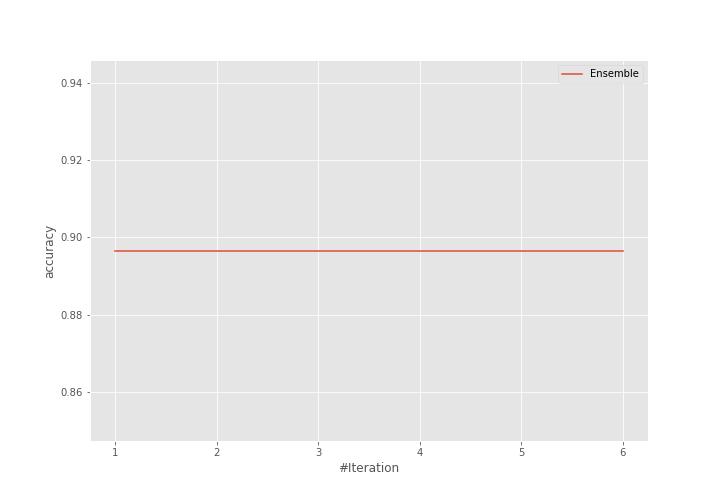

# Summary of Ensemble

[<< Go back](../README.md)

## Ensemble structure
| Model    |   Weight |
|:---------|---------:|
| 3_Linear |        1 |

## Metric details
|           |    score |     threshold |
|:----------|---------:|--------------:|
| logloss   | 0.249165 | nan           |
| auc       | 0.966138 | nan           |
| f1        | 0.911111 |   0.723102    |
| accuracy  | 0.908046 |   0.723102    |
| precision | 1        |   0.916053    |
| recall    | 1        |   2.39696e-07 |
| mcc       | 0.815873 |   0.723102    |

## Confusion matrix (at threshold=0.723102)
|                      |   Predicted as real |   Predicted as simulated |
|:---------------------|--------------------:|-------------------------:|
| Labeled as real      |                  38 |                        4 |
| Labeled as simulated |                   4 |                       41 |

## Learning curves

## Confusion Matrix

## Normalized Confusion Matrix

## ROC Curve

## Kolmogorov-Smirnov Statistic

## Precision-Recall Curve

## Calibration Curve

## Cumulative Gains Curve

## Lift Curve

[<< Go back](../README.md)
