# Summary of 3_Linear

[<< Go back](../README.md)

## Logistic Regression (Linear)
- **n_jobs**: -1
- **explain_level**: 2

## Validation
 - **validation_type**: split
 - **train_ratio**: 0.75
 - **shuffle**: True
 - **stratify**: True

## Optimized metric
accuracy

## Training time

4.2 seconds

## Metric details
|           |    score |     threshold |
|:----------|---------:|--------------:|
| logloss   | 0.336235 | nan           |
| auc       | 0.947146 | nan           |
| f1        | 0.917647 |   0.653268    |
| accuracy  | 0.91954  |   0.653268    |
| precision | 1        |   0.909997    |
| recall    | 1        |   2.16778e-07 |
| mcc       | 0.84446  |   0.766691    |

## Confusion matrix (at threshold=0.653268)
|                      |   Predicted as real |   Predicted as simulated |
|:---------------------|--------------------:|-------------------------:|
| Labeled as real      |                  41 |                        3 |
| Labeled as simulated |                   4 |                       39 |

## Learning curves
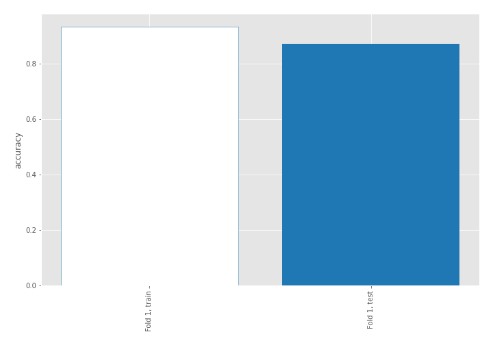

## Coefficients
| feature                           |   Learner_1 |
|:----------------------------------|------------:|
| return_autocorrelation_2_lag3     |  0.65727    |
| return_autocorrelation_2_lag2     |  0.552624   |
| sqreturn_correlation_ts1_lag_1    |  0.543192   |
| return_correlation_ts1_lag_1      |  0.543192   |
| return_autocorrelation_2_lag1     |  0.497533   |
| sqreturn_correlation_ts1_lag_2    |  0.31459    |
| return_correlation_ts1_lag_2      |  0.31459    |
| return_autocorrelation_1_lag1     |  0.29618    |
| sqreturn_correlation_ts2_lag_1    |  0.288208   |
| return_correlation_ts2_lag_1      |  0.288208   |
| return_correlation_ts1_lag_3      |  0.267477   |
| sqreturn_correlation_ts1_lag_3    |  0.267477   |
| return_mean2                      |  0.25549    |
| return_correlation_ts2_lag_3      |  0.255398   |
| sqreturn_correlation_ts2_lag_3    |  0.255398   |
| return_autocorrelation_1_lag2     |  0.252952   |
| return_autocorrelation_1_lag3     |  0.228323   |
| return_correlation_ts1_lag_0      |  0.0265443  |
| sqreturn_correlation_ts1_lag_0    |  0.0265443  |
| return_correlation_ts2_lag_2      |  0.00127943 |
| sqreturn_correlation_ts2_lag_2    |  0.00127943 |
| return_sd2                        | -0.271538   |
| return_skew1                      | -0.337226   |
| return_skew2                      | -0.379554   |
| price1_granger_cause_price2       | -0.553692   |
| return_sd1                        | -0.594911   |
| price2_granger_cause_price1       | -0.663918   |
| sqreturn_autocorrelation_ts2_lag3 | -0.688531   |
| intercept                         | -0.83194    |
| return_mean1                      | -0.925287   |
| sqreturn_autocorrelation_ts1_lag3 | -1.05297    |
| sqreturn_autocorrelation_ts1_lag2 | -1.33373    |
| sqreturn_autocorrelation_ts2_lag2 | -1.40202    |
| sqreturn_autocorrelation_ts2_lag1 | -1.60481    |
| sqreturn_autocorrelation_ts1_lag1 | -1.77495    |
| return_kurtosis2                  | -2.20929    |
| return_kurtosis1                  | -3.69211    |

## Permutation-based Importance
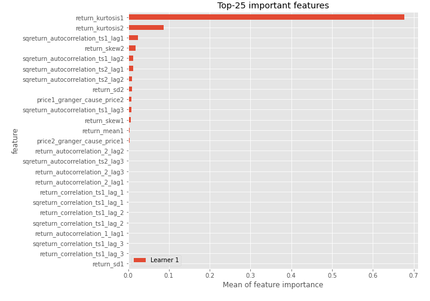
## Confusion Matrix

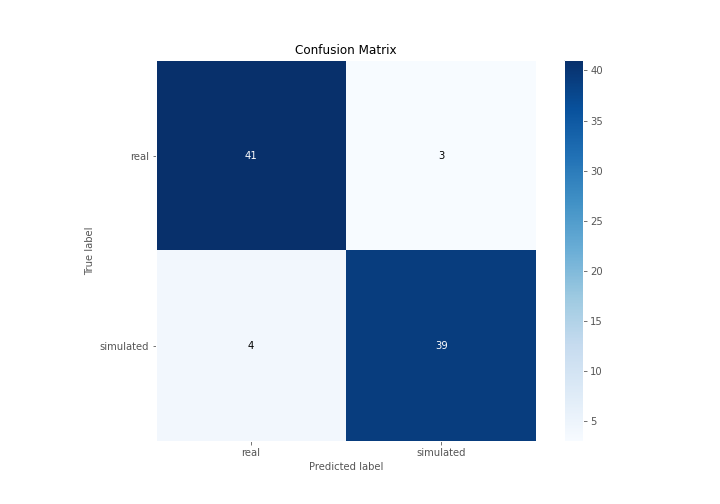

## Normalized Confusion Matrix

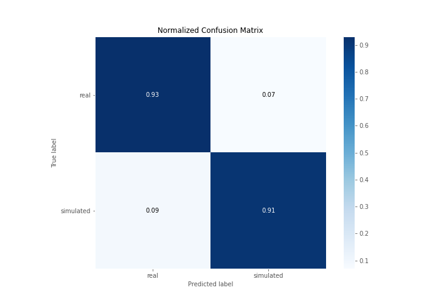

## ROC Curve

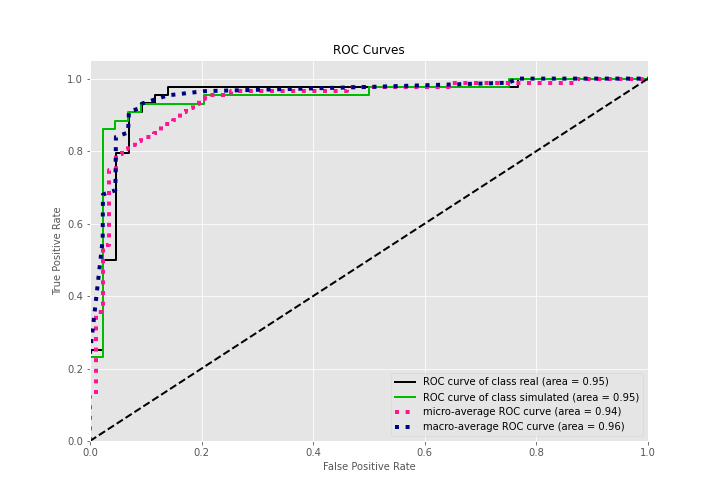

## Kolmogorov-Smirnov Statistic

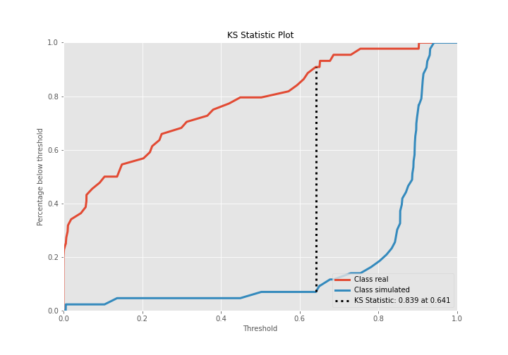

## Precision-Recall Curve

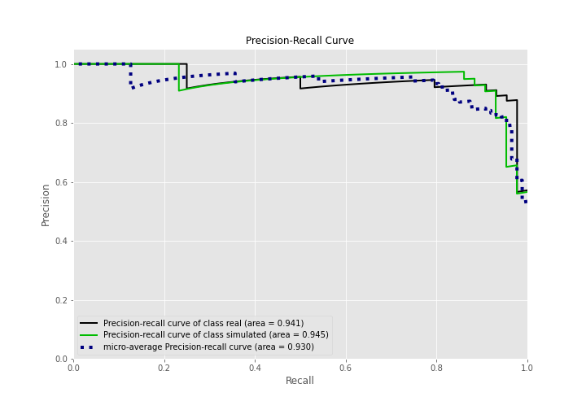

## Calibration Curve

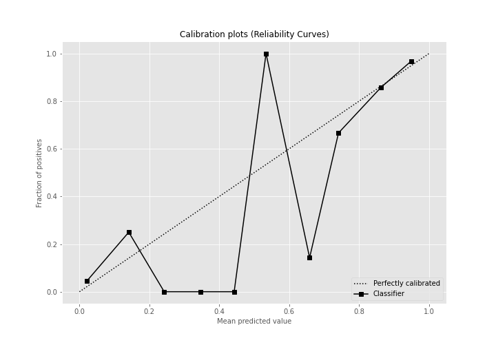

## Cumulative Gains Curve

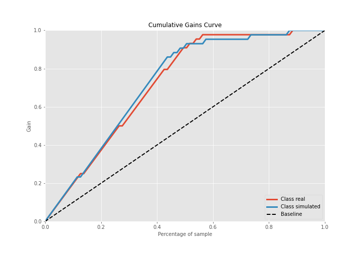

## Lift Curve

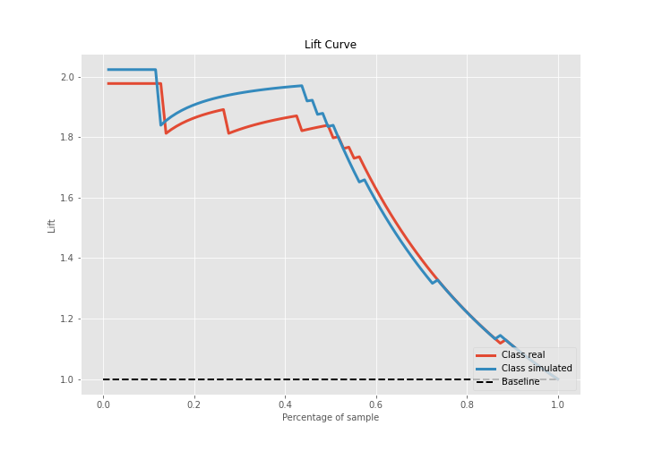

## SHAP Importance
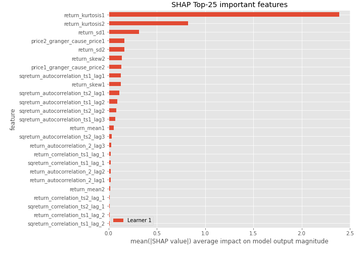

## SHAP Dependence plots

### Dependence (Fold 1)
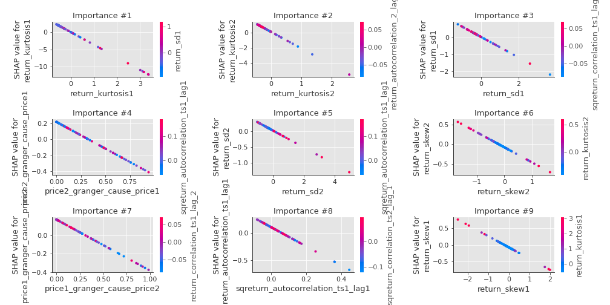

## SHAP Decision plots

### Top-10 Worst decisions for class 0 (Fold 1)
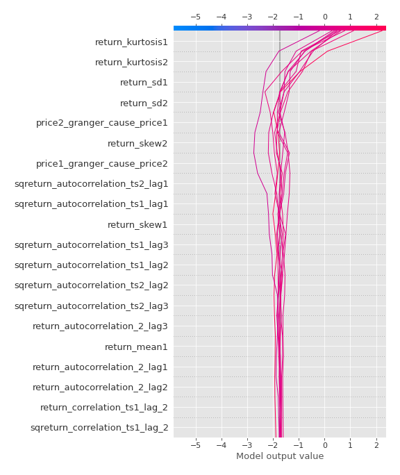
### Top-10 Best decisions for class 0 (Fold 1)
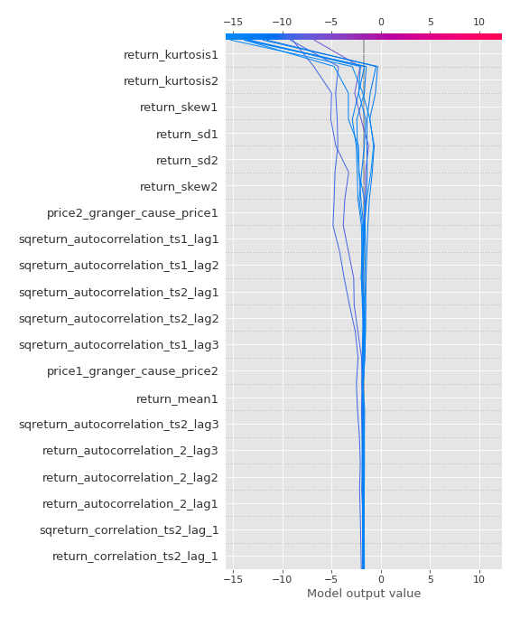
### Top-10 Worst decisions for class 1 (Fold 1)
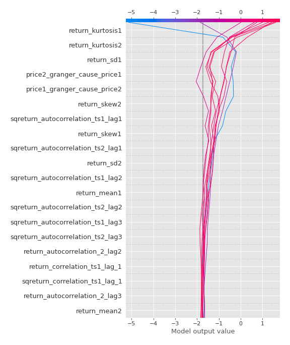
### Top-10 Best decisions for class 1 (Fold 1)
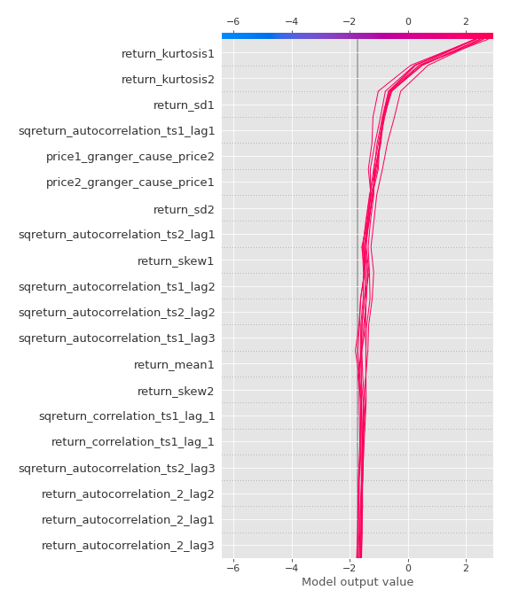

[<< Go back](../README.md)
