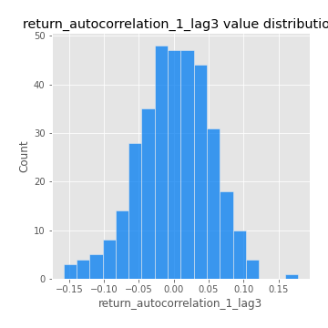

# Exploratory Data Analysis

[<< Go back](../README.md)
## Feature : target
- **Feature type** : categorical
- **Missing** : 0.0%
- **Unique** : 2
- **Count** :347
- **Unique** :2
- **Top** :real
- **Freq** :175

## Feature : return_mean1
- **Feature type** : continous
- **Missing** : 0.0%
- **Unique** : 347
- **Count** :347.0
- **Mean** :0.03455362895890812
- **Std** :0.07743486616548832
- **Min** :-0.22632637961920957
- **25%th Percentile** : -0.012642781843627122
- **50%th Percentile** : 0.034848913033867716
- **75%th Percentile** : 0.08394490599281391
- **Max** :0.3612366374600757

## Feature : return_mean2
- **Feature type** : continous
- **Missing** : 0.0%
- **Unique** : 347
- **Count** :347.0
- **Mean** :0.073548313546289
- **Std** :0.09187342305932462
- **Min** :-0.2542390567793847
- **25%th Percentile** : 0.025186920714555548
- **50%th Percentile** : 0.07589208259833399
- **75%th Percentile** : 0.12592538696042682
- **Max** :0.38866258013128696

## Feature : return_sd1
- **Feature type** : continous
- **Missing** : 0.0%
- **Unique** : 347
- **Count** :347.0
- **Mean** :1.7007379110875835
- **Std** :0.7278365356659791
- **Min** :0.7620831696941981
- **25%th Percentile** : 1.424566991315608
- **50%th Percentile** : 1.4850649450811746
- **75%th Percentile** : 1.6975652767055474
- **Max** :9.236766377527575

## Feature : return_sd2
- **Feature type** : continous
- **Missing** : 0.0%
- **Unique** : 347
- **Count** :347.0
- **Mean** :1.7409182778053793
- **Std** :0.6877822354090926
- **Min** :0.8967691504919791
- **25%th Percentile** : 1.4854247262228417
- **50%th Percentile** : 1.5678450348199182
- **75%th Percentile** : 1.6782424292442144
- **Max** :5.872800253666788

## Feature : return_skew1
- **Feature type** : continous
- **Missing** : 0.0%
- **Unique** : 347
- **Count** :347.0
- **Mean** :-0.1417183282712155
- **Std** :0.5951566519815654
- **Min** :-3.530116233761814
- **25%th Percentile** : -0.2655318276018894
- **50%th Percentile** : -0.09360869229161103
- **75%th Percentile** : 0.06822134900779127
- **Max** :1.989411030028313

## Feature : return_skew2
- **Feature type** : continous
- **Missing** : 0.0%
- **Unique** : 347
- **Count** :347.0
- **Mean** :-0.213641820362522
- **Std** :0.8055513037102143
- **Min** :-8.801502855292393
- **25%th Percentile** : -0.3622171043871496
- **50%th Percentile** : -0.12446576594006886
- **75%th Percentile** : 0.06889862360482138
- **Max** :2.2606839051517187

## Feature : return_kurtosis1
- **Feature type** : continous
- **Missing** : 0.0%
- **Unique** : 347
- **Count** :347.0
- **Mean** :3.4404110953205223
- **Std** :5.94735763747451
- **Min** :-0.3409024705790511
- **25%th Percentile** : 0.2564755962967924
- **50%th Percentile** : 1.2727241048969504
- **75%th Percentile** : 3.8405863563633806
- **Max** :46.07507808162177

## Feature : return_kurtosis2
- **Feature type** : continous
- **Missing** : 0.0%
- **Unique** : 347
- **Count** :347.0
- **Mean** :4.372624661909335
- **Std** :9.901185358892441
- **Min** :-0.3183365435254406
- **25%th Percentile** : 0.6097430408110973
- **50%th Percentile** : 1.692064428280108
- **75%th Percentile** : 4.393039424201936
- **Max** :143.10871011533666

## Feature : return_autocorrelation_1_lag1
- **Feature type** : continous
- **Missing** : 0.0%
- **Unique** : 347
- **Count** :347.0
- **Mean** :-0.008671273468577288
- **Std** :0.056822025871753536
- **Min** :-0.20673896439036124
- **25%th Percentile** : -0.04310738673790497
- **50%th Percentile** : -0.0037624471867330595
- **75%th Percentile** : 0.029175898753035487
- **Max** :0.1316675730343979

## Feature : return_autocorrelation_1_lag2
- **Feature type** : continous
- **Missing** : 0.0%
- **Unique** : 347
- **Count** :347.0
- **Mean** :-0.005262648695469054
- **Std** :0.04966853744169269
- **Min** :-0.13309283796645122
- **25%th Percentile** : -0.03589930318154413
- **50%th Percentile** : -0.006926539774437549
- **75%th Percentile** : 0.024768388883232406
- **Max** :0.1561488228015672

## Feature : return_autocorrelation_1_lag3
- **Feature type** : continous
- **Missing** : 0.0%
- **Unique** : 347
- **Count** :347.0
- **Mean** :0.0005824933494821296
- **Std** :0.0522265338494153
- **Min** :-0.15806635192103805
- **25%th Percentile** : -0.03235127762721438
- **50%th Percentile** : 0.001811812914563186
- **75%th Percentile** : 0.036952874676350805
- **Max** :0.17805869530681923

## Feature : return_autocorrelation_2_lag1
- **Feature type** : continous
- **Missing** : 0.0%
- **Unique** : 347
- **Count** :347.0
- **Mean** :-0.004869174637708757
- **Std** :0.05832571132576645
- **Min** :-0.25075531010123286
- **25%th Percentile** : -0.03715201154701496
- **50%th Percentile** : -8.28190260347712e-06
- **75%th Percentile** : 0.03442940450623502
- **Max** :0.12460254205708815

## Feature : return_autocorrelation_2_lag2
- **Feature type** : continous
- **Missing** : 0.0%
- **Unique** : 347
- **Count** :347.0
- **Mean** :0.006538656342575688
- **Std** :0.051124076351302464
- **Min** :-0.15323211089747296
- **25%th Percentile** : -0.028907373413892275
- **50%th Percentile** : 0.0066702928540513075
- **75%th Percentile** : 0.04046523908095967
- **Max** :0.14734721826682337

## Feature : return_autocorrelation_2_lag3
- **Feature type** : continous
- **Missing** : 0.0%
- **Unique** : 347
- **Count** :347.0
- **Mean** :0.001297844333235478
- **Std** :0.049447146281387085
- **Min** :-0.14200107169559698
- **25%th Percentile** : -0.03216606761167265
- **50%th Percentile** : 0.000973705122693163
- **75%th Percentile** : 0.03509065340535382
- **Max** :0.12489629575199976

## Feature : return_correlation_ts1_lag_0
- **Feature type** : continous
- **Missing** : 0.0%
- **Unique** : 347
- **Count** :347.0
- **Mean** :0.3049053970282085
- **Std** :0.10709929834817437
- **Min** :-0.027089510445801036
- **25%th Percentile** : 0.24742233325399343
- **50%th Percentile** : 0.2977404454471383
- **75%th Percentile** : 0.3523067413451286
- **Max** :0.7041861626832071

## Feature : return_correlation_ts1_lag_1
- **Feature type** : continous
- **Missing** : 0.0%
- **Unique** : 347
- **Count** :347.0
- **Mean** :-0.0026651335214956688
- **Std** :0.052556801059011636
- **Min** :-0.15776193292681923
- **25%th Percentile** : -0.036975064300229954
- **50%th Percentile** : 0.000401174020455929
- **75%th Percentile** : 0.03419371818898138
- **Max** :0.18115038823541313

## Feature : return_correlation_ts1_lag_2
- **Feature type** : continous
- **Missing** : 0.0%
- **Unique** : 347
- **Count** :347.0
- **Mean** :0.0015946585934194192
- **Std** :0.0468169985132065
- **Min** :-0.12864410180561703
- **25%th Percentile** : -0.03127503713938102
- **50%th Percentile** : 0.0009685707217309875
- **75%th Percentile** : 0.03629772919140943
- **Max** :0.10925794766608564

## Feature : return_correlation_ts1_lag_3
- **Feature type** : continous
- **Missing** : 0.0%
- **Unique** : 347
- **Count** :347.0
- **Mean** :0.002083301750365989
- **Std** :0.05139489651277022
- **Min** :-0.1270218498974763
- **25%th Percentile** : -0.03063964767080258
- **50%th Percentile** : 0.0014782569606743166
- **75%th Percentile** : 0.03297267198398095
- **Max** :0.1636773216468148

## Feature : return_correlation_ts2_lag_1
- **Feature type** : continous
- **Missing** : 0.0%
- **Unique** : 347
- **Count** :347.0
- **Mean** :-0.0031341976683691647
- **Std** :0.05637848870246995
- **Min** :-0.2081139431093261
- **25%th Percentile** : -0.0340519733401365
- **50%th Percentile** : -0.004748320710641742
- **75%th Percentile** : 0.030995826640370844
- **Max** :0.17208763791364762

## Feature : return_correlation_ts2_lag_2
- **Feature type** : continous
- **Missing** : 0.0%
- **Unique** : 347
- **Count** :347.0
- **Mean** :-0.0002687084185493348
- **Std** :0.04824873047235481
- **Min** :-0.15299951737180204
- **25%th Percentile** : -0.031377071489451486
- **50%th Percentile** : -0.0038541044751238722
- **75%th Percentile** : 0.02642666455525145
- **Max** :0.20772887392904255

## Feature : return_correlation_ts2_lag_3
- **Feature type** : continous
- **Missing** : 0.0%
- **Unique** : 347
- **Count** :347.0
- **Mean** :-0.002699953424048977
- **Std** :0.052213254808138564
- **Min** :-0.17564076057312866
- **25%th Percentile** : -0.03107216471819503
- **50%th Percentile** : -0.0011263914179240767
- **75%th Percentile** : 0.03420264553331982
- **Max** :0.17597870126212517

## Feature : sqreturn_autocorrelation_ts1_lag1
- **Feature type** : continous
- **Missing** : 0.0%
- **Unique** : 347
- **Count** :347.0
- **Mean** :0.04990730260995067
- **Std** :0.096671341484534
- **Min** :-0.07987173865882383
- **25%th Percentile** : -0.014105469244298965
- **50%th Percentile** : 0.025803915805844985
- **75%th Percentile** : 0.0826200215570817
- **Max** :0.49414293176447355

## Feature : sqreturn_autocorrelation_ts1_lag2
- **Feature type** : continous
- **Missing** : 0.0%
- **Unique** : 347
- **Count** :347.0
- **Mean** :0.04078229185399977
- **Std** :0.0882754348743759
- **Min** :-0.1148883715601245
- **25%th Percentile** : -0.013074284194059515
- **50%th Percentile** : 0.016282069714521983
- **75%th Percentile** : 0.06650318675581977
- **Max** :0.4522162366773919

## Feature : sqreturn_autocorrelation_ts1_lag3
- **Feature type** : continous
- **Missing** : 0.0%
- **Unique** : 347
- **Count** :347.0
- **Mean** :0.03300960122089847
- **Std** :0.07798940936812593
- **Min** :-0.09250238365205646
- **25%th Percentile** : -0.015070576487074805
- **50%th Percentile** : 0.011710548254852042
- **75%th Percentile** : 0.060448762111555546
- **Max** :0.41030914918857014

## Feature : sqreturn_autocorrelation_ts2_lag1
- **Feature type** : continous
- **Missing** : 0.0%
- **Unique** : 347
- **Count** :347.0
- **Mean** :0.04831215613061958
- **Std** :0.08934925199872056
- **Min** :-0.11969411174135153
- **25%th Percentile** : -0.00858917046001879
- **50%th Percentile** : 0.024001793134355548
- **75%th Percentile** : 0.08432500946327709
- **Max** :0.510085647437958

## Feature : sqreturn_autocorrelation_ts2_lag2
- **Feature type** : continous
- **Missing** : 0.0%
- **Unique** : 347
- **Count** :347.0
- **Mean** :0.0388003358507667
- **Std** :0.08131217874130602
- **Min** :-0.06916725465524584
- **25%th Percentile** : -0.011073435781051695
- **50%th Percentile** : 0.01300741529117995
- **75%th Percentile** : 0.054892904296237985
- **Max** :0.45676817892778204

## Feature : sqreturn_autocorrelation_ts2_lag3
- **Feature type** : continous
- **Missing** : 0.0%
- **Unique** : 347
- **Count** :347.0
- **Mean** :0.029330928655194342
- **Std** :0.06982582269996379
- **Min** :-0.11546018611739994
- **25%th Percentile** : -0.015723515846372178
- **50%th Percentile** : 0.015242675819064477
- **75%th Percentile** : 0.05905485486674432
- **Max** :0.31225727797735664

## Feature : sqreturn_correlation_ts1_lag_0
- **Feature type** : continous
- **Missing** : 0.0%
- **Unique** : 347
- **Count** :347.0
- **Mean** :0.3049053970282085
- **Std** :0.10709929834817437
- **Min** :-0.027089510445801036
- **25%th Percentile** : 0.24742233325399343
- **50%th Percentile** : 0.2977404454471383
- **75%th Percentile** : 0.3523067413451286
- **Max** :0.7041861626832071

## Feature : sqreturn_correlation_ts1_lag_1
- **Feature type** : continous
- **Missing** : 0.0%
- **Unique** : 347
- **Count** :347.0
- **Mean** :-0.0026651335214956688
- **Std** :0.052556801059011636
- **Min** :-0.15776193292681923
- **25%th Percentile** : -0.036975064300229954
- **50%th Percentile** : 0.000401174020455929
- **75%th Percentile** : 0.03419371818898138
- **Max** :0.18115038823541313

## Feature : sqreturn_correlation_ts1_lag_2
- **Feature type** : continous
- **Missing** : 0.0%
- **Unique** : 347
- **Count** :347.0
- **Mean** :0.0015946585934194192
- **Std** :0.0468169985132065
- **Min** :-0.12864410180561703
- **25%th Percentile** : -0.03127503713938102
- **50%th Percentile** : 0.0009685707217309875
- **75%th Percentile** : 0.03629772919140943
- **Max** :0.10925794766608564

## Feature : sqreturn_correlation_ts1_lag_3
- **Feature type** : continous
- **Missing** : 0.0%
- **Unique** : 347
- **Count** :347.0
- **Mean** :0.002083301750365989
- **Std** :0.05139489651277022
- **Min** :-0.1270218498974763
- **25%th Percentile** : -0.03063964767080258
- **50%th Percentile** : 0.0014782569606743166
- **75%th Percentile** : 0.03297267198398095
- **Max** :0.1636773216468148

## Feature : sqreturn_correlation_ts2_lag_1
- **Feature type** : continous
- **Missing** : 0.0%
- **Unique** : 347
- **Count** :347.0
- **Mean** :-0.0031341976683691647
- **Std** :0.05637848870246995
- **Min** :-0.2081139431093261
- **25%th Percentile** : -0.0340519733401365
- **50%th Percentile** : -0.004748320710641742
- **75%th Percentile** : 0.030995826640370844
- **Max** :0.17208763791364762

## Feature : sqreturn_correlation_ts2_lag_2
- **Feature type** : continous
- **Missing** : 0.0%
- **Unique** : 347
- **Count** :347.0
- **Mean** :-0.0002687084185493348
- **Std** :0.04824873047235481
- **Min** :-0.15299951737180204
- **25%th Percentile** : -0.031377071489451486
- **50%th Percentile** : -0.0038541044751238722
- **75%th Percentile** : 0.02642666455525145
- **Max** :0.20772887392904255

## Feature : sqreturn_correlation_ts2_lag_3
- **Feature type** : continous
- **Missing** : 0.0%
- **Unique** : 347
- **Count** :347.0
- **Mean** :-0.002699953424048977
- **Std** :0.052213254808138564
- **Min** :-0.17564076057312866
- **25%th Percentile** : -0.03107216471819503
- **50%th Percentile** : -0.0011263914179240767
- **75%th Percentile** : 0.03420264553331982
- **Max** :0.17597870126212517

## Feature : price2_granger_cause_price1
- **Feature type** : continous
- **Missing** : 0.0%
- **Unique** : 347
- **Count** :347.0
- **Mean** :0.30244833683610634
- **Std** :0.2813233342585612
- **Min** :6.987525009546856e-06
- **25%th Percentile** : 0.0590407111914759
- **50%th Percentile** : 0.22387344123664948
- **75%th Percentile** : 0.4957583133090729
- **Max** :0.9920241654809141

## Feature : price1_granger_cause_price2
- **Feature type** : continous
- **Missing** : 0.0%
- **Unique** : 347
- **Count** :347.0
- **Mean** :0.27195686421058135
- **Std** :0.2884237077299705
- **Min** :1.4634337611054677e-09
- **25%th Percentile** : 0.018469072078318667
- **50%th Percentile** : 0.16927638725462585
- **75%th Percentile** : 0.44148169996579384
- **Max** :0.9951398266867577

[<< Go back](../README.md)
