# Summary of 3_Linear

[<< Go back](../README.md)

## Logistic Regression (Linear)
- **n_jobs**: -1
- **explain_level**: 2

## Validation
 - **validation_type**: split
 - **train_ratio**: 0.75
 - **shuffle**: True
 - **stratify**: True

## Optimized metric
accuracy

## Training time

4.7 seconds

## Metric details
|           |    score |     threshold |
|:----------|---------:|--------------:|
| logloss   | 0.180308 | nan           |
| auc       | 0.996819 | nan           |
| f1        | 0.963855 |   0.584172    |
| accuracy  | 0.965517 |   0.706859    |
| precision | 1        |   0.706859    |
| recall    | 1        |   1.16584e-09 |
| mcc       | 0.932783 |   0.706859    |

## Confusion matrix (at threshold=0.706859)
|                      |   Predicted as real |   Predicted as simulated |
|:---------------------|--------------------:|-------------------------:|
| Labeled as real      |                  46 |                        0 |
| Labeled as simulated |                   3 |                       38 |

## Learning curves
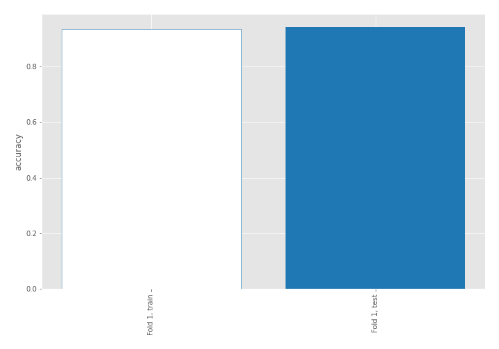

## Coefficients
| feature                           |   Learner_1 |
|:----------------------------------|------------:|
| return_autocorrelation_2_lag1     |   0.609197  |
| return_autocorrelation_2_lag3     |   0.590794  |
| return_autocorrelation_2_lag2     |   0.507215  |
| sqreturn_correlation_ts1_lag_3    |   0.436889  |
| return_correlation_ts1_lag_3      |   0.436889  |
| return_autocorrelation_1_lag1     |   0.430894  |
| return_correlation_ts1_lag_1      |   0.426494  |
| sqreturn_correlation_ts1_lag_1    |   0.426494  |
| sqreturn_correlation_ts1_lag_2    |   0.395113  |
| return_correlation_ts1_lag_2      |   0.395113  |
| return_autocorrelation_1_lag3     |   0.286     |
| return_correlation_ts2_lag_1      |   0.274699  |
| sqreturn_correlation_ts2_lag_1    |   0.274699  |
| return_mean2                      |   0.188622  |
| return_autocorrelation_1_lag2     |   0.179124  |
| return_correlation_ts1_lag_0      |   0.168547  |
| sqreturn_correlation_ts1_lag_0    |   0.168547  |
| return_correlation_ts2_lag_3      |   0.122219  |
| sqreturn_correlation_ts2_lag_3    |   0.122219  |
| return_sd1                        |   0.0412634 |
| return_correlation_ts2_lag_2      |   0.0137805 |
| sqreturn_correlation_ts2_lag_2    |   0.0137805 |
| return_sd2                        |  -0.459404  |
| return_skew1                      |  -0.520054  |
| return_skew2                      |  -0.679446  |
| sqreturn_autocorrelation_ts2_lag3 |  -0.854456  |
| price1_granger_cause_price2       |  -0.86363   |
| price2_granger_cause_price1       |  -0.90627   |
| intercept                         |  -0.916575  |
| sqreturn_autocorrelation_ts2_lag2 |  -0.991668  |
| return_mean1                      |  -1.02628   |
| sqreturn_autocorrelation_ts1_lag3 |  -1.17581   |
| sqreturn_autocorrelation_ts1_lag2 |  -1.24942   |
| sqreturn_autocorrelation_ts1_lag1 |  -1.39075   |
| sqreturn_autocorrelation_ts2_lag1 |  -1.53296   |
| return_kurtosis2                  |  -1.84064   |
| return_kurtosis1                  |  -3.62852   |

## Permutation-based Importance
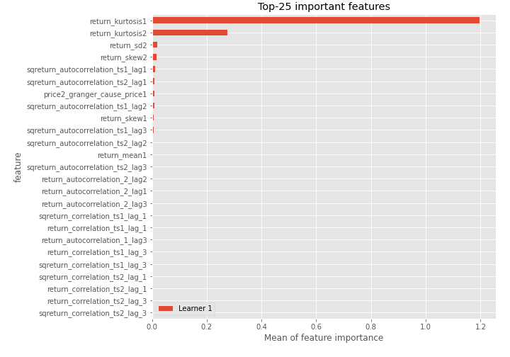
## Confusion Matrix

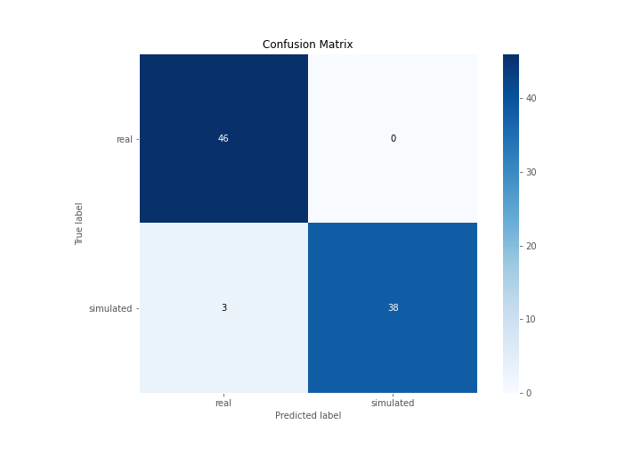

## Normalized Confusion Matrix

## ROC Curve

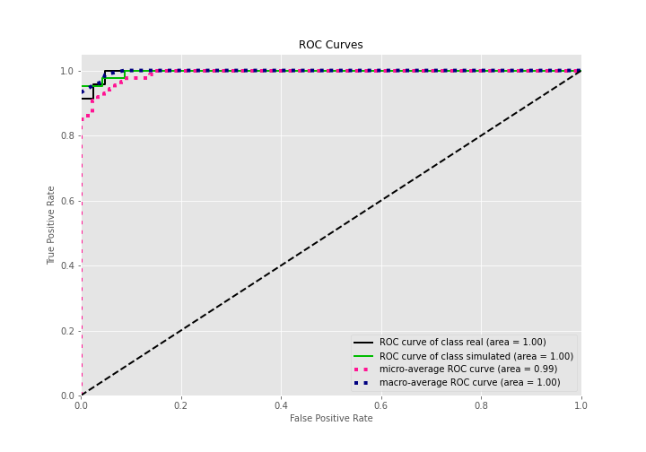

## Kolmogorov-Smirnov Statistic

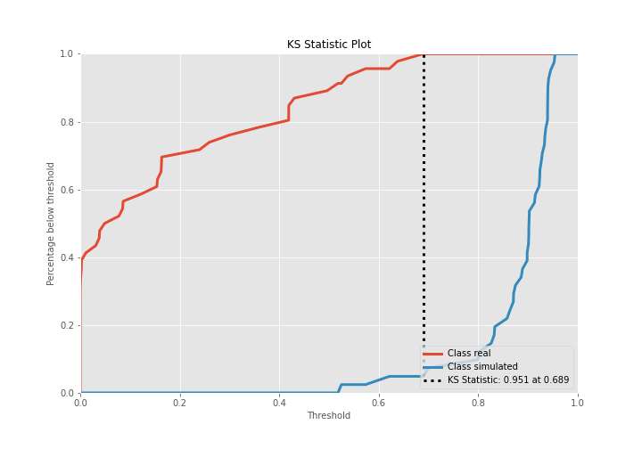

## Precision-Recall Curve

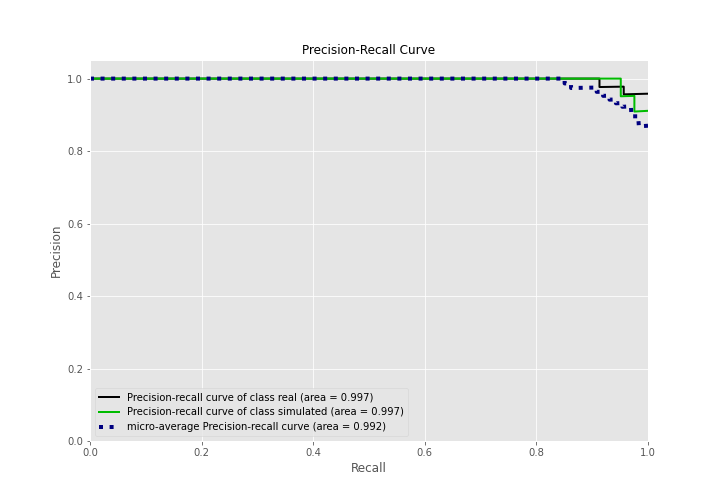

## Calibration Curve

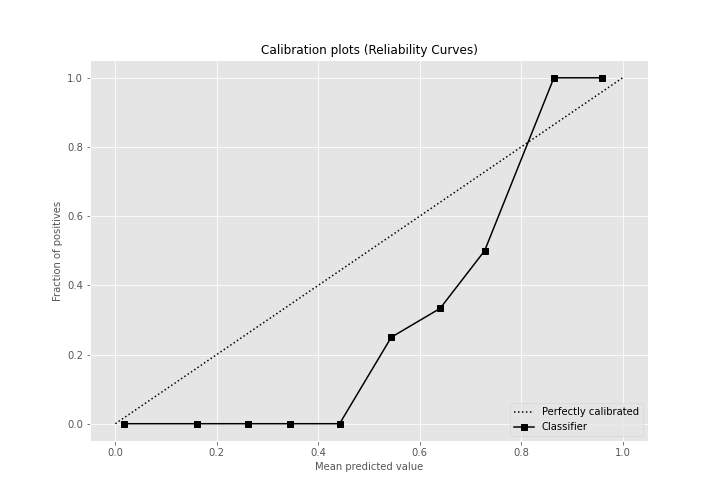

## Cumulative Gains Curve

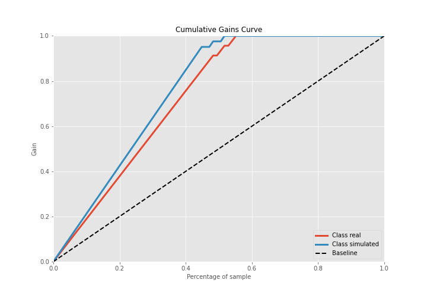

## Lift Curve

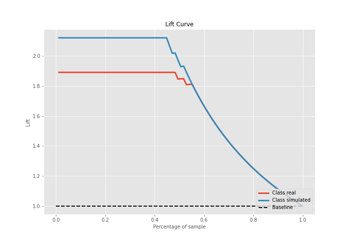

## SHAP Importance
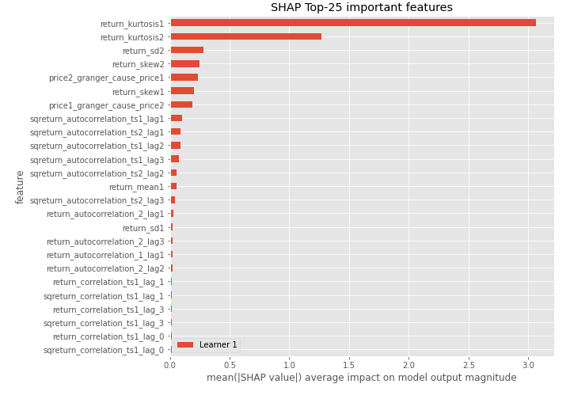

## SHAP Dependence plots

### Dependence (Fold 1)
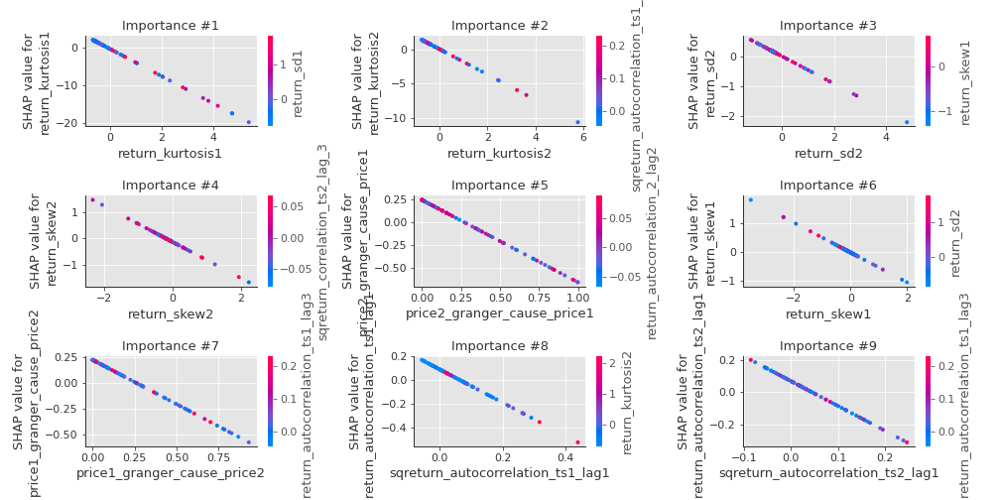

## SHAP Decision plots

### Top-10 Worst decisions for class 0 (Fold 1)
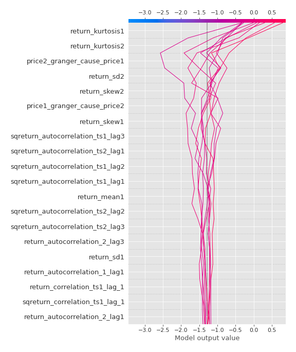
### Top-10 Best decisions for class 0 (Fold 1)
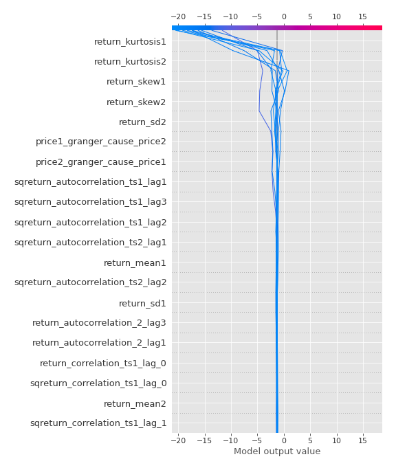
### Top-10 Worst decisions for class 1 (Fold 1)
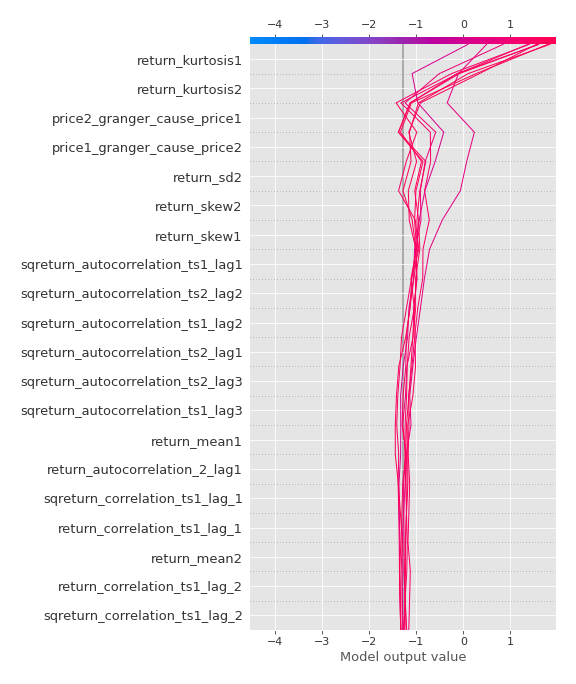
### Top-10 Best decisions for class 1 (Fold 1)
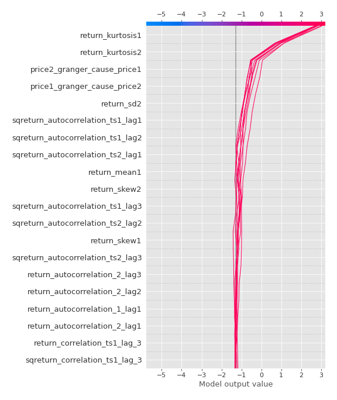

[<< Go back](../README.md)
