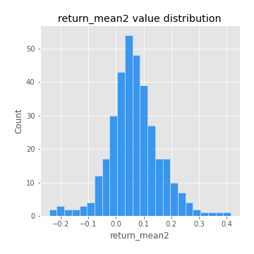
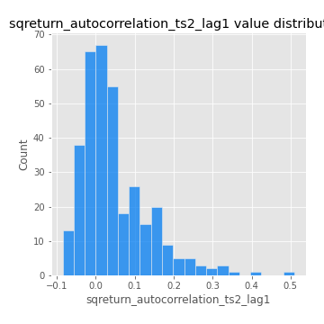

# Exploratory Data Analysis

[<< Go back](../README.md)
## Feature : target
- **Feature type** : categorical
- **Missing** : 0.0%
- **Unique** : 2
- **Count** :347
- **Unique** :2
- **Top** :real
- **Freq** :183

## Feature : return_mean1
- **Feature type** : continous
- **Missing** : 0.0%
- **Unique** : 347
- **Count** :347.0
- **Mean** :0.03541632352191272
- **Std** :0.07801093616652606
- **Min** :-0.22632637961920957
- **25%th Percentile** : -0.011357114235232304
- **50%th Percentile** : 0.034576633476395786
- **75%th Percentile** : 0.08525357149630244
- **Max** :0.37175100008111034

## Feature : return_mean2
- **Feature type** : continous
- **Missing** : 0.0%
- **Unique** : 347
- **Count** :347.0
- **Mean** :0.0651036449253391
- **Std** :0.0934355972874984
- **Min** :-0.24205418062825398
- **25%th Percentile** : 0.014476650442250305
- **50%th Percentile** : 0.05946743570771436
- **75%th Percentile** : 0.11458592047912212
- **Max** :0.4151718888476767

## Feature : return_sd1
- **Feature type** : continous
- **Missing** : 0.0%
- **Unique** : 347
- **Count** :347.0
- **Mean** :1.7070208951878578
- **Std** :0.7675657610471079
- **Min** :0.7470080772831957
- **25%th Percentile** : 1.4265238324814478
- **50%th Percentile** : 1.4914953054753983
- **75%th Percentile** : 1.6807155855963516
- **Max** :9.236766377527575

## Feature : return_sd2
- **Feature type** : continous
- **Missing** : 0.0%
- **Unique** : 347
- **Count** :347.0
- **Mean** :1.7857061270138441
- **Std** :0.7839640894984756
- **Min** :0.8592887433004143
- **25%th Percentile** : 1.4918381910119032
- **50%th Percentile** : 1.5693515101236717
- **75%th Percentile** : 1.6961466626780102
- **Max** :6.737618636746393

## Feature : return_skew1
- **Feature type** : continous
- **Missing** : 0.0%
- **Unique** : 347
- **Count** :347.0
- **Mean** :-0.13777942360421402
- **Std** :0.5744512809748237
- **Min** :-3.530116233761814
- **25%th Percentile** : -0.26948290846489453
- **50%th Percentile** : -0.09685819349884682
- **75%th Percentile** : 0.06650254873575964
- **Max** :2.224942816365292

## Feature : return_skew2
- **Feature type** : continous
- **Missing** : 0.0%
- **Unique** : 347
- **Count** :347.0
- **Mean** :-0.15969588446256355
- **Std** :0.587885923103939
- **Min** :-2.5169062744473636
- **25%th Percentile** : -0.3660886794435152
- **50%th Percentile** : -0.12179452936131185
- **75%th Percentile** : 0.06164063062174764
- **Max** :2.2606839051517187

## Feature : return_kurtosis1
- **Feature type** : continous
- **Missing** : 0.0%
- **Unique** : 347
- **Count** :347.0
- **Mean** :3.5142148721408843
- **Std** :5.910146239916493
- **Min** :-0.32082508161734946
- **25%th Percentile** : 0.3341059644141333
- **50%th Percentile** : 1.3310206104619415
- **75%th Percentile** : 3.9672030656784054
- **Max** :36.91113889081053

## Feature : return_kurtosis2
- **Feature type** : continous
- **Missing** : 0.0%
- **Unique** : 347
- **Count** :347.0
- **Mean** :3.9181092224374123
- **Std** :5.635483078618533
- **Min** :-0.23635668401727505
- **25%th Percentile** : 0.5492218238757638
- **50%th Percentile** : 1.7069842026221438
- **75%th Percentile** : 4.53498514656377
- **Max** :36.023880269969645

## Feature : return_autocorrelation_1_lag1
- **Feature type** : continous
- **Missing** : 0.0%
- **Unique** : 347
- **Count** :347.0
- **Mean** :-0.012797005031953537
- **Std** :0.059521858599721984
- **Min** :-0.20673896439036124
- **25%th Percentile** : -0.05198251852249314
- **50%th Percentile** : -0.008070082569726343
- **75%th Percentile** : 0.02359532204265357
- **Max** :0.12810656890648087

## Feature : return_autocorrelation_1_lag2
- **Feature type** : continous
- **Missing** : 0.0%
- **Unique** : 347
- **Count** :347.0
- **Mean** :-0.009519874310278656
- **Std** :0.05025261582875555
- **Min** :-0.13309283796645122
- **25%th Percentile** : -0.045628357198133115
- **50%th Percentile** : -0.009043088888686804
- **75%th Percentile** : 0.024112168985809437
- **Max** :0.13553587149024285

## Feature : return_autocorrelation_1_lag3
- **Feature type** : continous
- **Missing** : 0.0%
- **Unique** : 347
- **Count** :347.0
- **Mean** :0.0011747633221124935
- **Std** :0.048421198209889646
- **Min** :-0.1940836867390813
- **25%th Percentile** : -0.025608112872283026
- **50%th Percentile** : 0.0002777521396447955
- **75%th Percentile** : 0.033558350993694745
- **Max** :0.12594444161019483

## Feature : return_autocorrelation_2_lag1
- **Feature type** : continous
- **Missing** : 0.0%
- **Unique** : 347
- **Count** :347.0
- **Mean** :-0.006774441300125518
- **Std** :0.06069684992265091
- **Min** :-0.25075531010123286
- **25%th Percentile** : -0.037634937612484425
- **50%th Percentile** : -0.0014327133341762272
- **75%th Percentile** : 0.03219267561421492
- **Max** :0.16349871797309318

## Feature : return_autocorrelation_2_lag2
- **Feature type** : continous
- **Missing** : 0.0%
- **Unique** : 347
- **Count** :347.0
- **Mean** :0.004538446558150256
- **Std** :0.052425147445671526
- **Min** :-0.15323211089747296
- **25%th Percentile** : -0.03157731268115359
- **50%th Percentile** : 0.0022184308660985847
- **75%th Percentile** : 0.03922679447049155
- **Max** :0.1735398560230086

## Feature : return_autocorrelation_2_lag3
- **Feature type** : continous
- **Missing** : 0.0%
- **Unique** : 347
- **Count** :347.0
- **Mean** :0.0035826378489254283
- **Std** :0.050543584645378316
- **Min** :-0.14200107169559698
- **25%th Percentile** : -0.028726846212055804
- **50%th Percentile** : 0.002270671732529832
- **75%th Percentile** : 0.039155985709509136
- **Max** :0.1617665265542667

## Feature : return_correlation_ts1_lag_0
- **Feature type** : continous
- **Missing** : 0.0%
- **Unique** : 347
- **Count** :347.0
- **Mean** :0.30588881024232584
- **Std** :0.11222102108723203
- **Min** :-0.027089510445801036
- **25%th Percentile** : 0.24580235532314787
- **50%th Percentile** : 0.2967340849002642
- **75%th Percentile** : 0.3556744615592471
- **Max** :0.6949986865664105

## Feature : return_correlation_ts1_lag_1
- **Feature type** : continous
- **Missing** : 0.0%
- **Unique** : 347
- **Count** :347.0
- **Mean** :-0.004905065695812865
- **Std** :0.05164417354004366
- **Min** :-0.15776193292681923
- **25%th Percentile** : -0.03502286074139836
- **50%th Percentile** : 0.0003194534098903868
- **75%th Percentile** : 0.03565793103743107
- **Max** :0.15499424718508623

## Feature : return_correlation_ts1_lag_2
- **Feature type** : continous
- **Missing** : 0.0%
- **Unique** : 347
- **Count** :347.0
- **Mean** :0.0017017121765607799
- **Std** :0.048470441762921375
- **Min** :-0.12864410180561703
- **25%th Percentile** : -0.0301803951842221
- **50%th Percentile** : 0.0009685707217309875
- **75%th Percentile** : 0.03744194781667241
- **Max** :0.13169229077404784

## Feature : return_correlation_ts1_lag_3
- **Feature type** : continous
- **Missing** : 0.0%
- **Unique** : 347
- **Count** :347.0
- **Mean** :0.00264930425202428
- **Std** :0.051316589791864216
- **Min** :-0.12306593817498207
- **25%th Percentile** : -0.03312911319463009
- **50%th Percentile** : 0.00472618870785728
- **75%th Percentile** : 0.03450664505736821
- **Max** :0.1636773216468148

## Feature : return_correlation_ts2_lag_1
- **Feature type** : continous
- **Missing** : 0.0%
- **Unique** : 347
- **Count** :347.0
- **Mean** :-0.0033815743353649815
- **Std** :0.052927998457029724
- **Min** :-0.2081139431093261
- **25%th Percentile** : -0.035459986048167
- **50%th Percentile** : -0.001052307586426952
- **75%th Percentile** : 0.03337789519329462
- **Max** :0.17208763791364762

## Feature : return_correlation_ts2_lag_2
- **Feature type** : continous
- **Missing** : 0.0%
- **Unique** : 347
- **Count** :347.0
- **Mean** :-0.00035602574720907586
- **Std** :0.050179286087920376
- **Min** :-0.23751835475804678
- **25%th Percentile** : -0.03314364075393612
- **50%th Percentile** : 0.00017685560311833616
- **75%th Percentile** : 0.029888243531307864
- **Max** :0.15388933426238696

## Feature : return_correlation_ts2_lag_3
- **Feature type** : continous
- **Missing** : 0.0%
- **Unique** : 347
- **Count** :347.0
- **Mean** :0.000246630787014494
- **Std** :0.05038581645549322
- **Min** :-0.16212823605110202
- **25%th Percentile** : -0.028704283812544112
- **50%th Percentile** : -0.0007513723605027245
- **75%th Percentile** : 0.03549763167344745
- **Max** :0.12578577770423086

## Feature : sqreturn_autocorrelation_ts1_lag1
- **Feature type** : continous
- **Missing** : 0.0%
- **Unique** : 347
- **Count** :347.0
- **Mean** :0.05180905012142249
- **Std** :0.09317697583369698
- **Min** :-0.10748424857284766
- **25%th Percentile** : -0.011001482893099726
- **50%th Percentile** : 0.02651457470713404
- **75%th Percentile** : 0.08734031096560474
- **Max** :0.49414293176447355

## Feature : sqreturn_autocorrelation_ts1_lag2
- **Feature type** : continous
- **Missing** : 0.0%
- **Unique** : 347
- **Count** :347.0
- **Mean** :0.04416333144331713
- **Std** :0.09095724175720361
- **Min** :-0.10696830963992163
- **25%th Percentile** : -0.013121603964379933
- **50%th Percentile** : 0.02244311896299267
- **75%th Percentile** : 0.07547004548267527
- **Max** :0.540735851444759

## Feature : sqreturn_autocorrelation_ts1_lag3
- **Feature type** : continous
- **Missing** : 0.0%
- **Unique** : 347
- **Count** :347.0
- **Mean** :0.034930008149606416
- **Std** :0.07943133460187203
- **Min** :-0.08615991273946406
- **25%th Percentile** : -0.016805900967954382
- **50%th Percentile** : 0.01651282048716021
- **75%th Percentile** : 0.06333799669581507
- **Max** :0.44755937369538146

## Feature : sqreturn_autocorrelation_ts2_lag1
- **Feature type** : continous
- **Missing** : 0.0%
- **Unique** : 347
- **Count** :347.0
- **Mean** :0.04648612785299013
- **Std** :0.0878550188775048
- **Min** :-0.08520586663750691
- **25%th Percentile** : -0.012763218467384454
- **50%th Percentile** : 0.023806881754959538
- **75%th Percentile** : 0.08825199666712785
- **Max** :0.510085647437958

## Feature : sqreturn_autocorrelation_ts2_lag2
- **Feature type** : continous
- **Missing** : 0.0%
- **Unique** : 347
- **Count** :347.0
- **Mean** :0.04169044576621859
- **Std** :0.0876494243275689
- **Min** :-0.10034899835082745
- **25%th Percentile** : -0.012114060395060883
- **50%th Percentile** : 0.01814012081111259
- **75%th Percentile** : 0.05938992469860163
- **Max** :0.5373432415582473

## Feature : sqreturn_autocorrelation_ts2_lag3
- **Feature type** : continous
- **Missing** : 0.0%
- **Unique** : 347
- **Count** :347.0
- **Mean** :0.024353843015147123
- **Std** :0.07047699344541712
- **Min** :-0.10353225100977752
- **25%th Percentile** : -0.020189472276296305
- **50%th Percentile** : 0.009207583984403573
- **75%th Percentile** : 0.04521521546244153
- **Max** :0.30256115637327263

## Feature : sqreturn_correlation_ts1_lag_0
- **Feature type** : continous
- **Missing** : 0.0%
- **Unique** : 347
- **Count** :347.0
- **Mean** :0.30588881024232584
- **Std** :0.11222102108723203
- **Min** :-0.027089510445801036
- **25%th Percentile** : 0.24580235532314787
- **50%th Percentile** : 0.2967340849002642
- **75%th Percentile** : 0.3556744615592471
- **Max** :0.6949986865664105

## Feature : sqreturn_correlation_ts1_lag_1
- **Feature type** : continous
- **Missing** : 0.0%
- **Unique** : 347
- **Count** :347.0
- **Mean** :-0.004905065695812865
- **Std** :0.05164417354004366
- **Min** :-0.15776193292681923
- **25%th Percentile** : -0.03502286074139836
- **50%th Percentile** : 0.0003194534098903868
- **75%th Percentile** : 0.03565793103743107
- **Max** :0.15499424718508623

## Feature : sqreturn_correlation_ts1_lag_2
- **Feature type** : continous
- **Missing** : 0.0%
- **Unique** : 347
- **Count** :347.0
- **Mean** :0.0017017121765607799
- **Std** :0.048470441762921375
- **Min** :-0.12864410180561703
- **25%th Percentile** : -0.0301803951842221
- **50%th Percentile** : 0.0009685707217309875
- **75%th Percentile** : 0.03744194781667241
- **Max** :0.13169229077404784

## Feature : sqreturn_correlation_ts1_lag_3
- **Feature type** : continous
- **Missing** : 0.0%
- **Unique** : 347
- **Count** :347.0
- **Mean** :0.00264930425202428
- **Std** :0.051316589791864216
- **Min** :-0.12306593817498207
- **25%th Percentile** : -0.03312911319463009
- **50%th Percentile** : 0.00472618870785728
- **75%th Percentile** : 0.03450664505736821
- **Max** :0.1636773216468148

## Feature : sqreturn_correlation_ts2_lag_1
- **Feature type** : continous
- **Missing** : 0.0%
- **Unique** : 347
- **Count** :347.0
- **Mean** :-0.0033815743353649815
- **Std** :0.052927998457029724
- **Min** :-0.2081139431093261
- **25%th Percentile** : -0.035459986048167
- **50%th Percentile** : -0.001052307586426952
- **75%th Percentile** : 0.03337789519329462
- **Max** :0.17208763791364762

## Feature : sqreturn_correlation_ts2_lag_2
- **Feature type** : continous
- **Missing** : 0.0%
- **Unique** : 347
- **Count** :347.0
- **Mean** :-0.00035602574720907586
- **Std** :0.050179286087920376
- **Min** :-0.23751835475804678
- **25%th Percentile** : -0.03314364075393612
- **50%th Percentile** : 0.00017685560311833616
- **75%th Percentile** : 0.029888243531307864
- **Max** :0.15388933426238696

## Feature : sqreturn_correlation_ts2_lag_3
- **Feature type** : continous
- **Missing** : 0.0%
- **Unique** : 347
- **Count** :347.0
- **Mean** :0.000246630787014494
- **Std** :0.05038581645549322
- **Min** :-0.16212823605110202
- **25%th Percentile** : -0.028704283812544112
- **50%th Percentile** : -0.0007513723605027245
- **75%th Percentile** : 0.03549763167344745
- **Max** :0.12578577770423086

## Feature : price2_granger_cause_price1
- **Feature type** : continous
- **Missing** : 0.0%
- **Unique** : 347
- **Count** :347.0
- **Mean** :0.3080673183120039
- **Std** :0.29722454937549764
- **Min** :2.303805942718172e-06
- **25%th Percentile** : 0.05070249330381614
- **50%th Percentile** : 0.19772438720508023
- **75%th Percentile** : 0.5148715088538675
- **Max** :0.99757009783552

## Feature : price1_granger_cause_price2
- **Feature type** : continous
- **Missing** : 0.0%
- **Unique** : 347
- **Count** :347.0
- **Mean** :0.25379014638933634
- **Std** :0.27037028085569903
- **Min** :2.530575937811125e-07
- **25%th Percentile** : 0.025563503670268342
- **50%th Percentile** : 0.15058646504819864
- **75%th Percentile** : 0.4225110479927481
- **Max** :0.9951398266867577

[<< Go back](../README.md)
