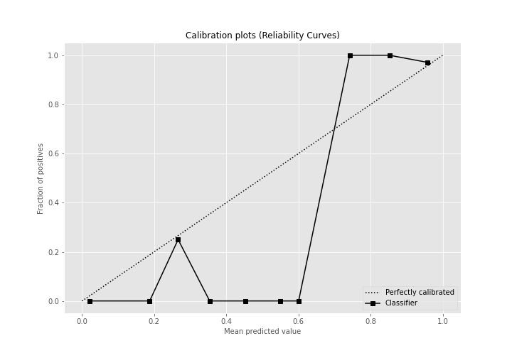

# Summary of 3_Linear

[<< Go back](../README.md)

## Logistic Regression (Linear)
- **n_jobs**: -1
- **explain_level**: 2

## Validation
 - **validation_type**: split
 - **train_ratio**: 0.75
 - **shuffle**: True
 - **stratify**: True

## Optimized metric
accuracy

## Training time

5.5 seconds

## Metric details
|           |    score |     threshold |
|:----------|---------:|--------------:|
| logloss   | 0.185219 | nan           |
| auc       | 0.989429 | nan           |
| f1        | 0.977273 |   0.691168    |
| accuracy  | 0.977011 |   0.691168    |
| precision | 1        |   0.922188    |
| recall    | 1        |   5.47229e-16 |
| mcc       | 0.954017 |   0.691168    |

## Confusion matrix (at threshold=0.691168)
|                      |   Predicted as real |   Predicted as simulated |
|:---------------------|--------------------:|-------------------------:|
| Labeled as real      |                  42 |                        1 |
| Labeled as simulated |                   1 |                       43 |

## Learning curves

## Coefficients
| feature                           |   Learner_1 |
|:----------------------------------|------------:|
| return_autocorrelation_2_lag3     |   0.650632  |
| return_autocorrelation_2_lag1     |   0.514353  |
| return_autocorrelation_2_lag2     |   0.441778  |
| return_correlation_ts2_lag_3      |   0.279993  |
| sqreturn_correlation_ts2_lag_3    |   0.279993  |
| return_autocorrelation_1_lag3     |   0.260498  |
| sqreturn_correlation_ts2_lag_1    |   0.24178   |
| return_correlation_ts2_lag_1      |   0.24178   |
| sqreturn_correlation_ts1_lag_2    |   0.236374  |
| return_correlation_ts1_lag_2      |   0.236374  |
| return_correlation_ts1_lag_1      |   0.227293  |
| sqreturn_correlation_ts1_lag_1    |   0.227293  |
| sqreturn_correlation_ts1_lag_3    |   0.195505  |
| return_correlation_ts1_lag_3      |   0.195505  |
| return_skew2                      |   0.166614  |
| return_autocorrelation_1_lag2     |   0.0823509 |
| return_mean2                      |   0.0559989 |
| return_autocorrelation_1_lag1     |   0.039019  |
| sqreturn_correlation_ts2_lag_2    |  -0.205374  |
| return_correlation_ts2_lag_2      |  -0.205374  |
| return_sd1                        |  -0.23282   |
| return_skew1                      |  -0.304558  |
| sqreturn_correlation_ts1_lag_0    |  -0.309987  |
| return_correlation_ts1_lag_0      |  -0.309987  |
| return_sd2                        |  -0.393238  |
| price2_granger_cause_price1       |  -0.494553  |
| price1_granger_cause_price2       |  -0.574902  |
| sqreturn_autocorrelation_ts2_lag3 |  -0.64342   |
| return_mean1                      |  -0.846981  |
| sqreturn_autocorrelation_ts1_lag3 |  -0.862282  |
| intercept                         |  -0.910297  |
| sqreturn_autocorrelation_ts2_lag2 |  -0.936966  |
| sqreturn_autocorrelation_ts1_lag2 |  -0.941698  |
| sqreturn_autocorrelation_ts1_lag1 |  -1.18274   |
| sqreturn_autocorrelation_ts2_lag1 |  -1.65056   |
| return_kurtosis2                  |  -2.76755   |
| return_kurtosis1                  |  -3.72613   |

## Permutation-based Importance

## Confusion Matrix

## Normalized Confusion Matrix

## ROC Curve

## Kolmogorov-Smirnov Statistic

## Precision-Recall Curve

## Calibration Curve

## Cumulative Gains Curve

## Lift Curve

## SHAP Importance

## SHAP Dependence plots

### Dependence (Fold 1)

## SHAP Decision plots

### Top-10 Worst decisions for class 0 (Fold 1)

### Top-10 Best decisions for class 0 (Fold 1)

### Top-10 Worst decisions for class 1 (Fold 1)

### Top-10 Best decisions for class 1 (Fold 1)

[<< Go back](../README.md)
