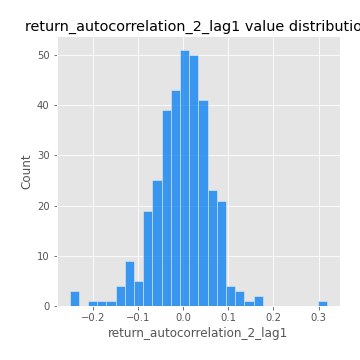

# Exploratory Data Analysis

[<< Go back](../README.md)
## Feature : target
- **Feature type** : categorical
- **Missing** : 0.0%
- **Unique** : 2
- **Count** :347
- **Unique** :2
- **Top** :simulated
- **Freq** :176

## Feature : return_mean1
- **Feature type** : continous
- **Missing** : 0.0%
- **Unique** : 347
- **Count** :347.0
- **Mean** :0.03578286622065987
- **Std** :0.07886829552895792
- **Min** :-0.18463914825439962
- **25%th Percentile** : -0.010553202232141068
- **50%th Percentile** : 0.03302608364331539
- **75%th Percentile** : 0.08041830548331591
- **Max** :0.37175100008111034

## Feature : return_mean2
- **Feature type** : continous
- **Missing** : 0.0%
- **Unique** : 347
- **Count** :347.0
- **Mean** :0.06728501824976862
- **Std** :0.09280866167511266
- **Min** :-0.24205418062825398
- **25%th Percentile** : 0.015501557407342846
- **50%th Percentile** : 0.06243282156777788
- **75%th Percentile** : 0.11374105349403765
- **Max** :0.46429527039879964

## Feature : return_sd1
- **Feature type** : continous
- **Missing** : 0.0%
- **Unique** : 347
- **Count** :347.0
- **Mean** :1.6633086135169615
- **Std** :0.5928386904540003
- **Min** :0.7470080772831957
- **25%th Percentile** : 1.413386035337866
- **50%th Percentile** : 1.486611753708523
- **75%th Percentile** : 1.6761094071152032
- **Max** :6.495661311240861

## Feature : return_sd2
- **Feature type** : continous
- **Missing** : 0.0%
- **Unique** : 347
- **Count** :347.0
- **Mean** :1.738626031816365
- **Std** :0.7400593141648355
- **Min** :0.8592887433004143
- **25%th Percentile** : 1.466731043618985
- **50%th Percentile** : 1.5485188717655796
- **75%th Percentile** : 1.650360564912476
- **Max** :6.737618636746393

## Feature : return_skew1
- **Feature type** : continous
- **Missing** : 0.0%
- **Unique** : 347
- **Count** :347.0
- **Mean** :-0.0931981134133321
- **Std** :0.5863809465194503
- **Min** :-3.530116233761814
- **25%th Percentile** : -0.21246093069240574
- **50%th Percentile** : -0.051025559642801144
- **75%th Percentile** : 0.07897326163934656
- **Max** :2.5845963767725557

## Feature : return_skew2
- **Feature type** : continous
- **Missing** : 0.0%
- **Unique** : 347
- **Count** :347.0
- **Mean** :-0.19974697676411893
- **Std** :0.6330187082228264
- **Min** :-5.778144124281153
- **25%th Percentile** : -0.30090474400591094
- **50%th Percentile** : -0.11603773946706451
- **75%th Percentile** : 0.04505925214501071
- **Max** :2.242019525651531

## Feature : return_kurtosis1
- **Feature type** : continous
- **Missing** : 0.0%
- **Unique** : 347
- **Count** :347.0
- **Mean** :3.2711169411664986
- **Std** :5.898592316110926
- **Min** :-0.3230679484284793
- **25%th Percentile** : 0.24436904267066772
- **50%th Percentile** : 0.8987573967891023
- **75%th Percentile** : 3.3144235969375373
- **Max** :36.91113889081053

## Feature : return_kurtosis2
- **Feature type** : continous
- **Missing** : 0.0%
- **Unique** : 347
- **Count** :347.0
- **Mean** :3.6052430089412377
- **Std** :6.647456691218636
- **Min** :-0.3803433752087799
- **25%th Percentile** : 0.44065033878670223
- **50%th Percentile** : 1.2982497741465324
- **75%th Percentile** : 4.109234780795159
- **Max** :71.39844769176813

## Feature : return_autocorrelation_1_lag1
- **Feature type** : continous
- **Missing** : 0.0%
- **Unique** : 347
- **Count** :347.0
- **Mean** :-0.011866666780760206
- **Std** :0.0550425794106875
- **Min** :-0.2135576224968752
- **25%th Percentile** : -0.04934987926150612
- **50%th Percentile** : -0.00836749927583308
- **75%th Percentile** : 0.02764414700325394
- **Max** :0.12810656890648087

## Feature : return_autocorrelation_1_lag2
- **Feature type** : continous
- **Missing** : 0.0%
- **Unique** : 347
- **Count** :347.0
- **Mean** :-0.006683529124530619
- **Std** :0.04889689398452234
- **Min** :-0.13309283796645122
- **25%th Percentile** : -0.03712226852220513
- **50%th Percentile** : -0.00824586433594758
- **75%th Percentile** : 0.022669235584248194
- **Max** :0.1561488228015672

## Feature : return_autocorrelation_1_lag3
- **Feature type** : continous
- **Missing** : 0.0%
- **Unique** : 347
- **Count** :347.0
- **Mean** :-0.0033817386135571426
- **Std** :0.05055986583404328
- **Min** :-0.1940836867390813
- **25%th Percentile** : -0.03599112891389786
- **50%th Percentile** : -0.00017942748212601523
- **75%th Percentile** : 0.02979322201485439
- **Max** :0.17805869530681923

## Feature : return_autocorrelation_2_lag1
- **Feature type** : continous
- **Missing** : 0.0%
- **Unique** : 347
- **Count** :347.0
- **Mean** :-0.0010736750930811743
- **Std** :0.06396710645881236
- **Min** :-0.25075531010123286
- **25%th Percentile** : -0.035448566827274014
- **50%th Percentile** : 0.002623070336642815
- **75%th Percentile** : 0.03843865468987223
- **Max** :0.31863413537898483

## Feature : return_autocorrelation_2_lag2
- **Feature type** : continous
- **Missing** : 0.0%
- **Unique** : 347
- **Count** :347.0
- **Mean** :0.0058768018032121444
- **Std** :0.054266560092284026
- **Min** :-0.15323211089747296
- **25%th Percentile** : -0.030899822315479053
- **50%th Percentile** : 0.0022635915712172997
- **75%th Percentile** : 0.04189668095922975
- **Max** :0.20974504043791217

## Feature : return_autocorrelation_2_lag3
- **Feature type** : continous
- **Missing** : 0.0%
- **Unique** : 347
- **Count** :347.0
- **Mean** :0.00627751588456489
- **Std** :0.0519884819249279
- **Min** :-0.1344316177078651
- **25%th Percentile** : -0.027478758569522505
- **50%th Percentile** : 0.0071566782792465145
- **75%th Percentile** : 0.04364995172987227
- **Max** :0.1419999376914021

## Feature : return_correlation_ts1_lag_0
- **Feature type** : continous
- **Missing** : 0.0%
- **Unique** : 347
- **Count** :347.0
- **Mean** :0.30517405560031896
- **Std** :0.11396847898615955
- **Min** :-0.027089510445801036
- **25%th Percentile** : 0.24996267730498423
- **50%th Percentile** : 0.2898974577816236
- **75%th Percentile** : 0.3441633480133571
- **Max** :0.7041861626832071

## Feature : return_correlation_ts1_lag_1
- **Feature type** : continous
- **Missing** : 0.0%
- **Unique** : 347
- **Count** :347.0
- **Mean** :-0.004601833757963326
- **Std** :0.0514151631209396
- **Min** :-0.16985510949917193
- **25%th Percentile** : -0.036816665679377344
- **50%th Percentile** : 0.00036059030370543037
- **75%th Percentile** : 0.03055107310791621
- **Max** :0.12829820852004423

## Feature : return_correlation_ts1_lag_2
- **Feature type** : continous
- **Missing** : 0.0%
- **Unique** : 347
- **Count** :347.0
- **Mean** :0.0007863542819056273
- **Std** :0.04876725617428568
- **Min** :-0.21653581047581763
- **25%th Percentile** : -0.03175523893056423
- **50%th Percentile** : 0.0005654992017133425
- **75%th Percentile** : 0.03753777827503324
- **Max** :0.10925794766608564

## Feature : return_correlation_ts1_lag_3
- **Feature type** : continous
- **Missing** : 0.0%
- **Unique** : 347
- **Count** :347.0
- **Mean** :-0.0007158092085468089
- **Std** :0.049339759641431453
- **Min** :-0.1270218498974763
- **25%th Percentile** : -0.03236878337706273
- **50%th Percentile** : -0.002541359936476351
- **75%th Percentile** : 0.03454413814077781
- **Max** :0.1636773216468148

## Feature : return_correlation_ts2_lag_1
- **Feature type** : continous
- **Missing** : 0.0%
- **Unique** : 347
- **Count** :347.0
- **Mean** :-0.005005321909083843
- **Std** :0.051459828205341854
- **Min** :-0.2081139431093261
- **25%th Percentile** : -0.03585596546558539
- **50%th Percentile** : -0.004404520286697243
- **75%th Percentile** : 0.03001898029419683
- **Max** :0.17208763791364762

## Feature : return_correlation_ts2_lag_2
- **Feature type** : continous
- **Missing** : 0.0%
- **Unique** : 347
- **Count** :347.0
- **Mean** :0.0007546580740507516
- **Std** :0.04825035058270745
- **Min** :-0.11689832689418005
- **25%th Percentile** : -0.03234851079025111
- **50%th Percentile** : 0.00010945039855708412
- **75%th Percentile** : 0.02907908365078573
- **Max** :0.20772887392904255

## Feature : return_correlation_ts2_lag_3
- **Feature type** : continous
- **Missing** : 0.0%
- **Unique** : 347
- **Count** :347.0
- **Mean** :-0.003027411246449674
- **Std** :0.04984463774865576
- **Min** :-0.17564076057312866
- **25%th Percentile** : -0.031108724848784425
- **50%th Percentile** : -0.0018221830070059627
- **75%th Percentile** : 0.03179121716373638
- **Max** :0.11696440117136578

## Feature : sqreturn_autocorrelation_ts1_lag1
- **Feature type** : continous
- **Missing** : 0.0%
- **Unique** : 347
- **Count** :347.0
- **Mean** :0.04933828832684371
- **Std** :0.08955580982888506
- **Min** :-0.08546537769036378
- **25%th Percentile** : -0.010847271202753769
- **50%th Percentile** : 0.027526459453190984
- **75%th Percentile** : 0.0826180162680516
- **Max** :0.4439086285737898

## Feature : sqreturn_autocorrelation_ts1_lag2
- **Feature type** : continous
- **Missing** : 0.0%
- **Unique** : 347
- **Count** :347.0
- **Mean** :0.04676209603373057
- **Std** :0.0955102327813365
- **Min** :-0.0892096128579046
- **25%th Percentile** : -0.013503466925464731
- **50%th Percentile** : 0.021479887738725657
- **75%th Percentile** : 0.06888276192344364
- **Max** :0.540735851444759

## Feature : sqreturn_autocorrelation_ts1_lag3
- **Feature type** : continous
- **Missing** : 0.0%
- **Unique** : 347
- **Count** :347.0
- **Mean** :0.034516217804144954
- **Std** :0.08228056522915662
- **Min** :-0.09743694237822763
- **25%th Percentile** : -0.01677750332050592
- **50%th Percentile** : 0.013427395686242242
- **75%th Percentile** : 0.05552084010219671
- **Max** :0.44755937369538146

## Feature : sqreturn_autocorrelation_ts2_lag1
- **Feature type** : continous
- **Missing** : 0.0%
- **Unique** : 347
- **Count** :347.0
- **Mean** :0.046687932974591013
- **Std** :0.090522135354658
- **Min** :-0.10549222074565649
- **25%th Percentile** : -0.01260459812201756
- **50%th Percentile** : 0.024896300065362514
- **75%th Percentile** : 0.08384687394187884
- **Max** :0.4190090519891419

## Feature : sqreturn_autocorrelation_ts2_lag2
- **Feature type** : continous
- **Missing** : 0.0%
- **Unique** : 347
- **Count** :347.0
- **Mean** :0.04234932103717549
- **Std** :0.09294824954290075
- **Min** :-0.1118587901001584
- **25%th Percentile** : -0.011959406183346007
- **50%th Percentile** : 0.02005830125849789
- **75%th Percentile** : 0.062271622691333434
- **Max** :0.5373432415582473

## Feature : sqreturn_autocorrelation_ts2_lag3
- **Feature type** : continous
- **Missing** : 0.0%
- **Unique** : 347
- **Count** :347.0
- **Mean** :0.026819632586934757
- **Std** :0.07196559788231692
- **Min** :-0.09988350166256747
- **25%th Percentile** : -0.017748131478449565
- **50%th Percentile** : 0.0116954064545904
- **75%th Percentile** : 0.048704058215286054
- **Max** :0.31225727797735664

## Feature : sqreturn_correlation_ts1_lag_0
- **Feature type** : continous
- **Missing** : 0.0%
- **Unique** : 347
- **Count** :347.0
- **Mean** :0.30517405560031896
- **Std** :0.11396847898615955
- **Min** :-0.027089510445801036
- **25%th Percentile** : 0.24996267730498423
- **50%th Percentile** : 0.2898974577816236
- **75%th Percentile** : 0.3441633480133571
- **Max** :0.7041861626832071

## Feature : sqreturn_correlation_ts1_lag_1
- **Feature type** : continous
- **Missing** : 0.0%
- **Unique** : 347
- **Count** :347.0
- **Mean** :-0.004601833757963326
- **Std** :0.0514151631209396
- **Min** :-0.16985510949917193
- **25%th Percentile** : -0.036816665679377344
- **50%th Percentile** : 0.00036059030370543037
- **75%th Percentile** : 0.03055107310791621
- **Max** :0.12829820852004423

## Feature : sqreturn_correlation_ts1_lag_2
- **Feature type** : continous
- **Missing** : 0.0%
- **Unique** : 347
- **Count** :347.0
- **Mean** :0.0007863542819056273
- **Std** :0.04876725617428568
- **Min** :-0.21653581047581763
- **25%th Percentile** : -0.03175523893056423
- **50%th Percentile** : 0.0005654992017133425
- **75%th Percentile** : 0.03753777827503324
- **Max** :0.10925794766608564

## Feature : sqreturn_correlation_ts1_lag_3
- **Feature type** : continous
- **Missing** : 0.0%
- **Unique** : 347
- **Count** :347.0
- **Mean** :-0.0007158092085468089
- **Std** :0.049339759641431453
- **Min** :-0.1270218498974763
- **25%th Percentile** : -0.03236878337706273
- **50%th Percentile** : -0.002541359936476351
- **75%th Percentile** : 0.03454413814077781
- **Max** :0.1636773216468148

## Feature : sqreturn_correlation_ts2_lag_1
- **Feature type** : continous
- **Missing** : 0.0%
- **Unique** : 347
- **Count** :347.0
- **Mean** :-0.005005321909083843
- **Std** :0.051459828205341854
- **Min** :-0.2081139431093261
- **25%th Percentile** : -0.03585596546558539
- **50%th Percentile** : -0.004404520286697243
- **75%th Percentile** : 0.03001898029419683
- **Max** :0.17208763791364762

## Feature : sqreturn_correlation_ts2_lag_2
- **Feature type** : continous
- **Missing** : 0.0%
- **Unique** : 347
- **Count** :347.0
- **Mean** :0.0007546580740507516
- **Std** :0.04825035058270745
- **Min** :-0.11689832689418005
- **25%th Percentile** : -0.03234851079025111
- **50%th Percentile** : 0.00010945039855708412
- **75%th Percentile** : 0.02907908365078573
- **Max** :0.20772887392904255

## Feature : sqreturn_correlation_ts2_lag_3
- **Feature type** : continous
- **Missing** : 0.0%
- **Unique** : 347
- **Count** :347.0
- **Mean** :-0.003027411246449674
- **Std** :0.04984463774865576
- **Min** :-0.17564076057312866
- **25%th Percentile** : -0.031108724848784425
- **50%th Percentile** : -0.0018221830070059627
- **75%th Percentile** : 0.03179121716373638
- **Max** :0.11696440117136578

## Feature : price2_granger_cause_price1
- **Feature type** : continous
- **Missing** : 0.0%
- **Unique** : 347
- **Count** :347.0
- **Mean** :0.3160071150395018
- **Std** :0.29676774077533946
- **Min** :1.1505642493585304e-05
- **25%th Percentile** : 0.04715768603473415
- **50%th Percentile** : 0.2263259877257201
- **75%th Percentile** : 0.561126655045358
- **Max** :0.9992926696459039

## Feature : price1_granger_cause_price2
- **Feature type** : continous
- **Missing** : 0.0%
- **Unique** : 347
- **Count** :347.0
- **Mean** :0.26289629870729886
- **Std** :0.27943554826575107
- **Min** :3.69340196222735e-07
- **25%th Percentile** : 0.025502581719359516
- **50%th Percentile** : 0.14561133452796057
- **75%th Percentile** : 0.4401472654034508
- **Max** :0.9740672632494507

[<< Go back](../README.md)
