# Summary of 3_Linear

[<< Go back](../README.md)

## Logistic Regression (Linear)
- **n_jobs**: -1
- **explain_level**: 2

## Validation
 - **validation_type**: split
 - **train_ratio**: 0.75
 - **shuffle**: True
 - **stratify**: True

## Optimized metric
accuracy

## Training time

7.1 seconds

## Metric details
|           |    score |     threshold |
|:----------|---------:|--------------:|
| logloss   | 0.173492 | nan           |
| auc       | 0.991543 | nan           |
| f1        | 0.966292 |   0.521047    |
| accuracy  | 0.965517 |   0.521047    |
| precision | 1        |   0.890628    |
| recall    | 1        |   2.43317e-07 |
| mcc       | 0.933299 |   0.521047    |

## Confusion matrix (at threshold=0.521047)
|                      |   Predicted as real |   Predicted as simulated |
|:---------------------|--------------------:|-------------------------:|
| Labeled as real      |                  41 |                        3 |
| Labeled as simulated |                   0 |                       43 |

## Learning curves
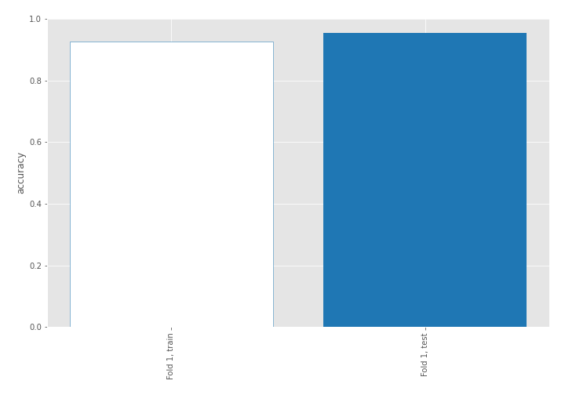

## Coefficients
| feature                           |   Learner_1 |
|:----------------------------------|------------:|
| return_autocorrelation_2_lag1     |   1.04796   |
| return_autocorrelation_2_lag3     |   0.745859  |
| return_correlation_ts1_lag_1      |   0.502615  |
| sqreturn_correlation_ts1_lag_1    |   0.502615  |
| return_autocorrelation_2_lag2     |   0.444996  |
| return_correlation_ts2_lag_1      |   0.372069  |
| sqreturn_correlation_ts2_lag_1    |   0.372069  |
| sqreturn_correlation_ts2_lag_3    |   0.336826  |
| return_correlation_ts2_lag_3      |   0.336826  |
| return_correlation_ts1_lag_3      |   0.318597  |
| sqreturn_correlation_ts1_lag_3    |   0.318597  |
| return_autocorrelation_1_lag3     |   0.271248  |
| return_autocorrelation_1_lag1     |   0.230593  |
| return_autocorrelation_1_lag2     |   0.220108  |
| return_mean2                      |   0.132887  |
| return_correlation_ts1_lag_2      |   0.132295  |
| sqreturn_correlation_ts1_lag_2    |   0.132295  |
| return_correlation_ts2_lag_2      |   0.0301369 |
| sqreturn_correlation_ts2_lag_2    |   0.0301369 |
| return_correlation_ts1_lag_0      |  -0.0905809 |
| sqreturn_correlation_ts1_lag_0    |  -0.0905809 |
| return_sd2                        |  -0.278111  |
| return_sd1                        |  -0.323222  |
| price2_granger_cause_price1       |  -0.346739  |
| return_skew2                      |  -0.42216   |
| price1_granger_cause_price2       |  -0.508103  |
| return_skew1                      |  -0.741779  |
| intercept                         |  -0.865216  |
| sqreturn_autocorrelation_ts2_lag2 |  -1.0534    |
| return_mean1                      |  -1.07804   |
| sqreturn_autocorrelation_ts2_lag3 |  -1.09476   |
| sqreturn_autocorrelation_ts1_lag3 |  -1.14922   |
| sqreturn_autocorrelation_ts1_lag2 |  -1.38078   |
| sqreturn_autocorrelation_ts1_lag1 |  -1.70371   |
| sqreturn_autocorrelation_ts2_lag1 |  -1.87636   |
| return_kurtosis2                  |  -2.30154   |
| return_kurtosis1                  |  -3.53023   |

## Permutation-based Importance
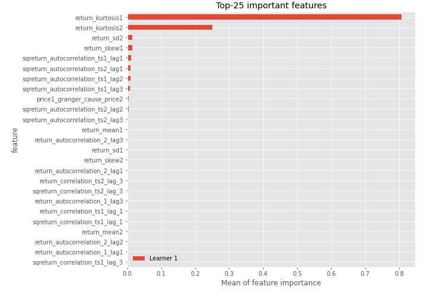
## Confusion Matrix

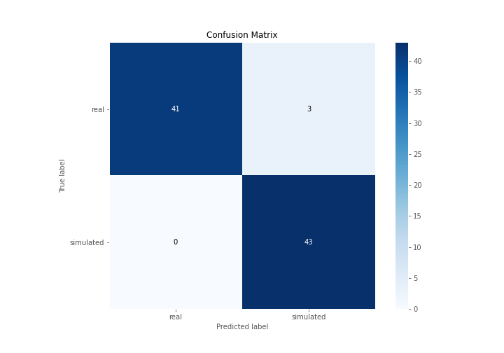

## Normalized Confusion Matrix

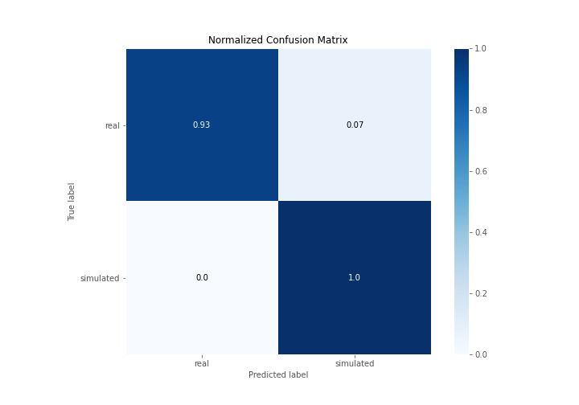

## ROC Curve

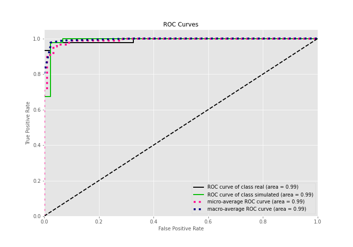

## Kolmogorov-Smirnov Statistic

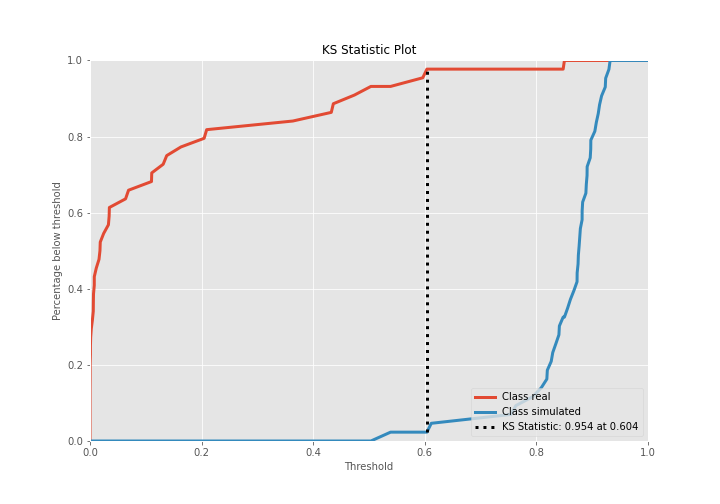

## Precision-Recall Curve

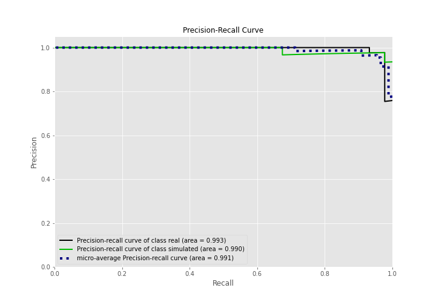

## Calibration Curve

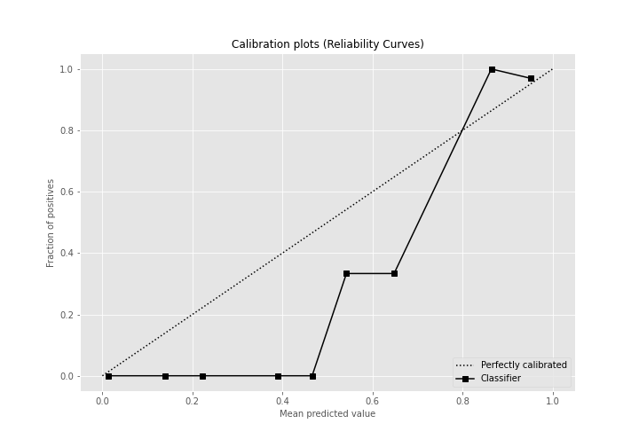

## Cumulative Gains Curve

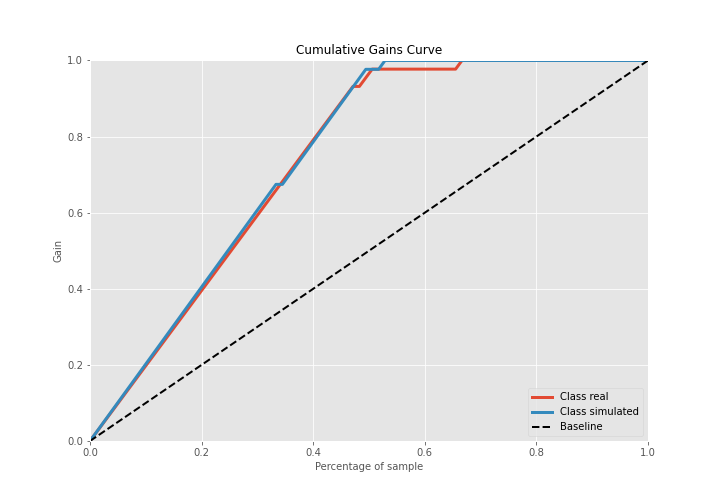

## Lift Curve

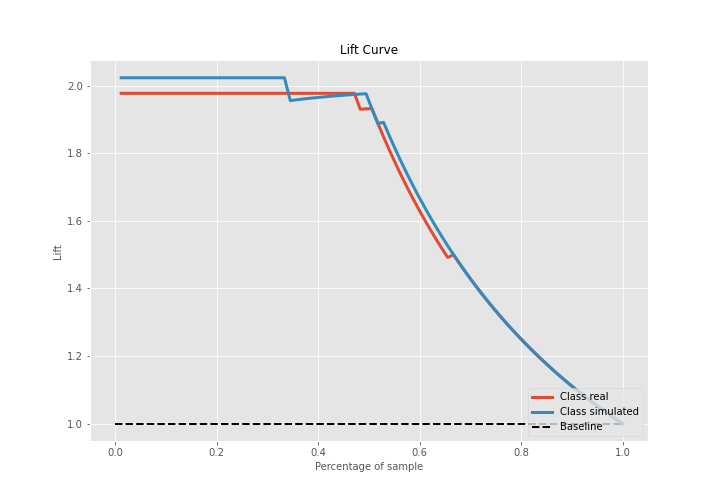

## SHAP Importance
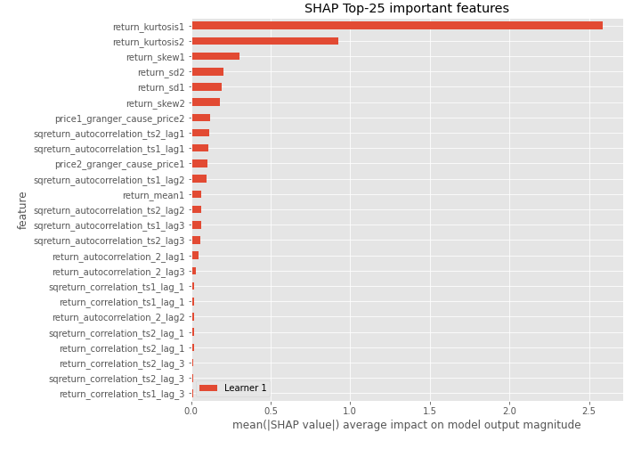

## SHAP Dependence plots

### Dependence (Fold 1)
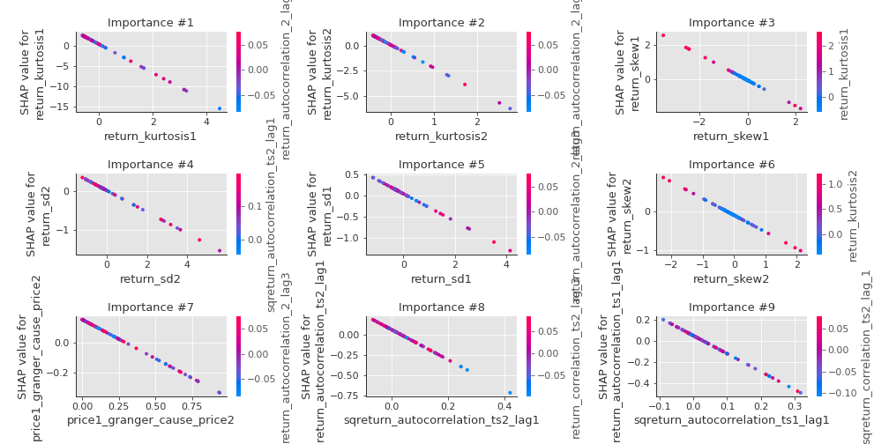

## SHAP Decision plots

### Top-10 Worst decisions for class 0 (Fold 1)
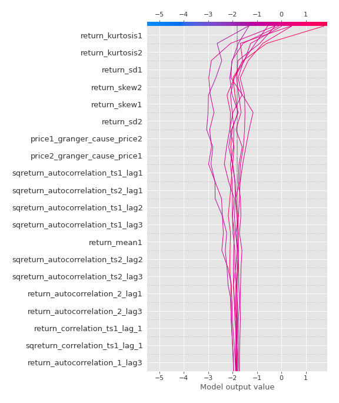
### Top-10 Best decisions for class 0 (Fold 1)
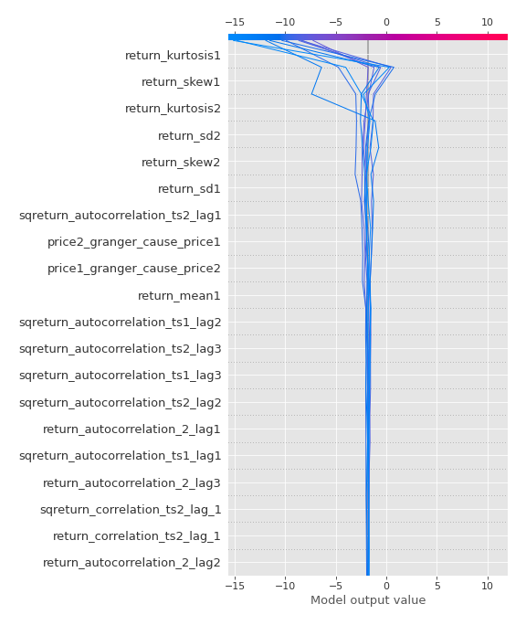
### Top-10 Worst decisions for class 1 (Fold 1)
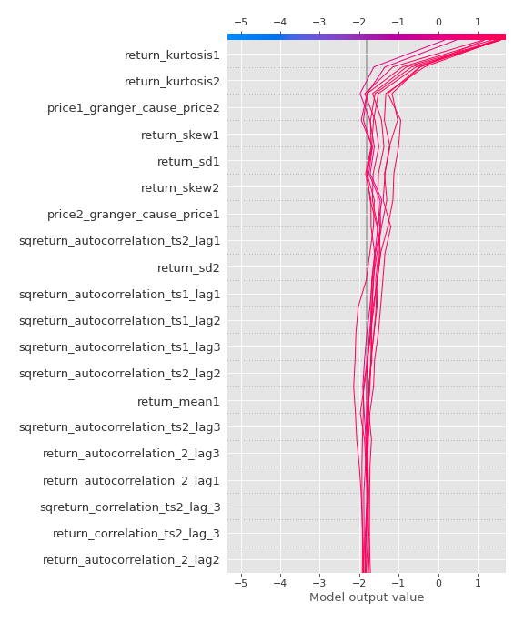
### Top-10 Best decisions for class 1 (Fold 1)
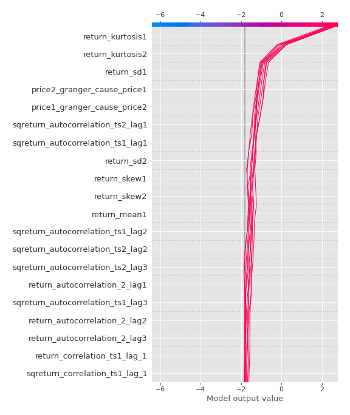

[<< Go back](../README.md)
